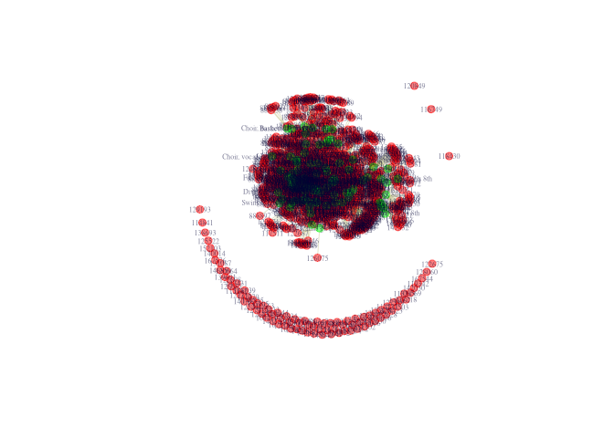
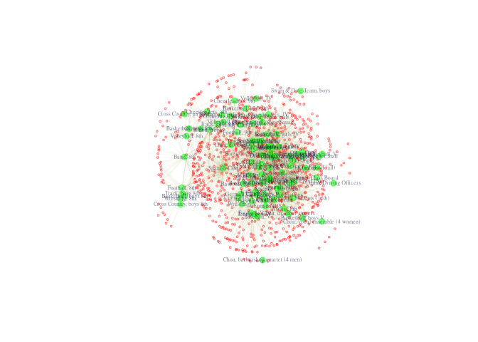
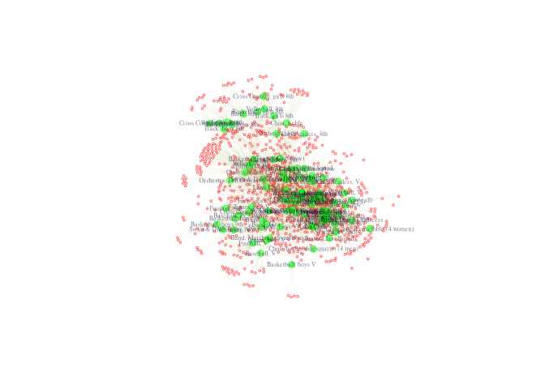
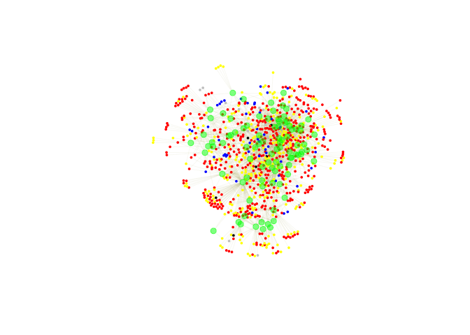
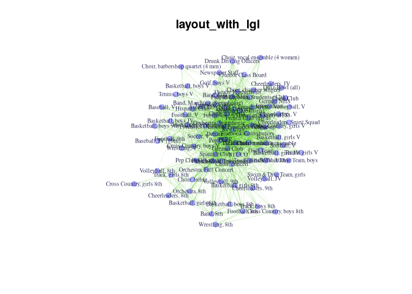
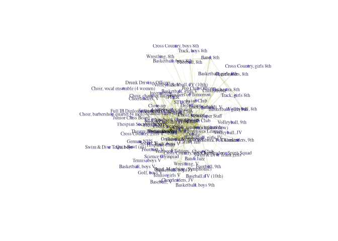
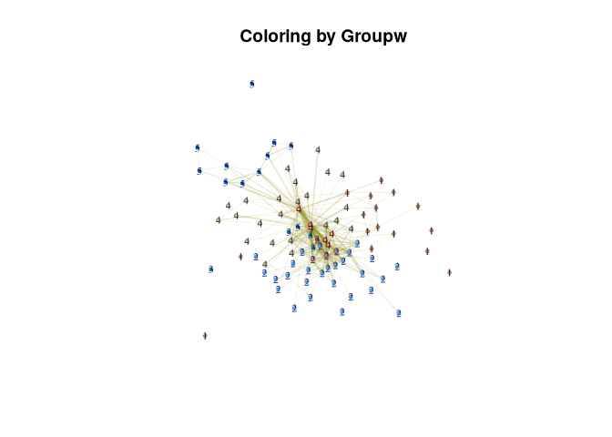

# Two-mode Networks: Affilitations and Dualities


The data consist of students (anonymized) and the student clubs in which
they are members (e.g., National Honor Society, wrestling team,
cheerleading squad, etc.). The data thus allow us to capture the duality
of social life in the school, as students are linked by being in the
same clubs, and clubs are linked by sharing the same students.

Substantively, we are motivated by the following questions:

    a) Which student clubs serve to integrate the school and which are more peripheral? 
    b) Which student clubs tend to share members at high rates? 
    c) What is the shared feature, or theme, that brings these clubs together in a cluster?

# Setup

``` r
library(igraph)
```

``` r
# url1 <- "https://github.com/JeffreyAlanSmith/Integrated_Network_Science/raw/master/data/affiliations_1996.txt"

affiliations96 <- read.delim("data/affiliations_1996.txt", check.names = FALSE)
dim(affiliations96)
```

    [1] 1295   91

``` r
affiliations96[1:8, 1:8]
```

           Academic decathalon Art Club Asian Club Band, 8th Band, Jazz
    101498                   0        0          0         0          0
    104452                   0        0          0         0          0
    104456                   0        0          0         0          0
    104462                   0        0          0         0          0
    104471                   0        0          0         0          0
    105215                   0        0          0         0          0
    106517                   0        0          0         0          0
    106569                   0        0          0         0          0
           Band, Marching (Symphonic) Baseball, JV (10th) Baseball, V
    101498                          0                   0           0
    104452                          1                   0           0
    104456                          0                   0           0
    104462                          0                   0           0
    104471                          0                   0           0
    105215                          0                   0           0
    106517                          0                   0           0
    106569                          0                   0           0

``` r
affils_student1 <- affiliations96[1, ]
affils_student1[which(affils_student1 == 1)]
```

           NHS Spanish Club (high) Spanish NHS Theatre Productions
    101498   1                   1           1                   1
           Thespian Society (ITS)
    101498                      1

``` r
# url2 <- "https://github.com/JeffreyAlanSmith/Integrated_Network_Science/raw/master/data/attributes_students.txt"

attributes_students <- read.delim("data/attributes_students.txt",
  stringsAsFactors = FALSE
)

# url3 <- "https://github.com/JeffreyAlanSmith/Integrated_Network_Science/raw/master/data/attributes_clubs.txt"

attributes_clubs <- read.delim("data/attributes_clubs.txt",
  stringsAsFactors = FALSE
)
```

The student data frame only includes students (1295 rows) and includes
student specific attributes. The student specific attributes are:

    gender (male, female)
    grade96 (grade in 1996)
    grade97 (grade in 1997)
    race (Asian, black, Hispanic, Native American, white)

``` r
attributes_students[1:5, ]
```

         ids    type gender grade96 grade97  race missing96 missing97
    1 101498 student female      11      12 white         0         0
    2 104452 student   male       9      10 black         0         0
    3 104456 student female       9      10 white         0         0
    4 104462 student   male       9      10 black         0         0
    5 104471 student female       9      10 black         0         0

The club data frame only includes clubs (91 rows) and includes club
specific attributes.The main club attributes of interest are:

    club_type_detailed (Academic Interest, Academic Competition, Ethnic Interest, Individual Sports, Leadership, Media, Performance Art, Service, Team Sports)
    club_profile (how much attention does the club get? low, moderate, high, very high)
    club_feeder (does club feed another club, like 8th grade football to 9th grade football?)
    club_type_gender (is club mixed gender, just boys or just girls?)
    club_type_grade (which grades, if any, is club restricted to?).

``` r
attributes_clubs[1:5, ]
```

                      ids type missing96 missing97   club_type_detailed
    1 Academic decathalon club         0         0 Academic Competition
    2            Art Club club         0         0      Performance Art
    3          Asian Club club         0         0      Ethnic Interest
    4           Band, 8th club         0         0      Performance Art
    5          Band, Jazz club         0         0      Performance Art
      club_type_general club_type_gender club_profile club_season club_commitment
    1          Academic       boys_girls          low      spring        not_high
    2   Performance Art       boys_girls          low    all_year        not_high
    3   Ethnic Interest       boys_girls          low    all_year        not_high
    4   Performance Art       boys_girls          low    all_year            high
    5   Performance Art       boys_girls     moderate    all_year            high
      club_type_grade club_feeder
    1      all_grades          no
    2      all_grades          no
    3      all_grades          no
    4          eighth         yes
    5          ninth+          no

Note that the student attribute data frame must be sorted in the same
order as the rows of the affiliation matrix, while the club attribute
data frame must be sorted in the same order as the columns of the
affiliation matrix.

``` r
shared_var_names <- c("ids", "type", "missing96", "missing97")

shared <- rbind(
  attributes_students[, shared_var_names],
  attributes_clubs[, shared_var_names]
)
```

``` r
num_clubs <- nrow(attributes_clubs)
NA_dat_club <- rep(NA, num_clubs)

student_var_names <- c("race", "gender", "grade96", "grade97")

student_specific <- rbind(
  attributes_students[, student_var_names],
  data.frame(
    race = NA_dat_club,
    gender = NA_dat_club,
    grade96 = NA_dat_club,
    grade97 = NA_dat_club
  )
)
```

``` r
num_students <- nrow(attributes_students)
NA_dat_student <- rep(NA, num_students)

club_var_names <- c(
  "club_type_detailed", "club_profile",
  "club_feeder", "club_type_gender",
  "club_type_grade"
)

club_specific <- rbind(
  data.frame(
    club_type_detailed = NA_dat_student,
    club_profile = NA_dat_student,
    club_feeder = NA_dat_student,
    club_type_gender = NA_dat_student,
    club_type_grade = NA_dat_student
  ),
  attributes_clubs[, club_var_names]
)
```

``` r
attributes_students_clubs <- cbind(shared, student_specific, club_specific)
head(attributes_students_clubs)
```

         ids    type missing96 missing97  race gender grade96 grade97
    1 101498 student         0         0 white female      11      12
    2 104452 student         0         0 black   male       9      10
    3 104456 student         0         0 white female       9      10
    4 104462 student         0         0 black   male       9      10
    5 104471 student         0         0 black female       9      10
    6 105215 student         0         0 white female      11      12
      club_type_detailed club_profile club_feeder club_type_gender club_type_grade
    1               <NA>         <NA>        <NA>             <NA>            <NA>
    2               <NA>         <NA>        <NA>             <NA>            <NA>
    3               <NA>         <NA>        <NA>             <NA>            <NA>
    4               <NA>         <NA>        <NA>             <NA>            <NA>
    5               <NA>         <NA>        <NA>             <NA>            <NA>
    6               <NA>         <NA>        <NA>             <NA>            <NA>

Keep only those in school in 1996.

``` r
not_missing <- attributes_students_clubs$missing96 == 0

is_student <- attributes_students_clubs$type == "student"
not_missing_student <- not_missing[is_student]

is_club <- attributes_students_clubs$type == "club"
not_missing_club <- not_missing[is_club]

affiliations96_nomiss <- affiliations96[not_missing_student, not_missing_club]

attributes_nomiss <- attributes_students_clubs[not_missing, ]
```

``` r
affil_net96 <- graph_from_biadjacency_matrix(
  incidence = affiliations96_nomiss,
  mode = "all"
)

affil_net96
```

    IGRAPH 79f2e52 UN-B 1029 2641 -- 
    + attr: type (v/l), name (v/c)
    + edges from 79f2e52 (vertex names):
     [1] 101498--NHS                        101498--Spanish Club (high)       
     [3] 101498--Spanish NHS                101498--Theatre Productions       
     [5] 101498--Thespian Society (ITS)     104452--Band, Marching (Symphonic)
     [7] 104452--Basketball, boys 9th       104452--Football, 9th             
     [9] 104452--Latin Club                 104456--German Club               
    [11] 104456--Latin Club                 104462--Basketball, boys JV       
    [13] 104462--Choir, concert             104462--Football, 9th             
    [15] 104462--Latin Club                 104462--Spanish Club              
    + ... omitted several edges

Note that the two-mode, or bipartite, network has a vertex attribute
called type that indicates the kind of node. type is automatically
created by igraph and attached as a vertex attribute. A False
corresponds to the students (rows) and True corresponds to the clubs
(columns). We thus have a network of students and clubs where all ties
link students to clubs (based on membership).

``` r
type96 <- vertex_attr(affil_net96, "type")
table(type96)
```

    type96
    FALSE  TRUE 
      938    91 

There are 938 students and 91 clubs.

``` r
set_attributes <- function(net, data = attributes_nomiss, attribute) {
  set_vertex_attr(
    graph = net, name = attribute,
    value = data[, attribute]
  )
}

affil_net96 <- affil_net96 |>
  set_attributes(attribute = "race") |>
  set_attributes(attribute = "gender") |>
  set_attributes(attribute = "grade96") |>
  set_attributes(attribute = "club_type_detailed") |>
  set_attributes(attribute = "club_profile")

affil_net96
```

    IGRAPH 79f2e52 UN-B 1029 2641 -- 
    + attr: type (v/l), name (v/c), race (v/c), gender (v/c), grade96
    | (v/n), club_type_detailed (v/c), club_profile (v/c)
    + edges from 79f2e52 (vertex names):
     [1] 101498--NHS                        101498--Spanish Club (high)       
     [3] 101498--Spanish NHS                101498--Theatre Productions       
     [5] 101498--Thespian Society (ITS)     104452--Band, Marching (Symphonic)
     [7] 104452--Basketball, boys 9th       104452--Football, 9th             
     [9] 104452--Latin Club                 104456--German Club               
    [11] 104456--Latin Club                 104462--Basketball, boys JV       
    [13] 104462--Choir, concert             104462--Football, 9th             
    + ... omitted several edges

# Plotting the Network

``` r
V(affil_net96)$color[type96 == FALSE] <- rgb(1, 0, 0, 0.5)
V(affil_net96)$color[type96 == TRUE] <- rgb(0, 1, 0, 0.5)
```

``` r
V(affil_net96)$label <- V(affil_net96)$name
V(affil_net96)$label.color <- rgb(0, 0, .2, .5)
V(affil_net96)$label.cex <- .5
V(affil_net96)$size <- 6
V(affil_net96)$frame.color <- V(affil_net96)$color # set color around nodes

E(affil_net96)$color <- rgb(.5, .5, 0, .2)
```

``` r
layout <- layout_with_fr(affil_net96, grid = "nogrid")
```

``` r
pdf("magact_stdnt_actvts_1996.pdf")
plot(affil_net96, layout = layout)
dev.off()
```

    png 
      2 

``` r
plot(affil_net96, layout = layout)
```



Remove the isolates

``` r
degree0 <- which(degree(affil_net96) == 0)
affil_net96_noisolates <- delete_vertices(affil_net96, degree0)
```

``` r
type96_noisolates <- vertex_attr(affil_net96_noisolates, "type")
table(type96_noisolates)
```

    type96_noisolates
    FALSE  TRUE 
      850    91 

``` r
is_student_type <- type96_noisolates == FALSE
```

``` r
V(affil_net96_noisolates)$label[is_student_type] <- NA
V(affil_net96_noisolates)$color[is_student_type] <- rgb(1, 0, 0, .1)
V(affil_net96_noisolates)$size[is_student_type] <- 2
E(affil_net96_noisolates)$color <- rgb(.5, .5, 0, .05)
```

``` r
pdf("magact_stdnt_actvts_1996_layout_with_kk.pdf")
plot(affil_net96_noisolates, layout = layout_with_kk)
dev.off()
```

    png 
      2 

``` r
plot(affil_net96_noisolates, layout = layout_with_kk)
```



``` r
pdf("magact_stdnt_actvts_1996_layout_with_fr.pdf")
plot(affil_net96_noisolates, layout = layout_with_fr)
dev.off()
```

    png 
      2 

``` r
plot(affil_net96_noisolates, layout = layout_with_fr)
```



Coloring students by race lol

``` r
library(car)

race <- V(affil_net96_noisolates)$race[is_student_type]

student_node_color <-
  recode(
    race,
    "'white' = 'red';
         'Hispanic' = 'grey';
         'Asian' = 'blue';
         'black' = 'yellow';
         'Native American' = 'black'"
  )
```

``` r
V(affil_net96_noisolates)$color[is_student_type] <- student_node_color
V(affil_net96_noisolates)$frame.color[is_student_type] <- student_node_color
V(affil_net96_noisolates)$label[!is_student_type] <- NA
```

``` r
plot(affil_net96_noisolates)
```



# Single Mode Networks

Divide the two-mode network into one-mode networks for analysis. The
student-to-student network will have ties based on number or common
clubs, and for the club-to-club network, ties will be based on number of
common members.

## Constructing one-mode projections

> Manually

To get the one-mode representation of ties between rows (students in our
example), multiply the matrix by its transpose. To get the one-mode
representation of ties between columns (clubs in our example), multiply
the transpose of the matrix by the matrix.

``` r
affiliations96_nomiss_mat <- as.matrix(affiliations96_nomiss)
club_club96 <- t(affiliations96_nomiss_mat) %*% affiliations96_nomiss_mat
club_club96[1:5, 1:5]
```

                        Academic decathalon Art Club Asian Club Band, 8th
    Academic decathalon                  29        3          1         0
    Art Club                              3       33          0         0
    Asian Club                            1        0          8         0
    Band, 8th                             0        0          0        46
    Band, Jazz                            1        0          0         0
                        Band, Jazz
    Academic decathalon          1
    Art Club                     0
    Asian Club                   0
    Band, 8th                    0
    Band, Jazz                  17

``` r
student_student96 <- affiliations96_nomiss_mat %*% t(affiliations96_nomiss_mat)
student_student96[1:5, 1:5]
```

           101498 104452 104456 104462 104471
    101498      5      0      0      0      0
    104452      0      4      1      2      0
    104456      0      1      2      1      0
    104462      0      2      1      5      0
    104471      0      0      0      0      0

``` r
dim(club_club96)
```

    [1] 91 91

``` r
dim(student_student96)
```

    [1] 938 938

> with `bipartite_projection()`

``` r
onemode96 <- bipartite_projection(affil_net96)
club_net96 <- onemode96$proj2
```

The weight for the club-to-club network is based on the number of shared
members between i and j. This is stored as an edge attribute called
weight.

``` r
club_names <- V(club_net96)$name
mat <- as_adjacency_matrix(club_net96, attr = "weight", sparse = F)
mat[1:5, 1:5]
```

                        Academic decathalon Art Club Asian Club Band, 8th
    Academic decathalon                   0        3          1         0
    Art Club                              3        0          0         0
    Asian Club                            1        0          0         0
    Band, 8th                             0        0          0         0
    Band, Jazz                            1        0          0         0
                        Band, Jazz
    Academic decathalon          1
    Art Club                     0
    Asian Club                   0
    Band, 8th                    0
    Band, Jazz                   0

The same as before, except the diagonals are zero.

## Plotting one-mode projections

``` r
V(club_net96)$label.color <- rgb(0, 0, .2, .8)
V(club_net96)$label.cex <- .60
V(club_net96)$size <- 6
V(club_net96)$color <- rgb(0, 0, 1, .3)
V(club_net96)$frame.color <- V(club_net96)$color
```

``` r
edgealpha <- log1p(E(club_net96)$weight) / max(log1p(E(club_net96)$weight) * 2)
E(club_net96)$color <- rgb(.25, .75, 0, edgealpha)
```

``` r
pdf("magact_stdnt_actvts_1996_clubs.pdf")
plot(club_net96, main = "layout_with_lgl", layout = layout_with_lgl)
plot(club_net96, main = "layout_with_fr", layout = layout_with_fr)
dev.off()
```

    png 
      2 

``` r
plot(club_net96, main = "layout_with_lgl", layout = layout_with_lgl)
```



``` r
library(svglite)

svglite("magact_stdnt_actvts_1996_clubs_lgl.svg")
plot(club_net96, main = "layout_with_lgl", layout = layout_with_lgl)
svglite("magact_stdnt_actvts_1996_clubs_fr.svg")
plot(club_net96, main = "layout_with_fr", layout = layout_with_fr)
dev.off()
```

    png 
      2 

To reduce density, weight the edges to remove edges below the mean, and
assign weights to the others based on standard deviation, with .5 if
between 0 and 1 sds, 1.5 if between 1 and 2, and 2.5 if above 2.

``` r
std_weight <- sd(E(club_net96)$weight)
weight_mean_center <- (E(club_net96)$weight - mean(E(club_net96)$weight))

recode_weight <- E(club_net96)$weight
recode_weight[weight_mean_center <= 0] <- -1
recode_weight[(weight_mean_center > 0) &
  (weight_mean_center <= std_weight)] <- 0.5
recode_weight[(weight_mean_center > std_weight) &
  (weight_mean_center <= std_weight * 2)] <- 1.5
recode_weight[weight_mean_center > std_weight * 2] <- 2.5
```

``` r
E(club_net96)$color <- rgb(.5, .5, 0, .2)
E(club_net96)$width <- recode_weight
V(club_net96)$size <- 3
```

``` r
plot(club_net96, layout = layout_with_lgl)
```



The plot offers important insight into the structure of club membership
in the school. We can see that there are a number of grade-specific
sports teams on the periphery and a core consisting of more generalist
clubs, like Pep Club and National Honor Society (NHS). Now, we want to
take the basic intuition from our plot and analyze the network more
formally. We will consider key measures of centrality.

# Club-to-club network

``` r
weights <- E(club_net96)$weight
scaled_weights <- weights / sd(weights)
invscaled_weights <- 1 / scaled_weights
```

## Centrality

``` r
deg_normalweights <- strength(club_net96, mode = "all")
deg_scaledweights <- strength(club_net96,
  mode = "all",
  weights = scaled_weights
)
deg_data <- data.frame(deg_normalweights, deg_scaledweights)
deg_data[1:10, ]
```

                               deg_normalweights deg_scaledweights
    Academic decathalon                      142         31.551195
    Art Club                                  87         19.330662
    Asian Club                                29          6.443554
    Band, 8th                                 79         17.553130
    Band, Jazz                                39          8.665469
    Band, Marching (Symphonic)                37          8.221086
    Baseball, JV (10th)                       32          7.110129
    Baseball, V                               27          5.999171
    Basketball, boys 8th                      45          9.998618
    Basketball, boys 9th                      30          6.665746

Note that if we use the degree() function (as we did in other
tutorials), this would not use the weights at all, just using a
binarized version of the network (where ij = 0 if they have at least one
member in common).

``` r
deg_noweight <- degree(club_net96, mode = "all")
cor(deg_scaledweights, deg_noweight)
```

    [1] 0.8587135

This is similar but not the same.

For closeness, we will use the inverted version of the weights, as two
clubs with more common members are actually closer. But in calculating
distance (the first step in calculating closeness), igraph treats the
weights in the opposite manner, assuming that higher weights imply
higher distances between nodes. We thus adjust for that and use the
inverted weights.

``` r
close_invweights <- closeness(club_net96, weights = invscaled_weights)
close_weights <- closeness(club_net96, weights = scaled_weights)
```

quick check, showing why inverted weights are used.

``` r
cor(deg_normalweights, close_invweights)
```

    [1] 0.7981294

``` r
cor(deg_normalweights, close_weights)
```

    [1] 0.2043294

``` r
deg_top10 <- order(deg_scaledweights, decreasing = T)[1:10]
toptenclubs_degree <- club_names[deg_top10]
data.frame(high_degree = toptenclubs_degree)
```

                                 high_degree
    1                               Pep Club
    2                                    NHS
    3                           Spanish Club
    4                          Drunk Driving
    5                             Latin Club
    6                               Key Club
    7  Forensics (National Forensics League)
    8                   Orchestra, Symphonic
    9                    Spanish Club (high)
    10                    French Club (high)

``` r
deg_bottom10 <- order(deg_scaledweights, decreasing = F)[1:10]
bottomtenclubs_degree <- club_names[deg_bottom10]
data.frame(
  high_degree = toptenclubs_degree,
  low_degree = bottomtenclubs_degree
)
```

                                 high_degree                        low_degree
    1                               Pep Club            Swim & Dive Team, boys
    2                                    NHS          Cross Country, girls 8th
    3                           Spanish Club Choir, barbershop quartet (4 men)
    4                          Drunk Driving           Cross Country, boys 8th
    5                             Latin Club                    Tennis girls V
    6                               Key Club                    Volleyball, JV
    7  Forensics (National Forensics League)   Choir, vocal ensemble (4 women)
    8                   Orchestra, Symphonic                Basketball, boys V
    9                    Spanish Club (high)                 Cheerleaders, 8th
    10                    French Club (high)                    Tennis, boys V

Which club attributes are associated with network centrality? Are higher
status clubs more/less central to the network?

``` r
club_profile <- factor(V(club_net96)$club_profile,
  ordered = T,
  levels = c("low", "moderate", "high", "very_high")
)

centrality_data <- data.frame(deg_data, club_profile = club_profile)
head(centrality_data)
```

                               deg_normalweights deg_scaledweights club_profile
    Academic decathalon                      142         31.551195          low
    Art Club                                  87         19.330662          low
    Asian Club                                29          6.443554          low
    Band, 8th                                 79         17.553130          low
    Band, Jazz                                39          8.665469     moderate
    Band, Marching (Symphonic)                37          8.221086     moderate

``` r
aggregate(deg_scaledweights ~ club_profile, data = centrality_data, FUN = mean)
```

      club_profile deg_scaledweights
    1          low          24.89827
    2     moderate          20.30023
    3         high          15.04843
    4    very_high          14.07213

``` r
aggregate(deg_scaledweights ~ club_profile, data = centrality_data, FUN = sd)
```

      club_profile deg_scaledweights
    1          low         28.904978
    2     moderate         18.779931
    3         high         11.708920
    4    very_high          8.552113

Low profile clubs are more central, but are also much more diverse in
degree.

## Groups

Which clubs tend to share members?

``` r
groups_scaledweights <- cluster_fast_greedy(club_net96,
  weights = scaled_weights
)
```

What clubs are in each group?

``` r
group_dat <- data.frame(
  group = as.numeric(membership(groups_scaledweights)),
  name = V(club_net96)$name,
  club_type_detailed = V(club_net96)$club_type_detailed
)
head(group_dat)
```

      group                       name   club_type_detailed
    1     2        Academic decathalon Academic Competition
    2     4                   Art Club      Performance Art
    3     2                 Asian Club      Ethnic Interest
    4     5                  Band, 8th      Performance Art
    5     2                 Band, Jazz      Performance Art
    6     1 Band, Marching (Symphonic)      Performance Art

``` r
group_dat[group_dat[, "group"] == 1, ]
```

       group                              name club_type_detailed
    6      1        Band, Marching (Symphonic)    Performance Art
    7      1               Baseball, JV (10th)        Team Sports
    8      1                       Baseball, V        Team Sports
    10     1              Basketball, boys 9th        Team Sports
    11     1               Basketball, boys JV        Team Sports
    12     1                Basketball, boys V        Team Sports
    24     1 Choir, barbershop quartet (4 men)    Performance Art
    32     1             Cross Country, boys V  Individual Sports
    40     1                     Football, 9th        Team Sports
    41     1                       Football, V        Team Sports
    50     1                      Golf, boys V  Individual Sports
    66     1                         Soccer, V        Team Sports
    73     1            Swim & Dive Team, boys  Individual Sports
    77     1                    Tennis, boys V  Individual Sports
    81     1                     Track, boys V  Individual Sports
    89     1                      Wrestling, V  Individual Sports

``` r
table(group_dat$club_type_detailed[group_dat$group == 1])
```


    Individual Sports   Performance Art       Team Sports 
                    6                 2                 8 

``` r
prop.table(table(group_dat$club_type_detailed[group_dat$group == 1]))
```


    Individual Sports   Performance Art       Team Sports 
                0.375             0.125             0.500 

Group 1 is mainly sports teams.

``` r
group_dat[group_dat[, "group"] == 2, ]
```

       group                            name   club_type_detailed
    1      2             Academic decathalon Academic Competition
    3      2                      Asian Club      Ethnic Interest
    5      2                      Band, Jazz      Performance Art
    15     2            Basketball, girls JV          Team Sports
    16     2             Basketball, girls V          Team Sports
    22     2                      Chess Club Academic Competition
    23     2                Choir, a capella      Performance Art
    25     2          Choir, chamber singers      Performance Art
    28     2 Choir, vocal ensemble (4 women)      Performance Art
    30     2                        Close-up    Academic Interest
    34     2          Cross Country, girls V    Individual Sports
    38     2          Drunk Driving Officers              Service
    44     2              French Club (high)    Academic Interest
    46     2                      French NHS    Academic Interest
    47     2 Full IB Diploma Students (12th)    Academic Interest
    49     2                      German NHS    Academic Interest
    52     2                     Internships    Academic Interest
    53     2              Junior Class Board           Leadership
    56     2                 Newspaper Staff                Media
    57     2                             NHS              Service
    64     2                 Quiz-Bowl (all) Academic Competition
    65     2                Science Olympiad Academic Competition
    68     2                     Softball, V          Team Sports
    70     2             Spanish Club (high)    Academic Interest
    71     2                     Spanish NHS    Academic Interest
    78     2             Theatre Productions      Performance Art
    79     2          Thespian Society (ITS)      Performance Art
    87     2                   Volleyball, V          Team Sports
    90     2           Yearbook Contributors                Media
    91     2                Yearbook Editors                Media

``` r
table(group_dat$club_type_detailed[group_dat$group == 2])
```


    Academic Competition    Academic Interest      Ethnic Interest 
                       4                    8                    1 
       Individual Sports           Leadership                Media 
                       1                    1                    3 
         Performance Art              Service          Team Sports 
                       6                    2                    4 

``` r
prop.table(table(group_dat$club_type_detailed[group_dat$group == 2]))
```


    Academic Competition    Academic Interest      Ethnic Interest 
              0.13333333           0.26666667           0.03333333 
       Individual Sports           Leadership                Media 
              0.03333333           0.03333333           0.10000000 
         Performance Art              Service          Team Sports 
              0.20000000           0.06666667           0.13333333 

Most are academic or art related.

``` r
group_dat[group_dat[, "group"] == 3, ]
```

       group                                  name   club_type_detailed
    35     3                                Debate Academic Competition
    42     3                             Forensics Academic Competition
    43     3 Forensics (National Forensics League) Academic Competition
    72     3                                 STUCO           Leadership
    86     3                        Volleyball, JV          Team Sports

``` r
table(group_dat$club_type_detailed[group_dat$group == 3])
```


    Academic Competition           Leadership          Team Sports 
                       3                    1                    1 

``` r
prop.table(table(group_dat$club_type_detailed[group_dat$group == 3]))
```


    Academic Competition           Leadership          Team Sports 
                     0.6                  0.2                  0.2 

``` r
group_dat[group_dat[, "group"] == 4, ]
```

       group                       name club_type_detailed
    2      4                   Art Club    Performance Art
    14     4      Basketball, girls 9th        Team Sports
    17     4          Cheerleaders, 8th        Team Sports
    18     4          Cheerleaders, 9th        Team Sports
    19     4           Cheerleaders, JV        Team Sports
    20     4 Cheerleaders, Spirit Squad        Team Sports
    21     4            Cheerleaders, V        Team Sports
    26     4             Choir, concert    Performance Art
    27     4              Choir, treble    Performance Art
    29     4    Choir, women's ensemble    Performance Art
    36     4                 Drill Team    Performance Art
    37     4              Drunk Driving            Service
    45     4          French Club (low)  Academic Interest
    51     4              Hispanic Club    Ethnic Interest
    54     4                   Key Club            Service
    55     4                 Latin Club  Academic Interest
    58     4             Orchestra, 8th    Performance Art
    59     4    Orchestra, Full Concert    Performance Art
    60     4       Orchestra, Symphonic    Performance Art
    61     4                       PEER            Service
    62     4                   Pep Club            Service
    63     4          Pep Club Officers            Service
    67     4        Softball, JV (10th)        Team Sports
    69     4               Spanish Club  Academic Interest
    74     4    Swim & Dive Team, girls  Individual Sports
    75     4       Teachers of Tomorrow  Academic Interest
    76     4             Tennis girls V  Individual Sports
    83     4             Track, girls V  Individual Sports
    85     4            Volleyball, 9th        Team Sports

``` r
table(group_dat$club_type_detailed[group_dat$group == 4])
```


    Academic Interest   Ethnic Interest Individual Sports   Performance Art 
                    4                 1                 3                 8 
              Service       Team Sports 
                    5                 8 

``` r
prop.table(table(group_dat$club_type_detailed[group_dat$group == 4]))
```


    Academic Interest   Ethnic Interest Individual Sports   Performance Art 
           0.13793103        0.03448276        0.10344828        0.27586207 
              Service       Team Sports 
           0.17241379        0.27586207 

A heterogenous group with Ports teams, Performance Arts, and Service
clubs.

``` r
group_dat[group_dat[, "group"] == 5, ]
```

       group                     name club_type_detailed
    4      5                Band, 8th    Performance Art
    9      5     Basketball, boys 8th        Team Sports
    13     5    Basketball, girls 8th        Team Sports
    31     5  Cross Country, boys 8th  Individual Sports
    33     5 Cross Country, girls 8th  Individual Sports
    39     5            Football, 8th        Team Sports
    48     5              German Club  Academic Interest
    80     5          Track, boys 8th  Individual Sports
    82     5         Track, girls 8th  Individual Sports
    84     5          Volleyball, 8th        Team Sports
    88     5           Wrestling, 8th  Individual Sports

``` r
table(group_dat$club_type_detailed[group_dat$group == 5])
```


    Academic Interest Individual Sports   Performance Art       Team Sports 
                    1                 5                 1                 4 

``` r
prop.table(table(group_dat$club_type_detailed[group_dat$group == 5]))
```


    Academic Interest Individual Sports   Performance Art       Team Sports 
           0.09090909        0.45454545        0.09090909        0.36363636 

A small group centered around sports teams (for younger students).

``` r
V(club_net96)$color <- membership(groups_scaledweights)
V(club_net96)$frame.color[deg_top10] <- rgb(1, 0, .2, .75)
```

``` r
set.seed(105)
group_label <- group_dat$group
plot(club_net96,
  main = "Coloring by Groupw",
  vertex.label = group_label, vertex.label.cex = .75
)
```



# Using the tnet package

So far, analysis has focused on mubers of edges, not weights on edges
(strength of the connection).

``` r
library(tnet)
```

`tnet` takes a weighted edgelist, with the last column containing the
weights.

``` r
club_edgelist96 <- as_edgelist(club_net96, names = F)
club_edgelist96 <- cbind(club_edgelist96, scaled_weights)
colnames(club_edgelist96) <- c("sender", "receiver", "weights")
```

`tnet` wants directed networks, so we need a reverse edge for every
edge.

``` r
club_edgelist96 <- rbind(club_edgelist96, club_edgelist96[, c(2, 1, 3)])
head(club_edgelist96)
```

         sender receiver   weights
    [1,]      1       54 1.9997237
    [2,]      1       59 0.4443830
    [3,]      1       62 1.3331491
    [4,]      1       65 1.3331491
    [5,]      1       44 0.8887661
    [6,]      1       60 0.8887661

``` r
dim(club_edgelist96)
```

    [1] 2722    3

Calculated weighted centrality

    measure = type of measure: degree calculates measure ignoring the weights; alpha considers the weights
    alpha = weight to put on counts compared to edge weights. 0 = all weight on counts; 1 = all weight on edge weights

``` r
degree_alpha1 <- degree_w(
  net = club_edgelist96, measure = "alpha",
  type = "out", alpha = 1
)
head(degree_alpha1)
```

         node     alpha
    [1,]    1 31.551195
    [2,]    2 19.330662
    [3,]    3  6.443554
    [4,]    4 17.553130
    [5,]    5  8.665469
    [6,]    6  8.221086

``` r
degree_alpha0 <- degree_w(
  net = club_edgelist96, measure = "alpha",
  type = "out", alpha = 0
)
head(degree_alpha0)
```

         node alpha
    [1,]    1    47
    [2,]    2    40
    [3,]    3    22
    [4,]    4    17
    [5,]    5    26
    [6,]    6    24

``` r
degree_alpha.5 <- degree_w(
  net = club_edgelist96, measure = "alpha",
  type = "out", alpha = .5
)
head(degree_alpha.5)
```

         node    alpha
    [1,]    1 38.50852
    [2,]    2 27.80695
    [3,]    3 11.90622
    [4,]    4 17.27435
    [5,]    5 15.01007
    [6,]    6 14.04657

``` r
cor(degree_alpha1[, 2], degree_alpha.5[, 2])
```

    [1] 0.97487

``` r
cor(degree_alpha0[, 2], degree_alpha.5[, 2])
```

    [1] 0.9489498

``` r
close_alpha1 <- closeness_w(club_edgelist96, alpha = 1)
head(close_alpha1)
```

         node   closeness  n.closeness
    [1,]    1 0.010976898 1.219655e-04
    [2,]    2 0.010183332 1.131481e-04
    [3,]    3 0.006155898 6.839886e-05
    [4,]    4 0.011741035 1.304559e-04
    [5,]    5 0.008258114 9.175683e-05
    [6,]    6 0.007146988 7.941097e-05

closeness and scaled closeness. Unlike `igraph`, do not need to invert
the weights.

``` r
close_alpha0 <- closeness_w(club_edgelist96, alpha = 0)
head(close_alpha0)
```

         node   closeness  n.closeness
    [1,]    1 0.007518797 8.354219e-05
    [2,]    2 0.007142857 7.936508e-05
    [3,]    3 0.006250000 6.944444e-05
    [4,]    4 0.006097561 6.775068e-05
    [5,]    5 0.006493506 7.215007e-05
    [6,]    6 0.006410256 7.122507e-05

This is equivalent to

``` r
close_igraph_noweight <- closeness(club_net96, weights = NA)
head(close_igraph_noweight)
```

           Academic decathalon                   Art Club 
                   0.007518797                0.007142857 
                    Asian Club                  Band, 8th 
                   0.006250000                0.006097561 
                    Band, Jazz Band, Marching (Symphonic) 
                   0.006493506                0.006410256 

``` r
close_alpha.5 <- closeness_w(club_edgelist96, alpha = .5)
cor(close_alpha0[, 2], close_alpha.5[, 2])
```

    [1] 0.8766644

# Racial Segregation

How strong is homophily along racial lines?

How many weighted edges connecting students are homophilous? If two
students are in the same club, do they share race. Calculate over
co-membership edges, and determine the proportion of edges matching on
race.

How many times is a student in a club with at least one other student of
the same race? Do students ever join clubs where they cannot find a
student of the same race?

## Proportion of co-membership edges matching on race

``` r
student_net96 <- onemode96$proj1
```

``` r
student_edges <-
  as_edgelist(student_net96) |>
  data.frame(weight = E(student_net96)$weight)
colnames(student_edges)[1:2] <- c("sender", "receiver")
head(student_edges)
```

      sender receiver weight
    1 101498   113060      1
    2 101498   113939      1
    3 101498   114037      3
    4 101498   114671      2
    5 101498   114679      4
    6 101498   114850      3

``` r
race_dat <- data.frame(
  name = V(student_net96)$name,
  race = V(student_net96)$race
)
head(race_dat)
```

        name  race
    1 101498 white
    2 104452 black
    3 104456 white
    4 104462 black
    5 104471 black
    6 105215 white

``` r
sender_race <- race_dat[match(
  student_edges[, "sender"],
  race_dat[, "name"]
), "race"]
receiver_race <- race_dat[match(
  student_edges[, "receiver"],
  race_dat[, "name"]
), "race"]
student_edges <- data.frame(
  student_edges,
  sender_race,
  receiver_race
)
head(student_edges)
```

      sender receiver weight sender_race receiver_race
    1 101498   113060      1       white         white
    2 101498   113939      1       white         black
    3 101498   114037      3       white         black
    4 101498   114671      2       white         white
    5 101498   114679      4       white         Asian
    6 101498   114850      3       white         white

``` r
same_race <- student_edges[, "sender_race"] == student_edges[, "receiver_race"]
```

``` r
sum(student_edges[same_race == T, "weight"]) / sum(student_edges[, "weight"])
```

    [1] 0.4675944

Many co-membership ties exist across race.

> Do the match at least one other student?

``` r
club_student_edges <- as_edgelist(affil_net96, names = F)
colnames(club_student_edges)[1:2] <- c("sender", "receiver")
head(club_student_edges)
```

         sender receiver
    [1,]      1      995
    [2,]      1     1008
    [3,]      1     1009
    [4,]      1     1016
    [5,]      1     1017
    [6,]      2      944

``` r
race2 <- V(affil_net96)$race
```

``` r
match_race <- NA

for (i in 1:nrow(club_student_edges)) {
  # grabbing race of student in edge:
  send_race <- race2[club_student_edges[i, "sender"]]

  # getting race of students in club of interest, excluding student in edge:
  club_id <- club_student_edges[i, "receiver"]
  edges_to_club <- club_student_edges[-i, "receiver"] == club_id
  student_ids <- club_student_edges[-i, ][edges_to_club, "sender"]
  club_race_composition <- race2[student_ids]

  # asking if race of focal student race matches any other student in club:
  match_race[i] <- send_race %in% club_race_composition
}
```

``` r
head(match_race)
```

    [1] TRUE TRUE TRUE TRUE TRUE TRUE

``` r
prop.table(table(match_race))
```

    match_race
         FALSE       TRUE 
    0.02309731 0.97690269 

It is very rare that only one of a racial group is in any club.

# Club centrality and attributes

Are more central clubs more or less segregated in terms of student
attributes like grade, gender or race. Is the proportion higher in
central, bridging clubs or in peripheral, exclusive ones?

Calculate the proportion of student pairs within each club that have the
same gender or grade.

``` r
student_id_list <- apply(affiliations96_nomiss,
  MARGIN = 2,
  FUN = \(x) which(x == 1)
)

student_id_list[1:2]
```

    $`Academic decathalon`
    113429 114920 115229 115460 118699 122638 122662 126330 128412 133022 133962 
        34     72     85     88    126    196    208    290    351    424    453 
    138751 139362 141015 148535 167506 167508 888892 888898 888947 888965 888976 
       504    526    576    657    693    695    727    733    782    800    811 
    888988 889001 889016 889036 889039 889048 889085 
       823    836    851    871    874    883    920 

    $`Art Club`
    119336 121389 122619 122671 122672 122683 122684 122687 126259 126281 126782 
       135    160    181    217    218    225    226    228    286    289    306 
    129101 129354 133959 138539 139362 141149 149824 888890 888900 888901 888930 
       366    384    452    496    526    592    665    725    735    736    765 
    888947 888948 888959 888978 888985 888991 889016 889028 889071 889080 889083 
       782    783    794    813    820    826    851    863    906    915    918 

``` r
prop_same <- function(attribute, ids) {
  tab_attribute <- table(attribute[ids])
  num_students <- sum(tab_attribute)
  num_match <- sum(tab_attribute^2) - num_students
  prop_same <- num_match / (num_students * (num_students - 1))
}
```

``` r
gender <- V(affil_net96)$gender[V(affil_net96)$type == FALSE]

same_gender_prop <- lapply(student_id_list,
  FUN = prop_same,
  attribute = gender
)
```

``` r
same_gender_prop <- unlist(same_gender_prop)
head(same_gender_prop)
```

           Academic decathalon                   Art Club 
                     0.4876847                  0.4886364 
                    Asian Club                  Band, 8th 
                     0.5714286                  0.4975845 
                    Band, Jazz Band, Marching (Symphonic) 
                     0.5588235                  0.5384615 

Correlate centrality scores with same-gender proportions.

``` r
cor(deg_normalweights, same_gender_prop)
```

    [1] -0.4342763

> and for grade

``` r
grade <- V(affil_net96)$grade96[V(affil_net96)$type == FALSE]

same_grade_prop <-
  lapply(student_id_list,
    FUN = prop_same,
    attribute = grade
  ) |>
  unlist()

cor(deg_normalweights, same_grade_prop)
```

    [1] -0.279257

Central clubs do have higher levels of segregation regarding gender and
grade.
