# Cultural Spaces


# Correspondence Analysis

``` r
library(FactoMineR)
library(factoextra)
library(CAinterprTools)
library(gplots)
library(plot3D)
library(NbClust)
```

``` r
# url1 <- "https://github.com/JeffreyAlanSmith/Integrated_Network_Science/raw/master/data/department_topic_data.txt"

department_topic <- read.table("data/department_topic_data.txt", header = T)
department_topic[1:4, 1:4]
```

                                             LIFE_COURSE SOCIOLOGY_OF_DEVIANCE
    SBS__Sociology                                   742                   715
    H__Languages__Societies_and_Cultures              80                   103
    SBS__Social_and_Developmental_Psychology          75                   165
    H__History                                        49                     7
                                             SOCIOLOGY_OF_RACE MEDICAL_SOCIOLOGY
    SBS__Sociology                                         445               525
    H__Languages__Societies_and_Cultures                   136                51
    SBS__Social_and_Developmental_Psychology                63                33
    H__History                                              47                12

The rows correspond to the department of the student (with the prefix
corresponding to department type: SBS is social behavioral sciences; H
is humanities; Ed is the education school; B is business; HS is health
sciences). The columns correspond to the main topic of the dissertation.
The values are the number of people in that department and topic. So 742
students submitted a dissertation on the life course and were in a
sociology department.

``` r
dim(department_topic)
```

    [1] 25 33

25 Departments, 33 Topics

``` r
department_names <- rownames(department_topic)
topic_names <- colnames(department_topic)
```

> Correspondence Analysis

Places the rows and columns in the same space.

``` r
ca_mod1 <- CA(department_topic, graph = FALSE)
ca_mod1
```

    **Results of the Correspondence Analysis (CA)**
    The row variable has  25  categories; the column variable has 33 categories
    The chi square of independence between the two variables is equal to 20620.07 (p-value =  0 ).
    *The results are available in the following objects:

       name              description                   
    1  "$eig"            "eigenvalues"                 
    2  "$col"            "results for the columns"     
    3  "$col$coord"      "coord. for the columns"      
    4  "$col$cos2"       "cos2 for the columns"        
    5  "$col$contrib"    "contributions of the columns"
    6  "$row"            "results for the rows"        
    7  "$row$coord"      "coord. for the rows"         
    8  "$row$cos2"       "cos2 for the rows"           
    9  "$row$contrib"    "contributions of the rows"   
    10 "$call"           "summary called parameters"   
    11 "$call$marge.col" "weights of the columns"      
    12 "$call$marge.row" "weights of the rows"         

``` r
summary(ca_mod1, nb.dec = 2, nbelements = 5, ncp = 3)
```


    Call:
    CA(X = department_topic, graph = FALSE) 

    The chi square of independence between the two variables is equal to 20620.07 (p-value =  0 ).

    Eigenvalues
                          Dim.1  Dim.2  Dim.3  Dim.4  Dim.5  Dim.6  Dim.7  Dim.8
    Variance               0.13   0.07   0.05   0.03   0.03   0.02   0.01   0.01
    % of var.             33.21  16.65  13.48   7.94   6.29   4.65   3.41   2.73
    Cumulative % of var.  33.21  49.87  63.35  71.29  77.58  82.23  85.64  88.37
                          Dim.9 Dim.10 Dim.11 Dim.12 Dim.13 Dim.14 Dim.15 Dim.16
    Variance               0.01   0.01   0.01   0.01   0.00   0.00   0.00   0.00
    % of var.              2.58   1.85   1.67   1.31   1.11   0.86   0.79   0.42
    Cumulative % of var.  90.95  92.80  94.47  95.77  96.89  97.74  98.53  98.95
                         Dim.17 Dim.18 Dim.19 Dim.20 Dim.21 Dim.22 Dim.23 Dim.24
    Variance               0.00   0.00   0.00   0.00   0.00   0.00   0.00   0.00
    % of var.              0.35   0.25   0.17   0.15   0.07   0.04   0.02   0.01
    Cumulative % of var.  99.30  99.55  99.72  99.87  99.94  99.97  99.99 100.00

    Rows (the 5 first)
                                                       Iner*1000   Dim.1   ctr
    SBS__Sociology                                   |      3.39 | -0.01  0.03
    H__Languages__Societies_and_Cultures             |     12.86 |  0.09  0.43
    SBS__Social_and_Developmental_Psychology         |     27.21 | -0.55 12.96
    H__History                                       |     46.28 |  0.99 25.41
    SBS__Clinical_Psychology                         |     28.00 | -0.74 12.66
                                                      cos2   Dim.2   ctr  cos2  
    SBS__Sociology                                    0.01 |  0.05  2.26  0.45 |
    H__Languages__Societies_and_Cultures              0.04 | -0.17  2.85  0.15 |
    SBS__Social_and_Developmental_Psychology          0.63 | -0.02  0.03  0.00 |
    H__History                                        0.73 | -0.08  0.34  0.00 |
    SBS__Clinical_Psychology                          0.60 |  0.09  0.35  0.01 |
                                                     Dim.3   ctr  cos2  
    SBS__Sociology                                   -0.01  0.04  0.01 |
    H__Languages__Societies_and_Cultures              0.14  2.43  0.10 |
    SBS__Social_and_Developmental_Psychology          0.25  6.36  0.13 |
    H__History                                        0.18  2.11  0.02 |
    SBS__Clinical_Psychology                          0.40  9.07  0.18 |

    Columns (the 5 first)
                                                       Iner*1000   Dim.1   ctr
    LIFE_COURSE                                      |      0.55 |  0.03  0.01
    SOCIOLOGY_OF_DEVIANCE                            |     18.69 | -0.57  6.89
    SOCIOLOGY_OF_RACE                                |      2.97 |  0.06  0.05
    MEDICAL_SOCIOLOGY                                |     21.03 | -0.32  1.55
    CHILD_DEVELOPMENT                                |     15.13 | -0.52  7.06
                                                      cos2   Dim.2   ctr  cos2  
    LIFE_COURSE                                       0.03 |  0.10  0.43  0.53 |
    SOCIOLOGY_OF_DEVIANCE                             0.49 |  0.13  0.71  0.03 |
    SOCIOLOGY_OF_RACE                                 0.02 | -0.23  1.46  0.33 |
    MEDICAL_SOCIOLOGY                                 0.10 |  0.46  6.49  0.21 |
    CHILD_DEVELOPMENT                                 0.62 | -0.11  0.64  0.03 |
                                                     Dim.3   ctr  cos2  
    LIFE_COURSE                                      -0.04  0.08  0.08 |
    SOCIOLOGY_OF_DEVIANCE                             0.40  8.13  0.24 |
    SOCIOLOGY_OF_RACE                                 0.04  0.05  0.01 |
    MEDICAL_SOCIOLOGY                                 0.14  0.73  0.02 |
    CHILD_DEVELOPMENT                                 0.09  0.51  0.02 |

``` r
fviz_ca_biplot(ca_mod1)
```

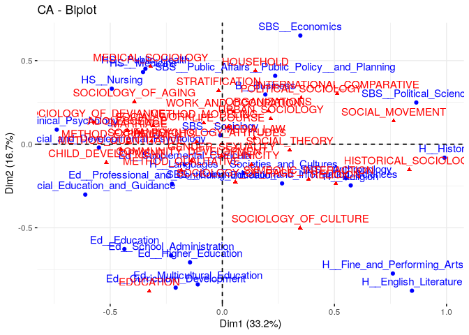

``` r
fviz_ca_biplot(ca_mod1,
  col.row = "orange", col.col = "steelblue",
  labelsize = 3, repel = T
) +
  theme_minimal()
```

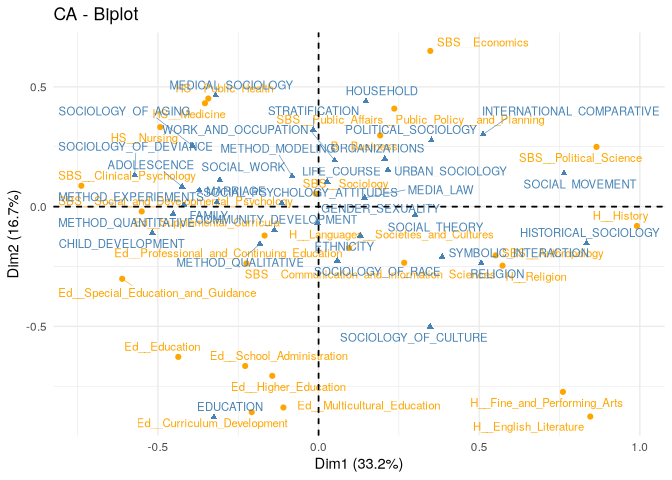

``` r
fviz_ca_row(ca_mod1, col.row = "orange", labelsize = 3, repel = T) +
  theme_minimal()
```

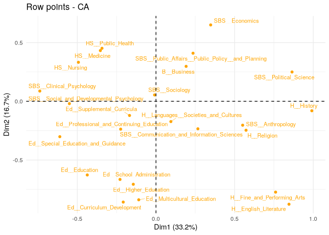

# Number of Dimensions

Decide on number of dimensions, balancing fit and interpretablity.

``` r
eig <- get_eigenvalue(ca_mod1)
eig
```

             eigenvalue variance.percent cumulative.variance.percent
    Dim.1  1.332917e-01     33.212926405                    33.21293
    Dim.2  6.683516e-02     16.653627519                    49.86655
    Dim.3  5.410294e-02     13.481083156                    63.34764
    Dim.4  3.185661e-02      7.937859321                    71.28550
    Dim.5  2.524612e-02      6.290692990                    77.57619
    Dim.6  1.867087e-02      4.652307510                    82.22850
    Dim.7  1.368130e-02      3.409034054                    85.63753
    Dim.8  1.095477e-02      2.729651666                    88.36718
    Dim.9  1.036783e-02      2.583399490                    90.95058
    Dim.10 7.408050e-03      1.845898466                    92.79648
    Dim.11 6.710398e-03      1.672061276                    94.46854
    Dim.12 5.237564e-03      1.305068324                    95.77361
    Dim.13 4.471813e-03      1.114262479                    96.88787
    Dim.14 3.433716e-03      0.855595118                    97.74347
    Dim.15 3.153639e-03      0.785806937                    98.52927
    Dim.16 1.680187e-03      0.418660133                    98.94793
    Dim.17 1.422663e-03      0.354491571                    99.30243
    Dim.18 9.880741e-04      0.246203022                    99.54863
    Dim.19 6.808799e-04      0.169658023                    99.71829
    Dim.20 6.083445e-04      0.151584047                    99.86987
    Dim.21 2.616822e-04      0.065204580                    99.93508
    Dim.22 1.465193e-04      0.036508898                    99.97158
    Dim.23 8.747367e-05      0.021796222                    99.99338
    Dim.24 2.656286e-05      0.006618791                   100.00000

> Scree plot

``` r
fviz_screeplot(ca_mod1)
```

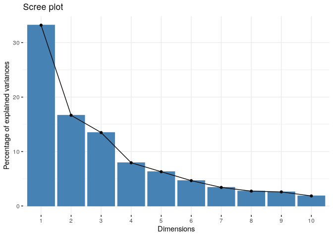

> Average rule

Another potentially useful approach is to apply the average rule
heuristic, which chooses the number of dimensions by selecting all
dimensions that explain more than the average dimension.

``` r
aver.rule(department_topic)
```

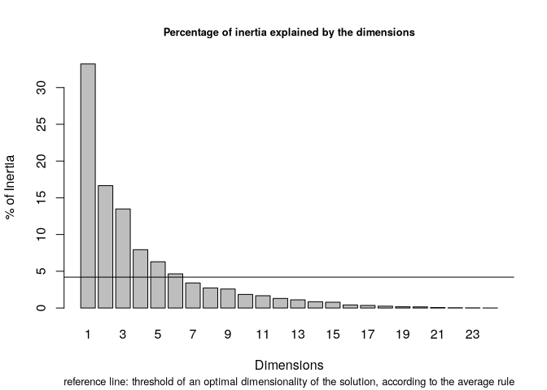

The dashed line indicates the average variance explained and the bars
show the percent variance explained for each dimension. The average rule
would suggest a solution of 6 dimensions. But if we take a closer look
we can see that dimensions 5 and 6 only add around 5% to the explained
variance, a fairly low return on adding an entire dimension to the plot.
So, we may think that the average rule tends to yield solutions with too
many dimensions, at least in this case.

> Malinvaud’s test

This sequential test checks the significance of the remaining dimensions
once the first k ones have been selected.

``` r
malinvaud(department_topic)
```

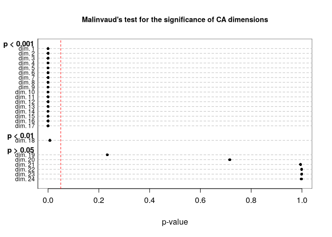

        K Dimension   Eigenvalue   Chi-square  df       p-value   p-class
    1   0    dim. 1 1.332917e-01 20620.073926 768  0.000000e+00 p < 0.001
    2   1    dim. 2 6.683516e-02 13771.543949 713  0.000000e+00 p < 0.001
    3   2    dim. 3 5.410294e-02 10337.553643 660  0.000000e+00 p < 0.001
    4   3    dim. 4 3.185661e-02  7557.744330 609  0.000000e+00 p < 0.001
    5   4    dim. 5 2.524612e-02  5920.951870 560  0.000000e+00 p < 0.001
    6   5    dim. 6 1.867087e-02  4623.806325 513  0.000000e+00 p < 0.001
    7   6    dim. 7 1.368130e-02  3664.497077 468  0.000000e+00 p < 0.001
    8   7    dim. 8 1.095477e-02  2961.551735 425  0.000000e+00 p < 0.001
    9   8    dim. 9 1.036783e-02  2398.695543 384 1.039277e-287 p < 0.001
    10  9   dim. 10 7.408050e-03  1865.996659 345 1.036095e-206 p < 0.001
    11 10   dim. 11 6.710398e-03  1485.371030 308 3.065673e-153 p < 0.001
    12 11   dim. 12 5.237564e-03  1140.590759 273 2.492875e-106 p < 0.001
    13 12   dim. 13 4.471813e-03   871.484706 240  1.658228e-72 p < 0.001
    14 13   dim. 14 3.433716e-03   641.722959 209  1.659357e-45 p < 0.001
    15 14   dim. 15 3.153639e-03   465.298613 180  3.872782e-27 p < 0.001
    16 15   dim. 16 1.680187e-03   303.264642 153  5.705095e-12 p < 0.001
    17 16   dim. 17 1.422663e-03   216.936613 128  1.532274e-06 p < 0.001
    18 17   dim. 18 9.880741e-04   143.840189 105  7.114028e-03  p < 0.01
    19 18   dim. 19 6.808799e-04    93.072944  84  2.335258e-01  p > 0.05
    20 19   dim. 20 6.083445e-04    58.089334  65  7.156535e-01  p > 0.05
    21 20   dim. 21 2.616822e-04    26.832591  48  9.942444e-01  p > 0.05
    22 21   dim. 22 1.465193e-04    13.387359  33  9.990331e-01  p > 0.05
    23 22   dim. 23 8.747367e-05     5.859197  20  9.990747e-01  p > 0.05
    24 23   dim. 24 2.656286e-05     1.364800   9  9.980310e-01  p > 0.05

This shows 18 dimensions as significant.

The text suggests that the scree plot recommends 2 or 3 dimensions, and
pursues this avenue.

> Examine the third dimension

Make a plot of the departments

``` r
locs_department <- ca_mod1$row$coord
```

``` r
text3D(
  x = locs_department[, "Dim 1"],
  y = locs_department[, "Dim 2"],
  z = locs_department[, "Dim 3"],
  labels = department_names, col = "black", theta = 120, phi = 20,
  xlab = "dim1", ylab = "dim2", zlab = "dim3", axes = T,
  ticktype = "detailed", main = "Departments in 3 Dimensions",
  cex = 0.75, bty = "g", d = 2, adj = 1, font = 1
)
```

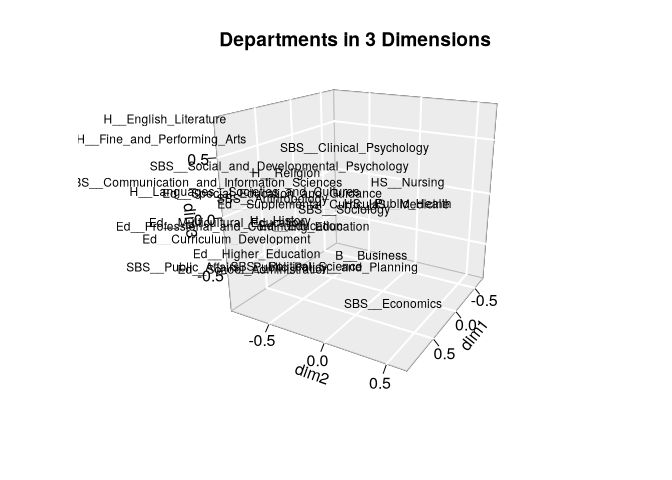

    png 
      2 

The plot is somewhat hard to read in three dimensions, but if we look at
the third (z) dimension, we can see that on one extreme we have higher
education and administration and on the other end we have English and
performing arts. Thus, dimension 3 basically separates some of the
departments that are close together on dimension 2 (English and higher
education) but unless we really think that distinction is crucial we may
be able to get away with the simpler 2-d plot, especially as those
departments are already pretty different on dimension 1.

# Importance of Rows/Columns

Which rows/columns are most importang in fitting a given dimension.

``` r
fviz_contrib(ca_mod1, choice = "row", axes = 1) +
  theme(axis.text.x = element_text(size = 8.0, angle = 75))
```

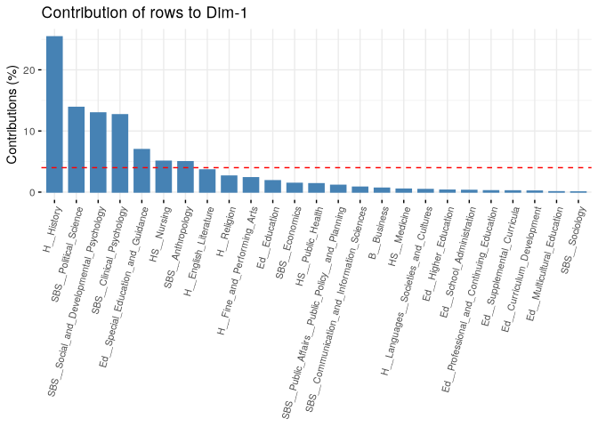

The highest contributing rows are far from the center of the dimension.

The second dimension:

``` r
fviz_contrib(ca_mod1, choice = "row", axes = 2) +
  theme(axis.text.x = element_text(size = 8.0, angle = 75))
```

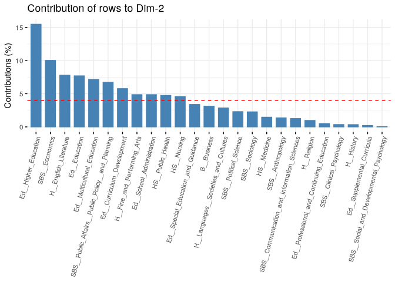

``` r
fviz_contrib(ca_mod1, choice = "col", axes = 1) +
  theme(axis.text.x = element_text(size = 8.0, angle = 75))
```

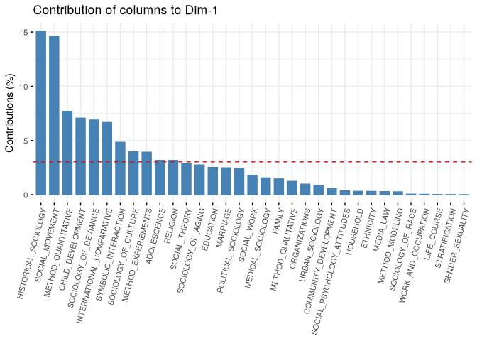

``` r
fviz_contrib(ca_mod1, choice = "col", axes = 2) +
  theme(axis.text.x = element_text(size = 8.0, angle = 75))
```

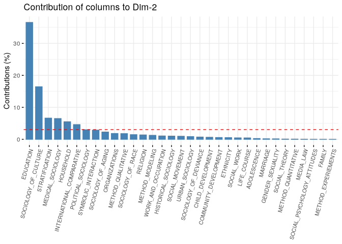

``` r
fviz_ca_biplot(ca_mod1,
  col.row = "contrib", col.col = "contrib",
  labelsize = 3, repel = T
) +
  scale_color_gradient2(
    low = "white", mid = "steelblue",
    high = "darkblue", midpoint = 8
  ) +
  theme_minimal()
```

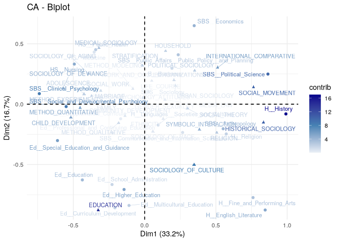

Looking at our figure, it is worth thinking about what it means to be in
the center of the plot compared to the extremes on one of the
dimensions. For example, sociology (department) and gender_sexuality
(topic) are in the center, while political science and social movements
are not. This would suggest that sociology PhDs tend to take on
dissertations that span many of the topics in the field. Similarly, this
means that individuals from a wide variety of disciplines study gender.
On the other hand, social movements is not studied by a wide variety of
departments while those in political science tend not to study a large
number of (sociological) topics, focused mainly on social movements. We
thus have distinctions between central, generalist departments/topics
and those that occupy more peripheral, niche locations

# Hierarchical Clustering

Calculate distance matrix between objects based on locations in 2D
solution.

``` r
locs_topic <- ca_mod1$col$coord
locs <- rbind(locs_department, locs_topic)[, 1:2]
```

``` r
d <- dist(locs, method = "euclidean")
fit <- hclust(d, method = "ward.D2")
```

Choose number of clusters with `NbClust`.

``` r
clusters <- NbClust(
  data = NULL, diss = d, distance = NULL,
  method = "ward.D2", index = c("silhouette")
)
```


     Only frey, mcclain, cindex, sihouette and dunn can be computed. To compute the other indices, data matrix is needed 

``` r
clusters$Best.nc
```

    Number_clusters     Value_Index 
             8.0000          0.4649 

Clusters contain both topics and departments

``` r
cluster_names <- paste("cluster", clusters$Best.partition, sep = "")
names(cluster_names) <- names(clusters$Best.partition)
row_clusters <- cluster_names[department_names]
col_clusters <- cluster_names[topic_names]
```

``` r
fviz_ca_biplot(ca_mod1,
  col.row = row_clusters, col.col = col_clusters,
  labelsize = 3, repel = T
) +
  theme_minimal()
```

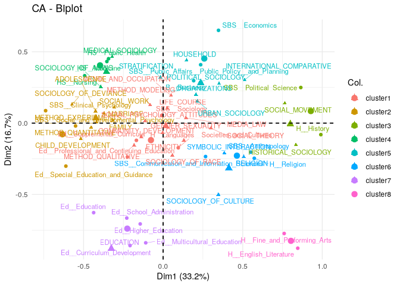

``` r
fviz_ca_biplot(ca_mod1,
  col.row = row_clusters, col.col = col_clusters,
  labelsize = 3, repel = T
) +
  theme_minimal()
```


> Clustering rows and columns seperately

``` r
ca_mod2 <- CA(department_topic, ncp = 2, graph = FALSE)
clust_rows <- HCPC(
  res = ca_mod2, nb.clust = 8, graph = FALSE,
  cluster.CA = "rows"
)
clust_cols <- HCPC(
  res = ca_mod2, nb.clust = 8, graph = FALSE,
  cluster.CA = "columns"
)
```

``` r
plot(clust_rows, choice = "map", draw.tree = FALSE)
```

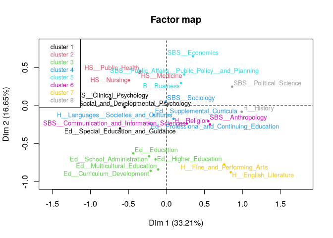

``` r
row_clusters2 <- clust_rows$data[department_names, "clust"]
table(row_clusters, row_clusters2)
```

                row_clusters2
    row_clusters 1 2 3 4 5 6 7 8
        cluster1 0 0 0 4 0 0 0 0
        cluster2 3 0 0 0 0 0 0 0
        cluster3 0 0 0 0 0 0 0 2
        cluster4 0 3 0 0 0 0 0 0
        cluster5 0 0 0 0 3 0 0 0
        cluster6 0 0 0 0 0 3 0 0
        cluster7 0 0 5 0 0 0 0 0
        cluster8 0 0 0 0 0 0 2 0

rows and columns are the same, though not in the same order.

``` r
plot(clust_cols, choice = "map", draw.tree = F)
```

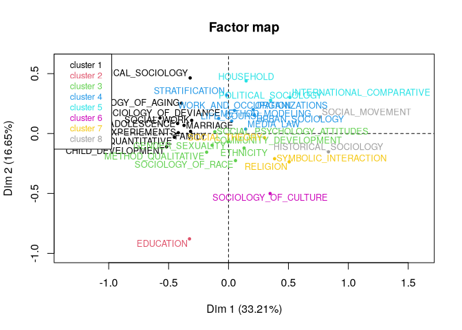
