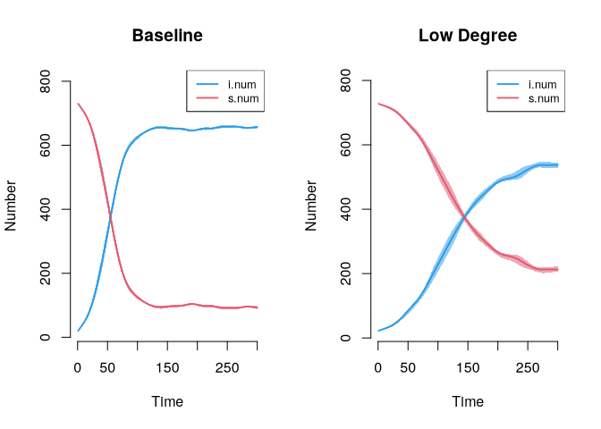

# Network Diffusion: Infectious Diseases


In this tutorial, we will cover dynamic epidemiological models of
diffusion. We will focus on the substantive case of infection spread
(like HIV or HCV) through a risk network (like drug use or a sex
network). We are particularly interested in how the features of the
network shape the potential for widespread contagion. For example, how
much does the epidemic potential decrease if the number of current
partners (e.g., number of sex partners during a given period) decreases
dramatically, so that network density decreases? We are also interested
in how risk behavior affects contagion potential.

We will utilize a dynamic network simulation in this tutorial.
Simulation models are useful as they can be conditioned on empirical
data, while also making it possible to explore complex, non-linear
dynamics; i.e., how individual behavior and wider network features
combine to shape infection potential. The model is dynamic as the
network is allowed to evolve as the simulation progresses. Thus, both
the network ties and the item of interest (the infection spreading over
the network) are allowed to update over time. The focus is still on
contagion, but actors are able to form and break ties as the simulation
progresses; making it possible to explore how the process of tie
formation, dissolution and maintenance affect the risk profile of a
population, in terms of infection spread.

With EpiModel, the basic idea is to specify two kinds of processes, one
related to the formation and breaking of network ties, and one related
to the spread of an infection through the network, dictating how an
infection is spread from node i to node j.

# Data Prep

``` r
library(EpiModel)
```

Here, we will use a faux ego network data set. We can assume that this
data is drawn from an at-risk population of drug users. The data
includes the following information about the respondent, or ego:

- the number of alters named for each ego (with no cap)
- where ego lives (city or suburbs)
- information on up to 3 named drug partners
- whether each named alter lives in the city or suburbs.

We can assume that ego reports on the location for each alter.

``` r
url1 <- "https://github.com/JeffreyAlanSmith/Integrated_Network_Science/raw/master/data/ego_network_example_data.txt"

ego_dat <- read.table(file = url1, header = T, stringsAsFactors = FALSE)
head(ego_dat)
```

      ids location degree location1 location2 location3
    1   1     city      1      city      <NA>      <NA>
    2   2     city      9      city   suburbs      city
    3   3     city      2      city      city      <NA>
    4   4     city      2      city      city      <NA>
    5   5     city      5      city      city      city
    6   6     city      5      city   suburbs      city

Degree is number of drug partners.

# Specifying the Network Model

## Size

Must specify network size. Can use population size, if known. Here will
use sample size.

``` r
num_nodes <- nrow(ego_dat)
num_nodes
```

    [1] 750

Create an empty, undirected network.

``` r
epi_network <- network.initialize(n = num_nodes, directed = F)
```

Add node attributes.

``` r
epi_network <- set.vertex.attribute(epi_network,
  attrname = "location",
  value = ego_dat$location
)
epi_network
```

     Network attributes:
      vertices = 750 
      directed = FALSE 
      hyper = FALSE 
      loops = FALSE 
      multiple = FALSE 
      bipartite = FALSE 
      total edges= 0 
        missing edges= 0 
        non-missing edges= 0 

     Vertex attribute names: 
        location vertex.names 

    No edge attributes

## Model formation of ties

A simple model, with terms for edges and nodefactor and nodematch for
location.

``` r
formation_formula <- formula(~ edges + nodefactor("location") +
  nodematch("location"))
```

Set target statistics for each term based on the ego network data.

> Set baseline number of edges

``` r
mean_degree <- mean(ego_dat$degree)
mean_degree
```

    [1] 3.706667

``` r
edges <- mean_degree * num_nodes / 2 # divide by 2 because undirected
edges
```

    [1] 1390

> Nodefactor

The nodefactor term is defined by the total number of ties emanating
from one group. This is defined as: the mean degree of the group \* the
number of people in that group.

``` r
mean_degree_location <- tapply(
  X = ego_dat$degree, INDEX = ego_dat$location,
  FUN = mean
)
mean_degree_location
```

       city suburbs 
       3.95    3.22 

``` r
tab_location <- table(ego_dat$location)
tab_location
```


       city suburbs 
        500     250 

``` r
edges_by_group <- mean_degree_location * tab_location
edges_by_group
```

       city suburbs 
       1975     805 

Use “city” as reference category.

``` r
edges_suburbs <- edges_by_group[2]
```

> Nodematch target

We need to calculate the number of edges we expect to match on location
(so ij are both in the city or both in the suburbs).

``` r
location_cols <- c("location1", "location2", "location3")
same_location <- ego_dat[, "location"] == ego_dat[, location_cols]
head(same_location)
```

         location1 location2 location3
    [1,]      TRUE        NA        NA
    [2,]      TRUE     FALSE      TRUE
    [3,]      TRUE      TRUE        NA
    [4,]      TRUE      TRUE        NA
    [5,]      TRUE      TRUE      TRUE
    [6,]      TRUE     FALSE      TRUE

``` r
prop_match <- prop.table(table(same_location))
prop_match
```

    same_location
        FALSE      TRUE 
    0.1916966 0.8083034 

So, about .808 of edges should match on location. Note that we still
need to calculate the number of edges we expect to match on location (so
far we just have the proportion).

``` r
num_match <- round(prop_match[[2]] * edges)
num_match
```

    [1] 1124

> Create target statistic input vector

``` r
target_statistics_baseline <- c(
  edges = edges,
  nodefactor.location = edges_suburbs,
  nodematch.location = num_match
)
target_statistics_baseline
```

                          edges nodefactor.location.suburbs 
                           1390                         805 
             nodematch.location 
                           1124 

## Model breaking of ties

This is set via a dissolution_coefs() function. The arguments are:

    - dissolution = a formula that determines how edges are dropped. This can take a number of forms. The simplest version is that all edges are dropped at the same rate; a more complicated model could allow edges of certain characteristics to end at different rates (so we may think that if two people share the same characteristic, then the edge may last longer).
    - duration = the average duration of an edge in the simulation; this is recorded in arbitrary time units (but we can think of this as months for concreteness)
    - d.rate = the death rate of the population (so that nodes can leave the network across time, at least potentially).

Here, we create a fairly simple dissolution model. In this case, all
edges dissolve at the same rate (set using `offset(edges)`), with
average duration of 25 time units (not based on actual data, although it
could be). The exit, or death rate, is set at .001.

``` r
dissolution_coefs <- dissolution_coefs(
  dissolution = ~ offset(edges),
  duration = 25, d.rate = .001
)
dissolution_coefs
```

    Dissolution Coefficients
    =======================
    Dissolution Model: ~offset(edges)
    Target Statistics: 25
    Crude Coefficient: 3.178054
    Mortality/Exit Rate: 0.001
    Adjusted Coefficient: 3.229321

# Estimating the Network Model

We now estimate the statistical network model that will be used in our
epidemiological simulation. The function is netest(), which is a wrapper
for the ergm() and tergm() functions explored in Chapter 13. The main
arguments are:

    - nw = network object used as basis for simulation
    - formation = formula specifying formation of edges
    - target.stats = input target statistics corresponding to formation formula
    - coefs.diss = coefficients for dissolution of edges

``` r
set.seed(1002)
net_mod <- netest(
  nw = epi_network, formation = formation_formula,
  target.stats = target_statistics_baseline,
  coef.diss = dissolution_coefs
)
```

    Unable to match target stats. Using MCMLE estimation.

    Starting maximum pseudolikelihood estimation (MPLE):

    Obtaining the responsible dyads.

    Evaluating the predictor and response matrix.

    Maximizing the pseudolikelihood.

    Finished MPLE.

    Starting Monte Carlo maximum likelihood estimation (MCMLE):

    Iteration 1 of at most 60:

    1 Optimizing with step length 1.0000.
    The log-likelihood improved by 0.0804.
    Convergence test p-value: 0.2109. Not converged with 99% confidence; increasing sample size.
    Iteration 2 of at most 60:
    1 Optimizing with step length 1.0000.
    The log-likelihood improved by 0.0709.
    Convergence test p-value: 0.0772. Not converged with 99% confidence; increasing sample size.
    Iteration 3 of at most 60:
    1 Optimizing with step length 1.0000.
    The log-likelihood improved by 0.0272.
    Convergence test p-value: < 0.0001. Converged with 99% confidence.
    Finished MCMLE.
    This model was fit using MCMC.  To examine model diagnostics and check
    for degeneracy, use the mcmc.diagnostics() function.

``` r
set.seed(1002)
net_mod <- netest(
  nw = epi_network, formation = formation_formula,
  target.stats = target_statistics_baseline,
  coef.diss = dissolution_coefs
)
summary(net_mod)
```

    Call:
    ergm(formula = formation, constraints = constraints, offset.coef = coef.form, 
        target.stats = target.stats, eval.loglik = FALSE, control = set.control.ergm, 
        verbose = verbose, basis = nw)

    Monte Carlo Maximum Likelihood Results:

                                Estimate Std. Error MCMC % z value Pr(>|z|)    
    edges                       -6.26602    0.06737      0 -93.009  < 1e-04 ***
    nodefactor.location.suburbs  0.11958    0.03671      0   3.257  0.00112 ** 
    nodematch.location           1.28863    0.06562      0  19.638  < 1e-04 ***
    ---
    Signif. codes:  0 '***' 0.001 '**' 0.01 '*' 0.05 '.' 0.1 ' ' 1


    Dissolution Coefficients
    =======================
    Dissolution Model: ~offset(edges)
    Target Statistics: 25
    Crude Coefficient: 3.178054
    Mortality/Exit Rate: 0.001
    Adjusted Coefficient: 3.229321

## Check if model is producing networks that match target statistics. Can do static for one time period or dynamic, taking into account formation and dissolution.

The main arguments to netdx() are:

    - x = model estimated from netest
    - nsims = number of simulated networks
    - dynamic = should look at dynamic statistics (T/F)?
    - nsteps = number of time periods in dynamic simulation
    - nwstats.formula = formula of statistics to test against, default is the target statistics specified in the formation formula.

Check static fit.

``` r
mod_fit1 <- netdx(x = net_mod, dynamic = F, nsims = 1000)
```


    Network Diagnostics
    -----------------------
    - Simulating 1000 networks
    - Calculating formation statistics

``` r
plot(mod_fit1, legend = T)
```


Static fit looks good. Now check dynamic for 300 time periods.

``` r
mod_fit2 <- netdx(x = net_mod, dynamic = T, nsims = 5, nsteps = 300)
```


    Network Diagnostics
    -----------------------
    - Simulating 5 networks
     |*****|
    - Calculating formation statistics

``` r
mod_fit2
```

    EpiModel Network Diagnostics
    =======================
    Diagnostic Method: Dynamic
    Simulations: 5
    Time Steps per Sim: 300

    Formation Diagnostics
    ----------------------- 
                                Target Sim Mean Pct Diff Sim SE Z Score
    edges                         1390 1387.908   -0.151  5.047  -0.414
    nodefactor.location.suburbs    805  809.077    0.507  4.303   0.948
    nodematch.location            1124 1124.063    0.006  4.186   0.015
                                SD(Sim Means) SD(Statistic)
    edges                               7.902        33.328
    nodefactor.location.suburbs        14.190        31.568
    nodematch.location                  7.486        29.609

    Duration Diagnostics
    ----------------------- 
          Target Sim Mean Pct Diff Sim SE Z Score SD(Sim Means) SD(Statistic)
    edges     25   24.986   -0.058   0.08  -0.181         0.256         0.611

    Dissolution Diagnostics
    ----------------------- 
          Target Sim Mean Pct Diff Sim SE Z Score SD(Sim Means) SD(Statistic)
    edges   0.04     0.04    0.416      0   1.283             0         0.005

``` r
plot(mod_fit2, legend = T)
```


This seems reasonable, though different from the source text.

Check duration and dissolution of ties.

``` r
par(mfrow = c(1, 2))
plot(mod_fit2, type = "duration")
plot(mod_fit2, type = "dissolution")
```


# Specifying the Epidemic Model

The second main step is to specify the epidemic part of the simulation,
determining the manner in which the infection spreads through social
connections. EpiModel allows for a flexible range of models to be
specified, although it is also possible to write additional code to
extend the functionality of the package. Here, we will consider a simple
contagion model, where actors, once infected, can pass it on to those
they interact with (e.g., share needles with) in a given time period. In
the language of epidemiological studies, we will consider a SIS model
(susceptible-infected-susceptible) where actors are either infected or
susceptible to be infected. We will assume that actors can be
reinfected, once recovered. We could alternatively assume that actors
cannot be reinfected, thus running an SIR model
(susceptible-infected-recovered). To run an epidemiological simulation,
in conjunction with our network model specified above, we need to create
a number of inputs, shaping the features of the simulation.

> Set initial state

As a first step, we need to create a vector that captures the initial
state that each node is in at the start of the simulation. Each node
must be set to a “s” “i” or “r” for susceptible, infected or recovered.
Here, let’s randomly select 3% of the population to be infected. We will
use a sample() function, randomly sampling an s, i, or r state for each
node, with probability .97, .03 and 0 (so no one is recovered). We set
size to num_nodes so that each node in the simulation will have an
initial state.

``` r
initial_status <- sample(c("s", "i", "r"),
  size = num_nodes,
  replace = T, prob = c(.97, .03, 0)
)
table(initial_status)
```

    initial_status
      i   s 
     23 727 

``` r
initial_status_inputs <- init.net(status.vector = initial_status)
```

> Set probabilities of infection and recovery

using a param.net() function. The arguments are:

    - inf.prob = the probability of infection in a given interaction (or act)
    - act.rate = number of interactions (or acts) in a time period between i and j, assuming that i and j are connected in that period.
    - rec.rate = the rate of recovery in a time period

Here we will we set the probability of infection to .025, so that in a
given act between i and j (like sharing needles) the probability of
infection is .025. We set the number of acts per period to 1. This means
that a pair, ij, that have a relationship have 1 risk event per period.
In each risk event, node i, if infected, can pass the infection to j.
Finally, we set the recovery rate to .01, so that a node has a .01
probability of recovering in a given time period.

``` r
input_to_episim <- param.net(
  inf.prob = 0.025, act.rate = 1,
  rec.rate = 0.01
)
input_to_episim
```

    Fixed Parameters
    ---------------------------
    inf.prob = 0.025
    act.rate = 1
    rec.rate = 0.01

> Create control object

Here we use the control.net() function. The main arguments are:

    - type = SI, SIR, SIS
    - nsteps = number of time periods for simulation
    - nsims = number of simulations to perform
    - ncores = number of processors to use in simulation (if multiple cores are to be used)

``` r
control_episim <- control.net(
  type = "SIS", nsteps = 300,
  nsims = 4, ncores = 4
)
control_episim
```

    Network Model Control Settings
    ===============================
    type = SIS
    nsteps = 300
    start = 1
    nsims = 4
    ncores = 4
    resimulate.network = FALSE
    tergmLite = FALSE
    cumulative.edgelist = FALSE
    truncate.el.cuml = 0
    module.order =
    save.nwstats = TRUE
    nwstats.formula = formation
    save.transmat = TRUE
    save.run = FALSE
    save.cumulative.edgelist = FALSE
    verbose = TRUE
    verbose.int = 1
    skip.check = FALSE
    raw.output = FALSE
    tergmLite.track.duration = FALSE
    save.diss.stats = TRUE
    attr.rules = <list>
    save.network = TRUE
    Dynamic Modules: resim_nets.FUN summary_nets.FUN infection.FUN recovery.FUN departures.FUN arrivals.FUN nwupdate.FUN prevalence.FUN

# Running Simulations

## Baseline Model

We can now run our epidemiological simulation using the netsim()
function. The main arguments are:

    - x = fitted network model, based on netest() function
    - param = model parameters, based on param.net() function
    - init = initial status inputs, based on init.net() function
    - control = control object, based on control.net() function

``` r
episim_baseline <- netsim(
  x = net_mod, param = input_to_episim,
  init = initial_status_inputs,
  control = control_episim
)
summary_data_baseline <- as.data.frame(episim_baseline, out = "mean")
head(summary_data_baseline)
```

      time  s.num i.num num si.flow is.flow
    1    1 727.00 23.00 750     NaN     NaN
    2    2 725.50 24.50 750    2.00    0.50
    3    3 723.50 26.50 750    2.50    0.50
    4    4 721.50 28.50 750    2.25    0.25
    5    5 718.00 32.00 750    3.50    0.00
    6    6 717.25 32.75 750    1.00    0.25

Check at different time periods.

``` r
summary(episim_baseline, at = 1)
```


    EpiModel Summary
    =======================
    Model class: netsim

    Simulation Details
    -----------------------
    Model type: SIS
    No. simulations: 4
    No. time steps: 300
    No. NW groups: 1

    Model Statistics
    ------------------------------
    Time: 1 
    ------------------------------ 
              mean  sd    pct
    Suscept.   727   0  0.969
    Infect.     23   0  0.031
    Total      750   0  1.000
    S -> I     NaN  NA     NA
    I -> S     NaN  NA     NA
    ------------------------------ 

``` r
summary(episim_baseline, at = 100)
```


    EpiModel Summary
    =======================
    Model class: netsim

    Simulation Details
    -----------------------
    Model type: SIS
    No. simulations: 4
    No. time steps: 300
    No. NW groups: 1

    Model Statistics
    ------------------------------
    Time: 100 
    ------------------------------ 
                mean      sd    pct
    Suscept.  126.00  15.122  0.168
    Infect.   624.00  15.122  0.832
    Total     750.00   0.000  1.000
    S -> I      8.50   1.915     NA
    I -> S      7.75   1.893     NA
    ------------------------------ 

``` r
plot(episim_baseline, y = c("i.num", "s.num"), legend = T)
```


Infection spreads quickly, over 80% infected after 100 periods.

## Varying network features

Here, we will keep the basic epidemiological simulation the same but
tweak the network features to see how this changes the epidemic
potential. In particular, we will ask how the spread of infection
through the population is affected when the number of partners per
person decreases substantially. We will assume that the number of edges
in the network in a given time period is cut in half. Here individuals
have, on average, degree of 1.854, rather than 3.707.

To construct inputs for the simulation, we will take the target
statistics used originally and simply multiple all of them by .5. This
will directly cut the number of edges in half. It will also ensure that
all of the other target statistics, like nodematch on location, are
based on the new desired number of edges (here half the original).

``` r
target_statistics_lowdegree <- round(target_statistics_baseline * .5)
target_statistics_lowdegree
```

                          edges nodefactor.location.suburbs 
                            695                         402 
             nodematch.location 
                            562 

``` r
net_mod_lowdegree <- netest(
  nw = epi_network, formation = formation_formula,
  target.stats = target_statistics_lowdegree,
  coef.diss = dissolution_coefs
)
```

    Unable to match target stats. Using MCMLE estimation.

    Starting maximum pseudolikelihood estimation (MPLE):

    Obtaining the responsible dyads.

    Evaluating the predictor and response matrix.

    Maximizing the pseudolikelihood.

    Finished MPLE.

    Starting Monte Carlo maximum likelihood estimation (MCMLE):

    Iteration 1 of at most 60:

    1 Optimizing with step length 1.0000.
    The log-likelihood improved by 0.0172.
    Convergence test p-value: 0.1091. Not converged with 99% confidence; increasing sample size.
    Iteration 2 of at most 60:
    1 Optimizing with step length 1.0000.
    The log-likelihood improved by 0.0017.
    Convergence test p-value: 0.0002. Converged with 99% confidence.
    Finished MCMLE.
    This model was fit using MCMC.  To examine model diagnostics and check
    for degeneracy, use the mcmc.diagnostics() function.

``` r
mod_fit_lowdegree <- netdx(
  x = net_mod_lowdegree, dynamic = T,
  nsims = 5, nsteps = 300
)
```


    Network Diagnostics
    -----------------------
    - Simulating 5 networks
     |*****|
    - Calculating formation statistics

``` r
plot(mod_fit_lowdegree, legend = T)
```


``` r
episim_lowdegree <- netsim(
  x = net_mod_lowdegree, param = input_to_episim,
  init = initial_status_inputs,
  control = control_episim
)
summary_data_lowdegree <- as.data.frame(episim_lowdegree, out = "mean")
```

And let’s compare period 10, 25, 50, 100, 150 and 300 between the two
simulations, just including the number infected (i.num in the summary
data frames).

``` r
period <- c(10, 25, 50, 100, 150, 300)
i_num_baseline <- summary_data_baseline[, "i.num"]
i_num_lowdegree <- summary_data_lowdegree[, "i.num"]

compare_dat <- data.frame(
  period = period,
  i.num.baseline = i_num_baseline[period],
  i.num.lowdegree = i_num_lowdegree[period]
)
compare_dat
```

      period i.num.baseline i.num.lowdegree
    1     10          43.50           27.50
    2     25         103.50           39.75
    3     50         322.75           84.75
    4    100         624.00          229.00
    5    150         652.50          389.50
    6    300         657.50          537.50

``` r
diff_infected <- i_num_baseline - i_num_lowdegree

plot(1:300, diff_infected,
  xlab = "period",
  ylab = "Difference in number infected",
  main = "Comparison of Baseline to Low Degree Simulation"
)
```


Plot the diffusion curves.

``` r
par(mfrow = c(1, 2))

plot(episim_baseline,
  y = c("i.num", "s.num"),
  legend = TRUE, main = "Baseline"
)

plot(episim_lowdegree,
  y = c("i.num", "s.num"),
  legend = TRUE, main = "Low Degree"
)
```



## Varying Epidemic Model

Lower the number of interactions per period.

``` r
input_to_episim_lowinteraction <- param.net(
  inf.prob = 0.025,
  act.rate = .40, rec.rate = 0.01
)
```

``` r
episim_lowinteraction <- netsim(
  x = net_mod,
  param = input_to_episim_lowinteraction,
  init = initial_status_inputs,
  control = control_episim
)
```

``` r
par(mfrow = c(1, 2))

plot(episim_baseline,
  y = c("i.num", "s.num"),
  legend = T, main = "Baseline"
)

plot(episim_lowinteraction,
  y = c("i.num", "s.num"),
  legend = T, main = "Low Interactions"
)
```


