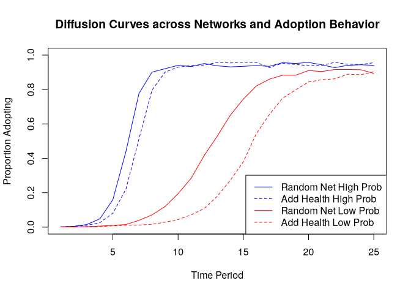

# Social Diffusion


The main question of this tutorial is how quickly an innovation becomes
widely adopted. We are particularly interested in the conditions which
increase/decrease the potential for widespread adoption. For example:

- how does network structure combine with adoption behavior to shape
  diffusion potential?
- Is diffusion slower when the network has strong group boundaries?
- If so, is this always the case, or does it depend on the process by
  which actors adopt the product? For example, what happens when the
  probability of adoption (in a given interaction) is very low or very
  high?

We will consider two main approaches to modeling diffusion processes.

- simple contagion models, where the probability of adoption is based
  only on the probability of direct transmission from i to j
- threshold models, where there is some base number of friends that must
  adopt before an actor will consider adopting; e.g., an actor may only
  take up a risky behavior if more than 1 of their friends have already
  done so.

# Preparation

We will utilize a network from the Add Health study for this tutorial.
The basic idea is to condition, or constrain, our analyses on the
features of an observed network. Add Health is a study of adolescents in
schools. The study collected detailed health and behavior information
for each student across a large number of schools. They also collected
network information, asking each student to name up to 5 male and 5
female friends. Here, we take one school network as the basis for the
analysis. We will utilize a synthetic version of the network; one that
is generated based on the original data (with the same basic features)
but cannot be linked back to the original data. The network of interest
has 658 nodes.

``` r
# url1 <- "https://github.com/JeffreyAlanSmith/Integrated_Network_Science/raw/master/data/addhealth_edgelist.txt"

ah_edgelist <- read.table("../data/addhealth_edgelist.txt", header = T)
head(ah_edgelist)
```

      sender receiver
    1      1      274
    2      1      449
    3      1      457
    4      1      564
    5      2      417
    6      2      459

``` r
library(igraph)
```

``` r
num_actors <- max(ah_edgelist$sender, ah_edgelist$receiver)
ah_network <- graph_from_data_frame(
  d = ah_edgelist, directed = F,
  vertices = data.frame(ids = 1:num_actors)
)
```

For the second network, we will use a random network with the same
number of nodes and degree distribution as in the Add Health network.
This offers a nice comparison, as we can see how two networks with the
same degree distribution (and thus density) but different structural
features yield different diffusion results.

``` r
# url2 <- "https://github.com/JeffreyAlanSmith/Integrated_Network_Science/raw/master/data/randnet_edgelist_ahexample.txt"

randnet_edgelist <- read.table("../data/randnet_edgelist_ahexample.txt", header = T)
```

``` r
rand_network <- graph_from_data_frame(
  d = randnet_edgelist, directed = F,
  vertices = data.frame(ids = 1:num_actors)
)
```

``` r
edge_density(ah_network)
```

    [1] 0.01327763

``` r
edge_density(rand_network)
```

    [1] 0.01327763

Density is the same

``` r
transitivity(ah_network)
```

    [1] 0.1472136

``` r
transitivity(rand_network)
```

    [1] 0.01814668

Transitivity is higher in the Add Health Network

``` r
dist_mat_ah <- distances(graph = ah_network, mode = "out")
summary(dist_mat_ah[dist_mat_ah != 0])
```

       Min. 1st Qu.  Median    Mean 3rd Qu.    Max. 
      1.000   3.000   4.000   3.517   4.000   7.000 

``` r
dist_mat_randnet <- distances(graph = rand_network, mode = "out")
summary(dist_mat_randnet[dist_mat_randnet != 0])
```

       Min. 1st Qu.  Median    Mean 3rd Qu.    Max. 
      1.000   3.000   3.000   3.229   4.000   7.000 

The distance between nodes is higher in the Aded Health network. The Add
Health network and random network have the same density, but the Add
Health network has higher transitivity and distance between nodes. This
indicates subgroups in the school that do not occur randomly.

# Simple Diffusion Models

Note that in this analysis we will hold the network fixed within a given
simulation. Thus, items flow over a network that does not change over
time (see Chapter 15 for the coevolution of behaviors and networks). For
concreteness, we can think of the innovation spreading through the
network as a new product, where actors who are surrounded by people who
adopt the product are more likely to take up the new product themselves.

The simple model focuses on the direct interaction between i and j, with
a proability of infection for each period. It is possible to allow nodes
to drop the product. The process repeats periodically.

``` r
# source("https://github.com/JeffreyAlanSmith/Integrated_Network_Science/raw/master/R/simple_contagion_function.R")
source("simple_contagion_function.R")
```

The main function is simple_contagion_function(). The arguments are:

- net = network of interest, as an igraph object
- initial_seeds = vector indicating which nodes start as ‘infected’
- time_periods = number of periods in simulation
- prob_infection = probability of passing from i to j
- prob_recovery = probability of recovering in a given time period

The function will run a simulation model where the initial seeds start
as infected, pass it to their neighbors with the probability set in
prob_infection. They adopt probabilistically and the process continues
until the simulation reaches the period set in time_periods.

We set the probability of infection (or adopting the product) at two
different levels, one ‘high’ and one ‘low’, to see how differing the
probability of adoption shapes diffusion through the network. The high
value will be set at .3 (so that j has a .3 probability of adopting the
product if i has adopted the product). The low value is set at .1. We
will set the recovery rate at .05 in all simulations (so that a node has
a .05 probability of dropping the product once adopted). We will run the
simulation over 25 time periods. We will pick one node to serve as our
initial seed. Note that we would generally want to run this multiple
times, with different seeds to see how this affects the results. Here we
set node 3 as the seed, our initially infected node.

``` r
initial_seeds <- 3
time_periods <- 25
prob_recovery <- .05
```

``` r
set.seed(5000)

ah_simresults_highprob <-
  simple_contagion_function(
    net = ah_network, initial_seeds = initial_seeds,
    time_periods = time_periods, prob_recovery = prob_recovery,
    prob_infection = .3
  )
```

``` r
names(ah_simresults_highprob)
```

    [1] "results"         "cumulative_prop"

The output is a list with two elements.

- a list of results, with one element corresponding to each time period
  in the simulation. For each time period, we see the nodes that are
  infected (i.e. adopters) and those that are susceptible, those cases
  who are not infected but could be.
- a cumulative distribution, showing the total proportion infected at
  the end of each time period.

``` r
head(ah_simresults_highprob$cumulative_prop)
```

    [1] 0.001519757 0.004559271 0.010638298 0.025835866 0.080547112 0.220364742

``` r
ah_simresults_lowprob <-
  simple_contagion_function(
    net = ah_network, initial_seeds = initial_seeds,
    time_periods = time_periods, prob_recovery = prob_recovery,
    prob_infection = .1
  )
```

``` r
rand_simresults_highprob <-
  simple_contagion_function(
    net = rand_network,
    initial_seeds = initial_seeds,
    time_periods = time_periods,
    prob_infection = .3,
    prob_recovery = prob_recovery
  )
rand_simresults_lowprob <-
  simple_contagion_function(
    net = rand_network,
    initial_seeds = initial_seeds,
    time_periods = time_periods,
    prob_infection = .1,
    prob_recovery = prob_recovery
  )
```

The easiest way to compare the results across runs is to plot the
proportion who adopt for each of the four scenarios, the two networks by
the two levels of adoption.

``` r
plot(
  x = 1:25, ylim = c(0, 1), type = "n",
  xlab = "Time Period", ylab = "Proportion Adopting",
  main = "Diffusion Curves across Networks and Adoption Behavior"
)

lines(
  x = 1:25, y = rand_simresults_highprob$cumulative_prop,
  lty = 1, col = "blue"
)
lines(
  x = 1:25, y = ah_simresults_highprob$cumulative_prop,
  lty = 2, col = "blue"
)
lines(
  x = 1:25, y = rand_simresults_lowprob$cumulative_prop,
  lty = 1, col = "red"
)
lines(
  x = 1:25, y = ah_simresults_lowprob$cumulative_prop,
  lty = 2, col = "red"
)
legend("bottomright", c(
  "Random Net High Prob", "Add Health High Prob",
  "Random Net Low Prob", "Add Health Low Prob"
),
col = c("blue", "blue", "red", "red"), lty = c(1, 2, 1, 2)
)
```



# Threshold Models

Adoption based on the number of people connected to who have already
adopted.

## Simulated diffusion processes

``` r
library(netdiffuseR)
```

`netdiffuseR` takes the network as a matrix, so we will begin by
transforming our network object (in igraph) into a matrix. We will do
this for both the Add Health network and the random network

``` r
ah_network_mat <- as_adjacency_matrix(ah_network)
rand_network_mat <- as_adjacency_matrix(rand_network)
```

The function to run the diffusion simulation is rdiffnet(). The main
arguments to rdiffnet() are:

- t = number of time periods in the simulation
- seed.nodes = nodes to be set as seeds, those who have already adopted
  the innovation at the beginning of the simulation. This can also be
  set as a character string, like “random”, telling the function to
  select seeds at random.
- seed.p.adopt = proportion to be selected as seeds if seeds not set by
  researcher in seed.nodes
- seed.graph = network of interest, as a matrix (or name of random graph
  to create)
- rewire = T/F, should network slices over time be generated by randomly
  rewiring ties?
- threshold.dist = a single value or scalar setting the thresholds (at
  what point will node i adopt the innovation?). Could also be a
  function determining the thresholds of each node.
- exposure.args = inputs to exposure function, such as normalized (T/F,
  should exposure be calculated as proportion (T) or absolute number of
  alters who adopt (F)?)

We need to specify the network of interest (seed.graph), either as a
static or dynamic graph. We will continue our example and use the static
version of the simulation.

``` r
num_nodes <- nrow(ah_network_mat)
num_seeds <- round(.05 * num_nodes)
num_seeds
```

    [1] 33

``` r
set.seed(15)
seeds <- sample(1:num_nodes, size = num_seeds)
```

``` r
exposure_list <- list(normalized = FALSE)

ah_simresults_threshold1 <- rdiffnet(
  t = 10, seed.nodes = seeds, seed.graph = ah_network_mat,
  rewire = F, threshold.dist = 1, exposure.args = exposure_list
)

class(ah_simresults_threshold1)
```

    [1] "diffnet"

``` r
names(ah_simresults_threshold1)
```

    [1] "graph"               "toa"                 "adopt"              
    [4] "cumadopt"            "vertex.static.attrs" "vertex.dyn.attrs"   
    [7] "graph.attrs"         "meta"               

toa = time of adoption

``` r
head(ah_simresults_threshold1$toa)
```

    1 2 3 4 5 6 
    3 1 3 3 2 2 

We see that node 1 adopted in period 3, node 2 adopted in period 1 and
so on.

``` r
head(ah_simresults_threshold1$cumadopt)
```

         [,1] [,2] [,3] [,4] [,5] [,6] [,7] [,8] [,9] [,10]
    [1,]    0    0    1    1    1    1    1    1    1     1
    [2,]    1    1    1    1    1    1    1    1    1     1
    [3,]    0    0    1    1    1    1    1    1    1     1
    [4,]    0    0    1    1    1    1    1    1    1     1
    [5,]    0    1    1    1    1    1    1    1    1     1
    [6,]    0    1    1    1    1    1    1    1    1     1

The rows are the nodes and the columns are the time periods. There is a
1 if node i has adopted by time period j.

``` r
cumul_adopt <- colSums(ah_simresults_threshold1$cumadopt) / num_nodes
head(cumul_adopt)
```

    [1] 0.05015198 0.39361702 0.91641337 0.99848024 1.00000000 1.00000000

``` r
cumulative_adopt_count(ah_simresults_threshold1)
```

                   1          2           3            4           5   6   7   8
    num  33.00000000 259.000000 603.0000000 657.00000000 6.58000e+02 658 658 658
    prop  0.05015198   0.393617   0.9164134   0.99848024 1.00000e+00   1   1   1
    rate  0.00000000   6.848485   1.3281853   0.08955224 1.52207e-03   0   0   0
           9  10
    num  658 658
    prop   1   1
    rate   0   0

``` r
plot_adopters(ah_simresults_threshold1)
```


``` r
plot_diffnet(ah_simresults_threshold1, slices = c(1, 3, 5, 7))
```


``` r
sum_model1 <- summary(ah_simresults_threshold1)
```

    Diffusion network summary statistics
    Name     : A diffusion network
    Behavior : Random contagion
    -----------------------------------------------------------------------------
     Period   Adopters   Cum Adopt. (%)   Hazard Rate   Density   Moran's I (sd)  
    -------- ---------- ---------------- ------------- --------- ---------------- 
           1         33        33 (0.05)             -      0.01 -0.00 (0.00)     
           2        226       259 (0.39)          0.36      0.01  0.01 (0.00) *** 
           3        344       603 (0.92)          0.86      0.01  0.01 (0.00) *** 
           4         54       657 (1.00)          0.98      0.01 -0.00 (0.00) *   
           5          1       658 (1.00)          1.00      0.01               -  
           6          0       658 (1.00)          0.00      0.01               -  
           7          0       658 (1.00)          0.00      0.01               -  
           8          0       658 (1.00)          0.00      0.01               -  
           9          0       658 (1.00)          0.00      0.01               -  
          10          0       658 (1.00)          0.00      0.01               -  
    -----------------------------------------------------------------------------
     Left censoring  : 0.05 (33)
     Right centoring : 0.00 (0)
     # of nodes      : 658

     Moran's I was computed on contemporaneous autocorrelation using 1/geodesic
     values. Significane levels  *** <= .01, ** <= .05, * <= .1.

The summary offers the number of adopters in each period, the cumulative
number, the cumulative proportion of adopters, as well as a number of
other useful summary measures. For example, the hazard (of adopting) is
the proportion adopting in that period given they had already ‘survived’
(i.e., not adopted) prior to that period. So, for period 2 the hazard
is: 226 / (658 - 33) = .362, as there are 226 adopters, 658 total nodes
and 33 had adopted in period 1.

## Comparing diffusion under different conditions

We begin by keeping everything the same but running the simulation over
the random network generated above. Thus, only the network structure is
allowed to vary from the previous simulation.

``` r
randnet_simresults_threshold1 <-
  rdiffnet(
    t = 10, seed.nodes = seeds,
    seed.graph = rand_network_mat,
    rewire = FALSE, threshold.dist = 1,
    exposure.args = exposure_list
  )
```

Re-run, requiring at least three friends to have adopted before
adopting.

``` r
ah_simresults_threshold3 <-
  rdiffnet(
    t = 10, seed.nodes = seeds,
    seed.graph = ah_network_mat,
    rewire = FALSE, threshold.dist = 3,
    exposure.args = exposure_list
  )

randnet_simresults_threshold3 <-
  rdiffnet(
    t = 10, seed.nodes = seeds,
    seed.graph = rand_network_mat,
    rewire = FALSE, threshold.dist = 3,
    exposure.args = exposure_list
  )
```

``` r
plot_adopters(randnet_simresults_threshold1,
  bg = "blue", pch = 25,
  include.legend = FALSE, what = "cumadopt",
  main = "Diffusion across Networks and Adoption Behavior"
)

plot_adopters(ah_simresults_threshold1,
  bg = "blue", pch = 21,
  add = TRUE, what = "cumadopt"
)

plot_adopters(randnet_simresults_threshold3,
  bg = "red", pch = 25,
  add = TRUE, what = "cumadopt"
)

plot_adopters(ah_simresults_threshold3,
  bg = "red", pch = 21,
  add = TRUE, what = "cumadopt"
)

legend("bottomright",
  c(
    "Random Net Low Threshold", "Add Health Low Threshold",
    "Random Net High Threshold", "Add Health High Threshold"
  ),
  pt.bg = c("blue", "blue", "red", "red"), pch = c(25, 21, 25, 21)
)
```


The Add Health network high threshold has higher adoption than the
random version, reflecting the strong group structure.

Sensitivity to initial seeds. Here we select nodes which are central in
the network. With automatic selection, must provide the proportion of
nodes to be selected with `seed.p.adopt`

``` r
ah_simresults_threshold3_central <-
  rdiffnet(
    t = 10, seed.nodes = "central",
    seed.p.adopt = .05,
    seed.graph = ah_network_mat,
    rewire = FALSE, threshold.dist = 3,
    exposure.args = exposure_list
  )

randnet_simresults_threshold3_central <-
  rdiffnet(
    t = 10, seed.nodes = "central",
    seed.p.adopt = .05,
    seed.graph = rand_network_mat,
    rewire = FALSE, threshold.dist = 3,
    exposure.args = exposure_list
  )
```

``` r
# random network, central seeds
plot_adopters(randnet_simresults_threshold3_central,
  bg = "blue", pch = 25,
  include.legend = FALSE, what = "cumadopt",
  main = "Random Versus Central Seeds: High Threshold Results"
)

# AH, random seeds
plot_adopters(ah_simresults_threshold3_central,
  bg = "blue", pch = 21,
  add = TRUE, what = "cumadopt"
)

# random network, central seeds
plot_adopters(randnet_simresults_threshold3,
  bg = "red", pch = 25,
  add = TRUE, what = "cumadopt"
)

# AH, random seeds
plot_adopters(ah_simresults_threshold3,
  bg = "red", pch = 21,
  add = TRUE, what = "cumadopt"
)

legend("bottomright", c(
  "Random Net, Central Seeds",
  "Add Health, Central Seeds",
  "Random Net, Rand Seeds",
  "Add Health, Rand Seeds"
),
pt.bg = c("blue", "blue", "red", "red"), pch = c(25, 21, 25, 21)
)
```


Diffusion is quicker with central seeds. With central seeds, the random
network quickly outpaces all others. These results demonstrate the
interdependencies between factors in the simulation, where having
central nodes as seeds spreads the adoption far enough at the beginning
to overcome the lack of group structure in the random network, leading
to faster diffusion rates in the long run.

Realistically, different people have different “threshold levels” to
convince them. Here, each node’s threshold is set randomly from 0 to 6.

``` r
thresholds <- round(runif(n = num_nodes, min = 0, max = 6))
```

``` r
ah_simresults_diffthreshold <-
  rdiffnet(
    t = 10, seed.nodes = seeds,
    seed.graph = ah_network_mat, rewire = F,
    threshold.dist = thresholds, exposure.args = exposure_list
  )
```

``` r
# AH, variable thresholds
plot_adopters(ah_simresults_diffthreshold,
  bg = "blue", pch = 21,
  include.legend = FALSE, what = "cumadopt",
  main = "Comparing Variable and Fixed Thresholds"
)

# AH, fixed thresholds
plot_adopters(ah_simresults_threshold3,
  bg = "red", pch = 21,
  add = TRUE, what = "cumadopt"
)

legend("bottomright",
  c("Add Health, Varied Thresholds", "Add Health, Threshold = 3"),
  pt.bg = c("blue", "red"), pch = c(21, 21)
)
```


Having variable thresholds increases the rate of diffusion.

## Simulations using Multiple Runs

Here we will employ a `rdiffnet_multiple()` function. This has identical
arguments as `rdiffnet` but with a few added options to control the
multiple runs:

- statistic = function describing the statistic of interest to be
  calculated for each run
- R = number of times to repeat simulation
- ncpus = number of cores to utilize if using parallel processing

``` r
stat_func <- function(x) {
  cumulative_adopt_count(x)["prop", ]
}
```

``` r
ah_simresults_multiple_threshold1 <- rdiffnet_multiple(
  statistic = stat_func, R = 100, ncpus = 4, t = 10,
  seed.nodes = "random", seed.p.adopt = .05,
  seed.graph = ah_network_mat, rewire = FALSE,
  threshold.dist = 1, exposure.args = exposure_list,
  stop.no.diff = FALSE
)
class(ah_simresults_multiple_threshold1)
```

    [1] "matrix" "array" 

``` r
dim(ah_simresults_multiple_threshold1)
```

    [1]  10 100

The rows correspond to the time periods in the simulation. The columns
correspond to the different simulations performed,

``` r
ah_simresults_multiple_threshold1[, 1:5]
```

             [,1]       [,2]       [,3]       [,4]       [,5]
    1  0.04863222 0.04863222 0.04863222 0.04863222 0.04863222
    2  0.37082067 0.38297872 0.35714286 0.35562310 0.35106383
    3  0.91033435 0.92249240 0.92097264 0.91337386 0.91185410
    4  0.99848024 1.00000000 0.99696049 0.99696049 0.99848024
    5  1.00000000 1.00000000 1.00000000 1.00000000 1.00000000
    6  1.00000000 1.00000000 1.00000000 1.00000000 1.00000000
    7  1.00000000 1.00000000 1.00000000 1.00000000 1.00000000
    8  1.00000000 1.00000000 1.00000000 1.00000000 1.00000000
    9  1.00000000 1.00000000 1.00000000 1.00000000 1.00000000
    10 1.00000000 1.00000000 1.00000000 1.00000000 1.00000000

``` r
ah_simresults_multiple_threshold3 <- rdiffnet_multiple(
  statistic = stat_func, R = 100, ncpus = 4, t = 10,
  seed.nodes = "random", seed.p.adopt = .05,
  seed.graph = ah_network_mat, rewire = FALSE,
  threshold.dist = 3, exposure.args = exposure_list,
  stop.no.diff = FALSE
)
```

``` r
par(mfrow = c(1, 2))

# Low threshold
boxplot(t(ah_simresults_multiple_threshold1),
  xlab = "Time",
  ylab = "Proportion of Adopters",
  main = "Low Threshold Model", boxwex = .5, ylim = c(0, 1)
)

# High threshold
boxplot(t(ah_simresults_multiple_threshold3),
  xlab = "Time",
  ylab = "Proportion of Adopters",
  main = "High Threshold Model", boxwex = .5, ylim = c(0, 1)
)
```


The high threshold model has the real potential for diffusion to not
occur. The initial seeds matter much more.

# Working with Empirical Data

Here we assume that a researcher has collected information about the
adoption of an innovation (product, etc.) over time and would like to
model this is as a threshold process.

``` r
# url3 <- "https://github.com/JeffreyAlanSmith/Integrated_Network_Science/raw/master/data/addhealth_attributes.txt"

ah_attributes <- read.table("../data/addhealth_attributes.txt", header = T)
head(ah_attributes)
```

      ids gender  race grade toa
    1   1 female white    12  NA
    2   2   male white    11  NA
    3   3 female white    11   8
    4   4 female white     9   4
    5   5   male white    12   4
    6   6   male white    10   5

A researcher with this kind of data, coupled with the network data used
above, may be interested in knowing if people tend to adopt if their
neighbors adopt. They may also want to know which actors have
higher/lower thresholds of adoption, showing which actors take up the
adoption easily and which need more prompting.

We will make use of the `new_diffnet()` function to create the diffnet
object. The main arguments are:

- graph = network of interest. This can be a static or dynamic
  (longitudinal) network.
- toa = vector showing time of adoption for each node
- vertex.static.attrs = data frame showing attributes for each node
  (restricted to attributes that don’t change over time); see
  vertex.dyn.attrs for attributes that are allowed to change over time.

``` r
ah_diffnet <- new_diffnet(
  graph = ah_network_mat, toa = ah_attributes$toa,
  vertex.static.attrs = ah_attributes
)
```

    Warning in new_diffnet(graph = ah_network_mat, toa = ah_attributes$toa, :
    -graph- is static and will be recycled (see ?new_diffnet).

``` r
ah_diffnet
```

    Dynamic network of class -diffnet-
     Name               : Diffusion Network
     Behavior           : Unspecified
     # of nodes         : 658 (1, 2, 3, 4, 5, 6, 7, 8, ...)
     # of time periods  : 10 (1 - 10)
     Type               : directed
     Final prevalence   : 0.86
     Static attributes  : ids, gender, race, grade, toa (5)
     Dynamic attributes : -

``` r
summary(ah_diffnet)
```

    Diffusion network summary statistics
    Name     : Diffusion Network
    Behavior : Unspecified
    -----------------------------------------------------------------------------
     Period   Adopters   Cum Adopt. (%)   Hazard Rate   Density   Moran's I (sd)  
    -------- ---------- ---------------- ------------- --------- ---------------- 
           1         33        33 (0.05)             -      0.01 -0.00 (0.00)     
           2         31        64 (0.10)          0.05      0.01  0.00 (0.00) *** 
           3         47       111 (0.17)          0.08      0.01  0.01 (0.00) *** 
           4         74       185 (0.28)          0.14      0.01  0.01 (0.00) *** 
           5        104       289 (0.44)          0.22      0.01  0.02 (0.00) *** 
           6        109       398 (0.60)          0.30      0.01  0.02 (0.00) *** 
           7         87       485 (0.74)          0.33      0.01  0.01 (0.00) *** 
           8         55       540 (0.82)          0.32      0.01  0.01 (0.00) *** 
           9         18       558 (0.85)          0.15      0.01  0.01 (0.00) *** 
          10          7       565 (0.86)          0.07      0.01  0.01 (0.00) *** 
    -----------------------------------------------------------------------------
     Left censoring  : 0.05 (33)
     Right centoring : 0.14 (93)
     # of nodes      : 658

     Moran's I was computed on contemporaneous autocorrelation using 1/geodesic
     values. Significane levels  *** <= .01, ** <= .05, * <= .1.

How do thresholds vary across nodes? We can use exposure of each node to
the innovation and time of adoption.

We will begin by getting the exposure of each node to the innovation
using the exposure() function. The arguments are:

- graph = the diffnet object
- normalized = T/F; T if results should be presented as proportion of
  neighbors who have adopted; F if reported as counts
- lags = period, in lags, from which to output exposure; if set to 0
  then outputs level of exposure in given period.

``` r
exposure_overall <- exposure(ah_diffnet, normalized = F, lags = 0)
head(exposure_overall)
```

      1 2 3  4  5  6  7  8  9 10
    1 0 0 0  1  3  4  4  4  4  4
    2 0 0 0  0  0  1  1  1  1  2
    3 0 0 0  1  2  5  6  6  7  7
    4 1 2 3  4  7 10 11 11 11 12
    5 2 3 8 10 12 13 13 13 13 13
    6 0 0 1  3  5  8  8 10 10 10

The rows correspond to the nodes in the network. The columns correspond
to time periods. The values show the number of friends in that period,
for that node, who have already adopted the innovation.

Now, we will take our results from the exposure() function and use it to
estimate the underlying threshold for each node. We will begin by
calculating the level of exposure prior to adoption, or lagged exposure.
The function is threshold(). The main arguments are:

- obj = exposure matrix
- toa = vector showing time of adoption
- lags = time of exposure to consider; lags = 1 is T - 1; lags = 2 is
  T - 2 and so on.

The basic idea is that each node adopts the period after their threshold
is met (assuming the threshold model is appropriate in this case). If a
node adopts in period T, then they must have reached their threshold in
period T - 1. We also know that they did not adopt in period T - 1,
meaning the threshold had not been met in period T - 2. We can thus
calculate the range of possible thresholds by calculating the exposure
at T - 2 and T - 1. We thus need to calculate exposure using lags = 2
and lags = 1.

``` r
thresh_lag2 <- threshold(
  obj = exposure_overall,
  toa = ah_diffnet$toa, lags = 2
)
head(thresh_lag2)
```

      threshold
    1        NA
    2        NA
    3         5
    4         2
    5         3
    6         1

``` r
thresh_lag1 <- threshold(
  obj = exposure_overall,
  toa = ah_diffnet$toa, lags = 1
)
head(thresh_lag1)
```

      threshold
    1        NA
    2        NA
    3         6
    4         3
    5         8
    6         3

The latent threshold is greater than the T-2 exposure and less than or
equal to the T-1 threshold.

``` r
threshold_dat <- data.frame(
  lower_bound = thresh_lag2[, 1],
  upper_bound = thresh_lag1[, 1]
)
head(threshold_dat)
```

      lower_bound upper_bound
    1          NA          NA
    2          NA          NA
    3           5           6
    4           2           3
    5           3           8
    6           1           3

We can go one step further and actually estimate a diffusion regression
model, estimating the effect of exposure on the probability of adopting.
The outcome of interest is whether a node adopted the innovation (0 = no
adoption; 1 = adoption) at a given time period. The main predictor is
exposure, here set to the exposure in T - 1 (so the exposure prior to
the period in question). We will also include controls for time period,
as adoption might start off quick but slow down over time. This is
accomplished by using factor(per) in the formula.

``` r
diffnet_model1 <- diffreg(
  ah_diffnet ~ exposure(normalized = F, lags = 1) +
    factor(per),
  type = "logit"
)
summary(diffnet_model1)
```


    Call:
    glm(formula = Adopt ~ exposure + factor(per), family = binomial(link = "logit"), 
        data = dat, subset = ifelse(is.na(toa), TRUE, toa >= per))

    Coefficients:
                  Estimate Std. Error z value Pr(>|z|)    
    (Intercept)   -3.85357    0.20086 -19.186  < 2e-16 ***
    exposure       1.16615    0.05139  22.691  < 2e-16 ***
    factor(per)3  -0.30245    0.26504  -1.141 0.253815    
    factor(per)4  -0.45997    0.26052  -1.766 0.077474 .  
    factor(per)5  -0.54952    0.26307  -2.089 0.036718 *  
    factor(per)6  -0.58495    0.27179  -2.152 0.031382 *  
    factor(per)7  -0.97272    0.29785  -3.266 0.001092 ** 
    factor(per)8  -1.09052    0.32706  -3.334 0.000855 ***
    factor(per)9  -2.00491    0.39573  -5.066 4.05e-07 ***
    factor(per)10 -2.80214    0.50595  -5.538 3.05e-08 ***
    ---
    Signif. codes:  0 '***' 0.001 '**' 0.01 '*' 0.05 '.' 0.1 ' ' 1

    (Dispersion parameter for binomial family taken to be 1)

        Null deviance: 2900.5  on 3258  degrees of freedom
    Residual deviance: 1700.3  on 3249  degrees of freedom
      (658 observations deleted due to missingness)
    AIC: 1720.3

    Number of Fisher Scoring iterations: 6

The odds of adopting the innovation increase by exp(1.16615) = 3.210
times for every additional friend who had adopted the innovation in the
previous period.

Here we will control for gender and grade. These attributes are
immediately available to be included in the formula as they were part of
the original diffnet object constructed above.

``` r
diffnet_model2 <- diffreg(
  ah_diffnet ~ exposure(normalized = F, lags = 1) +
    factor(per) + factor(gender) + grade,
  type = "logit"
)
summary(diffnet_model2)
```


    Call:
    glm(formula = Adopt ~ exposure + factor(per) + factor(gender) + 
        grade, family = binomial(link = "logit"), data = dat, subset = ifelse(is.na(toa), 
        TRUE, toa >= per))

    Coefficients:
                       Estimate Std. Error z value Pr(>|z|)    
    (Intercept)        -4.15794    0.64658  -6.431 1.27e-10 ***
    exposure            1.16647    0.05147  22.662  < 2e-16 ***
    factor(per)3       -0.30610    0.26589  -1.151  0.24963    
    factor(per)4       -0.44895    0.26124  -1.719  0.08570 .  
    factor(per)5       -0.53517    0.26393  -2.028  0.04259 *  
    factor(per)6       -0.55529    0.27236  -2.039  0.04147 *  
    factor(per)7       -0.94968    0.29917  -3.174  0.00150 ** 
    factor(per)8       -1.02542    0.32808  -3.126  0.00177 ** 
    factor(per)9       -1.94833    0.39604  -4.919 8.68e-07 ***
    factor(per)10      -2.76384    0.50760  -5.445 5.18e-08 ***
    factor(gender)male -0.38988    0.12814  -3.043  0.00235 ** 
    grade               0.04644    0.05824   0.797  0.42525    
    ---
    Signif. codes:  0 '***' 0.001 '**' 0.01 '*' 0.05 '.' 0.1 ' ' 1

    (Dispersion parameter for binomial family taken to be 1)

        Null deviance: 2900.5  on 3258  degrees of freedom
    Residual deviance: 1690.7  on 3247  degrees of freedom
      (658 observations deleted due to missingness)
    AIC: 1714.7

    Number of Fisher Scoring iterations: 6
