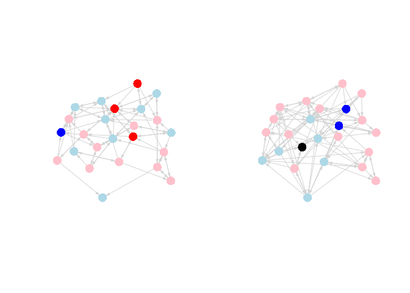
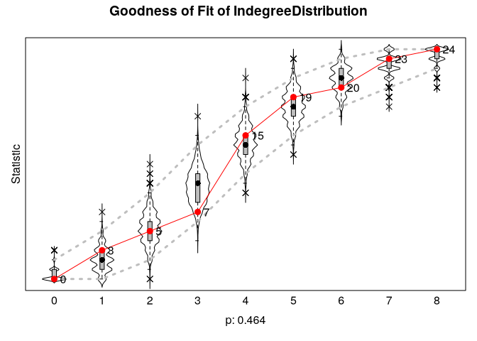
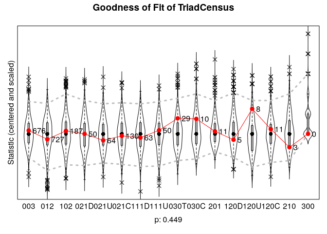
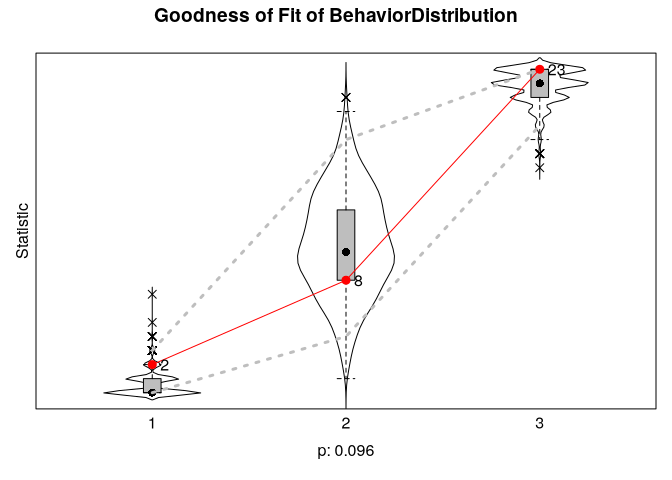
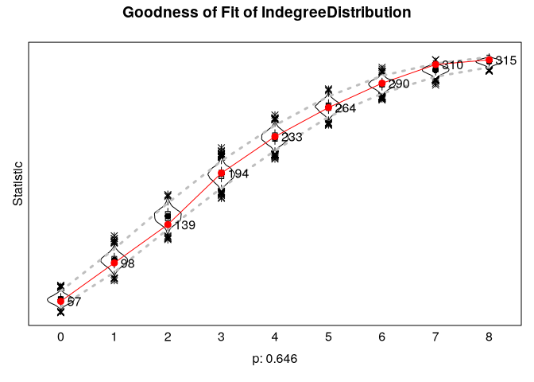
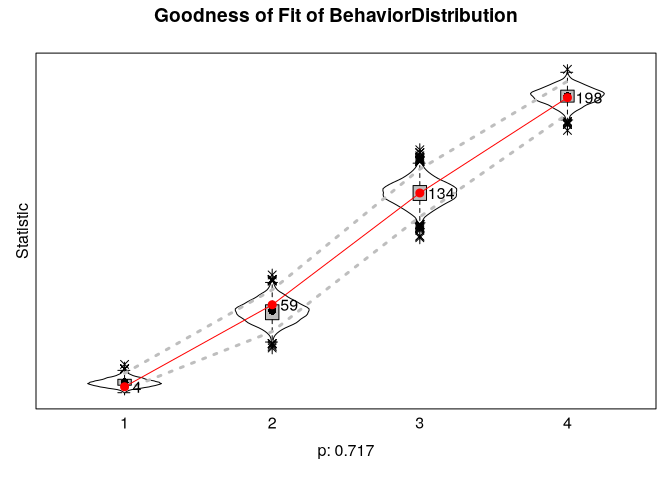

# Social Influence: Coevolution of Networks and Behaviors


How do actors come to resmble their peers in terms of behaviors?
Simulation Investigation for Empirical Network models are suitable for
small networks, eg. n \< 2500.

SIENA models are similar to STERG models, but examines changes in
behaviors as well as changes in ties.

The first example utilizes a small classroom-based network. The data
were collected by Daniel McFarland. There are two waves of data,
corresponding to semester 1 and semester 2. The key outcome of interest
is how much each student liked the subject of the class, measured in
both semester 1 and semester 2. There is also data on friendships for
both semesters. We want to know if students tend to converge on
attitudes (about how much they like the subject) with people they are
friends with. We also want to see how peer influence fits into a larger
picture of network change, where ties are being added and dropped over
time. For example, are students similar in terms of liking the subject
because of peer influence or because they select friends with similar
attitudes about the class (i.e., we want to differentiate between
influence and selection)?

# Preparation

``` r
# url1 <- "https://github.com/JeffreyAlanSmith/Integrated_Network_Science/raw/master/data/class237_sem1_edgelist.txt"

sem1_edgelist <- read.table("data/class237_sem1_edgelist.txt", header = T)

# url2 <- "https://github.com/JeffreyAlanSmith/Integrated_Network_Science/raw/master/data/class237_sem2_edgelist.txt"

sem2_edgelist <- read.table("data/class237_sem2_edgelist.txt", header = T)

# url3 <- "https://github.com/JeffreyAlanSmith/Integrated_Network_Science/raw/master/data/class237_attributes.txt"

attributes <- read.table("data/class237_attributes.txt", header = T)
```

``` r
head(sem1_edgelist)
```

      sender receiver
    1 113214   121470
    2 113214   125522
    3 113214   149552
    4 113214   122728
    5 113214   122706
    6 115909   127535

``` r
head(attributes)
```

         ids sem_id cls_id expected_grade like_subject had_teacher_before
    1 113214      1    237              4            4                  0
    2 121470      1    237              3            2                  0
    3 122728      1    237              4            2                  0
    4 125522      1    237              4            3                  0
    5 126359      1    237              4            4                  0
    6 122706      1    237              4            3                  0
      like_teacher course_challenging
    1            3                  1
    2            3                  3
    3            3                  2
    4            3                  4
    5            4                  3
    6            3                  3

Main attributes:

- `ids` = id of actor
- `sem_id` = semester where data comes from
- `expected_grade`: D = 1 C = 2 B = 3 A = 4
- `like_subject`: 1-4 scale, with 1 = strong dislike to 4 = like it a
  lot
- `like_teacher`: 1-4 scale, with 1 = strong dislike to 4 = like it a
  lot.

``` r
library(igraph)
library(reshape)
library(car)
```

For this analysis, ignore nodes entering and exiting, and only look at
those present in both semesters.

``` r
ids_sem1 <- attributes$ids[attributes$sem_id == 1]
ids_sem2 <- attributes$ids[attributes$sem_id == 2]
ids_keep <- ids_sem1[ids_sem1 %in% ids_sem2]
```

``` r
attributes <- attributes[attributes$ids %in% ids_keep, ]

send_in_sem1 <- sem1_edgelist[, 1] %in% ids_keep
rec_in_sem1 <- sem1_edgelist[, 2] %in% ids_keep
sem1_edgelist <- sem1_edgelist[send_in_sem1 & rec_in_sem1, ]

send_in_sem2 <- sem2_edgelist[, 1] %in% ids_keep
rec_in_sem2 <- sem2_edgelist[, 2] %in% ids_keep
sem2_edgelist <- sem2_edgelist[send_in_sem2 & rec_in_sem2, ]
```

``` r
sem1_attributes <- attributes[attributes$sem_id == 1, ]
sem2_attributes <- attributes[attributes$sem_id == 2, ]
```

``` r
sem1_net <- graph_from_data_frame(
  d = sem1_edgelist, directed = T, vertices = sem1_attributes
)

sem2_net <- graph_from_data_frame(
  d = sem2_edgelist, directed = T, vertices = sem2_attributes
)
```

Create node colors depending on liking the subject

``` r
cols_sem1 <- recode(sem1_attributes$like_subject,
  as.factor = F,
  "1 = 'blue'; 2 = 'light blue'; 3 = 'pink';
                     4 ='red'; NA = 'black'"
)

cols_sem2 <- recode(sem2_attributes$like_subject,
  as.factor = F,
  "1 = 'blue'; 2 = 'light blue'; 3 = 'pink';
                     4 = 'red'; NA = 'black'"
)
```

``` r
layout <- layout_with_fr(sem1_net)
```

``` r
par(mfrow = c(1, 2))

plot(sem1_net,
  vertex.label = NA, layout = layout, edge.arrow.size = .3,
  edge.arrow.width = 1, edge.color = "light gray",
  vertex.frame.color = NA, vertex.color = cols_sem1
)

plot(sem2_net,
  vertex.label = NA, layout = layout, edge.arrow.size = .3,
  edge.arrow.width = 1, edge.color = "light gray",
  vertex.frame.color = NA, vertex.color = cols_sem2
)
```



It looks like there may be some weak clustering by how much people like
the subject. It is a bit difficult to tell from the plot if people are
converging with their friend’s attitudes, although it does look like
students who really like the subject in semester 1 tend to have more
moderate views by semester 2 (moving from red to pink). That could be a
sign of peer influence, but we need to examine such hypotheses more
carefully.

# SIENA Model Setup

The question is whether students converge with their friends in terms of
how much they like the subject matter. We will address this question
while also considering the larger context in which actors are forming
and breaking ties. With SIENA models, the basic idea is to model the
coevolution of network ties and outcomes, simultaneously predicting
changes in ties (what factors make a friendship more likely to be
added/kept?) and changes in behaviors (what factors make it more likely
to increase liking the subject?). In this way, we can explore the
existence (or not) of peer influence while also controlling for nodal,
dyadic and triadic processes that affect both the formation of ties and
the outcome of interest (here interest in the subject).

``` r
library(RSiena)
```

**RSiena** requires that, before the model is run, the data be shaped
into objects specifying their role in the analysis.

Turn graphs in matrices.

``` r
sem1_matrix <- as_adjacency_matrix(graph = sem1_net, sparse = F)
sem2_matrix <- as_adjacency_matrix(graph = sem2_net, sparse = F)
table(rownames(sem1_matrix) == rownames(sem2_matrix))
```


    TRUE 
      24 

How much change from sem 1 to sem 2?

``` r
tab_change <- table(sem1_matrix, sem2_matrix)
tab_change
```

               sem2_matrix
    sem1_matrix   0   1
              0 429  58
              1  47  42

42 stable, 58 new, 47 dropped.

> Jaccard index

N11 / (N01 + N10 + N11)

Should be above .3 and should not be below .2.

``` r
42 / (58 + 47 + 42)
```

    [1] 0.2857143

Somewhat ambiguous, though close to .3. Lower values are less
problematic when average degree is increasing or decreasing, as here.

Make sure ids are in the same order.

``` r
table(sem1_attributes$ids == sem2_attributes$ids)
```


    TRUE 
      24 

RSiena requires that the networks be put together as an n X n X p array,
where n is the size of the network and p is the number of time periods.

``` r
net_size <- nrow(sem1_matrix)
sem12_array <- array(c(sem1_matrix, sem2_matrix),
  dim = c(net_size, net_size, 2)
)
dim(sem12_array)
```

    [1] 24 24  2

Since we model network change and behavior change, we need two kinds of
models and two kinds of dependent variables.

As a first step, we will construct a dependent variable based on the
network, so the ties (or tie change) is the outcome of interest. The
function is sienaDependent(). The main arguments are:

- netarray = matrix (for behaviors) or array (for network outcomes)
  showing behavioral or network values to predict
- type = type of dependent variable (e.g., behavior, oneMode)

Here we include the array constructed above based on the semester 1 and
semester 2 networks. The type is oneMode, indicating a one-mode network.

``` r
networks <- sienaDependent(netarray = sem12_array, type = "oneMode")
```

Now, we will construct the second dependent variable, based on our
‘behavior’ of interest, here how much they liked the subject in semester
1 and semester 2. The inputs are the over time values for liking the
subject, constructed as a matrix.

``` r
like_subject_matrix <- as.matrix(cbind(
  sem1_attributes$like_subject,
  sem2_attributes$like_subject
))
head(like_subject_matrix)
```

         [,1] [,2]
    [1,]    4    3
    [2,]    2    1
    [3,]    2    3
    [4,]    3    1
    [5,]    4    3
    [6,]    3    3

``` r
like_subject <- sienaDependent(
  netarray = like_subject_matrix,
  type = "behavior"
)
```

Create predictor objects (covariates). varCovar() is used with at least
3 periods of data when the attribute is not static.

``` r
like_teacher <- coCovar(sem1_attributes$like_teacher)
```

``` r
net_behavior_covar <- sienaDataCreate(networks, like_subject, like_teacher)
net_behavior_covar
```

    Dependent variables:  networks, like_subject 
    Number of observations: 2 

    Nodeset                  Actors 
    Number of nodes              24 

    Dependent variable networks 
    Type               oneMode  
    Observations       2        
    Nodeset            Actors   
    Densities          0.16 0.18

    Dependent variable like_subject
    Type               behavior    
    Observations       2           
    Nodeset            Actors      
    Range              1 - 4       

    Constant covariates:  like_teacher 

# Model Specification

The model is built up from basic effects and adding additional effects.

``` r
siena_effects <- getEffects(net_behavior_covar)
siena_effects
```

      name         effectName                    include fix   test  initialValue
    1 networks     basic rate parameter networks TRUE    FALSE FALSE    9.12260  
    2 networks     outdegree (density)           TRUE    FALSE FALSE   -0.71940  
    3 networks     reciprocity                   TRUE    FALSE FALSE    0.00000  
    4 like_subject rate like_subject period 1    TRUE    FALSE FALSE    0.81028  
    5 like_subject like_subject linear shape     TRUE    FALSE FALSE   -0.10773  
    6 like_subject like_subject quadratic shape  TRUE    FALSE FALSE    0.00000  
      parm
    1 0   
    2 0   
    3 0   
    4 0   
    5 0   
    6 0   

The two different models are “networks” for how the network changes over
time, and “like_subject” for how the attitude changes.

## Behavioral model

The function to add terms is includeEffects(). The main arguments are:

- myeff = siena object of effects
- name of term to include
- interaction1 = siena object from which effects are being calculated
- name = name of dependent variable for which effects are being included

For the peer influence term, use avSim, or average similarity to network
alters. It uses the “network” data, with the outcome of interest
“like_subject”

``` r
siena_effects <- includeEffects(siena_effects, avSim,
  interaction1 = "networks",
  name = "like_subject"
)
```

      effectName                      include fix   test  initialValue parm
    1 like_subject average similarity TRUE    FALSE FALSE          0   0   

Capture the tendency of higher indegree people to increase liking
compared to low indegree people.

``` r
siena_effects <- includeEffects(siena_effects, indeg,
  interaction1 = "networks",
  name = "like_subject"
)
```

      effectName            include fix   test  initialValue parm
    1 like_subject indegree TRUE    FALSE FALSE          0   0   

Add a factor for how much the student likes the teacher

``` r
siena_effects <- includeEffects(siena_effects, effFrom,
  interaction1 = "like_teacher",
  name = "like_subject"
)
```

      effectName                             include fix   test  initialValue parm
    1 like_subject: effect from like_teacher TRUE    FALSE FALSE          0   0   

## Network model

The evolution of friendship ties is the outcome of interest. Here are 4
common terms.

Do actors form and keep ties based on similar attitudes or behaviors.

``` r
siena_effects <- includeEffects(siena_effects, simX,
  interaction1 = "like_subject",
  name = "networks"
)
```

      effectName              include fix   test  initialValue parm
    1 like_subject similarity TRUE    FALSE FALSE          0   0   

Do people with certain attributes send out more/less ties? Do they
receive more or less?

``` r
siena_effects <- includeEffects(siena_effects, egoX,
  interaction1 = "like_subject",
  name = "networks"
)
```

      effectName       include fix   test  initialValue parm
    1 like_subject ego TRUE    FALSE FALSE          0   0   

``` r
siena_effects <- includeEffects(siena_effects, altX,
  interaction1 = "like_subject",
  name = "networks"
)
```

      effectName         include fix   test  initialValue parm
    1 like_subject alter TRUE    FALSE FALSE          0   0   

Add a term for transitivity, or local clustering.

``` r
siena_effects <- includeEffects(siena_effects, transTrip, name = "networks")
```

      effectName          include fix   test  initialValue parm
    1 transitive triplets TRUE    FALSE FALSE          0   0   

``` r
siena_effects
```

       name         effectName                             include fix   test 
    1  networks     basic rate parameter networks          TRUE    FALSE FALSE
    2  networks     outdegree (density)                    TRUE    FALSE FALSE
    3  networks     reciprocity                            TRUE    FALSE FALSE
    4  networks     transitive triplets                    TRUE    FALSE FALSE
    5  networks     like_subject alter                     TRUE    FALSE FALSE
    6  networks     like_subject ego                       TRUE    FALSE FALSE
    7  networks     like_subject similarity                TRUE    FALSE FALSE
    8  like_subject rate like_subject period 1             TRUE    FALSE FALSE
    9  like_subject like_subject linear shape              TRUE    FALSE FALSE
    10 like_subject like_subject quadratic shape           TRUE    FALSE FALSE
    11 like_subject like_subject average similarity        TRUE    FALSE FALSE
    12 like_subject like_subject indegree                  TRUE    FALSE FALSE
    13 like_subject like_subject: effect from like_teacher TRUE    FALSE FALSE
       initialValue parm
    1     9.12260   0   
    2    -0.71940   0   
    3     0.00000   0   
    4     0.00000   0   
    5     0.00000   0   
    6     0.00000   0   
    7     0.00000   0   
    8     0.81028   0   
    9    -0.10773   0   
    10    0.00000   0   
    11    0.00000   0   
    12    0.00000   0   
    13    0.00000   0   

# Model Estimation

We will now go ahead and estimate our model. Before we can estimate the
model we need to create an object of input specifications using the
sienaAlgorithmCreate() function. There are a number of possible inputs
but here we will leave most things at the defaults. We will include a
MaxDegree argument, telling the model what is the max degree possible in
the network. We set MaxDegree to 5 as students were restricted to naming
only up to 5 friends in the classroom.

``` r
input_options <- sienaAlgorithmCreate(
  projname = "class_model",
  MaxDegree = c(networks = 5),
  seed = 30000
)
```

    If you use this algorithm object, siena07 will create/use an output file class_model.txt .

Now, we are ready to estimate the model using the siena07() function.
The main arguments are:

- x = object of input specifications constructed using
  sienaAlgorithmCreate()
- data = main siena object constructed from sienaDataCreate() function
- effects = model effects specified using includeEffects() function
- useCluster = T/F; should we use multiple clusters?
- nbrNodes = number of processors to use

``` r
mod1 <- siena07(
  x = input_options, data = net_behavior_covar,
  effects = siena_effects, useCluster = TRUE,
  nbrNodes = 4
)
```

``` r
mod1
```

    Estimates, standard errors and convergence t-ratios

                                                      Estimate   Standard   Convergence 
                                                                   Error      t-ratio   
    Network Dynamics 
       1. rate basic rate parameter networks           9.2063  ( 2.0467   )    0.0158   
       2. eval outdegree (density)                    -0.1914  ( 0.8055   )   -0.0089   
       3. eval reciprocity                             0.4010  ( 0.2527   )   -0.0106   
       4. eval transitive triplets                     0.1565  ( 0.1034   )   -0.0490   
       5. eval like_subject alter                     -0.1734  ( 0.3489   )   -0.0553   
       6. eval like_subject ego                       -1.0340  ( 1.6899   )   -0.0832   
       7. eval like_subject similarity                 0.0229  ( 1.5477   )   -0.0234   

    Behavior Dynamics
       8. rate rate like_subject period 1              2.3618  ( 2.2625   )   -0.0253   
       9. eval like_subject linear shape              -0.4103  ( 1.8987   )    0.0325   
      10. eval like_subject quadratic shape           -0.2459  ( 1.0252   )   -0.0613   
      11. eval like_subject average similarity         5.6967  ( 7.7607   )    0.0456   
      12. eval like_subject indegree                   0.0845  ( 0.4303   )    0.0242   
      13. eval like_subject: effect from like_teacher  0.2671  ( 0.8322   )    0.0082   

    Overall maximum convergence ratio:    0.1648 


    Degrees constrained to maximum values:
    networks : 5 


    Total of 2158 iteration steps.

``` r
mod2 <- siena07(
  x = input_options, data = net_behavior_covar,
  effects = siena_effects, useCluster = TRUE,
  returnDeps = TRUE, nbrNodes = 2
)
mod2
```

    Estimates, standard errors and convergence t-ratios

                                                      Estimate   Standard   Convergence 
                                                                   Error      t-ratio   
    Network Dynamics 
       1. rate basic rate parameter networks           9.1907  ( 1.6434   )   -0.0663   
       2. eval outdegree (density)                    -0.1832  ( 0.7413   )   -0.0102   
       3. eval reciprocity                             0.3977  ( 0.2482   )   -0.0088   
       4. eval transitive triplets                     0.1643  ( 0.1151   )   -0.0103   
       5. eval like_subject alter                     -0.1678  ( 0.2467   )    0.0013   
       6. eval like_subject ego                       -1.0923  ( 1.3832   )   -0.0409   
       7. eval like_subject similarity                -0.0888  ( 1.4954   )   -0.0293   

    Behavior Dynamics
       8. rate rate like_subject period 1              2.3505  ( 1.3174   )   -0.0540   
       9. eval like_subject linear shape              -0.4566  ( 1.7687   )   -0.0074   
      10. eval like_subject quadratic shape           -0.3407  ( 0.9653   )   -0.0990   
      11. eval like_subject average similarity         4.9813  ( 7.0186   )    0.0161   
      12. eval like_subject indegree                   0.0885  ( 0.4135   )   -0.0100   
      13. eval like_subject: effect from like_teacher  0.2683  ( 0.8997   )   -0.0566   

    Overall maximum convergence ratio:    0.1859 


    Degrees constrained to maximum values:
    networks : 5 


    Total of 2494 iteration steps.

The overall convergence ratio is under .25. For each parameter,
convergence rates shoule be under .1 (absolute value). Convergence looks
good here.

The main items of interest in our results are the estimates and the
standard errors. Note that by dividing the estimates by the standard
errors we can do traditional t-tests on the coefficients. For example,
we can calculate the t-statistic for reciprocity (0.3977 / 0.2482) =
1.602, suggestive of a positive, but not significant, effect of
reciprocity on the formation and keeping of ties.

The peer influence seems high, but a large standard error suggests the
estimate is uncertain.

Create a simpler model by removing effects and increasing iterations

``` r
siena_effects <- includeEffects(siena_effects, indeg,
  interaction1 = "networks",
  name = "like_subject", inclue = FALSE
)
```

      effectName            include fix   test  initialValue parm
    1 like_subject indegree TRUE    FALSE FALSE          0   0   

``` r
siena_effects <- includeEffects(siena_effects, effFrom,
  interaction1 = "like_teacher",
  name = "like_subject", include = FALSE
)
```

    [1] effectName   include      fix          test         initialValue
    [6] parm        
    <0 rows> (or 0-length row.names)

Increase the number of iterations used in phase 3.

``` r
input_options <- sienaAlgorithmCreate(
  projname = "class_model",
  MaxDegree = c(networks = 5),
  n3 = 3000, seed = 30000
)
```

    If you use this algorithm object, siena07 will create/use an output file class_model.txt .

Use returnDeps to return the simulated networks.

``` r
mod3 <- siena07(
  x = input_options, data = net_behavior_covar,
  effects = siena_effects, returnDeps = TRUE,
  useCluster = TRUE, nbrNodes = 2
)
```

``` r
mod3
```

    Estimates, standard errors and convergence t-ratios

                                               Estimate   Standard   Convergence 
                                                            Error      t-ratio   
    Network Dynamics 
       1. rate basic rate parameter networks    9.2977  ( 1.7793   )    0.0150   
       2. eval outdegree (density)             -0.1756  ( 0.6520   )   -0.0186   
       3. eval reciprocity                      0.4032  ( 0.2378   )    0.0116   
       4. eval transitive triplets              0.1576  ( 0.1090   )   -0.0230   
       5. eval like_subject alter              -0.1681  ( 0.2471   )   -0.0153   
       6. eval like_subject ego                -1.0706  ( 1.1553   )   -0.0053   
       7. eval like_subject similarity         -0.0789  ( 1.5267   )   -0.0428   

    Behavior Dynamics
       8. rate rate like_subject period 1       2.2454  ( 1.0767   )   -0.0131   
       9. eval like_subject linear shape       -0.2007  ( 1.7649   )    0.0231   
      10. eval like_subject quadratic shape    -0.2559  ( 1.0732   )   -0.0449   
      11. eval like_subject average similarity  5.4112  ( 8.6645   )    0.0343   
      12. eval like_subject indegree            0.0318  ( 0.4087   )    0.0069   

    Overall maximum convergence ratio:    0.0938 


    Degrees constrained to maximum values:
    networks : 5 


    Total of 4433 iteration steps.

Similar estimates, still high standard errors. This suggests that the
limited data is the problem.

# Interpretation

## Network model

The coefficients can be understood as increasing/decreasing the ratio of
the log-probability that i adds (or keeps) a tie to j compared to i
adding (or keeping) a tie to h, where j and h are different nodes in the
network with different attributes and structural positions relative to
i. For example, we see a coefficient for reciprocity of 0.399. This
would suggest that the odds of a tie from i being sent to j is
exp(0.399) times higher than being sent to h, assuming that j-\>i exists
but h-\>i does not.

## Behavioral model

We now turn to the behavioral model, where we are particularly
interested in peer influence effects. Note that our average similarity
term had very high standard errors and we should be hesitant in pushing
the interpretation of that coefficient too far, even as we use that
coefficient in our calculations below. More generally, peer influence
effects can be a little tricky to interpret as we need to incorporate
the proper functional form used in the evaluation function and we need
to include multiple terms in interpreting the effect of peer influence
(in particular the linear and quadratic shape terms along with the
average similarity term). Our goal here is to calculate a table of peer
influence that shows how strongly students are drawn to having the same
values as their peers. We will calculate the evaluation function for
different students with friends who are more/less similar to them. This
table of peer influence effects will aid in interpretation.

[Library
link](https://www.stats.ox.ac.uk/~snijders/siena/InfluenceTables.r)

``` r
source("InfluenceTables.r")
```

The main function we will make use of is influenceMatrix(). The
arguments are:

- x = estimated model
- xd = siena network/behavior object
- netname = network relation name
- behname = behavioral name
- levls = levels possible for behavioral outcome

``` r
influence_matrix <- influenceMatrix(
  x = mod2, xd = net_behavior_covar,
  netname = "networks", behname = "like_subject",
  levls = 1:4
)
```

    Network networks ; dependent behavior like_subject .
    Parameters found are
     linear    quad   avSim 
    -0.4566 -0.3407  4.9813 
    Levels of alter refer to constant values of alter's behavior.

``` r
influence_matrix
```

               1          2          3           4
    1  1.2078326 -0.1488225 -2.1868646 -4.90629377
    2 -0.4526144  1.5116245 -0.5264176 -3.24584678
    3 -2.1130614 -0.1488225  1.1340294 -1.58539978
    4 -3.7735084 -1.8092695 -0.5264176  0.07504722

Columns are ego behavior, rows are friends behavior, in this case, how
much they like the subject. If ego is at 1, and his friends are at two,
the odds of shifting to 2 are

``` r
exp(1.5035) / exp(-.6708)
```

    [1] 8.796026

In this case, with a standard error so high, this is very uncertain.

# Checking Model Fit

Let’s first see if the model is reproducing the indegree distribution.
The function is `sienaGOF()`. The arguments are:

- sienaFitObject = model,
- auxiliaryFunction = function to calculate
- varName = network relation or behavior of interest

``` r
gof1 <- sienaGOF(
  sienaFitObject = mod2,
  auxiliaryFunction = IndegreeDistribution,
  verbose = TRUE, join = TRUE, varName = "networks"
)
```

    Detected 1000 iterations and 1 group.

    Calculating auxiliary statistics for period  1 .

      Period 1

      > Completed  100  calculations
      > Completed  200  calculations
      > Completed  300  calculations
      > Completed  400  calculations
      > Completed  500  calculations
      > Completed  600  calculations
      > Completed  700  calculations
      > Completed  800  calculations
      > Completed  900  calculations
      > Completed  1000  calculations
      > Completed  1000  calculations

``` r
plot(gof1)
```



Fit seems okay, now triad census.

``` r
gof2 <- sienaGOF(
  sienaFitObject = mod2,
  auxiliaryFunction = TriadCensus,
  verbose = T, join = T, varName = "networks"
)
```

    Detected 1000 iterations and 1 group.

    Calculating auxiliary statistics for period  1 .

      Period 1

      > Completed  100  calculations
      > Completed  200  calculations
      > Completed  300  calculations
      > Completed  400  calculations
      > Completed  500  calculations
      > Completed  600  calculations
      > Completed  700  calculations
      > Completed  800  calculations
      > Completed  900  calculations
      > Completed  1000  calculations
      > Completed  1000  calculations

``` r
plot(gof2, center = T, scale = T)
```



Fit okay. Overall behavior distribution:

``` r
gof_behavior <- sienaGOF(
  sienaFitObject = mod2,
  auxiliaryFunction = BehaviorDistribution,
  varName = "like_subject"
)
plot(gof_behavior)
```

    Note: some statistics are not plotted because their variance is 0.
    This holds for the statistic: 4.



# Three Time Periods

The data are based on students in a secondary school in Glasgow. The
data contain friendship information, demographic information and
substance use data for three waves. Here we focus on alcohol use.

[Data
Source](https://www.stats.ox.ac.uk/~snijders/siena/Glasgow_data.htm)

``` r
# url4 <- "https://github.com/JeffreyAlanSmith/Integrated_Network_Science/raw/master/data/Glasgow-friendship.RData"

load("data/Glasgow-friendship.RData")

# url5 <- "https://github.com/JeffreyAlanSmith/Integrated_Network_Science/raw/master/data/Glasgow-substances.RData"

load("data/Glasgow-substances.RData")

# url6 <- "https://github.com/JeffreyAlanSmith/Integrated_Network_Science/raw/master/data/Glasgow-demographic.RData"

load("data/Glasgow-demographic.RData")
```

``` r
friendship.1[1:10, 1:10]
```

         s001 s002 s003 s004 s005 s006 s007 s008 s009 s010
    s001    0    0    0    0    0    0    0    0    0    0
    s002    0    0    0    0    0    0    0    0    0    0
    s003    0    0    0    0    0    0    0    0    0    0
    s004    0    0    0    0    0    0    0    2    0    0
    s005    0    0    0    0    0    2    0    0    0    2
    s006    0    0    0    0    0    0    0    0    0    0
    s007    0    0    0    2    0    0    0    0    0    0
    s008    0    0    0    2    0    0    2    0    0    0
    s009    0    0    0    0    0    0    0    0    0    0
    s010    0    0    0    0    2    0    0    0    0    0

The friendship data is housed in friendship.1, friendship.2 and
friendship.3. Each is a matrix showing if there is a tie between i and
j, where 0 = no tie; 1 = best friend; 2 = friend; 10 = structural
absence of tie (as at least one student in the ij pair was not in the
school for that wave). There are also some NAs in the matrices,
indicating that there is no information on whether a tie exists between
i and j.

``` r
head(alcohol)
```

         t1 t2 t3
    s001  3  1  3
    s002 NA NA NA
    s003  2  2  2
    s004  2  2  3
    s005  2  3  3
    s006  3  2  5

The data show the value on alcohol use in the three waves of data: 1 =
none; 2 = once or twice a year; 3 = once a month; 4 = once a week; 5 =
more than once a week.

It is generally considered problematic if one has more than 20% missing
data.

All students kept, with structural 0 (10 in RSiena) to show no tie
possible if a student is missing for a period.

Simplify, not distinguishing between friend and best friend, so it is
binary.

``` r
friendship.1[friendship.1 == 2] <- 1
friendship.2[friendship.2 == 2] <- 1
friendship.3[friendship.3 == 2] <- 1
```

``` r
net_size_ex2 <- nrow(friendship.1)

net_array <- array(c(friendship.1, friendship.2, friendship.3),
  dim = c(net_size_ex2, net_size_ex2, 3)
)
dim(net_array)
```

    [1] 160 160   3

``` r
friendship <- sienaDependent(
  netarray = net_array,
  type = "oneMode"
)
friendship
```

    Type         oneMode              
    Observations 3                    
    Nodeset      Actors (160 elements)

Create a siena object for alcohol behavior

``` r
alcohol_depvar <- sienaDependent(
  netarray = alcohol,
  type = "behavior"
)
alcohol_depvar
```

    Type         behavior             
    Observations 3                    
    Nodeset      Actors (160 elements)

Create a gender covariate.

``` r
head(sex.F)
```

    s001 s002 s003 s004 s005 s006 
       2    1    2    1    1    1 

``` r
gender <- coCovar(sex.F)
```

``` r
friend_behavior_covar <- sienaDataCreate(
  friendship, alcohol_depvar, gender
)
friend_behavior_covar
```

    Dependent variables:  friendship, alcohol_depvar 
    Number of observations: 3 

    Nodeset                  Actors 
    Number of nodes             160 

    Dependent variable friendship      
    Type               oneMode         
    Observations       3               
    Nodeset            Actors          
    Densities          0.023 0.021 0.02

    Dependent variable alcohol_depvar
    Type               behavior      
    Observations       3             
    Nodeset            Actors        
    Range              1 - 5         

    Constant covariates:  gender 

## Model Specification and Estimation

Start with a base model

``` r
siena_effects_3wave_example <- getEffects(friend_behavior_covar)
siena_effects_3wave_example
```

      name           effectName                          include fix   test 
    1 friendship     constant friendship rate (period 1) TRUE    FALSE FALSE
    2 friendship     constant friendship rate (period 2) TRUE    FALSE FALSE
    3 friendship     outdegree (density)                 TRUE    FALSE FALSE
    4 friendship     reciprocity                         TRUE    FALSE FALSE
    5 alcohol_depvar rate alcohol_depvar (period 1)      TRUE    FALSE FALSE
    6 alcohol_depvar rate alcohol_depvar (period 2)      TRUE    FALSE FALSE
    7 alcohol_depvar alcohol_depvar linear shape         TRUE    FALSE FALSE
    8 alcohol_depvar alcohol_depvar quadratic shape      TRUE    FALSE FALSE
      initialValue parm
    1    7.41692   0   
    2    6.16651   0   
    3   -1.66821   0   
    4    0.00000   0   
    5    0.76577   0   
    6    1.15233   0   
    7    0.35525   0   
    8    0.00000   0   

Add the peer influence term

``` r
siena_effects_3wave_example <- includeEffects(
  siena_effects_3wave_example, avSim,
  interaction1 = "friendship", name = "alcohol_depvar"
)
```

      effectName                        include fix   test  initialValue parm
    1 alcohol_depvar average similarity TRUE    FALSE FALSE          0   0   

Include gender’s effect on drinking behavior

``` r
siena_effects_3wave_example <- includeEffects(
  siena_effects_3wave_example, effFrom,
  interaction1 = "gender", name = "alcohol_depvar"
)
```

      effectName                         include fix   test  initialValue parm
    1 alcohol_depvar: effect from gender TRUE    FALSE FALSE          0   0   

Include terms to predict friendship ties as the outcome.

``` r
siena_effects_3wave_example <- includeEffects(
  siena_effects_3wave_example, egoX,
  interaction1 = "alcohol_depvar", name = "friendship"
)
```

      effectName         include fix   test  initialValue parm
    1 alcohol_depvar ego TRUE    FALSE FALSE          0   0   

``` r
siena_effects_3wave_example <- includeEffects(
  siena_effects_3wave_example, altX,
  interaction1 = "alcohol_depvar", name = "friendship"
)
```

      effectName           include fix   test  initialValue parm
    1 alcohol_depvar alter TRUE    FALSE FALSE          0   0   

Include a term for selection on drinking behavior.

``` r
siena_effects_3wave_example <- includeEffects(
  siena_effects_3wave_example, simX,
  interaction1 = "alcohol_depvar", name = "friendship"
)
```

      effectName                include fix   test  initialValue parm
    1 alcohol_depvar similarity TRUE    FALSE FALSE          0   0   

A term for transitivity closure

``` r
siena_effects_3wave_example <- includeEffects(
  siena_effects_3wave_example, transTrip,
  name = "friendship"
)
```

      effectName          include fix   test  initialValue parm
    1 transitive triplets TRUE    FALSE FALSE          0   0   

``` r
siena_effects_3wave_example
```

       name           effectName                          include fix   test 
    1  friendship     constant friendship rate (period 1) TRUE    FALSE FALSE
    2  friendship     constant friendship rate (period 2) TRUE    FALSE FALSE
    3  friendship     outdegree (density)                 TRUE    FALSE FALSE
    4  friendship     reciprocity                         TRUE    FALSE FALSE
    5  friendship     transitive triplets                 TRUE    FALSE FALSE
    6  friendship     alcohol_depvar alter                TRUE    FALSE FALSE
    7  friendship     alcohol_depvar ego                  TRUE    FALSE FALSE
    8  friendship     alcohol_depvar similarity           TRUE    FALSE FALSE
    9  alcohol_depvar rate alcohol_depvar (period 1)      TRUE    FALSE FALSE
    10 alcohol_depvar rate alcohol_depvar (period 2)      TRUE    FALSE FALSE
    11 alcohol_depvar alcohol_depvar linear shape         TRUE    FALSE FALSE
    12 alcohol_depvar alcohol_depvar quadratic shape      TRUE    FALSE FALSE
    13 alcohol_depvar alcohol_depvar average similarity   TRUE    FALSE FALSE
    14 alcohol_depvar alcohol_depvar: effect from gender  TRUE    FALSE FALSE
       initialValue parm
    1     7.41692   0   
    2     6.16651   0   
    3    -1.66821   0   
    4     0.00000   0   
    5     0.00000   0   
    6     0.00000   0   
    7     0.00000   0   
    8     0.00000   0   
    9     0.76577   0   
    10    1.15233   0   
    11    0.35525   0   
    12    0.00000   0   
    13    0.00000   0   
    14    0.00000   0   

Students were limited to naming 6 friends.

``` r
input_options_3wave <- sienaAlgorithmCreate(
  MaxDegree = c(friendship = 6), n3 = 3000, seed = 5000
)
```

    If you use this algorithm object, siena07 will create/use an output file Siena.txt .

Estimate the model

``` r
mod1_3wave_example <- siena07(
  input_options_3wave,
  data = friend_behavior_covar,
  effects = siena_effects_3wave_example, returnDeps = T,
  initC = T, useCluster = T, nbrNodes = 2
)
```

``` r
mod1_3wave_example
```

    Estimates, standard errors and convergence t-ratios

                                                   Estimate   Standard   Convergence 
                                                                Error      t-ratio   
    Network Dynamics 
       1. rate constant friendship rate (period 1) 15.2825  ( 1.7375   )   -0.0032   
       2. rate constant friendship rate (period 2) 11.8442  ( 1.2779   )   -0.0213   
       3. eval outdegree (density)                 -2.5172  ( 0.0492   )   -0.0171   
       4. eval reciprocity                          2.0224  ( 0.0939   )   -0.0151   
       5. eval transitive triplets                  0.5646  ( 0.0232   )   -0.0366   
       6. eval alcohol_depvar alter                -0.0407  ( 0.0612   )    0.0092   
       7. eval alcohol_depvar ego                   0.0349  ( 0.0651   )    0.0384   
       8. eval alcohol_depvar similarity            0.7936  ( 0.3594   )   -0.0434   

    Behavior Dynamics
       9. rate rate alcohol_depvar (period 1)       1.6392  ( 0.2958   )    0.0331   
      10. rate rate alcohol_depvar (period 2)       2.7722  ( 0.5513   )    0.0551   
      11. eval alcohol_depvar linear shape          0.4561  ( 0.1467   )    0.0343   
      12. eval alcohol_depvar quadratic shape       0.0623  ( 0.0997   )    0.0315   
      13. eval alcohol_depvar average similarity    7.1645  ( 2.2501   )   -0.0708   
      14. eval alcohol_depvar: effect from gender   0.0497  ( 0.2012   )   -0.0220   

    Overall maximum convergence ratio:    0.1194 


    Degrees constrained to maximum values:
    friendship : 6 


    Total of 5224 iteration steps.

The model converges, and standard errors are much lower. Similarity is
higher (7.1645) and the standard error is much lower. The effect is
significan, with a t-statistic of 3.184 (7.1645 / 2.2501). We also see
that reciprocity is quite strong, as is the tendency for transitive
relations. We also see that there is selection on alcohol use (a
coefficient of 0.7936 and a standard error of 0.3594 for similarity),
suggesting that not only do students tend to converge to the behaviors
of their peers, they also tend to seek out those with similar drinking
behavior.

``` r
influence_matrix_3wave <- influenceMatrix(
  x = mod1_3wave_example, xd = friend_behavior_covar,
  netname = "friendship", behname = "alcohol_depvar",
  levls = 1:5
)
```

    Network friendship ; dependent behavior alcohol_depvar .
    Parameters found are
    linear   quad  avSim 
    0.4561 0.0623 7.1645 
    Levels of alter refer to constant values of alter's behavior.

``` r
influence_matrix_3wave
```

               1          2          3          4          5
    1  1.3703344 -0.1540429 -1.5537744 -2.8288600 -3.9792997
    2 -0.4208021  1.6370936  0.2373621 -1.0377235 -2.1881631
    3 -2.2119386 -0.1540429  2.0284986  0.7534131 -0.3970266
    4 -4.0030751 -1.9451794  0.2373621  2.5445496  1.3941099
    5 -5.7942116 -3.7363160 -1.5537744  0.7534131  3.1852464

``` r
gof_3wave <- sienaGOF(mod1_3wave_example, IndegreeDistribution,
  verbose = T, join = T, varName = "friendship"
)
```

    Detected 3000 iterations and 1 group.

    Calculating auxiliary statistics for periods  1 2 .

      Period 1

      > Completed  100  calculations
      > Completed  200  calculations
      > Completed  300  calculations
      > Completed  400  calculations
      > Completed  500  calculations
      > Completed  600  calculations
      > Completed  700  calculations
      > Completed  800  calculations
      > Completed  900  calculations
      > Completed  1000  calculations
      > Completed  1100  calculations
      > Completed  1200  calculations
      > Completed  1300  calculations
      > Completed  1400  calculations
      > Completed  1500  calculations
      > Completed  1600  calculations
      > Completed  1700  calculations
      > Completed  1800  calculations
      > Completed  1900  calculations
      > Completed  2000  calculations
      > Completed  2100  calculations
      > Completed  2200  calculations
      > Completed  2300  calculations
      > Completed  2400  calculations
      > Completed  2500  calculations
      > Completed  2600  calculations
      > Completed  2700  calculations
      > Completed  2800  calculations
      > Completed  2900  calculations
      > Completed  3000  calculations
      > Completed  3000  calculations

      Period 2

      > Completed  100  calculations
      > Completed  200  calculations
      > Completed  300  calculations
      > Completed  400  calculations
      > Completed  500  calculations
      > Completed  600  calculations
      > Completed  700  calculations
      > Completed  800  calculations
      > Completed  900  calculations
      > Completed  1000  calculations
      > Completed  1100  calculations
      > Completed  1200  calculations
      > Completed  1300  calculations
      > Completed  1400  calculations
      > Completed  1500  calculations
      > Completed  1600  calculations
      > Completed  1700  calculations
      > Completed  1800  calculations
      > Completed  1900  calculations
      > Completed  2000  calculations
      > Completed  2100  calculations
      > Completed  2200  calculations
      > Completed  2300  calculations
      > Completed  2400  calculations
      > Completed  2500  calculations
      > Completed  2600  calculations
      > Completed  2700  calculations
      > Completed  2800  calculations
      > Completed  2900  calculations
      > Completed  3000  calculations
      > Completed  3000  calculations

``` r
plot(gof_3wave)
```



``` r
gof_behavior_3wave <- sienaGOF(
  mod1_3wave_example, BehaviorDistribution,
  varName = "alcohol_depvar"
)

plot(gof_behavior_3wave)
```

    Note: some statistics are not plotted because their variance is 0.
    This holds for the statistic: 5.



## Time Heterogeneity

Comparing the difference in estimates from T1 to T2 vs T2 and T3.

``` r
time_test <- sienaTimeTest(mod1_3wave_example)
summary(time_test)
```

    Joint significance test of time heterogeneity:
    chi-squared =  10.25, d.f. = 10, p= 0.4185, 
    where H0: The following parameters are zero:
     ( 1) (*)Dummy2:outdegree (density)
     ( 2) (*)Dummy2:reciprocity
     ( 3) (*)Dummy2:transitive triplets
     ( 4) (*)Dummy2:alcohol_depvar alter
     ( 5) (*)Dummy2:alcohol_depvar ego
     ( 6) (*)Dummy2:alcohol_depvar similarity
     ( 7) (*)Dummy2:alcohol_depvar linear shape
     ( 8) (*)Dummy2:alcohol_depvar quadratic shape
     ( 9) (*)Dummy2:alcohol_depvar average similarity
     (10) (*)Dummy2:alcohol_depvar: effect from gender

    Individual significance tests and one-step estimators:
                                                 Initial Est. One Step Est. p-Value
    outdegree (density)                          -2.5172      -2.4831        0.0000
    reciprocity                                   2.0224       1.9256        0.0000
    transitive triplets                           0.5646       0.5222        0.0000
    alcohol_depvar alter                         -0.0407      -0.0021        0.5060
    alcohol_depvar ego                            0.0349      -0.0385        0.5920
    alcohol_depvar similarity                     0.7936       0.7868        0.0270
    alcohol_depvar linear shape                   0.4561       0.4929        0.0020
    alcohol_depvar quadratic shape                0.0623       0.1869        0.5320
    alcohol_depvar average similarity             7.1645       8.8445        0.0010
    alcohol_depvar: effect from gender            0.0497      -0.0320        0.8050
    (*)Dummy2:outdegree (density)                 0.0000      -0.0936        0.1250
    (*)Dummy2:reciprocity                         0.0000       0.1965        0.0200
    (*)Dummy2:transitive triplets                 0.0000       0.1061        0.0080
    (*)Dummy2:alcohol_depvar alter                0.0000      -0.0836        0.8830
    (*)Dummy2:alcohol_depvar ego                  0.0000       0.1449        0.3850
    (*)Dummy2:alcohol_depvar similarity           0.0000      -0.0245        0.7640
    (*)Dummy2:alcohol_depvar linear shape         0.0000       0.0097        0.9560
    (*)Dummy2:alcohol_depvar quadratic shape      0.0000      -0.2384        0.4400
    (*)Dummy2:alcohol_depvar average similarity   0.0000      -2.8301        0.9200
    (*)Dummy2:alcohol_depvar: effect from gender  0.0000       0.0721        0.9670

    Effect-wise joint significance tests
    (i.e. each effect across all dummies):
                                       chi-sq. df p-value
    outdegree (density)                   2.36  1   0.124
    reciprocity                           5.41  1   0.020
    transitive triplets                   7.07  1   0.008
    alcohol_depvar alter                  0.02  1   0.888
    alcohol_depvar ego                    0.75  1   0.386
    alcohol_depvar similarity             0.09  1   0.764
    alcohol_depvar linear shape           0.00  1   1.000
    alcohol_depvar quadratic shape        0.60  1   0.439
    alcohol_depvar average similarity     0.01  1   0.920
    alcohol_depvar: effect from gender    0.00  1   1.000

    Period-wise joint significance tests
    (i.e. each period across all parameters):
             chi-sq. df p-value
    Period 1   10.25 10   0.418
    Period 2   10.25 10   0.418

    Use the following indices for plotting:
      (1) outdegree (density)
      (2) reciprocity
      (3) transitive triplets
      (4) alcohol_depvar alter
      (5) alcohol_depvar ego
      (6) alcohol_depvar similarity
      (7) alcohol_depvar linear shape
      (8) alcohol_depvar quadratic shape
      (9) alcohol_depvar average similarity
      (10) alcohol_depvar: effect from gender

    If you would like to fit time dummies to your model,
    use the includeTimeDummy function.
    Type "?sienaTimeTest" for more information on this output.

The results of the joint significance tests do not show a p-value low
enough to reject the null hypothesis that the effects are the same.

If we had found significant differences we may want to include terms
that allow the coefficients (at least some of them) to vary by time. In
particular, we would want to look at the significance tests on the
specific coefficients interacted with time; here we would focus on the
series of coefficients starting with ‘Dummy 2’, looking at which cases
there is a significant t-test (suggesting that the coefficient for T2 -
T3, for example, is different than the coefficient in T1 - T2). We would
then use an includeTimeDummy() function to include the desired terms,
allowing those coefficients to vary across time. For example, let’s run
through a quick example where we allow the coefficients on density and
transitive triplets to vary between the first period of change (T1 to
T2) and the second (T2 to T3).

``` r
siena_effects_3wave_example <- includeTimeDummy(
  siena_effects_3wave_example, density, transTrip,
  timeDummy = "2"
)
```

                                name          effectName
    friendship.obj.eval.1 friendship outdegree (density)
    friendship.obj.eval.3 friendship transitive triplets
                                           functionName shortName interaction1
    friendship.obj.eval.1                Number of ties   density             
    friendship.obj.eval.3 Number of transitive triplets transTrip             
                          interaction2 type basicRate include randomEffects   fix
    friendship.obj.eval.1              eval     FALSE    TRUE          TRUE FALSE
    friendship.obj.eval.3              eval     FALSE    TRUE         FALSE FALSE
                           test timeDummy initialValue parm functionType period
    friendship.obj.eval.1 FALSE         2    -1.668207    0    objective   <NA>
    friendship.obj.eval.3 FALSE         2     0.000000    0    objective   <NA>
                          rateType untrimmedValue effect1 effect2 effect3
    friendship.obj.eval.1     <NA>      -1.668207       0       0       0
    friendship.obj.eval.3     <NA>       0.000000       0       0       0
                          interactionType local setting effectFn statisticFn
    friendship.obj.eval.1          dyadic  TRUE             NULL        NULL
    friendship.obj.eval.3                  TRUE             NULL        NULL
                          netType groupName group effectNumber
    friendship.obj.eval.1 oneMode    Group1     1           14
    friendship.obj.eval.3 oneMode    Group1     1           23

``` r
siena_effects_3wave_example
```

       name           effectName                          include fix   test 
    1  friendship     constant friendship rate (period 1) TRUE    FALSE FALSE
    2  friendship     constant friendship rate (period 2) TRUE    FALSE FALSE
    3  friendship     outdegree (density)                 TRUE    FALSE FALSE
    4  friendship     reciprocity                         TRUE    FALSE FALSE
    5  friendship     transitive triplets                 TRUE    FALSE FALSE
    6  friendship     alcohol_depvar alter                TRUE    FALSE FALSE
    7  friendship     alcohol_depvar ego                  TRUE    FALSE FALSE
    8  friendship     alcohol_depvar similarity           TRUE    FALSE FALSE
    9  alcohol_depvar rate alcohol_depvar (period 1)      TRUE    FALSE FALSE
    10 alcohol_depvar rate alcohol_depvar (period 2)      TRUE    FALSE FALSE
    11 alcohol_depvar alcohol_depvar linear shape         TRUE    FALSE FALSE
    12 alcohol_depvar alcohol_depvar quadratic shape      TRUE    FALSE FALSE
    13 alcohol_depvar alcohol_depvar average similarity   TRUE    FALSE FALSE
    14 alcohol_depvar alcohol_depvar: effect from gender  TRUE    FALSE FALSE
       initialValue parm timeDummy
    1     7.41692   0    ,        
    2     6.16651   0    ,        
    3    -1.66821   0    2        
    4     0.00000   0    ,        
    5     0.00000   0    2        
    6     0.00000   0    ,        
    7     0.00000   0    ,        
    8     0.00000   0    ,        
    9     0.76577   0    ,        
    10    1.15233   0    ,        
    11    0.35525   0    ,        
    12    0.00000   0    ,        
    13    0.00000   0    ,        
    14    0.00000   0    ,        

``` r
mod2_3wave_example <- siena07(
  input_options_3wave,
  data = friend_behavior_covar,
  effects = siena_effects_3wave_example, returnDeps = T,
  initC = T, useCluster = T, nbrNodes = 2
)

mod2_3wave_example
```

    Estimates, standard errors and convergence t-ratios

                                                           Estimate   Standard   Convergence 
                                                                        Error      t-ratio   
    Network Dynamics 
       1. rate constant friendship rate (period 1)         14.6715  ( 1.4518   )    0.0103   
       2. rate constant friendship rate (period 2)         11.9149  ( 1.0703   )    0.0100   
       3. eval outdegree (density)                         -2.5164  ( 0.0498   )   -0.0219   
       4. eval reciprocity                                  2.0263  ( 0.0954   )   -0.0207   
       5. eval transitive triplets                          0.5675  ( 0.0234   )   -0.0120   
       6. eval alcohol_depvar alter                        -0.0378  ( 0.0542   )   -0.0039   
       7. eval alcohol_depvar ego                           0.0168  ( 0.0674   )    0.0219   
       8. eval alcohol_depvar similarity                    0.7463  ( 0.3329   )    0.0177   
       9. eval Dummy2:friendship ego x transitive triplets  0.1116  ( 0.0448   )    0.0598   
      10. eval Dummy2:friendship ego                       -0.0240  ( 0.0846   )    0.0541   

    Behavior Dynamics
      11. rate rate alcohol_depvar (period 1)               1.6302  ( 0.3225   )   -0.0225   
      12. rate rate alcohol_depvar (period 2)               2.7327  ( 0.5251   )   -0.0555   
      13. eval alcohol_depvar linear shape                  0.4639  ( 0.1310   )   -0.0091   
      14. eval alcohol_depvar quadratic shape               0.0641  ( 0.0984   )    0.0054   
      15. eval alcohol_depvar average similarity            7.2544  ( 2.1290   )    0.0079   
      16. eval alcohol_depvar: effect from gender           0.0576  ( 0.1965   )   -0.0018   

    Overall maximum convergence ratio:    0.1001 


    Degrees constrained to maximum values:
    friendship : 6 


    Total of 5129 iteration steps.

We see that there are now interactions between time and two terms
(density and transitive triplets). These two are labeled as ‘friendship
ego’ and ‘friendship ego X transitive triplets’. For example, we can see
that there is some evidence that the effect of transitivity is higher in
later time periods than in earlier ones.
