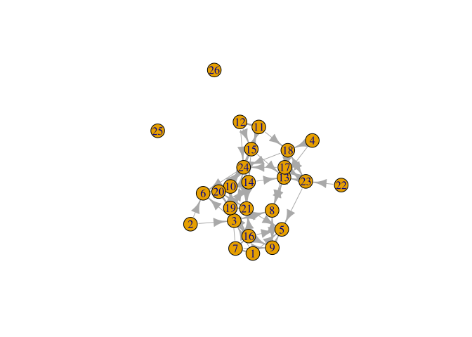

# 3.1-CrossSectionalData


``` r
library(igraph)
library(reshape)
```

# Reading data

``` r
# url1 <- "https://github.com/JeffreyAlanSmith/Integrated_Network_Science/raw/master/data/class555_matrix.csv"
class_mat <- read.csv("data/class555_matrix.csv")
class(class_mat)
```

    [1] "data.frame"

``` r
class_mat <- as.matrix(class_mat)
rownames(class_mat) <- 1:nrow(class_mat)
colnames(class_mat) <- 1:ncol(class_mat)
class_mat
```

       1 2 3 4 5 6 7 8 9 10 11 12 13 14 15 16 17 18 19 20 21 22 23 24
    1  0 0 1 0 1 0 1 0 0  0  0  0  0  0  0  0  0  0  0  0  1  0  0  0
    2  0 0 1 0 0 1 0 0 0  0  0  0  0  0  0  0  0  0  0  0  0  0  0  0
    3  0 0 0 0 0 1 0 1 0  0  0  0  0  0  0  1  0  0  0  0  0  0  0  1
    4  0 0 0 0 0 0 0 0 0  0  0  0  1  0  0  0  0  1  0  0  0  0  0  0
    5  0 0 0 0 0 0 0 0 0  0  0  0  0  0  0  0  0  0  0  0  0  0  0  0
    6  0 0 0 0 0 0 0 0 0  0  0  0  0  0  0  0  0  0  0  0  0  0  0  0
    7  1 0 0 0 0 0 0 0 1  1  0  0  0  0  0  1  0  0  0  0  0  0  0  0
    8  0 0 1 0 0 0 0 0 1  0  0  0  1  0  0  0  0  0  0  0  0  0  0  0
    9  0 0 0 0 1 0 0 1 0  0  0  0  0  0  0  0  0  0  0  0  0  0  0  0
    10 0 0 0 0 0 1 0 0 0  0  0  0  0  1  0  0  0  0  1  1  0  0  0  1
    11 0 0 0 0 0 0 0 0 0  0  0  1  0  0  1  0  0  1  0  0  0  0  0  1
    12 0 0 0 0 0 0 0 0 0  0  1  0  0  0  1  0  0  0  0  0  0  0  0  1
    13 0 0 0 0 0 0 0 1 0  0  0  0  0  0  0  0  0  0  0  0  0  0  0  0
    14 0 0 0 0 0 0 0 0 0  1  0  0  1  0  0  0  0  0  1  0  1  0  0  1
    15 0 0 0 0 0 0 0 0 0  1  1  0  1  1  0  0  0  0  0  0  0  0  0  1
    16 0 0 1 0 1 0 0 0 1  0  0  0  0  0  0  0  0  0  1  0  0  0  0  0
    17 0 0 0 0 0 0 0 1 0  0  0  0  1  0  0  0  0  1  0  0  0  0  1  1
    18 0 0 0 0 0 0 0 0 0  0  0  0  1  0  0  0  1  0  0  0  0  0  1  1
    19 0 0 0 0 0 0 0 0 0  0  0  0  0  1  0  1  0  0  0  1  1  0  0  0
    20 0 0 0 0 0 0 0 0 0  0  0  0  0  0  0  0  0  0  1  0  1  0  0  1
    21 0 0 0 0 1 0 0 0 0  0  0  0  0  0  0  0  0  0  1  1  0  0  0  0
    22 0 0 0 0 0 0 0 0 0  0  0  0  0  0  0  0  0  0  0  0  0  0  1  0
    23 0 0 0 0 1 0 0 0 0  0  0  0  1  0  0  0  1  1  0  0  0  0  0  0
    24 0 0 0 0 0 1 0 0 0  1  0  0  0  1  1  0  0  0  0  0  1  0  0  0

``` r
# url2 <- "https://github.com/JeffreyAlanSmith/Integrated_Network_Science/raw/master/data/class555_attributedata.csv"
class_attributes <- read.csv("data/class555_attributedata.csv",
  stringsAsFactors = T
)
class_attributes
```

       id gender grade  race
    1   1   Male    12 White
    2   2 Female    12 White
    3   3 Female    12 White
    4   4 Female    12 White
    5   5   Male    12 White
    6   6 Female    12 White
    7   7   Male    11 Black
    8   8   Male    11 White
    9   9   Male    11 White
    10 10 Female    11 White
    11 11 Female    10 White
    12 12 Female    10 White
    13 13   Male    10 White
    14 14   Male    10 White
    15 15 Female    10 White
    16 16   Male    10 White
    17 17 Female    10 White
    18 18 Female    10 White
    19 19 Female    10 White
    20 20 Female    10 White
    21 21 Female    10 White
    22 22 Female    10 White
    23 23 Female    10 White
    24 24 Female    10 White

``` r
class(class_attributes[, "gender"])
```

    [1] "factor"

``` r
levels(class_attributes[, "gender"])
```

    [1] "Female" "Male"  

# `igraph` networks

## Construction from matrix

Must convert data frames to matrices.

``` r
class_net_by_matrix <- graph_from_adjacency_matrix(
  adjmatrix = class_mat,
  mode = "directed"
)
class_net_by_matrix
```

    IGRAPH f55067a DN-- 24 77 -- 
    + attr: name (v/c)
    + edges from f55067a (vertex names):
     [1] 1 ->3  1 ->5  1 ->7  1 ->21 2 ->3  2 ->6  3 ->6  3 ->8  3 ->16 3 ->24
    [11] 4 ->13 4 ->18 7 ->1  7 ->9  7 ->10 7 ->16 8 ->3  8 ->9  8 ->13 9 ->5 
    [21] 9 ->8  10->6  10->14 10->19 10->20 10->24 11->12 11->15 11->18 11->24
    [31] 12->11 12->15 12->24 13->8  14->10 14->13 14->19 14->21 14->24 15->10
    [41] 15->11 15->13 15->14 15->24 16->3  16->5  16->9  16->19 17->8  17->13
    [51] 17->18 17->23 17->24 18->13 18->17 18->23 18->24 19->14 19->16 19->20
    [61] 19->21 20->19 20->21 20->24 21->5  21->19 21->20 22->23 23->5  23->13
    [71] 23->17 23->18 24->6  24->10 24->14 24->15 24->21

map node attributes

``` r
class_net_by_matrix <- set_vertex_attr(
  graph = class_net_by_matrix,
  name = "gender",
  value = class_attributes$gender
)
class_net_by_matrix <- set_vertex_attr(
  graph = class_net_by_matrix,
  name = "grade",
  value = class_attributes$grade
)
class_net_by_matrix <- set_vertex_attr(
  graph = class_net_by_matrix,
  name = "race",
  value = class_attributes$race
)
class_net_by_matrix
```

    IGRAPH f55067a DN-- 24 77 -- 
    + attr: name (v/c), gender (v/x), grade (v/n), race (v/x)
    + edges from f55067a (vertex names):
     [1] 1 ->3  1 ->5  1 ->7  1 ->21 2 ->3  2 ->6  3 ->6  3 ->8  3 ->16 3 ->24
    [11] 4 ->13 4 ->18 7 ->1  7 ->9  7 ->10 7 ->16 8 ->3  8 ->9  8 ->13 9 ->5 
    [21] 9 ->8  10->6  10->14 10->19 10->20 10->24 11->12 11->15 11->18 11->24
    [31] 12->11 12->15 12->24 13->8  14->10 14->13 14->19 14->21 14->24 15->10
    [41] 15->11 15->13 15->14 15->24 16->3  16->5  16->9  16->19 17->8  17->13
    [51] 17->18 17->23 17->24 18->13 18->17 18->23 18->24 19->14 19->16 19->20
    [61] 19->21 20->19 20->21 20->24 21->5  21->19 21->20 22->23 23->5  23->13
    [71] 23->17 23->18 24->6  24->10 24->14 24->15 24->21

## Construction from edge list

``` r
# url3 <- "https://github.com/JeffreyAlanSmith/Integrated_Network_Science/raw/master/data/class555_edgelist.csv"

class_edges <- read.csv("data/class555_edgelist.csv")
head(class_edges)
```

      sender receiver weight
    1      1        3      1
    2      1        5      1
    3      1        7      1
    4      1       21      1
    5      2        3      1
    6      2        6      1

``` r
class_net_by_edges <- graph_from_data_frame(
  d = class_edges,
  directed = T
)
class_net_by_edges
```

    IGRAPH c2cbb62 DNW- 24 77 -- 
    + attr: name (v/c), weight (e/n)
    + edges from c2cbb62 (vertex names):
     [1] 1 ->3  1 ->5  1 ->7  1 ->21 2 ->3  2 ->6  3 ->6  3 ->8  3 ->16 3 ->24
    [11] 4 ->13 4 ->18 7 ->1  7 ->9  7 ->10 7 ->16 8 ->3  8 ->9  8 ->13 9 ->5 
    [21] 9 ->8  10->6  10->14 10->19 10->20 10->24 11->12 11->15 11->18 11->24
    [31] 12->11 12->15 12->24 13->8  14->10 14->13 14->19 14->21 14->24 15->10
    [41] 15->11 15->13 15->14 15->24 16->3  16->5  16->9  16->19 17->8  17->13
    [51] 17->18 17->23 17->24 18->13 18->17 18->23 18->24 19->14 19->16 19->20
    [61] 19->21 20->19 20->21 20->24 21->5  21->19 21->20 22->23 23->5  23->13
    [71] 23->17 23->18 24->6  24->10 24->14 24->15 24->21

> The same, with a vertex argument for attributes

``` r
class_net_by_edges <- graph_from_data_frame(
  d = class_edges,
  directed = T,
  vertices = class_attributes
)
class_net_by_edges
```

    IGRAPH 824f0d5 DNW- 24 77 -- 
    + attr: name (v/c), gender (v/c), grade (v/n), race (v/c), weight (e/n)
    + edges from 824f0d5 (vertex names):
     [1] 1 ->3  1 ->5  1 ->7  1 ->21 2 ->3  2 ->6  3 ->6  3 ->8  3 ->16 3 ->24
    [11] 4 ->13 4 ->18 7 ->1  7 ->9  7 ->10 7 ->16 8 ->3  8 ->9  8 ->13 9 ->5 
    [21] 9 ->8  10->6  10->14 10->19 10->20 10->24 11->12 11->15 11->18 11->24
    [31] 12->11 12->15 12->24 13->8  14->10 14->13 14->19 14->21 14->24 15->10
    [41] 15->11 15->13 15->14 15->24 16->3  16->5  16->9  16->19 17->8  17->13
    [51] 17->18 17->23 17->24 18->13 18->17 18->23 18->24 19->14 19->16 19->20
    [61] 19->21 20->19 20->21 20->24 21->5  21->19 21->20 22->23 23->5  23->13
    [71] 23->17 23->18 24->6  24->10 24->14 24->15 24->21

``` r
V(class_net_by_edges)$name
```

     [1] "1"  "2"  "3"  "4"  "5"  "6"  "7"  "8"  "9"  "10" "11" "12" "13" "14" "15"
    [16] "16" "17" "18" "19" "20" "21" "22" "23" "24"

As discussed above, the edgelist does not contain information about
isolates. If there are isolates in the network and we want to construct
the network from an edgelist, we need to be careful.

``` r
net <- graph_from_data_frame(
  d = class_edges, directed = T,
  vertices = (id <- 1:26)
)
plot(net)
```



## Extracting information

``` r
vertex_attr(
  graph = class_net_by_edges,
  name = "grade"
)
```

     [1] 12 12 12 12 12 12 11 11 11 11 10 10 10 10 10 10 10 10 10 10 10 10 10 10

``` r
weights <- edge_attr(
  graph = class_net_by_edges,
  name = "weight"
)
weights
```

     [1] 1 1 1 1 1 1 1 1 1 1 1 1 1 1 1 1 1 1 1 1 1 1 1 1 1 1 1 1 1 1 1 1 1 1 1 1 1 1
    [39] 1 1 1 1 1 1 1 1 1 1 1 1 1 1 1 1 1 1 1 1 1 1 1 1 1 1 1 1 1 1 1 1 1 1 1 1 1 1
    [77] 1

## Extracting matrices and edgelists

``` r
class_edges_temp <- as_edgelist(
  graph = class_net_by_edges, names = F
)
head(class_edges_temp)
```

         [,1] [,2]
    [1,]    1    3
    [2,]    1    5
    [3,]    1    7
    [4,]    1   21
    [5,]    2    3
    [6,]    2    6

``` r
as_adjacency_matrix(graph = class_net_by_edges)
```

    24 x 24 sparse Matrix of class "dgCMatrix"

      [[ suppressing 24 column names '1', '2', '3' ... ]]

                                                      
    1  . . 1 . 1 . 1 . . . . . . . . . . . . . 1 . . .
    2  . . 1 . . 1 . . . . . . . . . . . . . . . . . .
    3  . . . . . 1 . 1 . . . . . . . 1 . . . . . . . 1
    4  . . . . . . . . . . . . 1 . . . . 1 . . . . . .
    5  . . . . . . . . . . . . . . . . . . . . . . . .
    6  . . . . . . . . . . . . . . . . . . . . . . . .
    7  1 . . . . . . . 1 1 . . . . . 1 . . . . . . . .
    8  . . 1 . . . . . 1 . . . 1 . . . . . . . . . . .
    9  . . . . 1 . . 1 . . . . . . . . . . . . . . . .
    10 . . . . . 1 . . . . . . . 1 . . . . 1 1 . . . 1
    11 . . . . . . . . . . . 1 . . 1 . . 1 . . . . . 1
    12 . . . . . . . . . . 1 . . . 1 . . . . . . . . 1
    13 . . . . . . . 1 . . . . . . . . . . . . . . . .
    14 . . . . . . . . . 1 . . 1 . . . . . 1 . 1 . . 1
    15 . . . . . . . . . 1 1 . 1 1 . . . . . . . . . 1
    16 . . 1 . 1 . . . 1 . . . . . . . . . 1 . . . . .
    17 . . . . . . . 1 . . . . 1 . . . . 1 . . . . 1 1
    18 . . . . . . . . . . . . 1 . . . 1 . . . . . 1 1
    19 . . . . . . . . . . . . . 1 . 1 . . . 1 1 . . .
    20 . . . . . . . . . . . . . . . . . . 1 . 1 . . 1
    21 . . . . 1 . . . . . . . . . . . . . 1 1 . . . .
    22 . . . . . . . . . . . . . . . . . . . . . . 1 .
    23 . . . . 1 . . . . . . . 1 . . . 1 1 . . . . . .
    24 . . . . . 1 . . . 1 . . . 1 1 . . . . . 1 . . .

## Construction from adjacency list

``` r
# url4 <- "https://github.com/JeffreyAlanSmith/Integrated_Network_Science/raw/master/data/class555_adjacency_list.csv"

class_adjacency <- read.csv("data/class555_adjacency_list.csv")
class_adjacency
```

       id Nomination1 Nomination2 Nomination3 Nomination4 Nomination5
    1   1           3           5           7          21          NA
    2   2           3           6          NA          NA          NA
    3   3           6           8          16          24          NA
    4   4          13          18          NA          NA          NA
    5   5          NA          NA          NA          NA          NA
    6   6          NA          NA          NA          NA          NA
    7   7           1           9          10          16          NA
    8   8           3           9          13          NA          NA
    9   9           5           8          NA          NA          NA
    10 10           6          14          19          20          24
    11 11          12          15          18          24          NA
    12 12          11          15          24          NA          NA
    13 13           8          NA          NA          NA          NA
    14 14          10          13          19          21          24
    15 15          10          11          13          14          24
    16 16           3           5           9          19          NA
    17 17           8          13          18          23          24
    18 18          13          17          23          24          NA
    19 19          14          16          20          21          NA
    20 20          19          21          24          NA          NA
    21 21           5          19          20          NA          NA
    22 22          23          NA          NA          NA          NA
    23 23           5          13          17          18          NA
    24 24           6          10          14          15          21

``` r
nomination_cols <- paste0("Nomination", 1:5)
nomination_cols
```

    [1] "Nomination1" "Nomination2" "Nomination3" "Nomination4" "Nomination5"

``` r
class_edgelist_by_adjaceny <-
  reshape(
    data = class_adjacency,
    varying = nomination_cols,
    v.names = "receiver",
    idvar = "id",
    direction = "long"
  )
head(class_edgelist_by_adjaceny)
```

        id time receiver
    1.1  1    1        3
    2.1  2    1        3
    3.1  3    1        6
    4.1  4    1       13
    5.1  5    1       NA
    6.1  6    1       NA

``` r
class_edgelist_by_adjaceny <- class_edgelist_by_adjaceny[, -2]
colnames(class_edgelist_by_adjaceny) <- c("sender", "receiver")
keepers <- complete.cases(class_edgelist_by_adjaceny)
class_edgelist_by_adjaceny <- class_edgelist_by_adjaceny[keepers, ]
ordering <- order(class_edgelist_by_adjaceny$sender)
class_edgelist_by_adjaceny <- class_edgelist_by_adjaceny[ordering, ]
head(class_edgelist_by_adjaceny)
```

        sender receiver
    1.1      1        3
    1.2      1        5
    1.3      1        7
    1.4      1       21
    2.1      2        3
    2.2      2        6

# `network` networks

``` r
detach(package:igraph)
library(network)
```

## Construction from matrix

``` r
class_net_by_matrix_2 <-
  network(x = class_mat, directed = T)
class_net_by_matrix_2
```

     Network attributes:
      vertices = 24 
      directed = TRUE 
      hyper = FALSE 
      loops = FALSE 
      multiple = FALSE 
      bipartite = FALSE 
      total edges= 77 
        missing edges= 0 
        non-missing edges= 77 

     Vertex attribute names: 
        vertex.names 

    No edge attributes

It is often easier to treat the attributes as characters (rather than
factors) when they are categorical variables.

``` r
class_attributes$race <- as.character(class_attributes$race)
class_attributes$gender <- as.character(class_attributes$gender)
attribute_list <- do.call(list, class_attributes)
attribute_list_2 <- as.list.data.frame(class_attributes)
attribute_list
```

    $id
     [1]  1  2  3  4  5  6  7  8  9 10 11 12 13 14 15 16 17 18 19 20 21 22 23 24

    $gender
     [1] "Male"   "Female" "Female" "Female" "Male"   "Female" "Male"   "Male"  
     [9] "Male"   "Female" "Female" "Female" "Male"   "Male"   "Female" "Male"  
    [17] "Female" "Female" "Female" "Female" "Female" "Female" "Female" "Female"

    $grade
     [1] 12 12 12 12 12 12 11 11 11 11 10 10 10 10 10 10 10 10 10 10 10 10 10 10

    $race
     [1] "White" "White" "White" "White" "White" "White" "Black" "White" "White"
    [10] "White" "White" "White" "White" "White" "White" "White" "White" "White"
    [19] "White" "White" "White" "White" "White" "White"

``` r
attribute_list_2
```

    $id
     [1]  1  2  3  4  5  6  7  8  9 10 11 12 13 14 15 16 17 18 19 20 21 22 23 24

    $gender
     [1] "Male"   "Female" "Female" "Female" "Male"   "Female" "Male"   "Male"  
     [9] "Male"   "Female" "Female" "Female" "Male"   "Male"   "Female" "Male"  
    [17] "Female" "Female" "Female" "Female" "Female" "Female" "Female" "Female"

    $grade
     [1] 12 12 12 12 12 12 11 11 11 11 10 10 10 10 10 10 10 10 10 10 10 10 10 10

    $race
     [1] "White" "White" "White" "White" "White" "White" "Black" "White" "White"
    [10] "White" "White" "White" "White" "White" "White" "White" "White" "White"
    [19] "White" "White" "White" "White" "White" "White"

``` r
class_net_by_matrix_net <-
  network(
    x = class_mat, directed = T,
    vertex.attr = attribute_list
  )
class_net_by_matrix_net
```

     Network attributes:
      vertices = 24 
      directed = TRUE 
      hyper = FALSE 
      loops = FALSE 
      multiple = FALSE 
      bipartite = FALSE 
      total edges= 77 
        missing edges= 0 
        non-missing edges= 77 

     Vertex attribute names: 
        gender grade id race vertex.names 

    No edge attributes

Setting vertext attributes manually

``` r
set.vertex.attribute(
  x = class_net_by_matrix_net,
  attrname = "gradenew",
  value = class_attributes$grade
)
class_net_by_matrix_net
```

     Network attributes:
      vertices = 24 
      directed = TRUE 
      hyper = FALSE 
      loops = FALSE 
      multiple = FALSE 
      bipartite = FALSE 
      total edges= 77 
        missing edges= 0 
        non-missing edges= 77 

     Vertex attribute names: 
        gender grade gradenew id race vertex.names 

    No edge attributes

## Construction from edgelist

``` r
class_net_by_edges_net <- network(
  x = class_edges, directed = T,
  vertices = class_attributes
)
class_net_by_edges_net
```

     Network attributes:
      vertices = 24 
      directed = TRUE 
      hyper = FALSE 
      loops = FALSE 
      multiple = FALSE 
      bipartite = FALSE 
      total edges= 77 
        missing edges= 0 
        non-missing edges= 77 

     Vertex attribute names: 
        gender grade race vertex.names 

     Edge attribute names: 
        weight 

``` r
as.matrix(class_net_by_edges_net)
```

       1 2 3 4 5 6 7 8 9 10 11 12 13 14 15 16 17 18 19 20 21 22 23 24
    1  0 0 1 0 1 0 1 0 0  0  0  0  0  0  0  0  0  0  0  0  1  0  0  0
    2  0 0 1 0 0 1 0 0 0  0  0  0  0  0  0  0  0  0  0  0  0  0  0  0
    3  0 0 0 0 0 1 0 1 0  0  0  0  0  0  0  1  0  0  0  0  0  0  0  1
    4  0 0 0 0 0 0 0 0 0  0  0  0  1  0  0  0  0  1  0  0  0  0  0  0
    5  0 0 0 0 0 0 0 0 0  0  0  0  0  0  0  0  0  0  0  0  0  0  0  0
    6  0 0 0 0 0 0 0 0 0  0  0  0  0  0  0  0  0  0  0  0  0  0  0  0
    7  1 0 0 0 0 0 0 0 1  1  0  0  0  0  0  1  0  0  0  0  0  0  0  0
    8  0 0 1 0 0 0 0 0 1  0  0  0  1  0  0  0  0  0  0  0  0  0  0  0
    9  0 0 0 0 1 0 0 1 0  0  0  0  0  0  0  0  0  0  0  0  0  0  0  0
    10 0 0 0 0 0 1 0 0 0  0  0  0  0  1  0  0  0  0  1  1  0  0  0  1
    11 0 0 0 0 0 0 0 0 0  0  0  1  0  0  1  0  0  1  0  0  0  0  0  1
    12 0 0 0 0 0 0 0 0 0  0  1  0  0  0  1  0  0  0  0  0  0  0  0  1
    13 0 0 0 0 0 0 0 1 0  0  0  0  0  0  0  0  0  0  0  0  0  0  0  0
    14 0 0 0 0 0 0 0 0 0  1  0  0  1  0  0  0  0  0  1  0  1  0  0  1
    15 0 0 0 0 0 0 0 0 0  1  1  0  1  1  0  0  0  0  0  0  0  0  0  1
    16 0 0 1 0 1 0 0 0 1  0  0  0  0  0  0  0  0  0  1  0  0  0  0  0
    17 0 0 0 0 0 0 0 1 0  0  0  0  1  0  0  0  0  1  0  0  0  0  1  1
    18 0 0 0 0 0 0 0 0 0  0  0  0  1  0  0  0  1  0  0  0  0  0  1  1
    19 0 0 0 0 0 0 0 0 0  0  0  0  0  1  0  1  0  0  0  1  1  0  0  0
    20 0 0 0 0 0 0 0 0 0  0  0  0  0  0  0  0  0  0  1  0  1  0  0  1
    21 0 0 0 0 1 0 0 0 0  0  0  0  0  0  0  0  0  0  1  1  0  0  0  0
    22 0 0 0 0 0 0 0 0 0  0  0  0  0  0  0  0  0  0  0  0  0  0  1  0
    23 0 0 0 0 1 0 0 0 0  0  0  0  1  0  0  0  1  1  0  0  0  0  0  0
    24 0 0 0 0 0 1 0 0 0  1  0  0  0  1  1  0  0  0  0  0  1  0  0  0

``` r
get.vertex.attribute(x = class_net_by_edges_net, attrname = "grade")
```

     [1] 12 12 12 12 12 12 11 11 11 11 10 10 10 10 10 10 10 10 10 10 10 10 10 10

Check the order

``` r
get.vertex.attribute(
  x = class_net_by_edges_net,
  attrname = "vertex.names"
)
```

     [1]  1  2  3  4  5  6  7  8  9 10 11 12 13 14 15 16 17 18 19 20 21 22 23 24

## Add Edge Attributes

``` r
set.edge.attribute(
  x = class_net_by_edges_net,
  attrname = "weight",
  value = class_edges[, "weight"]
)
class_net_by_edges_net
```

     Network attributes:
      vertices = 24 
      directed = TRUE 
      hyper = FALSE 
      loops = FALSE 
      multiple = FALSE 
      bipartite = FALSE 
      total edges= 77 
        missing edges= 0 
        non-missing edges= 77 

     Vertex attribute names: 
        gender grade race vertex.names 

     Edge attribute names: 
        weight 

# Moving between `igraph` and `network`

``` r
library(intergraph)
```

``` r
asNetwork(class_net_by_edges)
```

     Network attributes:
      vertices = 24 
      directed = TRUE 
      hyper = FALSE 
      loops = FALSE 
      multiple = FALSE 
      bipartite = FALSE 
      total edges= 77 
        missing edges= 0 
        non-missing edges= 77 

     Vertex attribute names: 
        gender grade race vertex.names 

     Edge attribute names: 
        weight 

# Key network measures

## Degree

``` r
head(class_mat)
```

      1 2 3 4 5 6 7 8 9 10 11 12 13 14 15 16 17 18 19 20 21 22 23 24
    1 0 0 1 0 1 0 1 0 0  0  0  0  0  0  0  0  0  0  0  0  1  0  0  0
    2 0 0 1 0 0 1 0 0 0  0  0  0  0  0  0  0  0  0  0  0  0  0  0  0
    3 0 0 0 0 0 1 0 1 0  0  0  0  0  0  0  1  0  0  0  0  0  0  0  1
    4 0 0 0 0 0 0 0 0 0  0  0  0  1  0  0  0  0  1  0  0  0  0  0  0
    5 0 0 0 0 0 0 0 0 0  0  0  0  0  0  0  0  0  0  0  0  0  0  0  0
    6 0 0 0 0 0 0 0 0 0  0  0  0  0  0  0  0  0  0  0  0  0  0  0  0

``` r
outdeg <- rowSums(class_mat)
outdeg
```

     1  2  3  4  5  6  7  8  9 10 11 12 13 14 15 16 17 18 19 20 21 22 23 24 
     4  2  4  2  0  0  4  3  2  5  4  3  1  5  5  4  5  4  4  3  3  1  4  5 

``` r
indeg <- colSums(class_mat)
indeg
```

     1  2  3  4  5  6  7  8  9 10 11 12 13 14 15 16 17 18 19 20 21 22 23 24 
     1  0  4  0  5  4  1  4  3  4  2  1  7  4  3  3  2  4  5  3  5  0  3  9 

``` r
detach(package:network)
library(igraph)
```

``` r
outdeg_igraph <- degree(
  graph = class_net_by_edges, mode = "out"
)
indeg_igraph <- degree(
  graph = class_net_by_edges, mode = "in"
)
table(outdeg == outdeg_igraph)
```


    TRUE 
      24 

## Density

``` r
num_edges <- gsize(class_net_by_edges)
num_edges
```

    [1] 77

``` r
num_nodes <- gorder(class_net_by_edges)
num_nodes
```

    [1] 24

Number of dyads (number of possible edges)

``` r
number_dyads <- (num_nodes * (num_nodes - 1))
den <- num_edges / number_dyads
den
```

    [1] 0.1394928

Or, simply using `igraph`

``` r
edge_density(class_net_by_edges)
```

    [1] 0.1394928

## Walks

By raising the matrix to the nth power, we get the number of walks of
length n between all ij pairs.

``` r
walks2 <- class_mat %*% class_mat
walks2
```

       1 2 3 4 5 6 7 8 9 10 11 12 13 14 15 16 17 18 19 20 21 22 23 24
    1  1 0 0 0 1 1 0 1 1  1  0  0  0  0  0  2  0  0  1  1  0  0  0  1
    2  0 0 0 0 0 1 0 1 0  0  0  0  0  0  0  1  0  0  0  0  0  0  0  1
    3  0 0 2 0 1 1 0 0 2  1  0  0  1  1  1  0  0  0  1  0  1  0  0  0
    4  0 0 0 0 0 0 0 1 0  0  0  0  1  0  0  0  1  0  0  0  0  0  1  1
    5  0 0 0 0 0 0 0 0 0  0  0  0  0  0  0  0  0  0  0  0  0  0  0  0
    6  0 0 0 0 0 0 0 0 0  0  0  0  0  0  0  0  0  0  0  0  0  0  0  0
    7  0 0 2 0 3 1 1 1 1  0  0  0  0  1  0  0  0  0  2  1  1  0  0  1
    8  0 0 0 0 1 1 0 3 0  0  0  0  0  0  0  1  0  0  0  0  0  0  0  1
    9  0 0 1 0 0 0 0 0 1  0  0  0  1  0  0  0  0  0  0  0  0  0  0  0
    10 0 0 0 0 0 1 0 0 0  2  0  0  1  2  1  1  0  0  2  1  4  0  0  2
    11 0 0 0 0 0 1 0 0 0  2  2  0  2  2  2  0  1  0  0  0  1  0  1  3
    12 0 0 0 0 0 1 0 0 0  2  1  1  1  2  2  0  0  1  0  0  1  0  0  2
    13 0 0 1 0 0 0 0 0 1  0  0  0  1  0  0  0  0  0  0  0  0  0  0  0
    14 0 0 0 0 1 2 0 1 0  1  0  0  0  3  1  1  0  0  2  3  2  0  0  1
    15 0 0 0 0 0 2 0 1 0  2  0  1  1  2  2  0  0  1  2  1  2  0  0  3
    16 0 0 0 0 1 1 0 2 0  0  0  0  0  1  0  2  0  0  0  1  1  0  0  1
    17 0 0 1 0 1 1 0 1 1  1  0  0  3  1  1  0  2  1  0  0  1  0  1  1
    18 0 0 0 0 1 1 0 2 0  1  0  0  2  1  1  0  1  2  0  0  1  0  1  1
    19 0 0 1 0 2 0 0 0 1  1  0  0  1  0  0  0  0  0  4  1  2  0  0  2
    20 0 0 0 0 1 1 0 0 0  1  0  0  0  2  1  1  0  0  1  2  2  0  0  0
    21 0 0 0 0 0 0 0 0 0  0  0  0  0  1  0  1  0  0  1  1  2  0  0  1
    22 0 0 0 0 1 0 0 0 0  0  0  0  1  0  0  0  1  1  0  0  0  0  0  0
    23 0 0 0 0 0 0 0 2 0  0  0  0  2  0  0  0  1  1  0  0  0  0  2  2
    24 0 0 0 0 1 1 0 0 0  2  1  0  2  2  0  0  0  0  3  2  1  0  0  3

``` r
class_mat[c(1, 7), ]
```

      1 2 3 4 5 6 7 8 9 10 11 12 13 14 15 16 17 18 19 20 21 22 23 24
    1 0 0 1 0 1 0 1 0 0  0  0  0  0  0  0  0  0  0  0  0  1  0  0  0
    7 1 0 0 0 0 0 0 0 1  1  0  0  0  0  0  1  0  0  0  0  0  0  0  0

``` r
walks3 <- class_mat %*% class_mat %*% class_mat
walks3
```

       1 2 3 4 5 6 7 8 9 10 11 12 13 14 15 16 17 18 19 20 21 22 23 24
    1  0 0 4 0 4 2 1 1 3  1  0  0  1  3  1  1  0  0  4  2  4  0  0  2
    2  0 0 2 0 1 1 0 0 2  1  0  0  1  1  1  0  0  0  1  0  1  0  0  0
    3  0 0 0 0 3 3 0 5 0  2  1  0  2  3  0  3  0  0  3  3  2  0  0  5
    4  0 0 1 0 1 1 0 2 1  1  0  0  3  1  1  0  1  2  0  0  1  0  1  1
    5  0 0 0 0 0 0 0 0 0  0  0  0  0  0  0  0  0  0  0  0  0  0  0  0
    6  0 0 0 0 0 0 0 0 0  0  0  0  0  0  0  0  0  0  0  0  0  0  0  0
    7  1 0 1 0 2 3 0 3 2  3  0  0  2  3  1  5  0  0  3  3  5  0  0  4
    8  0 0 4 0 1 1 0 0 4  1  0  0  3  1  1  0  0  0  1  0  1  0  0  0
    9  0 0 0 0 1 1 0 3 0  0  0  0  0  0  0  1  0  0  0  0  0  0  0  1
    10 0 0 1 0 5 4 0 1 1  5  1  0  3  7  2  2  0  0 10  8  7  0  0  6
    11 0 0 0 0 2 5 0 3 0  7  2  2  6  7  5  0  1  4  5  3  5  0  1  9
    12 0 0 0 0 1 4 0 1 0  6  3  1  5  6  4  0  1  1  5  3  4  0  1  9
    13 0 0 0 0 1 1 0 3 0  0  0  0  0  0  0  1  0  0  0  0  0  0  0  1
    14 0 0 2 0 3 2 0 0 2  5  1  0  5  5  1  2  0  0 10  5  9  0  0  8
    15 0 0 1 0 2 5 0 1 1  7  3  0  6  9  4  2  1  0  7  6  8  0  1  9
    16 0 0 4 0 3 1 0 0 4  2  0  0  3  1  1  0  0  0  5  1  3  0  0  2
    17 0 0 1 0 3 3 0 7 1  3  1  0  7  3  1  1  2  3  3  2  2  0  3  7
    18 0 0 2 0 2 2 0 3 2  3  1  0  8  3  1  0  3  2  3  2  2  0  3  6
    19 0 0 0 0 3 4 0 3 0  2  0  0  0  7  2  5  0  0  4  7  7  0  0  3
    20 0 0 1 0 3 1 0 0 1  3  1  0  3  3  0  1  0  0  8  4  5  0  0  6
    21 0 0 1 0 3 1 0 0 1  2  0  0  1  2  1  1  0  0  5  3  4  0  0  2
    22 0 0 0 0 0 0 0 2 0  0  0  0  2  0  0  0  1  1  0  0  0  0  2  2
    23 0 0 2 0 2 2 0 3 2  2  0  0  6  2  2  0  3  3  0  0  2  0  2  2
    24 0 0 0 0 1 5 0 2 0  5  0  1  2  8  4  3  0  1  7  6 10  0  0  7

## Paths, distance, closeness

### Shortest path

``` r
dist_mat <- distances(
  graph = class_net_by_edges,
  mode = "out"
)
dist_mat[1:10, 1:10]
```

         1   2   3   4   5   6   7   8   9  10
    1    0 Inf   1 Inf   1   2   1   2   2   2
    2  Inf   0   1 Inf   3   1 Inf   2   3   3
    3  Inf Inf   0 Inf   2   1 Inf   1   2   2
    4  Inf Inf   3   0   3   3 Inf   2   3   3
    5  Inf Inf Inf Inf   0 Inf Inf Inf Inf Inf
    6  Inf Inf Inf Inf Inf   0 Inf Inf Inf Inf
    7    1 Inf   2 Inf   2   2   0   2   1   1
    8  Inf Inf   1 Inf   2   2 Inf   0   1   3
    9  Inf Inf   2 Inf   1   3 Inf   1   0   4
    10 Inf Inf   3 Inf   3   1 Inf   3   3   0

### Specific paths

``` r
all_shortest_paths(
  class_net_by_edges,
  from = 1, to = 6
)
```

    $vpaths
    $vpaths[[1]]
    + 3/24 vertices, named, from 824f0d5:
    [1] 1 3 6


    $epaths
    $epaths[[1]]
    [1] 1 7


    $nrgeo
     [1] 1 0 1 0 1 1 1 0 0 0 0 0 0 0 0 0 0 0 0 0 1 0 0 1

    $res
    $res[[1]]
    + 3/24 vertices, named, from 824f0d5:
    [1] 1 3 6

``` r
all_shortest_paths(
  class_net_by_edges,
  from = 1, to = 16
)
```

    $vpaths
    $vpaths[[1]]
    + 3/24 vertices, named, from 824f0d5:
    [1] 1  3  16

    $vpaths[[2]]
    + 3/24 vertices, named, from 824f0d5:
    [1] 1  7  16


    $epaths
    $epaths[[1]]
    [1] 1 9

    $epaths[[2]]
    [1]  3 16


    $nrgeo
     [1] 1 0 1 0 1 1 1 0 1 1 0 0 0 0 0 2 0 0 0 0 1 0 0 1

    $res
    $res[[1]]
    + 3/24 vertices, named, from 824f0d5:
    [1] 1  3  16

    $res[[2]]
    + 3/24 vertices, named, from 824f0d5:
    [1] 1  7  16

Mean distance between nodes

``` r
diag(dist_mat) <- NA
mean(dist_mat, na.rm = T)
```

    [1] Inf

Excluding unreachable pairs

``` r
mean(dist_mat[dist_mat != Inf], na.rm = T)
```

    [1] 2.808933

### Closeness

Alternative measure when unreachable pairs. zeros are unreachable pairs.

``` r
close_mat <- 1 / dist_mat
close_mat[1:10, 1:10]
```

        1  2         3  4         5         6  7         8         9        10
    1  NA  0 1.0000000  0 1.0000000 0.5000000  1 0.5000000 0.5000000 0.5000000
    2   0 NA 1.0000000  0 0.3333333 1.0000000  0 0.5000000 0.3333333 0.3333333
    3   0  0        NA  0 0.5000000 1.0000000  0 1.0000000 0.5000000 0.5000000
    4   0  0 0.3333333 NA 0.3333333 0.3333333  0 0.5000000 0.3333333 0.3333333
    5   0  0 0.0000000  0        NA 0.0000000  0 0.0000000 0.0000000 0.0000000
    6   0  0 0.0000000  0 0.0000000        NA  0 0.0000000 0.0000000 0.0000000
    7   1  0 0.5000000  0 0.5000000 0.5000000 NA 0.5000000 1.0000000 1.0000000
    8   0  0 1.0000000  0 0.5000000 0.5000000  0        NA 1.0000000 0.3333333
    9   0  0 0.5000000  0 1.0000000 0.3333333  0 1.0000000        NA 0.2500000
    10  0  0 0.3333333  0 0.3333333 1.0000000  0 0.3333333 0.3333333        NA

``` r
mean(close_mat, na.rm = T)
```

    [1] 0.3482272

The difference in the 2 calculations is due to the exclusion/inclusion
of unreachable nodes.

``` r
median(dist_mat, na.rm = T)
```

    [1] 3

``` r
median(close_mat, na.rm = T)
```

    [1] 0.3333333

## Reachability

``` r
reach_mat <- ifelse(dist_mat < Inf, yes = 1, no = 0)
reach_mat
```

        1  2  3  4  5  6  7  8  9 10 11 12 13 14 15 16 17 18 19 20 21 22 23 24
    1  NA  0  1  0  1  1  1  1  1  1  1  1  1  1  1  1  1  1  1  1  1  0  1  1
    2   0 NA  1  0  1  1  0  1  1  1  1  1  1  1  1  1  1  1  1  1  1  0  1  1
    3   0  0 NA  0  1  1  0  1  1  1  1  1  1  1  1  1  1  1  1  1  1  0  1  1
    4   0  0  1 NA  1  1  0  1  1  1  1  1  1  1  1  1  1  1  1  1  1  0  1  1
    5   0  0  0  0 NA  0  0  0  0  0  0  0  0  0  0  0  0  0  0  0  0  0  0  0
    6   0  0  0  0  0 NA  0  0  0  0  0  0  0  0  0  0  0  0  0  0  0  0  0  0
    7   1  0  1  0  1  1 NA  1  1  1  1  1  1  1  1  1  1  1  1  1  1  0  1  1
    8   0  0  1  0  1  1  0 NA  1  1  1  1  1  1  1  1  1  1  1  1  1  0  1  1
    9   0  0  1  0  1  1  0  1 NA  1  1  1  1  1  1  1  1  1  1  1  1  0  1  1
    10  0  0  1  0  1  1  0  1  1 NA  1  1  1  1  1  1  1  1  1  1  1  0  1  1
    11  0  0  1  0  1  1  0  1  1  1 NA  1  1  1  1  1  1  1  1  1  1  0  1  1
    12  0  0  1  0  1  1  0  1  1  1  1 NA  1  1  1  1  1  1  1  1  1  0  1  1
    13  0  0  1  0  1  1  0  1  1  1  1  1 NA  1  1  1  1  1  1  1  1  0  1  1
    14  0  0  1  0  1  1  0  1  1  1  1  1  1 NA  1  1  1  1  1  1  1  0  1  1
    15  0  0  1  0  1  1  0  1  1  1  1  1  1  1 NA  1  1  1  1  1  1  0  1  1
    16  0  0  1  0  1  1  0  1  1  1  1  1  1  1  1 NA  1  1  1  1  1  0  1  1
    17  0  0  1  0  1  1  0  1  1  1  1  1  1  1  1  1 NA  1  1  1  1  0  1  1
    18  0  0  1  0  1  1  0  1  1  1  1  1  1  1  1  1  1 NA  1  1  1  0  1  1
    19  0  0  1  0  1  1  0  1  1  1  1  1  1  1  1  1  1  1 NA  1  1  0  1  1
    20  0  0  1  0  1  1  0  1  1  1  1  1  1  1  1  1  1  1  1 NA  1  0  1  1
    21  0  0  1  0  1  1  0  1  1  1  1  1  1  1  1  1  1  1  1  1 NA  0  1  1
    22  0  0  1  0  1  1  0  1  1  1  1  1  1  1  1  1  1  1  1  1  1 NA  1  1
    23  0  0  1  0  1  1  0  1  1  1  1  1  1  1  1  1  1  1  1  1  1  0 NA  1
    24  0  0  1  0  1  1  0  1  1  1  1  1  1  1  1  1  1  1  1  1  1  0  1 NA

## Diameter

``` r
max(dist_mat[dist_mat != Inf], na.rm = T)
```

    [1] 7

``` r
diameter(class_net_by_edges)
```

    [1] 7
