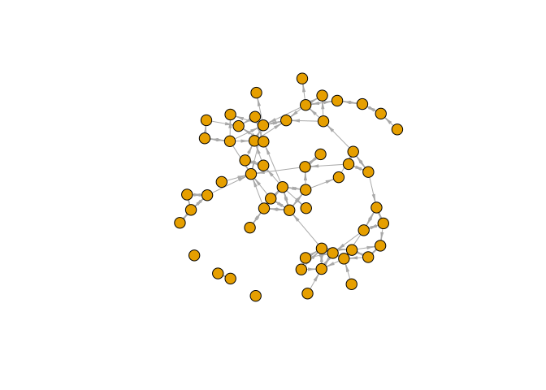
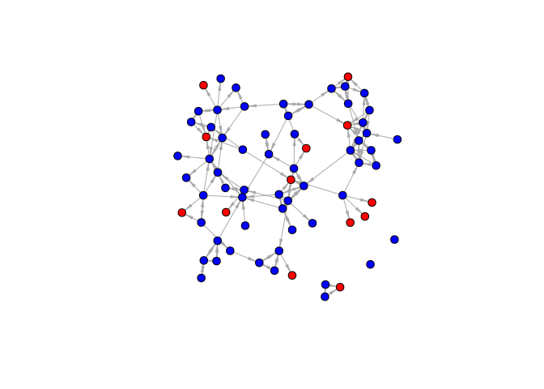
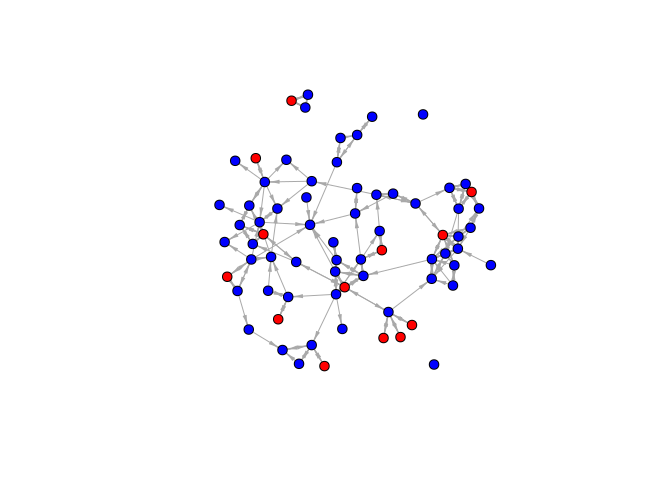

# 4.1 - Missing Data


# Missing Data

- data based on friendships between women in a sorority
- the true network has 72 nodes
- there are 14 nodes that are non-respondents
- Note that we still have any nominations from the non-missing nodes
  (those who filled out the survey) to the missing nodes (the
  non-respondents)

``` r
url1 <- "https://github.com/JeffreyAlanSmith/Integrated_Network_Science/raw/master/data/sorority_attributes_wmissingdata.csv"

sorority_attributes <- read.csv(file = url1)

url2 <- "https://github.com/JeffreyAlanSmith/Integrated_Network_Science/raw/master/data/sorority_matrix_wmissingdata.csv"

sorority_matrix <- read.csv(file = url2, row.names = 1)
```

``` r
sorority_matrix <- as.matrix(sorority_matrix)
```

The attributes data shows who was missing the day of the survey.

``` r
missing <- which(sorority_attributes[, "missing"] == 1)
missing
```

     [1]  2  7 12 26 29 30 44 45 47 50 54 64 65 66

``` r
notmissing <- which(sorority_attributes[, "missing"] == 0)
```

``` r
sorority_matrix[6, 1:15]
```

     id1  id2  id3  id4  id5  id6  id7  id8  id9 id10 id11 id12 id13 id14 id15 
       0    0    0    0    0    0    0    0    0    0    0    0    0    0    0 

``` r
sorority_matrix[1:15, 2]
```

     id1  id2  id3  id4  id5  id6  id7  id8  id9 id10 id11 id12 id13 id14 id15 
       0   NA    0    0    0    0   NA    0    0    0    0   NA    1    0    0 

``` r
sorority_matrix[2, 7]
```

    [1] NA

# Listwise deletion

Delete all of the missing nodes. Information about ties to missing nodes
from non-missing nodes is lost.

``` r
matrix_remove_missing <- sorority_matrix[-missing, -missing]
dim(matrix_remove_missing)
```

    [1] 58 58

``` r
library(igraph)
```

``` r
net_listwise_delete <- graph_from_adjacency_matrix(matrix_remove_missing,
  mode = "directed"
)

plot(net_listwise_delete,
  vertex.label = NA, vertex.size = 10,
  edge.arrow.size = .5, edge.arrow.width = .5
)
```



## Calculate closeness

- define shortest path between each pair of nodes
- take inverse of values to accommodate unreachable nodes
- take the mean of the values

``` r
dist_listwise_delete <- distances(
  graph = net_listwise_delete,
  mode = "out"
)
diag(dist_listwise_delete) <- NA
```

``` r
mean_closeness_listwise_delete <- mean(1 / dist_listwise_delete, na.rm = T)
mean_closeness_listwise_delete
```

    [1] 0.1098182

``` r
measure_closeness <- function(net) {
  dist_matrix <- distances(graph = net, mode = "out")
  diag(dist_matrix) <- NA
  mean(1 / dist_matrix, na.rm = T)
}
measure_closeness(net_listwise_delete)
```

    [1] 0.1098182

# Gauging Bias Level

Here we will rely on the model presented in Smith, Moody, and Morgan
(2017). They have provided an easy to use bias calculator at
<http://www.soc.duke.edu/~jmoody77/missingdata/calculator.htm>. The
researcher must set a number of inputs into the bias calculator and we
will walk through how to practically do this in the case of the sorority
network. The main inputs are: size, percent missing, indegree standard
deviation, directed/undirected and the type of missing data.

``` r
indeg <- degree(net_listwise_delete, mode = "in")
sd(indeg)
```

    [1] 1.609203

# Simple imputation

3 basic versions for directed networks: - asymmetric - symmetric -
probabilistic

``` r
nominations_missing_nodes <- sorority_matrix[, missing]
```

Keep only those with at least one nomination.

``` r
indeg_missing <- colSums(nominations_missing_nodes, na.rm = T)
impute_nodes <- missing[indeg_missing > 0]
impute_nodes
```

     [1]  2  7 12 26 29 30 44 45 47 50 54 64 66

Which should be removed

``` r
still_missing <- missing[indeg_missing == 0]
still_missing
```

    [1] 65

## Asymmetric

Assumes that no nomination made from the missing nodes to non-missing
nodes

``` r
matrix_impute_asym <- sorority_matrix
matrix_impute_asym[missing, ] <- 0
net_impute_asym <- graph_from_adjacency_matrix(matrix_impute_asym,
  mode = "directed"
)
```

``` r
cols <- ifelse(sorority_attributes[, "missing"] == 1, "red", "blue")
table(cols, sorority_attributes[, "missing"])
```

          
    cols    0  1
      blue 58  0
      red   0 14

``` r
V(net_impute_asym)$color <- cols
```

``` r
net_impute_asym <- delete_vertices(
  graph = net_impute_asym,
  v = still_missing
)
```

``` r
plot(net_impute_asym,
  vertex.label = NA, vertex.size = 7,
  edge.arrow.size = .5, edge.arrow.width = .5
)
```



``` r
mean_closeness_impute_asym <- measure_closeness(net_impute_asym)
mean_closeness_impute_asym
```

    [1] 0.08920313

## Symmetric

``` r
matrix_impute_sym <- sorority_matrix
head(nominations_missing_nodes)
```

        id2 id7 id12 id26 id29 id30 id44 id45 id47 id50 id54 id64 id65 id66
    id1   0   0    0    0    0    0    0    0    0    0    0    0    0    0
    id2  NA  NA   NA   NA   NA   NA   NA   NA   NA   NA   NA   NA   NA   NA
    id3   0   1    0    1    0    0    0    0    0    0    0    1    0    1
    id4   0   0    0    0    0    0    0    0    0    0    0    0    0    0
    id5   0   0    0    0    0    0    0    0    0    0    0    0    0    0
    id6   0   0    0    0    0    0    0    0    0    0    0    0    0    0

``` r
nominations_missing_nodes[is.na(nominations_missing_nodes)] <- 0
dim(nominations_missing_nodes)
```

    [1] 72 14

Transpose to have it in the form of outgoing ties from missing nodes.

``` r
outgoing_ties_sym <- t(nominations_missing_nodes)
```

``` r
matrix_impute_sym[missing, ] <- outgoing_ties_sym
matrix_impute_sym[1:15, 2]
```

     id1  id2  id3  id4  id5  id6  id7  id8  id9 id10 id11 id12 id13 id14 id15 
       0    0    0    0    0    0    0    0    0    0    0    0    1    0    0 

Person 13 nominated person 2.

``` r
matrix_impute_sym[2, 13]
```

    [1] 1

``` r
matrix_impute_asym[2, 13]
```

    [1] 0

``` r
net_impute_sym <- graph_from_adjacency_matrix(matrix_impute_sym,
  mode = "directed"
)
V(net_impute_sym)$color <- cols
net_impute_sym <- delete_vertices(
  graph = net_impute_sym,
  v = still_missing
)
net_impute_sym
```

    IGRAPH b479387 DN-- 71 189 -- 
    + attr: name (v/c), color (v/c)
    + edges from b479387 (vertex names):
     [1] id1 ->id39 id1 ->id42 id2 ->id13 id2 ->id62 id3 ->id1  id3 ->id7 
     [7] id3 ->id26 id3 ->id64 id3 ->id66 id7 ->id3  id8 ->id1  id8 ->id42
    [13] id8 ->id55 id9 ->id25 id9 ->id28 id9 ->id63 id9 ->id64 id9 ->id72
    [19] id10->id44 id10->id48 id10->id64 id11->id50 id11->id52 id11->id71
    [25] id12->id20 id12->id31 id12->id32 id12->id35 id12->id42 id12->id55
    [31] id13->id2  id13->id14 id13->id22 id13->id34 id13->id52 id13->id62
    [37] id14->id22 id14->id33 id14->id34 id14->id44 id14->id69 id15->id16
    [43] id15->id18 id15->id22 id16->id15 id16->id41 id17->id43 id18->id15
    + ... omitted several edges

``` r
plot(net_impute_sym,
  vertex.label = NA, vertex.size = 7,
  edge.arrow.size = .5, edge.arrow.width = .5
)
```



``` r
mean_closeness_impute_sym <- measure_closeness(net_impute_sym)
mean_closeness_impute_sym
```

    [1] 0.1574669

## Probabilistic imputation

Calculate the number of reciprocal dyads divided by the total number.

``` r
p <- reciprocity(
  graph = net_listwise_delete,
  mode = "ratio"
)
p
```

    [1] 0.4204545

``` r
matrix_impute_prob <- sorority_matrix
outgoing_ties_prob <- t(nominations_missing_nodes)
```

``` r
set.seed(200)
impute_tie <- outgoing_ties_prob == 1

outgoing_ties_prob[impute_tie] <- rbinom(outgoing_ties_prob[impute_tie],
  size = 1, prob = p
)

matrix_impute_prob[missing, ] <- outgoing_ties_prob
```

``` r
net_impute_prob <- graph_from_adjacency_matrix(matrix_impute_prob,
  mode = "directed"
)

net_impute_prob <- delete_vertices(
  graph = net_impute_prob,
  v = still_missing
)
mean_closeness_impute_prob <- measure_closeness(net_impute_prob)

mean_closeness_impute_prob
```

    [1] 0.1351686

## Comparison

``` r
closeness_table <- data.frame(
  true = .15,
  listwise_delete = mean_closeness_listwise_delete,
  asym = mean_closeness_impute_asym,
  sym = mean_closeness_impute_sym,
  prob = mean_closeness_impute_prob
)
closeness_table
```

      true listwise_delete       asym       sym      prob
    1 0.15       0.1098182 0.08920313 0.1574669 0.1351686
