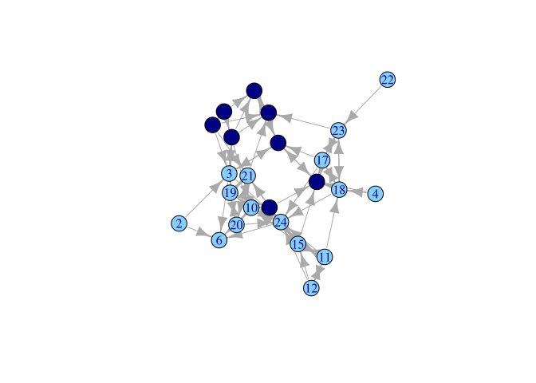

# 5.1 - Network Visualization


``` r
# url1 <- "https://github.com/JeffreyAlanSmith/Integrated_Network_Science/raw/master/data/class555_edgelist.csv"

class_edges <- read.csv("data/class555_edgelist.csv")

# url2 <- "https://github.com/JeffreyAlanSmith/Integrated_Network_Science/raw/master/data/class555_attributedata.csv"

class_attributes <- read.csv("data/class555_attributedata.csv")
```

# Network Visualization

# igraph

``` r
library(igraph)
```

``` r
class_net <- graph_from_data_frame(
  d = class_edges, directed = T,
  vertices = class_attributes
)
class_net
```

    IGRAPH 140ddf4 DNW- 24 77 -- 
    + attr: name (v/c), gender (v/c), grade (v/n), race (v/c), weight (e/n)
    + edges from 140ddf4 (vertex names):
     [1] 1 ->3  1 ->5  1 ->7  1 ->21 2 ->3  2 ->6  3 ->6  3 ->8  3 ->16 3 ->24
    [11] 4 ->13 4 ->18 7 ->1  7 ->9  7 ->10 7 ->16 8 ->3  8 ->9  8 ->13 9 ->5 
    [21] 9 ->8  10->6  10->14 10->19 10->20 10->24 11->12 11->15 11->18 11->24
    [31] 12->11 12->15 12->24 13->8  14->10 14->13 14->19 14->21 14->24 15->10
    [41] 15->11 15->13 15->14 15->24 16->3  16->5  16->9  16->19 17->8  17->13
    [51] 17->18 17->23 17->24 18->13 18->17 18->23 18->24 19->14 19->16 19->20
    [61] 19->21 20->19 20->21 20->24 21->5  21->19 21->20 22->23 23->5  23->13
    [71] 23->17 23->18 24->6  24->10 24->14 24->15 24->21

``` r
plot(class_net)
```


> Add color

``` r
cols <- ifelse(class_attributes$gender == "Female", "lightskyblue", "navy")
table(cols, class_attributes$gender)
```

                  
    cols           Female Male
      lightskyblue     16    0
      navy              0    8

``` r
V(class_net)$color <- cols
plot(class_net)
```


Alternatively

``` r
plot(class_net, vertex.color = cols)
```



> Which nodes receive the most nominations?

``` r
indeg <- degree(class_net, mode = "in")
plot(class_net, vertex.size = indeg, margin = -.1)
```


``` r
plot(class_net,
  vertex.size = indeg + 3, vertex.label.color = "red",
  margin = -.10
)
```


``` r
class_net |>
  plot(
    vertex.size = indeg + 3, vertex.label = NA,
    vertex.frame.color = NA, edge.arrow.size = .5,
    edge.arrow.width = .75, edge.color = "light gray",
    margin = -.10
  )
```


> MDS-based layout

``` r
class_net |>
  plot(
    vertex.size = indeg + 3, vertex.label = NA,
    vertex.frame.color = NA, edge.arrow.size = .5,
    edge.arrow.width = .75, edge.color = "light gray",
    margin = -.10,
    layout = layout_with_mds
  )
```


> Kamada-Kawai layout

``` r
class_net |>
  plot(
    vertex.size = indeg + 3, vertex.label = NA,
    vertex.frame.color = NA, edge.arrow.size = .5,
    edge.arrow.width = .75, edge.color = "light gray",
    margin = -.10,
    layout = layout_with_kk
  )
```


# ggplot

``` r
detach(package:igraph)
library(network)
library(intergraph)
library(ggplot2)
library(GGally)
```

``` r
class_net_sna <- asNetwork(class_net)
set.vertex.attribute(class_net_sna,
  attrname = "indeg",
  value = indeg
)
```

## GGally

``` r
ggnet2(class_net_sna,
  node.size = indeg, node.color = cols,
  edge.size = 0.5, edge.color = "grey80",
  arrow.size = 3, arrow.gap = 0.02
)
```


``` r
ggnet2(class_net_sna,
  node.size = indeg, node.color = cols,
  edge.size = 0.5, edge.color = "grey80",
  arrow.size = 3, arrow.gap = 0.02
) +
  guides(size = "none")
```


``` r
ggnet2(class_net_sna,
  node.size = indeg, node.color = "gender",
  palette = c("Male" = "navy", "Female" = "lightskyblue"),
  edge.size = 0.5, edge.color = "grey80",
  arrow.size = 3, arrow.gap = 0.02
) +
  guides(size = "none")
```


``` r
ggnet2(class_net_sna,
  node.size = indeg, node.color = "gender",
  palette = c("Male" = "navy", "Female" = "lightskyblue"),
  edge.size = 0.5, edge.color = c("color", "grey80"),
  arrow.size = 3, arrow.gap = 0.02
) +
  guides(size = "none")
```


## ggnetwork

``` r
library(ggnetwork)
```

``` r
ggplot(
  class_net_sna,
  aes(x = x, y = y, xend = xend, yend = yend)
) +
  geom_edges(
    color = "lightgrey",
    arrow = arrow(length = unit(7.5, "pt"), type = "closed")
  ) +
  geom_nodes(color = cols, size = indeg + 3) +
  theme_blank()
```


# Contour plots

``` r
ggplot(class_net_sna,
  arrow.gap = 0.01,
  aes(x = x, y = y, xend = xend, yend = yend)
) +
  geom_edges(
    color = "lightgrey",
    arrow = arrow(length = unit(5, "pt"), type = "closed")
  ) +
  geom_nodes(color = cols) +
  theme_blank() +
  geom_density2d()
```

    Warning: The following aesthetics were dropped during statistical transformation: xend
    and yend.
    ℹ This can happen when ggplot fails to infer the correct grouping structure in
      the data.
    ℹ Did you forget to specify a `group` aesthetic or to convert a numerical
      variable into a factor?


# Interactive plots

``` r
library(networkD3)
```

The networkD3 package indexes the nodes starting from 0 (rather than 1)
so we need to create an edgelist and attribute file that starts the ids
with 0.

``` r
class_edges_zeroindex <- class_edges[, c("sender", "receiver")] - 1

class_attributes_zeroindex <- data.frame(
  id = class_attributes$id - 1,
  indeg = indeg,
  gender = class_attributes$gender
)
```

``` r
forceNetwork(
  Links = class_edges_zeroindex,
  Nodes = class_attributes_zeroindex,
  Source = "sender", Target = "receiver",
  Group = "gender", Nodesize = "indeg", NodeID = "id",
  opacity = 0.9, bounded = FALSE, opacityNoHover = 0.2
)
```

# Dynamic network visualizations

``` r
# url3 <- "https://github.com/JeffreyAlanSmith/Integrated_Network_Science/raw/master/data/example_edge_spells.csv"

edge_spells <- read.csv("data/example_edge_spells.csv")
head(edge_spells)
```

      start_time end_time send_col receive_col
    1      0.143    0.143       11           2
    2      0.286    0.286        2          11
    3      0.429    0.429        2           5
    4      0.571    0.571        5           2
    5      0.714    0.714        9           8
    6      0.857    0.857        8           9

``` r
# url4 <- "https://github.com/JeffreyAlanSmith/Integrated_Network_Science/raw/master/data/example_vertex_spells.csv"

vertex_spells <- read.csv("data/example_vertex_spells.csv")
head(vertex_spells)
```

      start_time end_time id
    1          0       43  1
    2          0       43  2
    3          0       43  3
    4          0       43  4
    5          0       43  5
    6          0       43  6

``` r
url5 <- "https://github.com/JeffreyAlanSmith/Integrated_Network_Science/raw/master/data/class_attributes.txt"

attributes_example2 <- read.table(file = url5, header = T)
head(attributes_example2)
```

      id gnd grd rce
    1  1   2  10   4
    2  2   2  10   3
    3  3   2  10   3
    4  4   2  10   3
    5  5   2  10   3
    6  6   1  10   4

``` r
library(networkDynamic)
```

``` r
net_dynamic_interactions <- networkDynamic(
  vertex.spells = vertex_spells,
  edge.spells = edge_spells
)
```

    Initializing base.net of size 18 imputed from maximum vertex id in edge records
    Created net.obs.period to describe network
     Network observation period info:
      Number of observation spells: 1 
      Maximal time range observed: 0 until 43 
      Temporal mode: continuous 
      Time unit: unknown 
      Suggested time increment: NA 

## Time flattened

Split the network by time intervals

``` r
extract_nets <- get.networks(
  net_dynamic_interactions,
  start = 0, time.increment = 20
)
extract_nets
```

    [[1]]
     Network attributes:
      vertices = 18 
      directed = TRUE 
      hyper = FALSE 
      loops = FALSE 
      multiple = FALSE 
      bipartite = FALSE 
      total edges= 42 
        missing edges= 0 
        non-missing edges= 42 

     Vertex attribute names: 
        vertex.names 

    No edge attributes

    [[2]]
     Network attributes:
      vertices = 18 
      directed = TRUE 
      hyper = FALSE 
      loops = FALSE 
      multiple = FALSE 
      bipartite = FALSE 
      total edges= 34 
        missing edges= 0 
        non-missing edges= 34 

     Vertex attribute names: 
        vertex.names 

    No edge attributes

``` r
cols_example2 <- ifelse(attributes_example2$gnd == 2, "lightskyblue", "navy")
```

``` r
par(mfrow = c(1, 2))

plot(extract_nets[[1]],
  main = "Talk to Network, 0-20 mins",
  vertex.col = cols_example2, vertex.cex = 2
)

plot(extract_nets[[2]],
  main = "Talk to Network, 20-40 mins",
  vertex.col = cols_example2, vertex.cex = 2
)
```


> Consistent layout accross periods

``` r
locs <- network.layout.fruchtermanreingold(extract_nets[[1]], layout.par = NULL)

par(mfrow = c(1, 2))

plot(extract_nets[[1]],
  main = "Talk to Network, 0-20 mins",
  vertex.col = cols_example2, vertex.cex = 2, coord = locs
)

plot(extract_nets[[2]],
  main = "Talk to Network, 20-40 mins",
  vertex.col = cols_example2, vertex.cex = 2, coord = locs
)
```


## Dynamic network movies

``` r
library(ndtv)
```

``` r
slice_par <- list(
  start = 0, end = 43, interval = 1,
  aggregate.dur = 0, rule = "latest"
)

set.network.attribute(net_dynamic_interactions, "slice.par", slice_par)
```

``` r
render.d3movie(
  net_dynamic_interactions,
  displaylables = FALSE,
  vertex.cex = 1.5, output.mode = "HTML",
  filename = "classroom_movie_1.html"
)
```

``` r
slice_par <- list(
  start = 0, end = 43, interval = 1,
  aggregate.dur = 1, rule = "latest"
)

set.network.attribute(net_dynamic_interactions, "slice.par", slice_par)

render.d3movie(net_dynamic_interactions,
  displaylabels = FALSE,
  vertex.cex = 1.5, vertex.col = cols,
  output.mode = "HTML", filename = "classroom_movie2.html"
)
```

> Longer time periods

``` r
slice_par <- list(
  start = 0, end = 43, interval = 10,
  aggregate.dur = 10, rule = "latest"
)

set.network.attribute(net_dynamic_interactions, "slice.par", slice_par)

render.d3movie(net_dynamic_interactions,
  displaylabels = FALSE,
  vertex.cex = 1.5, vertex.col = cols,
  output.mode = "HTML", filename = "classroom_movie2.html"
)
```

``` r
slice_par <- list(
  start = 0, end = 43, interval = 1,
  aggregate.dur = 10, rule = "latest"
)

set.network.attribute(net_dynamic_interactions, "slice.par", slice_par)

render.d3movie(net_dynamic_interactions,
  displaylabels = FALSE,
  vertex.cex = 1.5, vertex.col = cols,
  output.mode = "HTML", filename = "classroom_movie2.html"
)
```
