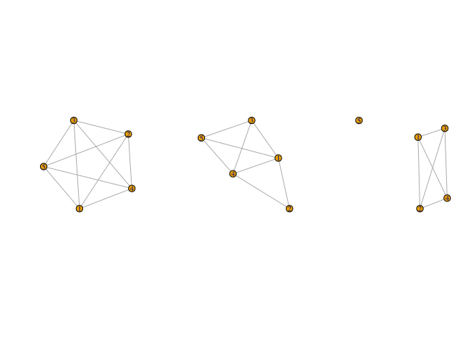
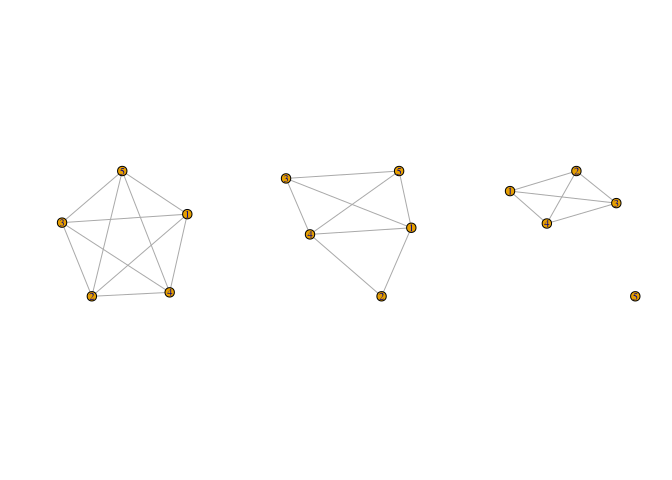
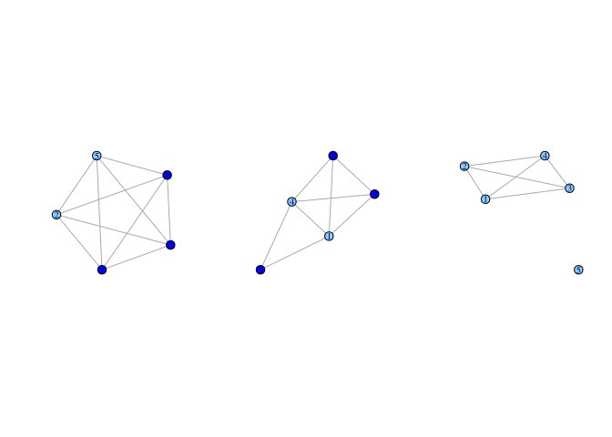

# 6 - Ego Network Data


# Ego Network Data

Ego network data are based on a sample of individuals and are commonly
used in the social sciences. Each respondent (ego) reports on the people
(alters) they are connected to, providing the local network around the
focal respondent. Ego network data offer only pieces of the whole
network, as there is typically no way of knowing if the alters named by
one respondent are the same alters named by another. Ego network data
thus require a somewhat different approach than with sociocentric
network data. Most clearly, we must conceptually separate the
information about the egos from information about the named alters,
which is typically provided by ego. Ego network data can be structured
in a number of ways but will generally have 4 kinds of information:

    first, demographic, behavioral, etc. information on the egos
    second, demographic, behavioral, etc. information on the named alters
    third, information about the relationship between ego and alter
    fourth, information about the relationships between the alters.

Our example ego network data come from the 1985 General Social Survey
ego network module. The GSS is a nationally representative survey that
is fielded yearly, including basic demographic information,
socio-economic measures and the like. In addition to the core survey
given each year, the GSS will include rotating modules, including
occasional modules on social networks. Here, we will work with ego
network data from the GSS that has been preprocessed into three
different files: a file with the ego attributes; a file with the alter
attributes; and a file with the alter-alter ties.

``` r
# url1 <- "https://github.com/JeffreyAlanSmith/Integrated_Network_Science/raw/master/data/gss1985_ego_dat.csv"

ego_dat <- read.csv("data/gss1985_ego_dat.csv", stringsAsFactors = F)
str(ego_dat)
```

    'data.frame':   1534 obs. of  13 variables:
     $ CASEID          : int  19850001 19850002 19850003 19850004 19850005 19850006 19850007 19850008 19850009 19850010 ...
     $ AGE             : int  33 49 23 26 24 45 44 56 85 65 ...
     $ EDUC            : int  16 19 16 20 17 17 18 12 7 12 ...
     $ RACE            : chr  "white" "white" "white" "white" ...
     $ SEX             : chr  "male" "male" "female" "female" ...
     $ RELIG           : chr  "jewish" "catholic" "jewish" "jewish" ...
     $ AGE_CATEGORICAL : chr  "30s" "40s" "20s" "20s" ...
     $ EDUC_CATEGORICAL: chr  "College" "Post Graduate" "College" "Post Graduate" ...
     $ NUMGIVEN        : int  6 6 5 5 5 4 6 5 2 2 ...
     $ HAPPY           : int  2 2 2 2 2 2 2 2 2 2 ...
     $ HEALTH          : int  2 1 1 2 2 2 1 2 3 2 ...
     $ PARTYID         : int  1 4 1 0 2 1 1 4 0 1 ...
     $ WTSSALL         : num  1.036 1.036 1.036 0.518 0.518 ...

NUMGIVEN is the number of alters named (max 6+)

``` r
ego_dat <- ego_dat[!is.na(ego_dat$NUMGIVEN), ]
```

``` r
# url2 <- "https://github.com/JeffreyAlanSmith/Integrated_Network_Science/raw/master/data/gss1985_alter_dat.csv"

alter_dat <- read.csv("data/gss1985_alter_dat.csv", stringsAsFactors = F)
str(alter_dat)
```

    'data.frame':   4483 obs. of  12 variables:
     $ CASEID          : int  19850001 19850001 19850001 19850001 19850001 19850002 19850002 19850002 19850002 19850002 ...
     $ ALTERID         : int  1 2 3 4 5 1 2 3 4 5 ...
     $ AGE             : int  32 29 32 35 29 42 44 45 40 50 ...
     $ EDUC            : num  18 16 18 16 13 12 18 16 12 18 ...
     $ RACE            : chr  "white" "white" "white" "white" ...
     $ SEX             : chr  "male" "female" "male" "male" ...
     $ RELIG           : chr  "jewish" "protestant" "jewish" "jewish" ...
     $ AGE_CATEGORICAL : chr  "30s" "20s" "30s" "30s" ...
     $ EDUC_CATEGORICAL: chr  "Post Graduate" "College" "Post Graduate" "College" ...
     $ TALKTO          : int  2 1 3 3 2 1 2 1 1 1 ...
     $ SPOUSE          : int  2 1 2 2 2 1 2 2 2 2 ...
     $ KIN             : int  0 1 0 1 0 1 0 0 0 0 ...

``` r
# url3 <- "https://github.com/JeffreyAlanSmith/Integrated_Network_Science/raw/master/data/gss1985_alteralter_dat.csv"

alteralter_dat <- read.csv("data/gss1985_alteralter_dat.csv")
str(alteralter_dat)
```

    'data.frame':   4880 obs. of  4 variables:
     $ CASEID: int  19850001 19850001 19850001 19850001 19850001 19850001 19850001 19850001 19850001 19850001 ...
     $ ALTER1: int  1 1 1 1 2 2 2 3 3 4 ...
     $ ALTER2: int  2 3 4 5 3 4 5 4 5 5 ...
     $ WEIGHT: int  2 1 1 1 2 2 2 1 1 1 ...

# Homophily

## Creating the network from survey data

``` r
library(egor)
```

The egor() function assumes that you are inputting the data using three
separate files. The main arguments are:

    alters = alter attributes data frame
    egos = ego attributes data frame
    aaties = alter-alter tie data frame
    alter_design = list of arguments to specify nomination information from survey
    ego_design = list of arguments to specify survey design of study
    ID.vars = list of variable names corresponding to key columns:
        ego = variable name for id of ego
        alter = variable name for id of alter (in alter data)
        source = variable name for 'sender' of tie in alter-alter data
        target = variable name for 'receiver' of tie in alter-alter data

``` r
egonetlist <- egor(
  alters = alter_dat, egos = ego_dat,
  aaties = alteralter_dat, alter_design = list(max = 5),
  ID.vars = list(
    ego = "CASEID", alter = "ALTERID",
    source = "ALTER1", target = "ALTER2"
  )
)
egonetlist
```

    # EGO data (active): 1,531 × 13

    Warning: `...` must be empty in `format.tbl()`
    Caused by error in `format_tbl()`:
    ! `...` must be empty.
    ✖ Problematic argument:
    • advice = FALSE

      .egoID   AGE  EDUC RACE  SEX   RELIG AGE_CATEGORICAL EDUC_CATEGORICAL NUMGIVEN
    *  <int> <int> <int> <chr> <chr> <chr> <chr>           <chr>               <int>
    1 1.99e7    33    16 white male  jewi… 30s             College                 6
    2 1.99e7    49    19 white male  cath… 40s             Post Graduate           6
    3 1.99e7    23    16 white fema… jewi… 20s             College                 5
    4 1.99e7    26    20 white fema… jewi… 20s             Post Graduate           5
    5 1.99e7    24    17 white fema… cath… 20s             Post Graduate           5
    # ℹ 1,526 more rows
    # ℹ 4 more variables: HAPPY <int>, HEALTH <int>, PARTYID <int>, WTSSALL <dbl>
    # ALTER data: 4,483 × 12

    Warning: `...` must be empty in `format.tbl()`
    Caused by error in `format_tbl()`:
    ! `...` must be empty.
    ✖ Problematic argument:
    • advice = FALSE

      .altID   .egoID   AGE  EDUC RACE  SEX   RELIG AGE_CATEGORICAL EDUC_CATEGORICAL
    *  <int>    <int> <int> <dbl> <chr> <chr> <chr> <chr>           <chr>           
    1      1 19850001    32    18 white male  jewi… 30s             Post Graduate   
    2      2 19850001    29    16 white fema… prot… 20s             College         
    3      3 19850001    32    18 white male  jewi… 30s             Post Graduate   
    # ℹ 4,480 more rows
    # ℹ 3 more variables: TALKTO <int>, SPOUSE <int>, KIN <int>
    # AATIE data: 4,880 × 4

    Warning: `...` must be empty in `format.tbl()`
    Caused by error in `format_tbl()`:
    ! `...` must be empty.
    ✖ Problematic argument:
    • advice = FALSE

        .egoID .srcID .tgtID WEIGHT
    *    <int>  <int>  <int>  <int>
    1 19850001      1      2      2
    2 19850001      1      3      1
    3 19850001      1      4      1
    # ℹ 4,877 more rows

``` r
egonetlist <- egor(
  alters = alter_dat, egos = ego_dat,
  aaties = alteralter_dat, alter_design = list(max = 5),
  ID.vars = list(
    ego = "CASEID", alter = "ALTERID",
    source = "ALTER1", target = "ALTER2"
  )
)
str(egonetlist)
```

    List of 3
     $ ego  : tibble [1,531 × 13] (S3: tbl_df/tbl/data.frame)
      ..$ .egoID          : int [1:1531] 19850001 19850002 19850003 19850004 19850005 19850006 19850007 19850008 19850009 19850010 ...
      ..$ AGE             : int [1:1531] 33 49 23 26 24 45 44 56 85 65 ...
      ..$ EDUC            : int [1:1531] 16 19 16 20 17 17 18 12 7 12 ...
      ..$ RACE            : chr [1:1531] "white" "white" "white" "white" ...
      ..$ SEX             : chr [1:1531] "male" "male" "female" "female" ...
      ..$ RELIG           : chr [1:1531] "jewish" "catholic" "jewish" "jewish" ...
      ..$ AGE_CATEGORICAL : chr [1:1531] "30s" "40s" "20s" "20s" ...
      ..$ EDUC_CATEGORICAL: chr [1:1531] "College" "Post Graduate" "College" "Post Graduate" ...
      ..$ NUMGIVEN        : int [1:1531] 6 6 5 5 5 4 6 5 2 2 ...
      ..$ HAPPY           : int [1:1531] 2 2 2 2 2 2 2 2 2 2 ...
      ..$ HEALTH          : int [1:1531] 2 1 1 2 2 2 1 2 3 2 ...
      ..$ PARTYID         : int [1:1531] 1 4 1 0 2 1 1 4 0 1 ...
      ..$ WTSSALL         : num [1:1531] 1.036 1.036 1.036 0.518 0.518 ...
     $ alter: tibble [4,483 × 12] (S3: tbl_df/tbl/data.frame)
      ..$ .altID          : int [1:4483] 1 2 3 4 5 1 2 3 4 5 ...
      ..$ .egoID          : int [1:4483] 19850001 19850001 19850001 19850001 19850001 19850002 19850002 19850002 19850002 19850002 ...
      ..$ AGE             : int [1:4483] 32 29 32 35 29 42 44 45 40 50 ...
      ..$ EDUC            : num [1:4483] 18 16 18 16 13 12 18 16 12 18 ...
      ..$ RACE            : chr [1:4483] "white" "white" "white" "white" ...
      ..$ SEX             : chr [1:4483] "male" "female" "male" "male" ...
      ..$ RELIG           : chr [1:4483] "jewish" "protestant" "jewish" "jewish" ...
      ..$ AGE_CATEGORICAL : chr [1:4483] "30s" "20s" "30s" "30s" ...
      ..$ EDUC_CATEGORICAL: chr [1:4483] "Post Graduate" "College" "Post Graduate" "College" ...
      ..$ TALKTO          : int [1:4483] 2 1 3 3 2 1 2 1 1 1 ...
      ..$ SPOUSE          : int [1:4483] 2 1 2 2 2 1 2 2 2 2 ...
      ..$ KIN             : int [1:4483] 0 1 0 1 0 1 0 0 0 0 ...
     $ aatie: tibble [4,880 × 4] (S3: tbl_df/tbl/data.frame)
      ..$ .egoID: int [1:4880] 19850001 19850001 19850001 19850001 19850001 19850001 19850001 19850001 19850001 19850001 ...
      ..$ .srcID: int [1:4880] 1 1 1 1 2 2 2 3 3 4 ...
      ..$ .tgtID: int [1:4880] 2 3 4 5 3 4 5 4 5 5 ...
      ..$ WEIGHT: int [1:4880] 2 1 1 1 2 2 2 1 1 1 ...
     - attr(*, "class")= chr [1:2] "egor" "list"
     - attr(*, "alter_design")=List of 1
      ..$ max: num 5
     - attr(*, "active")= chr "ego"

``` r
names(egonetlist)
```

    [1] "ego"   "alter" "aatie"

``` r
egonetlist[["ego"]][, 1:5]
```

    # A tibble: 1,531 × 5
         .egoID   AGE  EDUC RACE  SEX   
          <int> <int> <int> <chr> <chr> 
     1 19850001    33    16 white male  
     2 19850002    49    19 white male  
     3 19850003    23    16 white female
     4 19850004    26    20 white female
     5 19850005    24    17 white female
     6 19850006    45    17 white male  
     7 19850007    44    18 white female
     8 19850008    56    12 white female
     9 19850009    85     7 white female
    10 19850010    65    12 white female
    # ℹ 1,521 more rows

``` r
egonetlist[["alter"]][, 1:5]
```

    # A tibble: 4,483 × 5
       .altID   .egoID   AGE  EDUC RACE 
        <int>    <int> <int> <dbl> <chr>
     1      1 19850001    32    18 white
     2      2 19850001    29    16 white
     3      3 19850001    32    18 white
     4      4 19850001    35    16 white
     5      5 19850001    29    13 white
     6      1 19850002    42    12 white
     7      2 19850002    44    18 white
     8      3 19850002    45    16 white
     9      4 19850002    40    12 white
    10      5 19850002    50    18 white
    # ℹ 4,473 more rows

``` r
egonetlist[["aatie"]]
```

    # A tibble: 4,880 × 4
         .egoID .srcID .tgtID WEIGHT
          <int>  <int>  <int>  <int>
     1 19850001      1      2      2
     2 19850001      1      3      1
     3 19850001      1      4      1
     4 19850001      1      5      1
     5 19850001      2      3      2
     6 19850001      2      4      2
     7 19850001      2      5      2
     8 19850001      3      4      1
     9 19850001      3      5      1
    10 19850001      4      5      1
    # ℹ 4,870 more rows

## Summary statistics

``` r
dens <- ego_density(egonetlist)
head(dens)
```

    # A tibble: 6 × 2
        .egoID density
         <int>   <dbl>
    1 19850001   1    
    2 19850002   0.8  
    3 19850003   0.6  
    4 19850004   0.6  
    5 19850005   1    
    6 19850006   0.667

``` r
alteralter_dat[alteralter_dat$CASEID == 19850001, ]
```

         CASEID ALTER1 ALTER2 WEIGHT
    1  19850001      1      2      2
    2  19850001      1      3      1
    3  19850001      1      4      1
    4  19850001      1      5      1
    5  19850001      2      3      2
    6  19850001      2      4      2
    7  19850001      2      5      2
    8  19850001      3      4      1
    9  19850001      3      5      1
    10 19850001      4      5      1

``` r
alteralter_dat[alteralter_dat$CASEID == 19850002, ]
```

         CASEID ALTER1 ALTER2 WEIGHT
    11 19850002      1      2      1
    12 19850002      1      3      1
    13 19850002      1      4      2
    14 19850002      1      5      2
    15 19850002      2      4      2
    16 19850002      3      4      2
    17 19850002      3      5      1
    18 19850002      4      5      2

# Plotting Networks

``` r
library(igraph)
```

``` r
igraph_nets <- as_igraph(egonetlist)
igraph_nets[1:3]
```

    $`19850001`
    IGRAPH 6e45aad UN-- 5 10 -- 
    + attr: .egoID (g/n), name (v/c), AGE (v/n), EDUC (v/n), RACE (v/c),
    | SEX (v/c), RELIG (v/c), AGE_CATEGORICAL (v/c), EDUC_CATEGORICAL
    | (v/c), TALKTO (v/n), SPOUSE (v/n), KIN (v/n), WEIGHT (e/n)
    + edges from 6e45aad (vertex names):
     [1] 1--2 1--3 1--4 1--5 2--3 2--4 2--5 3--4 3--5 4--5

    $`19850002`
    IGRAPH 163da38 UN-- 5 8 -- 
    + attr: .egoID (g/n), name (v/c), AGE (v/n), EDUC (v/n), RACE (v/c),
    | SEX (v/c), RELIG (v/c), AGE_CATEGORICAL (v/c), EDUC_CATEGORICAL
    | (v/c), TALKTO (v/n), SPOUSE (v/n), KIN (v/n), WEIGHT (e/n)
    + edges from 163da38 (vertex names):
    [1] 1--2 1--3 1--4 1--5 2--4 3--4 3--5 4--5

    $`19850003`
    IGRAPH 909564f UN-- 5 6 -- 
    + attr: .egoID (g/n), name (v/c), AGE (v/n), EDUC (v/n), RACE (v/c),
    | SEX (v/c), RELIG (v/c), AGE_CATEGORICAL (v/c), EDUC_CATEGORICAL
    | (v/c), TALKTO (v/n), SPOUSE (v/n), KIN (v/n), WEIGHT (e/n)
    + edges from 909564f (vertex names):
    [1] 1--2 1--3 1--4 2--3 2--4 3--4

Extracting information

``` r
vertex_attr(igraph_nets[[1]], "SEX")
```

    [1] "male"   "female" "male"   "male"   "female"

``` r
alter_dat[alter_dat$CASEID == 19850001, "SEX"]
```

    [1] "male"   "female" "male"   "male"   "female"

plot first three networks

``` r
par(mfrow = c(1, 3))
purrr::walk(igraph_nets[1:3], plot)
```



alternatively

``` r
par(mfrow = c(1, 3))
lapply(igraph_nets[1:3], plot)
```



    $`19850001`
    NULL

    $`19850002`
    NULL

    $`19850003`
    NULL

``` r
plot_colorgender <- function(nets) {
  cols <- vertex_attr(nets, "SEX")
  cols <- ifelse(cols == "female", "lightskyblue", "blue")
  plot(nets, vertex.color = cols)
}
```

``` r
par(mfrow = c(1, 3))
purrr::walk(igraph_nets[1:3], plot_colorgender)
```



# Homophily: Ego-Alter Attributes

We will focus on gender and racial homophily, comparing across kin and
non-kin ties.

## Proportion of Alters matching Ego

eg., if ego is male, what proportion of named alters are also male?

``` r
prop_same <- function(alt_attr, ego_attr) {
  same <- sum(ego_attr == alt_attr, na.rm = T)
  prop_same <- same / sum(!is.na(alt_attr))
  prop_same[is.na(ego_attr)] <- NA
  prop_same
}
```

``` r
pmatch_sex <- comp_ply(egonetlist,
  alt.attr = "SEX", ego.attr = "SEX",
  .f = prop_same
)
head(pmatch_sex)
```

    # A tibble: 6 × 2
        .egoID result
         <int>  <dbl>
    1 19850001   0.6 
    2 19850002   0.6 
    3 19850003   1   
    4 19850004   0.4 
    5 19850005   0.4 
    6 19850006   0.75

``` r
egonetlist_kin <- subset(
  egonetlist, egonetlist[["alter"]]$KIN == 1,
  unit = "alter"
)
pmatch_sex_kin <- comp_ply(egonetlist_kin,
  alt.attr = "SEX",
  ego.attr = "SEX", .f = prop_same
)

egonetlist_nonkin <- subset(
  egonetlist, egonetlist[["alter"]]$KIN == 0,
  unit = "alter"
)
pmatch_sex_nonkin <- comp_ply(egonetlist_nonkin,
  alt.attr = "SEX",
  ego.attr = "SEX", .f = prop_same
)

sexdat <- data.frame(
  pmatch_sex$result, pmatch_sex_kin$result, pmatch_sex_nonkin$result
)
head(sexdat)
```

             pmatch_sex.result pmatch_sex_kin.result pmatch_sex_nonkin.result
    19850001              0.60                   0.5                  0.66667
    19850002              0.60                   0.0                  0.75000
    19850003              1.00                   1.0                  1.00000
    19850004              0.40                   NaN                  0.40000
    19850005              0.40                   0.4                      NaN
    19850006              0.75                   1.0                  0.66667

``` r
pmatch_race <- comp_ply(egonetlist,
  alt.attr = "RACE",
  .f = prop_same, ego.attr = "RACE"
) # all alters

pmatch_race_kin <- comp_ply(egonetlist_kin,
  alt.attr = "RACE",
  .f = prop_same, ego.attr = "RACE"
) # kin

pmatch_race_nonkin <- comp_ply(egonetlist_nonkin,
  alt.attr = "RACE",
  .f = prop_same, ego.attr = "RACE"
) # nonkin

racedat <- data.frame(
  pmatch_race$result, pmatch_race_kin$result,
  pmatch_race_nonkin$result
)
head(racedat)
```

             pmatch_race.result pmatch_race_kin.result pmatch_race_nonkin.result
    19850001                  1                      1                         1
    19850002                  1                      1                         1
    19850003                  1                      1                         1
    19850004                  1                    NaN                         1
    19850005                  1                      1                       NaN
    19850006                  1                      1                         1

``` r
apply(sexdat, MARGIN = 2, FUN = summary)
```

            pmatch_sex.result pmatch_sex_kin.result pmatch_sex_nonkin.result
    Min.              0.00000               0.00000                  0.00000
    1st Qu.           0.40000               0.00000                  0.50000
    Median            0.60000               0.50000                  1.00000
    Mean              0.59173               0.46479                  0.73819
    3rd Qu.           0.80000               0.66667                  1.00000
    Max.              1.00000               1.00000                  1.00000
    NA's            137.00000             405.00000                557.00000

``` r
apply(racedat, MARGIN = 2, FUN = summary)
```

            pmatch_race.result pmatch_race_kin.result pmatch_race_nonkin.result
    Min.               0.00000                0.00000                   0.00000
    1st Qu.            1.00000                1.00000                   1.00000
    Median             1.00000                1.00000                   1.00000
    Mean               0.94778                0.96901                   0.92945
    3rd Qu.            1.00000                1.00000                   1.00000
    Max.               1.00000                1.00000                   1.00000
    NA's             140.00000              406.00000                 561.00000

## Ego-Alter Pairs (Dyadic Level Homophily)

How likely is a tie to exist between 2 people who match on gender and/or
race? What proporiation of ties are homogenous along gender lines?

``` r
ego_alter_dat <-
  data.frame(as_alters_df(egonetlist, include.ego.vars = TRUE))
head(ego_alter_dat)
```

      .altID   .egoID AGE EDUC  RACE    SEX      RELIG AGE_CATEGORICAL
    1      1 19850001  32   18 white   male     jewish             30s
    2      2 19850001  29   16 white female protestant             20s
    3      3 19850001  32   18 white   male     jewish             30s
    4      4 19850001  35   16 white   male     jewish             30s
    5      5 19850001  29   13 white female   catholic             20s
    6      1 19850002  42   12 white female   catholic             40s
      EDUC_CATEGORICAL TALKTO SPOUSE KIN AGE_ego EDUC_ego RACE_ego SEX_ego
    1    Post Graduate      2      2   0      33       16    white    male
    2          College      1      1   1      33       16    white    male
    3    Post Graduate      3      2   0      33       16    white    male
    4          College      3      2   1      33       16    white    male
    5     Some College      2      2   0      33       16    white    male
    6               HS      1      1   1      49       19    white    male
      RELIG_ego AGE_CATEGORICAL_ego EDUC_CATEGORICAL_ego NUMGIVEN_ego HAPPY_ego
    1    jewish                 30s              College            6         2
    2    jewish                 30s              College            6         2
    3    jewish                 30s              College            6         2
    4    jewish                 30s              College            6         2
    5    jewish                 30s              College            6         2
    6  catholic                 40s        Post Graduate            6         2
      HEALTH_ego PARTYID_ego WTSSALL_ego
    1          2           1      1.0363
    2          2           1      1.0363
    3          2           1      1.0363
    4          2           1      1.0363
    5          2           1      1.0363
    6          1           4      1.0363

``` r
cnames <- colnames(ego_alter_dat)
cnames[3:9] <- paste0(cnames[3:9], "_alter")
colnames(ego_alter_dat) <- cnames
head(ego_alter_dat)
```

      .altID   .egoID AGE_alter EDUC_alter RACE_alter SEX_alter RELIG_alter
    1      1 19850001        32         18      white      male      jewish
    2      2 19850001        29         16      white    female  protestant
    3      3 19850001        32         18      white      male      jewish
    4      4 19850001        35         16      white      male      jewish
    5      5 19850001        29         13      white    female    catholic
    6      1 19850002        42         12      white    female    catholic
      AGE_CATEGORICAL_alter EDUC_CATEGORICAL_alter TALKTO SPOUSE KIN AGE_ego
    1                   30s          Post Graduate      2      2   0      33
    2                   20s                College      1      1   1      33
    3                   30s          Post Graduate      3      2   0      33
    4                   30s                College      3      2   1      33
    5                   20s           Some College      2      2   0      33
    6                   40s                     HS      1      1   1      49
      EDUC_ego RACE_ego SEX_ego RELIG_ego AGE_CATEGORICAL_ego EDUC_CATEGORICAL_ego
    1       16    white    male    jewish                 30s              College
    2       16    white    male    jewish                 30s              College
    3       16    white    male    jewish                 30s              College
    4       16    white    male    jewish                 30s              College
    5       16    white    male    jewish                 30s              College
    6       19    white    male  catholic                 40s        Post Graduate
      NUMGIVEN_ego HAPPY_ego HEALTH_ego PARTYID_ego WTSSALL_ego
    1            6         2          2           1      1.0363
    2            6         2          2           1      1.0363
    3            6         2          2           1      1.0363
    4            6         2          2           1      1.0363
    5            6         2          2           1      1.0363
    6            6         2          1           4      1.0363

``` r
sextab <- table(
  ego_alter_dat[, "SEX_ego"],
  ego_alter_dat[, "SEX_alter"]
)
sextab
```

            
             female male
      female   1515  970
      male      748 1245

> Proportion of ties that match gender

``` r
sum(diag(sextab)) / sum(sextab)
```

    [1] 0.61635

``` r
racetab <- table(
  ego_alter_dat[, "RACE_ego"],
  ego_alter_dat[, "RACE_alter"]
)
racetab
```

              
               asian black hispanic other white
      asian       12     3        3     1    12
      black        1   283        4     1    40
      hispanic     1     6      120     0    64
      other        3     2        1    19     9
      white       15    29       29     5  3808

``` r
sum(diag(racetab)) / sum(racetab)
```

    [1] 0.94878

## Compare to baseline (randomly formed ties)

In this case, pair each case with each other to calculate the base odds

``` r
get_oddsratio <- function(egoalter_tab, attribute) {
  match <- sum(diag(egoalter_tab))
  notmatch <- sum(egoalter_tab) - match

  freq <- table(attribute)
  total_dyads <- sum(freq) * (sum(freq) - 1)

  match_chance <- sum(freq * (freq - 1))
  notmatch_chance <- total_dyads - match_chance

  or <- (match * notmatch_chance) / (notmatch * match_chance)

  return(or)
}
```

``` r
get_oddsratio(sextab, ego_dat[, "SEX"])
```

    [1] 1.5751

``` r
get_oddsratio(racetab, ego_dat[, "RACE"])
```

    [1] 7.3793

Odds of matching on gender is 1.58 times higher than random, and race
odds are 7.38 times higher.

Compre kin and non-kin ties

``` r
kin_sextab <- table(
  ego_alter_dat[ego_alter_dat$KIN == 1, "SEX_ego"],
  ego_alter_dat[ego_alter_dat$KIN == 1, "SEX_alter"]
)
get_oddsratio(kin_sextab, ego_dat[, "SEX"])
```

    [1] 0.95804

``` r
kin_racetab <- table(
  ego_alter_dat[ego_alter_dat$KIN == 1, "RACE_ego"],
  ego_alter_dat[ego_alter_dat$KIN == 1, "RACE_alter"]
)

get_oddsratio(egoalter_tab = kin_racetab, attribute = ego_dat[, "RACE"])
```

    [1] 14.129

``` r
nonkin_sextab <- table(
  ego_alter_dat[ego_alter_dat$KIN == 0, "SEX_ego"],
  ego_alter_dat[ego_alter_dat$KIN == 0, "SEX_alter"]
)

get_oddsratio(egoalter_tab = nonkin_sextab, attribute = ego_dat[, "SEX"])
```

    [1] 2.9377

``` r
nonkin_racetab <- table(
  ego_alter_dat[ego_alter_dat$KIN == 0, "RACE_ego"],
  ego_alter_dat[ego_alter_dat$KIN == 0, "RACE_alter"]
)

get_oddsratio(egoalter_tab = nonkin_racetab, attribute = ego_dat[, "RACE"])
```

    [1] 4.7586

Adjust for the fact that some people do not form ties

``` r
get_oddsratio(
  egoalter_tab = sextab,
  attribute = ego_dat$SEX[ego_dat$NUMGIVEN > 0]
)
```

    [1] 1.5715

# Homophily: Alter Attributes

Here, we ignore the ego attribute and simply summarize the alter
attributes within each ego network. Such measures are often used as
predictors of other outcomes, like political attitudes and mental health
(see below for an example).

For example, we may want to know how diverse the ego network is, or how
similar/different the alters are to each other. Is ego surrounded by
people who are all the same? One summary measure is *Shannon entropy*,
equal to: `-1 * (sum(pi * log(pi))` where pi is the proportion of alters
in category i. This is a measure of diversity, with larger values
meaning the ego network is more diverse.

``` r
sex_diversity <-
  alts_diversity_entropy(egonetlist,
    alt.attr = "SEX",
    base = exp(1)
  )
head(sex_diversity)
```

    # A tibble: 6 × 2
        .egoID entropy
         <int>   <dbl>
    1 19850001   0.673
    2 19850002   0.673
    3 19850003   0    
    4 19850004   0.673
    5 19850005   0.673
    6 19850006   0.562

remember that the sample is half-male, half-female, so 0.673 is high.

``` r
race_diversity <- alts_diversity_entropy(egonetlist,
  alt.attr = "RACE",
  base = exp(1)
)
head(race_diversity)
```

    # A tibble: 6 × 2
        .egoID entropy
         <int>   <dbl>
    1 19850001       0
    2 19850002       0
    3 19850003       0
    4 19850004       0
    5 19850005       0
    6 19850006       0

The function will yield 0 for either none or 1 alters. Sub NAs for these
cases.

``` r
sex_diversity[ego_dat$NUMGIVEN <= 1, "entropy"] <- NA
race_diversity[ego_dat$NUMGIVEN <= 1, "entropy"] <- NA
```

``` r
options(digits = 6)
summary(sex_diversity[, "entropy"])
```

        entropy     
     Min.   :0.000  
     1st Qu.:0.500  
     Median :0.637  
     Mean   :0.490  
     3rd Qu.:0.673  
     Max.   :0.693  
     NA's   :364    

``` r
options(digits = 7)
summary(race_diversity[, "entropy"])
```

        entropy      
     Min.   :0.0000  
     1st Qu.:0.0000  
     Median :0.0000  
     Mean   :0.0507  
     3rd Qu.:0.0000  
     Max.   :1.3322  
     NA's   :364     

> Continuous variables

``` r
mean_altereduc <- comp_ply(egonetlist,
  alt.attr = "EDUC",
  .f = mean, na.rm = TRUE
)
summary(mean_altereduc[, "result"])
```

         result     
     Min.   : 3.50  
     1st Qu.:12.00  
     Median :12.50  
     Mean   :12.89  
     3rd Qu.:14.33  
     Max.   :18.00  
     NA's   :153    

# Ego networks as Predictors

Exploring density and network size. Eg., predict network size as a
function of one or more characteristics.

Target `Happy`: 1 = very, 2 = pretty, 3 = not

``` r
ego_dat$HAPPY_F <- factor(ego_dat$HAPPY,
  levels = c(3, 2, 1),
  labels = c(
    "not too happy",
    "pretty happy",
    "very happy"
  )
)
```

``` r
ego_dat$RACE_F <- factor(ego_dat$RACE, levels = c(
  "white", "asian",
  "black", "hispanic",
  "other"
))
ego_dat$SEX_F <- factor(ego_dat$SEX)
```

``` r
ego_dat$DENSITY <- dens[["density"]] #  getting values out of tibble format

ego_dat$DENSITY <- dens[["density"]]
ego_dat$RACE_DIVERSITY <- race_diversity[["entropy"]]
ego_dat$MEAN_ALTEREDUC <- mean_altereduc[["result"]]
```

HAPPY is ordinal, so an ordered logistic regression or similar should be
used.

``` r
library(MASS)
```

``` r
ego_dat_nomiss <- na.omit(ego_dat[, c(
  "HAPPY_F", "NUMGIVEN", "DENSITY",
  "MEAN_ALTEREDUC", "RACE_DIVERSITY",
  "EDUC", "AGE", "RACE_F",
  "SEX_F"
)])
```

``` r
summary(happy_mod1 <- polr(HAPPY_F ~ NUMGIVEN + DENSITY,
  data = ego_dat_nomiss
))
```


    Re-fitting to get Hessian

    Call:
    polr(formula = HAPPY_F ~ NUMGIVEN + DENSITY, data = ego_dat_nomiss)

    Coefficients:
               Value Std. Error t value
    NUMGIVEN 0.08905    0.04789   1.859
    DENSITY  0.49492    0.20547   2.409

    Intercepts:
                               Value   Std. Error t value
    not too happy|pretty happy -1.4143  0.2722    -5.1965
    pretty happy|very happy     1.6190  0.2724     5.9435

    Residual Deviance: 2080.162 
    AIC: 2088.162 

Density is more strongly correlated with Happiness than number of links.

``` r
summary(happy_mod2 <- polr(
  HAPPY_F ~ NUMGIVEN + DENSITY + EDUC + AGE +
    RACE_F + SEX_F,
  data = ego_dat_nomiss
))
```


    Re-fitting to get Hessian

    Call:
    polr(formula = HAPPY_F ~ NUMGIVEN + DENSITY + EDUC + AGE + RACE_F + 
        SEX_F, data = ego_dat_nomiss)

    Coefficients:
                      Value Std. Error t value
    NUMGIVEN        0.03867    0.04982  0.7761
    DENSITY         0.53994    0.20849  2.5897
    EDUC            0.06446    0.02180  2.9563
    AGE             0.00244    0.00363  0.6722
    RACE_Fasian     1.07909    0.75375  1.4316
    RACE_Fblack    -0.92220    0.24011 -3.8407
    RACE_Fhispanic -0.40628    0.28247 -1.4383
    RACE_Fother    -0.33871    0.67691 -0.5004
    SEX_Fmale       0.09657    0.12030  0.8027

    Intercepts:
                               Value   Std. Error t value
    not too happy|pretty happy -0.7120  0.4383    -1.6242
    pretty happy|very happy     2.3946  0.4438     5.3962

    Residual Deviance: 2047.593 
    AIC: 2069.593 

``` r
summary(happy_mod3 <- polr(
  HAPPY_F ~ NUMGIVEN + DENSITY + EDUC + AGE +
    RACE_F + SEX_F + MEAN_ALTEREDUC +
    RACE_DIVERSITY,
  data = ego_dat_nomiss
))
```


    Re-fitting to get Hessian

    Call:
    polr(formula = HAPPY_F ~ NUMGIVEN + DENSITY + EDUC + AGE + RACE_F + 
        SEX_F + MEAN_ALTEREDUC + RACE_DIVERSITY, data = ego_dat_nomiss)

    Coefficients:
                        Value Std. Error  t value
    NUMGIVEN        3.654e-02   0.050117  0.72909
    DENSITY         6.040e-01   0.211527  2.85561
    EDUC            1.198e-02   0.026014  0.46034
    AGE            -9.306e-05   0.003691 -0.02521
    RACE_Fasian     1.014e+00   0.765069  1.32518
    RACE_Fblack    -8.308e-01   0.242392 -3.42758
    RACE_Fhispanic -1.823e-01   0.287255 -0.63450
    RACE_Fother    -1.382e-02   0.680679 -0.02030
    SEX_Fmale       7.795e-02   0.120653  0.64609
    MEAN_ALTEREDUC  1.294e-01   0.035478  3.64683
    RACE_DIVERSITY -6.904e-01   0.361167 -1.91148

    Intercepts:
                               Value   Std. Error t value
    not too happy|pretty happy  0.1813  0.5104     0.3552
    pretty happy|very happy     3.3248  0.5211     6.3808

    Residual Deviance: 2030.842 
    AIC: 2056.842 

ALTEREDUC is more important than EDUC

# One input file

``` r
# url4 <- "https://github.com/JeffreyAlanSmith/Integrated_Network_Science/raw/master/data/gss1985_egonetworks.csv"

egonets <- read.csv("data/gss1985_egonetworks.csv")
head(egonets)
```

        CASEID AGE EDUC  RACE    SEX    RELIG AGE_CATEGORICAL EDUC_CATEGORICAL
    1 19850001  33   16 white   male   jewish             30s          College
    2 19850002  49   19 white   male catholic             40s    Post Graduate
    3 19850003  23   16 white female   jewish             20s          College
    4 19850004  26   20 white female   jewish             20s    Post Graduate
    5 19850005  24   17 white female catholic             20s    Post Graduate
    6 19850006  45   17 white   male     none             40s    Post Graduate
      NUMGIVEN HAPPY HEALTH PARTYID WTSSALL AGE1 AGE2 AGE3 AGE4 AGE5 EDUC1 EDUC2
    1        6     2      2       1  1.0363   32   29   32   35   29    18    16
    2        6     2      1       4  1.0363   42   44   45   40   50    12    18
    3        5     2      1       1  1.0363   25   24   46   21   35    16    12
    4        5     2      2       0  0.5181   26   27   28   27   25    18    18
    5        5     2      2       2  0.5181   44   25   20   19   12    12    13
    6        4     2      2       1  0.5181   40   35   44   35   NA    16    16
      EDUC3 EDUC4 EDUC5 RACE1 RACE2 RACE3 RACE4 RACE5   SEX1   SEX2   SEX3   SEX4
    1    18    16    13 white white white white white   male female   male   male
    2    16    12    18 white white white white white female   male   male female
    3    18    16    18 white white white white white female female female female
    4    18    18    16 white white white white white female   male   male   male
    5    13    13     8 white white white white white female female   male   male
    6    18    16    NA white white white white  <NA>   male   male   male female
        SEX5     RELIG1     RELIG2   RELIG3     RELIG4   RELIG5 AGE_CATEGORICAL1
    1 female     jewish protestant   jewish     jewish catholic              30s
    2   male   catholic     jewish   jewish   catholic   jewish              40s
    3 female     jewish     jewish   jewish     jewish   jewish              20s
    4 female       none protestant     none       none   jewish              20s
    5   male   catholic   catholic catholic   catholic catholic              40s
    6   <NA> protestant       none     none protestant     <NA>              40s
      AGE_CATEGORICAL2 AGE_CATEGORICAL3 AGE_CATEGORICAL4 AGE_CATEGORICAL5
    1              20s              30s              30s              20s
    2              40s              40s              40s              50s
    3              20s              40s              20s              30s
    4              20s              20s              20s              20s
    5              20s              20s              20s              20s
    6              30s              40s              30s             <NA>
      EDUC_CATEGORICAL1 EDUC_CATEGORICAL2 EDUC_CATEGORICAL3 EDUC_CATEGORICAL4
    1     Post Graduate           College     Post Graduate           College
    2                HS     Post Graduate           College                HS
    3           College                HS     Post Graduate           College
    4     Post Graduate     Post Graduate     Post Graduate     Post Graduate
    5                HS      Some College      Some College      Some College
    6           College           College     Post Graduate           College
      EDUC_CATEGORICAL5 TALKTO1 TALKTO2 TALKTO3 TALKTO4 TALKTO5 SPOUSE1 SPOUSE2
    1      Some College       2       1       3       3       2       2       1
    2     Post Graduate       1       2       1       1       1       1       2
    3     Post Graduate       2       2       2       1       2       2       2
    4           College       1       1       3       2       1       2       2
    5             No HS       2       2       3       3       2       2       2
    6              <NA>       4       2       2       1      NA       2       2
      SPOUSE3 SPOUSE4 SPOUSE5 KIN1 KIN2 KIN3 KIN4 KIN5 CLOSE12 CLOSE13 CLOSE14
    1       2       2       2    0    1    0    1    0       2       1       1
    2       2       2       2    1    0    0    0    0       1       1       2
    3       2       2       2    0    0    1    1    0       1       1       1
    4       2       2       2    0    0    0    0    0       1       0       0
    5       2       2       2    1    1    1    1    1       2       2       2
    6       2       2      NA    1    0    0    0   NA       0       1       0
      CLOSE15 CLOSE23 CLOSE24 CLOSE25 CLOSE34 CLOSE35 CLOSE45
    1       1       2       2       2       1       1       1
    2       2       0       2       0       2       1       2
    3      NA       1       1      NA       2      NA       0
    4       1       0       1       1       1       0       1
    5       2       2       2       2       2       2       2
    6      NA       1       1      NA       1      NA      NA

Right now, the NUMGIVEN column shows a 6 if they have 6+ ties. But as
they only report on 5 alters, we will define their actual network size
as 5 if they report having 6+ alters.

``` r
egonets$netsize <- ifelse(egonets$NUMGIVEN == 6, 5, egonets$NUMGIVEN)
egonets <- egonets[!is.na(egonets$NUMGIVEN), ]
```

The ego network data frame is the first 13 colums

``` r
ego_dat_fromonefile <- egonets[, 1:13]
```

``` r
create_alter_data <- function(egonets, netsize, var_names, egoID) {
  # Arguments:
  # egonets: ego network data frame
  # netsize: vector of ego network size
  # var_names: names of variables to put on alter data frame (assumed to be
  # var.name1, var.name2, for each alter)
  # egoID: name of id of ego on ego network data frame

  # creating empty list to hold output for each variable:
  overall_list <- list()

  # taking out the isolates as they have no alters:
  egonets_noisolates <- egonets[netsize > 0, ]

  # redefining network size after taking out isolates:
  netsize_updated <- netsize[netsize > 0]

  # running over each variable name:
  for (p in 1:length(var_names)) {
    var_list <- list()
    alter_list <- list()

    # running over each ego:
    for (x in 1:nrow(egonets_noisolates)) {
      # getting alter id number:
      alter_nums <- rep(1:netsize_updated[x], times = 1)

      # Now we grab the alter columns for that ego and put those
      # values in a larger list so we can stack them later on
      # into one big vector (one for each variable of interest)
      alt_cols <- paste(rep(var_names[p], each = netsize_updated[x]),
        alter_nums,
        sep = ""
      )

      var_list[[x]] <- egonets_noisolates[x, alt_cols]

      alter_list[[x]] <- alter_nums
    }

    # stacking all alter values into one long column
    var <- unlist(var_list)
    overall_list[[p]] <- var
  }

  # putting all new variables together:
  dat <- data.frame(do.call(data.frame, overall_list))

  # putting useful column names on data frame
  colnames(dat) <- var_names

  # adding egoID and alterID to data frame:
  dat <- cbind(
    rep(egonets_noisolates[, egoID], netsize_updated),
    unlist(alter_list), dat
  )

  colnames(dat)[1:2] <- c(egoID, "alterID")

  return(dat)
}
```

``` r
alter_dat_fromonefile <-
  create_alter_data(
    egonets = egonets,
    netsize = egonets$netsize,
    var_names = c(
      "AGE", "EDUC", "RACE",
      "SEX", "RELIG"
    ),
    egoID = "CASEID"
  )
head(alter_dat_fromonefile)
```

        CASEID alterID AGE EDUC  RACE    SEX      RELIG
    1 19850001       1  32   18 white   male     jewish
    2 19850001       2  29   16 white female protestant
    3 19850001       3  32   18 white   male     jewish
    4 19850001       4  35   16 white   male     jewish
    5 19850001       5  29   13 white female   catholic
    6 19850002       1  42   12 white female   catholic

``` r
create_alteralter_data <- function(egonets, netsize, aa_tie_data,
                                   egoID, max_alter) {
  # Arguments:
  # egonets: ego network data frame
  # netsize: vector of ego network size
  # aa_tie_data : data for each ego showing ties between alters;
  # assumed to be ordered by 1-2; 1-3; 1-4; 1-5, etc. on the columns
  # egoID: name of id of ego on ego network data frame
  # max_alter: maximum of number of alter of which alter-alter tie
  # data was reported on

  overall_list <- list()

  # taking out the isolates and those
  # with only one alter as they have no alter-alter ties
  egonets_noisolates <- egonets[netsize > 1, ]

  # also taking out the
  # isolates and those with only one alter
  # for the alter-alter tie input data
  alteralter_tie_data <- aa_tie_data[netsize > 1, ]

  # redefining network size after taking out isolates:
  netsize_updated <- netsize[netsize > 1]

  # defining possible alter-alter ties
  alter_ids <- t(combn(max_alter, 2))

  # running over each ego:
  for (x in 1:nrow(egonets_noisolates)) {
    # First we create a data frame based on the ego ids, the possible
    # alter-alter ties and the weights for each alter-alter tie,
    # based on the  input data for that ego
    alter_dat_row <- data.frame(
      egoID = egonets_noisolates[x, egoID],
      alter_ids,
      weight = unlist(alteralter_tie_data[x, ])
    )

    # Here we reduce some of the rows (corresponding to alter-alter ties)
    # if ego had less than the max number of alters or if some
    # of the alter-alter ties are not present (assumed if value
    # is equal to 0 or NA)
    alter_dat_row <- alter_dat_row[alter_dat_row[, 2] <= netsize_updated[x] &
      alter_dat_row[, 3] <= netsize_updated[x] &
      !is.na(alter_dat_row$weight) &
      alter_dat_row$weight != 0, ]

    overall_list[[x]] <- alter_dat_row
  }

  # putting all alter-alter ties, by ego, in one data frame:
  alter_alter_dat <- do.call(rbind, overall_list)

  # putting useful column names on the data frame:
  colnames(alter_alter_dat) <- c(egoID, "source", "target", "weight")
  rownames(alter_alter_dat) <- 1:nrow(alter_alter_dat)

  return(alter_alter_dat)
}
```

``` r
aa_tie_data <- egonets[, 64:73]

alteralter_dat_fromonefile <- create_alteralter_data(
  egonets = egonets,
  netsize = egonets$netsize,
  aa_tie_data = aa_tie_data,
  egoID = "CASEID",
  max_alter = 5
)
head(alter_dat_fromonefile)
```

        CASEID alterID AGE EDUC  RACE    SEX      RELIG
    1 19850001       1  32   18 white   male     jewish
    2 19850001       2  29   16 white female protestant
    3 19850001       3  32   18 white   male     jewish
    4 19850001       4  35   16 white   male     jewish
    5 19850001       5  29   13 white female   catholic
    6 19850002       1  42   12 white female   catholic

``` r
egonetlist2 <- egor(
  alters = alter_dat_fromonefile,
  egos = ego_dat_fromonefile,
  aaties = alteralter_dat_fromonefile,
  alter_design = list(max = 5),
  ID.vars = list(
    ego = "CASEID", alter = "alterID",
    source = "source", target = "target"
  )
)
egonetlist2
```

    # EGO data (active): 1,531 × 13

    Warning: `...` must be empty in `format.tbl()`
    Caused by error in `format_tbl()`:
    ! `...` must be empty.
    ✖ Problematic argument:
    • advice = FALSE

      .egoID   AGE  EDUC RACE  SEX   RELIG AGE_CATEGORICAL EDUC_CATEGORICAL NUMGIVEN
    *  <int> <int> <int> <chr> <chr> <chr> <chr>           <chr>               <int>
    1 1.99e7    33    16 white male  jewi… 30s             College                 6
    2 1.99e7    49    19 white male  cath… 40s             Post Graduate           6
    3 1.99e7    23    16 white fema… jewi… 20s             College                 5
    4 1.99e7    26    20 white fema… jewi… 20s             Post Graduate           5
    5 1.99e7    24    17 white fema… cath… 20s             Post Graduate           5
    # ℹ 1,526 more rows
    # ℹ 4 more variables: HAPPY <int>, HEALTH <int>, PARTYID <int>, WTSSALL <dbl>
    # ALTER data: 4,483 × 7

    Warning: `...` must be empty in `format.tbl()`
    Caused by error in `format_tbl()`:
    ! `...` must be empty.
    ✖ Problematic argument:
    • advice = FALSE

      .altID   .egoID   AGE  EDUC RACE  SEX    RELIG     
    *  <int>    <int> <int> <dbl> <chr> <chr>  <chr>     
    1      1 19850001    32    18 white male   jewish    
    2      2 19850001    29    16 white female protestant
    3      3 19850001    32    18 white male   jewish    
    # ℹ 4,480 more rows
    # AATIE data: 4,880 × 4

    Warning: `...` must be empty in `format.tbl()`
    Caused by error in `format_tbl()`:
    ! `...` must be empty.
    ✖ Problematic argument:
    • advice = FALSE

        .egoID .srcID .tgtID weight
    *    <int>  <int>  <int>  <int>
    1 19850001      1      2      2
    2 19850001      1      3      1
    3 19850001      1      4      1
    # ℹ 4,877 more rows
