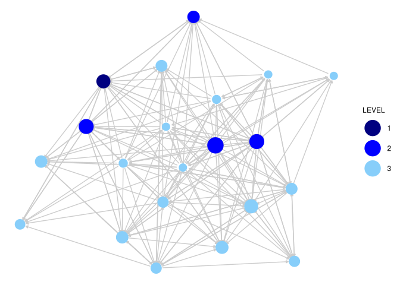
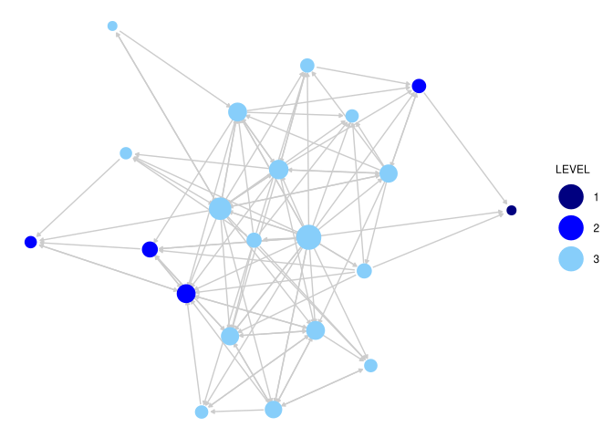

# Dyads and Triads


# Dyads and Triads

We will make use of a data set collected by David Krackhardt. The data
are based on three relations collected on workers in a single
organization. Krackhardt asked employees at a high-tech firm that was
undergoing a union certification campaign, to whom they reported, with
whom they were friends, and to whom they go to for advice. These
relationships provide insight into the firm’s embedded social structure,
which may play a strong role in shaping opinion and opinion change.

``` r
# url1 <- "https://github.com/JeffreyAlanSmith/Integrated_Network_Science/raw/master/data/krackhardt_advice.csv"

advice_data_frame <- read.csv("data/krackhardt_advice.csv")
head(advice_data_frame)
```

      ego alter advice_tie
    1   1     1          0
    2   1     2          1
    3   1     3          0
    4   1     4          1
    5   1     5          0
    6   1     6          0

Subset that full data frame to only keep those cases where a tie exists,
thus giving us the edgelist for this network.

``` r
advice_edgelist <- advice_data_frame[advice_data_frame$advice_tie == 1, ]
```

``` r
# url2 <- "https://github.com/JeffreyAlanSmith/Integrated_Network_Science/raw/master/data/krackhardt_attributes.csv"

attributes <- read.csv("data/krackhardt_attributes.csv")
attributes
```

       ids AGE TENURE LEVEL DEPT
    1    1  33  9.333     3    4
    2    2  42 19.583     2    4
    3    3  40 12.750     3    2
    4    4  33  7.500     3    4
    5    5  32  3.333     3    2
    6    6  59 28.000     3    1
    7    7  55 30.000     1    0
    8    8  34 11.333     3    1
    9    9  62  5.417     3    2
    10  10  37  9.250     3    3
    11  11  46 27.000     3    3
    12  12  34  8.917     3    1
    13  13  48  0.250     3    2
    14  14  43 10.417     2    2
    15  15  40  8.417     3    2
    16  16  27  4.667     3    4
    17  17  30 12.417     3    1
    18  18  33  9.083     2    3
    19  19  32  4.833     3    2
    20  20  38 11.667     3    2
    21  21  36 12.500     2    1

``` r
library(sna)
```

``` r
krack_advice <- network(
  x = advice_edgelist, directed = T,
  vertices = attributes
)
krack_advice
```

     Network attributes:
      vertices = 21 
      directed = TRUE 
      hyper = FALSE 
      loops = FALSE 
      multiple = FALSE 
      bipartite = FALSE 
      total edges= 190 
        missing edges= 0 
        non-missing edges= 190 

     Vertex attribute names: 
        AGE DEPT LEVEL TENURE vertex.names 

     Edge attribute names: 
        advice_tie 

``` r
# url3 <- "https://github.com/JeffreyAlanSmith/Integrated_Network_Science/raw/master/data/krackhardt_friendship.csv"

friends_data_frame <- read.csv("data/krackhardt_friendship.csv")
head(friends_data_frame)
```

      ego alter friendship_tie
    1   1     1              0
    2   1     2              1
    3   1     3              0
    4   1     4              1
    5   1     5              0
    6   1     6              0

``` r
friends_edgelist <- friends_data_frame[friends_data_frame$friendship_tie == 1, ]

krack_friendship <- network(
  x = friends_edgelist, directed = T,
  vertices = attributes
)
```

``` r
library(GGally)
```

``` r
indeg_advice <- degree(krack_advice, cmode = "indegree")
```

``` r
ggnet2(krack_advice,
  node.color = "LEVEL", node.size = indeg_advice,
  palette = c("1" = "navy", "2" = "blue", "3" = "lightskyblue"),
  edge.size = .5, edge.color = "grey80",
  arrow.size = 3, arrow.gap = 0.02
) +
  guides(size = "none")
```



``` r
indeg_friendship <- degree(krack_friendship, "indegree")

ggnet2(krack_friendship,
  node.color = "LEVEL", node.size = indeg_friendship,
  palette = c("1" = "navy", "2" = "blue", "3" = "lightskyblue"),
  edge.size = .5, edge.color = "grey80",
  arrow.size = 3, arrow.gap = 0.02
) +
  guides(size = "none")
```



# Dyadic Processes

## Dyad Census and Reciprocity

Characterizes each dyad as null, asymmetric, or mutual.

``` r
dyadcensus_friendship <- dyad.census(krack_friendship)
dyadcensus_friendship
```

         Mut Asym Null
    [1,]  23   56  131

``` r
dyadcensus_friendship[, "Mut"] / (dyadcensus_friendship[, "Mut"] +
  dyadcensus_friendship[, "Asym"])
```

        Mut 
    0.29114 

``` r
recip_friendship <- grecip(krack_friendship, measure = "dyadic.nonnull")
recip_friendship
```

        Mut 
    0.29114 

``` r
recip_advice <- grecip(dat = krack_advice, measure = "dyadic.nonnull")
recip_advice
```

        Mut 
    0.31034 

## Conditional Uniform Graph Tests

Baseline comparisons

``` r
cug_recip <- cug.test(
  dat = krack_friendship, FUN = grecip,
  mode = c("digraph"),
  cmode = c("edges"), reps = 1000,
  FUN.args = list(measure = "dyadic.nonnull")
)
cug_recip
```


    Univariate Conditional Uniform Graph Test

    Conditioning Method: edges 
    Graph Type: digraph 
    Diagonal Used: FALSE 
    Replications: 1000 

    Observed Value: 0.29114 
    Pr(X>=Obs): 0 
    Pr(X<=Obs): 1 

``` r
cug_recip$obs.stat
```

        Mut 
    0.29114 

``` r
summary(cug_recip$rep.stat)
```

       Min. 1st Qu.  Median    Mean 3rd Qu.    Max. 
     0.0303  0.1087  0.1333  0.1369  0.1591  0.2439 

The observed stat is higher than all randomily simulated networks,
invlidating the null-hypothesis.

## Dyad Census by Node Attributes

Exploring reciprocity

For example, we can ask if cross-gender ties are more/less likely to be
reciprocated.

``` r
table(attributes$LEVEL)
```


     1  2  3 
     1  4 16 

The question is how does the social structure, based on friendship or
advice, map onto the organizational structure, where some people are in
positions of authority and most are not.

Calculate dyad census seperately for each level. to see if mutual dyad
frequency is higher or lower if the people are at the same level.

``` r
same_level <- outer(attributes$LEVEL, attributes$LEVEL, "==")
```

Now, we need to construct a matrix that shows if each i-j pair is null,
asymmetric or mutual.

``` r
dyad_matrix <- function(dat) {
  mat <- as.matrix(dat)
  diag(mat) <- NA
  # Next, we do a little trick where we take the matrix and
  # add it to its transpose, yielding a matrix of 0s, 1s
  # and 2s. If it is null, the resulting value will be 0
  # (neither ij nor ji exists); if it is asymmetric there
  # will be a 1 (as ij or ji exists but not both); and
  # if it is mutual there will be a 2 (as there are ties
  # from ij and ji).
  dyad_mat <- mat + t(mat)

  dyad_mat[dyad_mat == 0] <- "null"
  dyad_mat[dyad_mat == 1] <- "asym"
  dyad_mat[dyad_mat == 2] <- "mut"

  dyad_mat
}
```

``` r
friends_dyads <- dyad_matrix(krack_friendship)
friends_dyads[1:5, 1:5]
```

      1      2      3      4      5     
    1 NA     "mut"  "null" "mut"  "null"
    2 "mut"  NA     "null" "asym" "asym"
    3 "null" "null" NA     "null" "null"
    4 "mut"  "asym" "null" NA     "null"
    5 "null" "asym" "null" "null" NA    

``` r
table(friends_dyads) / 2
```

    friends_dyads
    asym  mut null 
      56   23  131 

``` r
table(friends_dyads[same_level == TRUE]) / 2
```


    asym  mut null 
      38   19   69 

``` r
table(friends_dyads[same_level == FALSE]) / 2
```


    asym  mut null 
      18    4   62 

Cross-level connections show a much lower reciprocity level.

## Advice and Friendship Together

Are there joint rules governing advice and friendship?

``` r
advice_dyads <- dyad_matrix(krack_advice)
advice_dyads[1:5, 1:5]
```

      1      2      3      4      5     
    1 NA     "asym" "asym" "mut"  "asym"
    2 "asym" NA     "asym" "asym" "asym"
    3 "asym" "asym" NA     "asym" "null"
    4 "mut"  "asym" "asym" NA     "null"
    5 "asym" "asym" "null" "null" NA    

``` r
table(friends_dyads, advice_dyads) / 2
```

                 advice_dyads
    friends_dyads asym mut null
             asym   37  10    9
             mut     9   9    5
             null   54  26   51

# Triadic Processes

## Triad Census

There are 16 different triad types:

    003 A, B, C, empty triad
    012 A->B, C
    102 A<->B, C
    021D A<-B->C
    021U A->B<-C
    021C A->B->C
    111D A<->B<-C
    111U A<->B->C
    030T A->B<-C, A->C
    030C A<-B<-C, A->C
    201 A<->B<->C
    120D A<-B->C, A<->C
    120U A->B<-C, A<->C
    120C A->B->C, A<->C
    210 A->B<->C, A<->C
    300 A<->B<->C, A<->C, completely connected

``` r
triads_friendship <- triad.census(krack_friendship)
triads_friendship
```

         003 012 102 021D 021U 021C 111D 111U 030T 030C 201 120D 120U 120C 210 300
    [1,] 376 366 143  114   34   35   39  101   23    0  20   16   25    9  23   6

``` r
triads_advice <- triad.census(krack_advice)
triads_advice
```

         003 012 102 021D 021U 021C 111D 111U 030T 030C 201 120D 120U 120C 210 300
    [1,]  74 153  90  160   86   49   59  101  190    2  72   62   78   17 107  30

``` r
options(digits = 3)
triad_data <- data.frame(
  advice = t(triads_advice),
  friendship = t(triads_friendship)
)
triad_data$ratio <- triad_data$advice / triad_data$friendship
triad_data
```

         advice friendship ratio
    003      74        376 0.197
    012     153        366 0.418
    102      90        143 0.629
    021D    160        114 1.404
    021U     86         34 2.529
    021C     49         35 1.400
    111D     59         39 1.513
    111U    101        101 1.000
    030T    190         23 8.261
    030C      2          0   Inf
    201      72         20 3.600
    120D     62         16 3.875
    120U     78         25 3.120
    120C     17          9 1.889
    210     107         23 4.652
    300      30          6 5.000

Note that the total number of triads in each network is the same, making
comparisons easier. There are a number of things one could highlight
between the two networks, but one striking difference is in the 030T
triad, A-\>B\<-C, A-\>C. The advice network has a much higher proportion
of 030T triads than the friendship network, suggestive of an underlying
hierarchy of advice less present in the friendship network; where A
gives advice to B and C and C gives advice to B and B simply receives
advice from others. The underlying hierarchy in this advice relation
thus runs: A to C to B, as A influences B and C, C influences only B and
B influences no one. Such a pattern of hierarchy does not emerge as
clearly in the friendship network. In general, the triads associated
with transitive dominance relations (021D, 120D, 021U, 030T, 120U) are
more likely to be present in the advice network than the friendship
network. Note that we need to be a little careful in pushing that
conclusion too far, as the networks have different levels of density
(and possibly reciprocity) that may be driving the differences we
observe in the triad count. We need to take these baseline differences
into account before formally interpreting the triad counts. Here, we
will utilize a CUG test to compare the triad census to what we might
expect by chance, if people randomly formed ties. We discuss other, more
complex, options in future chapters,

We use the same cug.test() function as we used above when looking at
reciprocity. The main difference is that here we condition the random
networks in a different way. In this case we will condition on the dyad
census, to see how the counts of the triad census differ above what we
expect from a network of the same size, density and dyadic tendencies
(i.e., same rate of reciprocity). Our particular question is if
different specific triad types show up more (or less) than we expect in
a random network, conditioned on those features.

``` r
count_triads <- function(dat, triad_names) {
  triads <- triad.census(dat)
  triads[1, triad_names]
}
```

``` r
count_triads(krack_advice, triad_names = c("030T"))
```

    030T 
     190 

``` r
cug_triads_advice <- cug.test(
  krack_advice,
  FUN = count_triads,
  mode = c("digraph"),
  cmode = c("dyad.census"), reps = 1000,
  FUN.args = list(triad_names = c("030T"))
)
cug_triads_advice
```


    Univariate Conditional Uniform Graph Test

    Conditioning Method: dyad.census 
    Graph Type: digraph 
    Diagonal Used: FALSE 
    Replications: 1000 

    Observed Value: 190 
    Pr(X>=Obs): 0 
    Pr(X<=Obs): 1 

In all 1000 random networks, the observed count is above that seen in
the randomly generated network (P(X \>= Obs) is equal to 0). This means
that the tendency for A to give advice to B and C and then C to give
advice to B cannot be accounted for based simply on the density of
advice relations and expectations of reciprocity.

``` r
cug_triads_friendship <- cug.test(krack_friendship,
  FUN = count_triads,
  mode = c("digraph"),
  cmode = c("dyad.census"), reps = 1000,
  FUN.args = list(triad_names = c("030T"))
)
cug_triads_friendship
```


    Univariate Conditional Uniform Graph Test

    Conditioning Method: dyad.census 
    Graph Type: digraph 
    Diagonal Used: FALSE 
    Replications: 1000 

    Observed Value: 23 
    Pr(X>=Obs): 0.134 
    Pr(X<=Obs): 0.903 

Here the observed value is possible based on the random networks, but
not certain.

``` r
cug_triads_friendship$obs.stat
```

    030T 
      23 

``` r
summary(cug_triads_friendship$rep.stat)
```

       Min. 1st Qu.  Median    Mean 3rd Qu.    Max. 
        7.0    15.0    18.0    18.1    21.0    32.0 

Let’s consider 120U (A-\>B\<-C, A\<-\>C). In this case A and C have a
reciprocated friendship. They also both nominate B who does not nominate
them back.

``` r
cug_triads_friendship2 <- cug.test(krack_friendship,
  FUN = count_triads,
  mode = c("digraph"),
  cmode = c("dyad.census"), reps = 1000,
  FUN.args = list(triad_names = c("120U"))
)
cug_triads_friendship2
```


    Univariate Conditional Uniform Graph Test

    Conditioning Method: dyad.census 
    Graph Type: digraph 
    Diagonal Used: FALSE 
    Replications: 1000 

    Observed Value: 25 
    Pr(X>=Obs): 0 
    Pr(X<=Obs): 1 

The observed is above that expected by chance in all networks.

Overall, it would appear that the advice network is built around
dominance type relations in a way that the friendship network is not.
Individuals give advice in a way that follows patterns of status; where,
for example, A gives advice ‘down the line’ to B and C. In contrast, the
friendship network, at least in our short analysis, is consistent with
balancing relations, where if two nodes are strong friends, they will
tend to agree (in terms of liking or not liking) third party nodes, even
if that third party does not return the friendship. This was not
captured very well in the dyadic analysis, where the reciprocity rates
were pretty similar in the two networks.

``` r
source("CUGtest_alltriads.R")
```

``` r
CUG_test_table <- CUGtest_alltriads(
  dat = krack_friendship,
  mode = "digraph",
  cmode = "dyad.census", reps = 1000
)
CUG_test_table
```

       triads obs mean_random prop_random_lte_obs
    1     003 376      319.65               1.000
    2     012 366      417.47               0.000
    3     102 143      171.09               0.003
    4    021D 114       44.35               1.000
    5    021U  34       43.99               0.052
    6    021C  35       88.04               0.000
    7    111D  39       73.81               0.000
    8    111U 101       73.45               1.000
    9    030T  23       18.19               0.908
    10   030C   0        5.98               0.004
    11    201  20       29.27               0.017
    12   120D  16        7.80               0.997
    13   120U  25        7.70               1.000
    14   120C   9       15.36               0.052
    15    210  23       12.28               0.995
    16    300   6        1.57               0.999

## Transitivity

``` r
gtrans(krack_advice, measure = "weak")
```

    [1] 0.664

“weak” calculates the proportion of transitive triads divided by the
number of potentially intransitive triads, defined as triads where i -\>
j and j -\> k; the strong version divides by the total number of triads.
