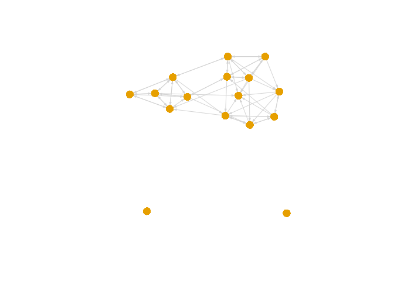
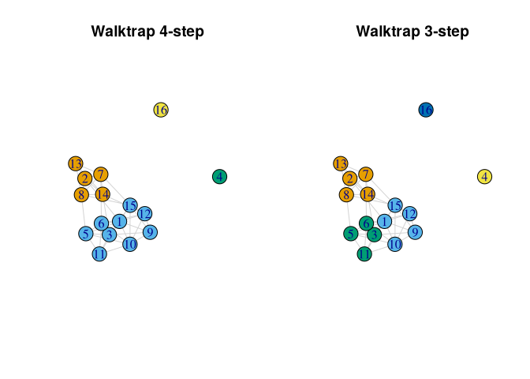
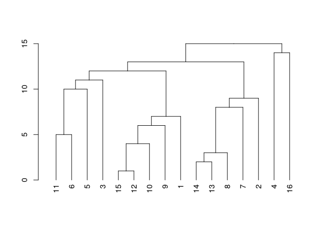
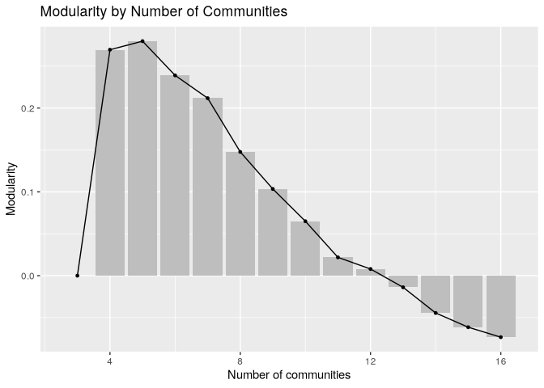
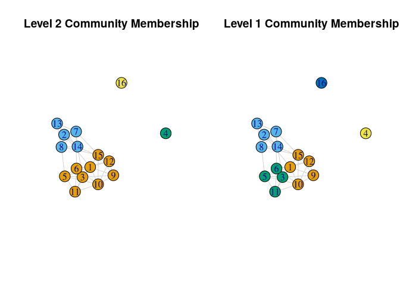
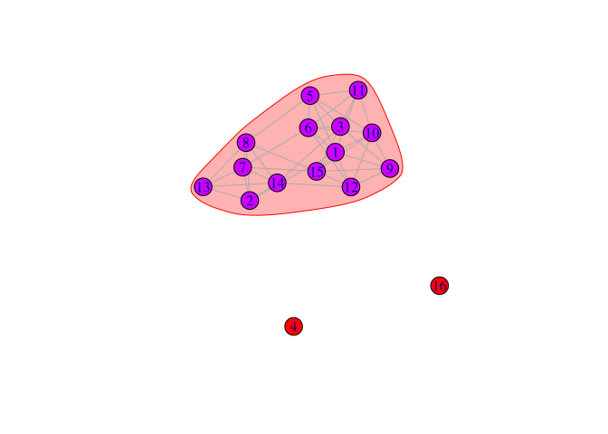
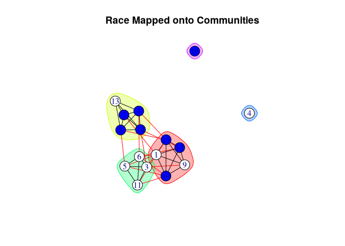
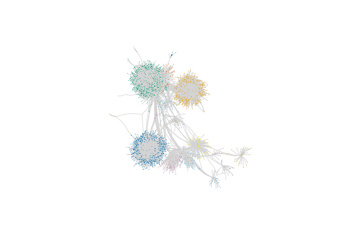
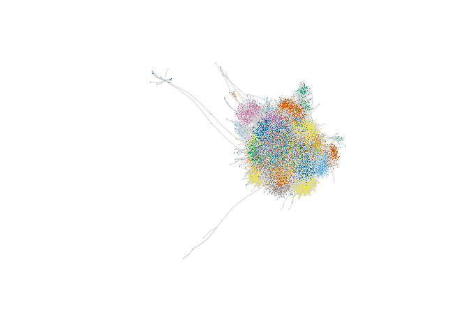

# Network Cohesion and Communities


Cohesion is how robust the network is to being fragmented. Community
structure captures sets of actors which form groups

# First Example

The first example comes from adolescent data collected by Daniel
McFarland on the different kinds of interactions occurring in one
classroom. This network is small, with only 16 actors.

Looking at the potential for consensus and solidarity:

Is the network cohesive, or strongly split into local communities
(groups) with few ties between them?

Are there distinct racial groups?

``` r
library(igraph)
library(ggplot2)
```

``` r
# url1 <- "https://github.com/JeffreyAlanSmith/Integrated_Network_Science/raw/master/data/class182_networkdata.csv"

class182_networkdata <- read.csv("data/class182_networkdata.csv")
head(class182_networkdata)
```

      ego alter friend_tie social_tie task_tie
    1   1     1          0        0.0      0.0
    2   1     2          0        0.0      0.0
    3   1     3          0        0.0      0.0
    4   1     4          0        0.0      0.0
    5   1     5          0        1.2      0.3
    6   1     6          0        0.0      0.0

`friend_tie` is 0, 1 or 2, “no friend”, “friend”, “bestie” the others
are interactions per hour.

``` r
# url2 <- "https://github.com/JeffreyAlanSmith/Integrated_Network_Science/raw/master/data/class182_attributedata.csv"

class182_attributes <- read.csv("data/class182_attributedata.csv")
class182_attributes
```

       ids  race grade gender
    1    1 white    10   male
    2    2 black    10 female
    3    3 white    10 female
    4    4 white    11 female
    5    5 white    10   male
    6    6 white    10 female
    7    7 black    10 female
    8    8 black    10 female
    9    9 white    10 female
    10  10 black    11   male
    11  11 white    10   male
    12  12 black    11 female
    13  13 white    10 female
    14  14 black    10 female
    15  15 black    10 female
    16  16 black    13   male

``` r
edge_value <- class182_networkdata$friend_tie

edgelist_friendship <- class182_networkdata[
  edge_value > 0,
  c("ego", "alter", "friend_tie")
]
head(edgelist_friendship)
```

       ego alter friend_tie
    17   2     1          1
    23   2     7          1
    24   2     8          1
    29   2    13          2
    30   2    14          1
    37   3     5          1

``` r
net182_friend <- graph_from_data_frame(
  d = edgelist_friendship, directed = T,
  vertices = class182_attributes
)
net182_friend
```

    IGRAPH 700798c DN-- 16 62 -- 
    + attr: name (v/c), race (v/c), grade (v/n), gender (v/c), friend_tie
    | (e/n)
    + edges from 700798c (vertex names):
     [1] 2 ->1  2 ->7  2 ->8  2 ->13 2 ->14 3 ->5  3 ->6  3 ->11 3 ->14 3 ->15
    [11] 5 ->1  5 ->3  5 ->6  5 ->8  5 ->10 5 ->11 6 ->1  6 ->3  6 ->5  6 ->7 
    [21] 6 ->10 6 ->11 6 ->12 7 ->2  7 ->8  7 ->13 7 ->14 8 ->2  8 ->5  8 ->7 
    [31] 8 ->13 8 ->14 8 ->15 9 ->1  9 ->3  9 ->10 9 ->12 9 ->15 10->1  10->9 
    [41] 10->12 10->15 11->1  11->3  11->5  11->6  11->10 12->1  12->9  12->15
    [51] 13->2  13->7  13->8  13->14 14->2  14->3  14->8  14->12 15->1  15->7 
    [61] 15->9  15->12

# Cohesion

``` r
plot(net182_friend,
  vertex.label = NA, vertex.size = 10,
  edge.arrow.size = 0.25, edge.arrow.width = 1,
  edge.color = "light gray", vertex.frame.color = NA
)
```



It appears fairly cohesive but split into two groups (not considering
the isolates).

``` r
edge_density(net182_friend)
```

    [1] 0.25833

Components: sets of nodes such that i can reach j, when mode is strong,
j must also reach i.

``` r
components_friendship <- components(
  graph = net182_friend,
  mode = "weak"
)
components_friendship
```

    $membership
     1  2  3  4  5  6  7  8  9 10 11 12 13 14 15 16 
     1  1  1  2  1  1  1  1  1  1  1  1  1  1  1  3 

    $csize
    [1] 14  1  1

    $no
    [1] 3

``` r
components_friendship$csize / sum(components_friendship$csize)
```

    [1] 0.8750 0.0625 0.0625

Shows that all but 2 are in the largest component.

> Bicomponents are sets of nodes with at least 2 paths between them,
> such that one can be cut and the nodes remain connected. A measure of
> robustness.

``` r
bicomponents_friendship <- biconnected_components(graph = net182_friend)
bicomponents_friendship$components
```

    [[1]]
    + 14/16 vertices, named, from 700798c:
     [1] 10 15 11 9  12 14 13 8  5  3  6  7  2  1 

All but 2 are in the single bicomponent, suggesting high cohestion.

> Connectivity of specific pairs of nodes. How many nodes would need to
> be removed for i to no longer reach j.

``` r
net182_friend_und <- as_undirected(net182_friend, mode = "collapse")
net182_friend_und
```

    IGRAPH 5126ea2 UN-- 16 42 -- 
    + attr: name (v/c), race (v/c), grade (v/n), gender (v/c)
    + edges from 5126ea2 (vertex names):
     [1] 1 --2  1 --5  3 --5  1 --6  3 --6  5 --6  2 --7  6 --7  2 --8  5 --8 
    [11] 7 --8  1 --9  3 --9  1 --10 5 --10 6 --10 9 --10 1 --11 3 --11 5 --11
    [21] 6 --11 10--11 1 --12 6 --12 9 --12 10--12 2 --13 7 --13 8 --13 2 --14
    [31] 3 --14 7 --14 8 --14 12--14 13--14 1 --15 3 --15 7 --15 8 --15 9 --15
    [41] 10--15 12--15

``` r
vertex_disjoint_paths(
  graph = net182_friend_und,
  source = 1, target = 9
)
```

    [1] 5

For the entire network:

``` r
vertex_connectivity(graph = net182_friend_und)
```

    [1] 0

The entire network is already disconnected due to the 2 isolates.

``` r
isolates <- which(degree(net182_friend_und) == 0)
net182_noisolates <- delete_vertices(net182_friend_und, isolates)
vertex_connectivity(graph = net182_noisolates)
```

    [1] 4

The network is robust to disconnection. This again shows strong
cohesion.

# Community Detection

Does the network divide into a number of small communities, or does the
network basically split in half, with one strong dividing line? Does
race map strongly onto the found communities? Inter-community contact:
How do the communities (and the ties between) contribute or detract from
the overall cohesion of the network?

## Walktrap

Creates communites based on random walks, typically of length 4 or 5.
Initially, all nodes are treated as seperate groups.

``` r
friend_comm_wt4 <- cluster_walktrap(
  graph = net182_friend_und,
  steps = 4,
  membership = T
)
friend_comm_wt4
```

    IGRAPH clustering walktrap, groups: 4, mod: 0.27
    + groups:
      $`1`
      [1] "2"  "7"  "8"  "13" "14"
      
      $`2`
      [1] "1"  "3"  "5"  "6"  "9"  "10" "11" "12" "15"
      
      $`3`
      [1] "4"
      
      $`4`
      + ... omitted several groups/vertices

``` r
mems_wt_4step <- membership(friend_comm_wt4)
mems_wt_4step
```

     1  2  3  4  5  6  7  8  9 10 11 12 13 14 15 16 
     2  1  2  3  2  2  1  1  2  2  2  2  1  1  2  4 

``` r
mod_wt_4step <- modularity(friend_comm_wt4)
mod_wt_4step
```

    [1] 0.26956

Modularity (discussed in greater detail in the main text, Chapter 8)
measures the quality of the partition, comparing the number of edges
going within communities (based on the given partition) compared to that
expected under a null model.

Same with 3 steps:

``` r
friend_comm_wt3 <- cluster_walktrap(
  graph = net182_friend_und,
  steps = 3, membership = T
)
mems_wt_3step <- membership(friend_comm_wt3)
mems_wt_3step
```

     1  2  3  4  5  6  7  8  9 10 11 12 13 14 15 16 
     2  1  3  4  3  3  1  1  2  2  3  2  1  1  2  5 

``` r
mod_wt_3step <- modularity(friend_comm_wt3)
mod_wt_3step
```

    [1] 0.27976

``` r
table(mems_wt_4step, mems_wt_3step)
```

                 mems_wt_3step
    mems_wt_4step 1 2 3 4 5
                1 5 0 0 0 0
                2 0 5 4 0 0
                3 0 0 0 1 0
                4 0 0 0 0 1

``` r
par(mfrow = c(1, 2))
layout <- layout_with_fr(net182_friend)

plot(net182_friend_und,
  layout = layout,
  vertex.color = mems_wt_4step, edge.color = "light grey",
  vertex.size = 20, main = "Walktrap 4-step"
)

plot(net182_friend_und,
  layout = layout,
  vertex.color = mems_wt_3step, edge.color = "lightgrey",
  vertex.size = 20, main = "Walktrap 3-step"
)
```



## Edge Betweenness

Edges connecting seperate communities have high edge-betweeness because
all the shortest paths from one community to another is through these
edges. The algorithm iteratively removes the edges with the highest
betweenness scores.

``` r
friend_comm_eb <- cluster_edge_betweenness(graph = net182_friend_und)
friend_comm_eb
```

    IGRAPH clustering edge betweenness, groups: 5, mod: 0.28
    + groups:
      $`1`
      [1] "1"  "9"  "10" "12" "15"
      
      $`2`
      [1] "2"  "7"  "8"  "13" "14"
      
      $`3`
      [1] "3"  "5"  "6"  "11"
      
      $`4`
      + ... omitted several groups/vertices

defaults to maximize modularity

``` r
mems_eb <- membership(friend_comm_eb)
table(mems_wt_3step, mems_eb)
```

                 mems_eb
    mems_wt_3step 1 2 3 4 5
                1 0 5 0 0 0
                2 5 0 0 0 0
                3 0 0 4 0 0
                4 0 0 0 1 0
                5 0 0 0 0 1

They are the same.

``` r
plot(as.dendrogram(friend_comm_eb))
```



## Scree Plots

A way of determining how fit changes with the increase in the number of
communities to determine whether a better strategy than maximizing
modularity exists.

``` r
extract_modularity_data <- function(communities, graph) {
  # Arguments:
  # communities: igraph communities object
  # graph: igraph object

  mems_list <- list() # list where membership information will be saved
  num_communities <- NA # vector where number of communities will be saved
  modularities <- NA # avector to store modularity scores

  # Extracting levels of aggregation, or steps,
  # in the hierarchical merge data.
  num_merges <- 0:nrow(communities$merges)

  # Note that we start from 0 as the first level
  # corresponds to all nodes in their own community,
  # and that does not have a row in the  merge data frame.

  # Looping through each level of aggregation
  for (x in 1:length(num_merges)) {
    # We first extract the membership
    # information at the given merge level using a
    # cut_at function. The inputs are the community
    # object and the merge step of interest.

    mems_list[[x]] <- cut_at(communities, steps = num_merges[x])

    # Now we calculate the number of communities associated
    # with the given clustering solution:
    num_communities[x] <- length(unique(mems_list[[x]]))

    # Let's also calculate the modularity score, just to make sure
    # we get the right value for that set of community memberships:
    modularities[x] <- modularity(graph, mems_list[[x]])
  }

  # We will now put together our extracted
  # information in a data frame.

  plot_data <- data.frame(
    modularity = modularities,
    num_communities = num_communities
  )

  # Let's reorder to go from low number of communities to high:
  mems_list <- mems_list[order(plot_data$num_communities)]
  plot_data <- plot_data[order(plot_data$num_communities), ]
  rownames(plot_data) <- 1:nrow(plot_data)

  # outputting results in a list:
  return(list(
    summary_data = plot_data,
    membership_list = mems_list
  ))
}
```

``` r
modularity_data <- extract_modularity_data(
  communities = friend_comm_eb,
  graph = net182_friend_und
)
summary_data <- modularity_data[[1]]
summary_data
```

       modularity num_communities
    1   0.0000000               3
    2   0.2695578               4
    3   0.2797619               5
    4   0.2389456               6
    5   0.2117347               7
    6   0.1476757               8
    7   0.1034580               9
    8   0.0649093              10
    9   0.0218254              11
    10  0.0079365              12
    11 -0.0138889              13
    12 -0.0445011              14
    13 -0.0615079              15
    14 -0.0734127              16

``` r
ggplot(summary_data, aes(num_communities, modularity)) +
  geom_bar(stat = "identity", fill = "grey") +
  geom_line(color = "black", linetype = "solid") +
  geom_point(shape = 19, size = 1, color = "black") +
  labs(
    title = "Modularity by Number of Communities",
    x = "Number of communities",
    y = "Modularity"
  )
```



Compare the 4 and 5 community solutions.

``` r
mems_list <- modularity_data[[2]]
mems_ids_4 <- which(summary_data$num_communities == 4)
mems_eb4 <- mems_list[[mems_ids_4]]
mems_eb4
```

     [1] 1 2 1 3 1 1 2 2 1 1 1 1 2 2 1 4

``` r
mems_wt_4step
```

     1  2  3  4  5  6  7  8  9 10 11 12 13 14 15 16 
     2  1  2  3  2  2  1  1  2  2  2  2  1  1  2  4 

## Multi-level Clustering

Each node starts as its own community, then moved to a community to
maximize modularity unless no move increases modularity. This continues
until a local maxima of modularity is reached. The process repeats using
the new groups.

Higher resolution yields a larger number of communities.

``` r
set.seed(100)
friend_comm_multi <- cluster_louvain(
  graph = net182_friend_und,
  resolution = .9
)
friend_comm_multi$memberships
```

         [,1] [,2] [,3] [,4] [,5] [,6] [,7] [,8] [,9] [,10] [,11] [,12] [,13] [,14]
    [1,]    1    2    3    4    3    3    2    2    1     1     3     1     2     2
    [2,]    1    2    1    3    1    1    2    2    1     1     1     1     2     2
         [,15] [,16]
    [1,]     1     5
    [2,]     1     4

``` r
mems_mult_level1 <- friend_comm_multi$memberships[1, ]
mems_mult_level2 <- friend_comm_multi$memberships[2, ]
table(mems_mult_level1, mems_mult_level2)
```

                    mems_mult_level2
    mems_mult_level1 1 2 3 4
                   1 5 0 0 0
                   2 0 5 0 0
                   3 4 0 0 0
                   4 0 0 1 0
                   5 0 0 0 1

``` r
friend_comm_multi$modularity
```

    [1] 0.31369 0.32594

``` r
par(mfrow = c(1, 2))

# 4 communities
plot(net182_friend_und,
  layout = layout, vertex.color = mems_mult_level2,
  edge.color = "light gray", vertex.size = 20,
  main = "Level 2 Community Membership"
)

# 5 communities
plot(net182_friend_und,
  layout = layout, vertex.color = mems_mult_level1,
  edge.color = "light gray", vertex.size = 20,
  main = "Level 1 Community Membership"
)
```



## Cohesive Blocking

Subsets the network based on k-connectivity, where k is the number of
nodes required so that all members can no longer reach each other.

``` r
friend_comm_cohesive <- cohesive_blocks(graph = net182_friend_und)
friend_comm_cohesive
```

    Cohesive block structure:
    B-1      c 0, n 16
    '- B-2   c 4, n 14   ooo.oooooo ooooo. 

``` r
plot(friend_comm_cohesive, net182_friend_und)
```



# Demographic Characteristics

How salient is race in classroom structure?

``` r
library(car)

cols <- recode(class182_attributes$race,
  as.factor = F, "'black' = 'blue'; NA = NA; else = 'white'"
)
```

``` r
table(class182_attributes$race, cols)
```

           cols
            blue white
      black    8     0
      white    0     8

``` r
plot(friend_comm_eb, net182_friend_und,
  col = cols, layout = layout,
  main = "Race Mapped onto Communities"
)
```



``` r
proportion <- function(communities, attribute) {
  dat <- tapply(
    factor(attribute), communities,
    function(x) {
      y <- table(x)
      y / sum(y)
    }
  )
  do.call(rbind, dat)
}
```

``` r
proportion(
  communities = mems_eb,
  attribute = class182_attributes$race
)
```

      black white
    1   0.6   0.4
    2   0.8   0.2
    3   0.0   1.0
    4   0.0   1.0
    5   1.0   0.0

``` r
table(class182_attributes$race)
```


    black white 
        8     8 

# Community Overlap

``` r
class182_dyads <- class182_networkdata[, c("ego", "alter")]
head(class182_dyads)
```

      ego alter
    1   1     1
    2   1     2
    3   1     3
    4   1     4
    5   1     5
    6   1     6

``` r
mat182_friend <- as_adjacency_matrix(net182_friend_und, sparse = F)
diag(mat182_friend) <- NA
friend <- c(t(mat182_friend))
head(friend)
```

    [1] NA  1  0  0  1  1

``` r
ego_community <- mems_mult_level2[class182_dyads$ego]
alter_community <- mems_mult_level2[class182_dyads$alter]

same_comm <- ego_community == alter_community
```

``` r
table(same_comm, friend) / 2
```

             friend
    same_comm  0  1
        FALSE 67  7
        TRUE  11 35

67 dyads are not friends and not in the same community. 7 are friends,
though from different communities

Odds of two people in the same communty choosing each other as friends.

``` r
(35 * 67) / (7 * 11)
```

    [1] 30.455

# Big Data: Second Example

The second example will take up the problem of analyzing a much larger
network, here an email network of over 200,000 nodes. This second
example is included as a means of demonstrating some of the added
complications of dealing with ‘big’ data, as well as to offer some
suggestion on best practices when analyzing such networks.

We now turn to a second, completely different example using the email
patterns of individuals working at a large European research institute.
The goal is to work through a community analysis on a much larger
network than the classroom data used above. The email network has
265,214 nodes and over 400,000 edges. The data are freely available at:
https://snap.stanford.edu/data/email-EuAll.html

``` r
# url3 <- "https://github.com/JeffreyAlanSmith/Integrated_Network_Science/raw/master/data/email-EuAll.txt"

email_edges <- read.table("data/email-EuAll.txt")
dim(email_edges)
```

    [1] 420045      2

``` r
head(email_edges)
```

      V1 V2
    1  0  1
    2  0  4
    3  0  5
    4  0  8
    5  0 11
    6  0 20

``` r
colnames(email_edges) <- c("ego", "alter")
email_edges <- email_edges + 1
email_edges <- email_edges[email_edges[, 1] != email_edges[, 2], ]
email_network <- graph_from_data_frame(
  d = email_edges, directed = T, vertices = (id <- as.numeric(1:265214))
)
email_network <- as_undirected(email_network, mode = "collapse")
```

## Multi-level clustering

``` r
set.seed(101)
email_comm_multi <- cluster_louvain(
  graph = email_network,
  resolution = 1
)
email_mems <- email_comm_multi$memberships
nrow(email_mems)
```

    [1] 4

``` r
comm_length <- function(x) {
  length(unique(x))
}

num_coms <- apply(email_mems, 1, comm_length)
num_coms
```

    [1] 18354 16019 15915 15913

``` r
email_comm_multi$modularity
```

    [1] 0.69051 0.78538 0.79147 0.79150

``` r
mems_email <- email_comm_multi$memberships[4, ]
summary(as.numeric(table(mems_email)))
```

       Min. 1st Qu.  Median    Mean 3rd Qu.    Max. 
        1.0     2.0     2.0    16.7     2.0 16201.0 

Most of the groups are small, but some large, even very large,
communities exist.

## Community structure within the Initial Communities

For each desired community that we want to divide further, we need to
form a network of just those members and then perform community
detection on that subgraph.

``` r
create_subcommunity <- function(graph, initial_communities, community_number) {
  in_community <- which(initial_communities == community_number)
  subgraph1 <- induced_subgraph(
    graph = graph,
    vids = in_community
  )

  # perform community detection algorithm
  comm1 <- cluster_fast_greedy(graph = subgraph1)
  mems_subgraph1 <- membership(comm1)

  ids_map <- as.numeric(vertex_attr(subgraph1, "name"))

  mems_new <- initial_communities

  mems_subgraph1_relabel <- mems_subgraph1 + max(initial_communities)

  mems_new[ids_map] <- mems_subgraph1_relabel

  num_comms_new <- length(unique(mems_new))
  mems_updated <- as.numeric(as.character(factor(mems_new,
    labels = 1:num_comms_new
  )))

  list(
    subgraph = subgraph1,
    mems_subgraphs = mems_subgraph1,
    membership_updated = mems_updated
  )
}
```

``` r
subcommunity_dat <- create_subcommunity(
  graph = email_network,
  initial_communities = mems_email,
  community_number = 33
)

subnet <- subcommunity_dat$subgraph
mems_subnet <- subcommunity_dat$mems_subgraph
mems_updated <- subcommunity_dat$membership_updated

layout_email <- layout.fruchterman.reingold(subnet)
```

    Warning: `layout.fruchterman.reingold()` was deprecated in igraph 2.1.0.
    ℹ Please use `layout_with_fr()` instead.

``` r
plot(subnet,
  vertex.label = NA, vertex.size = .6,
  layout = layout_email, edge.color = "light gray",
  edge.curved = .2, vertex.frame.color = NA,
  vertex.color = mems_subnet
)
```



This community consists of sub-communities.

``` r
table(mems_updated[mems_email == 33])
```


    15913 15914 15915 15916 15917 15918 15919 15920 15921 15922 15923 15924 15925 
      682   172   846   166   952   103   165    78    72    47    17    16    14 
    15926 15927 15928 
        6     3     5 

All of the original members have been split between 16 communities

``` r
modularity(email_network, mems_updated)
```

    [1] 0.79105

``` r
subcommunity_dat <- create_subcommunity(
  graph = email_network,
  initial_communities = mems_updated,
  community_number = 2
)
subnet <- subcommunity_dat$subgraph
mems_subnet <- subcommunity_dat$mems_subgraph
mems_updated <- subcommunity_dat$membership_updated

layout_email <- layout.fruchterman.reingold(subnet)

plot(subnet,
  vertex.label = NA, vertex.size = .6,
  layout = layout_email, edge.color = "light gray",
  edge.curved = .2, vertex.frame.color = NA,
  vertex.color = mems_subnet
)
```


