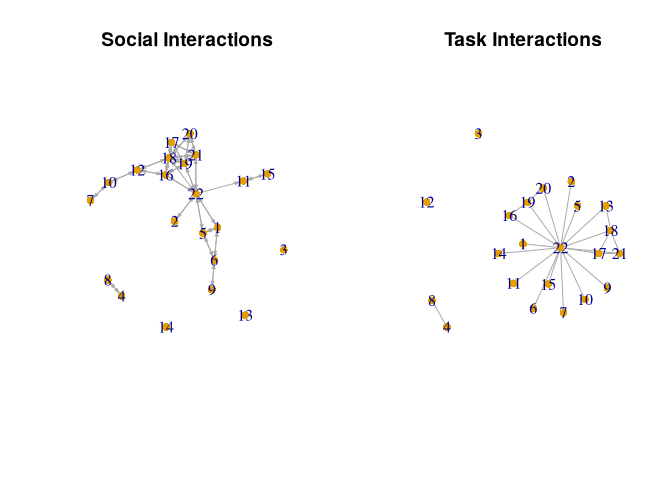
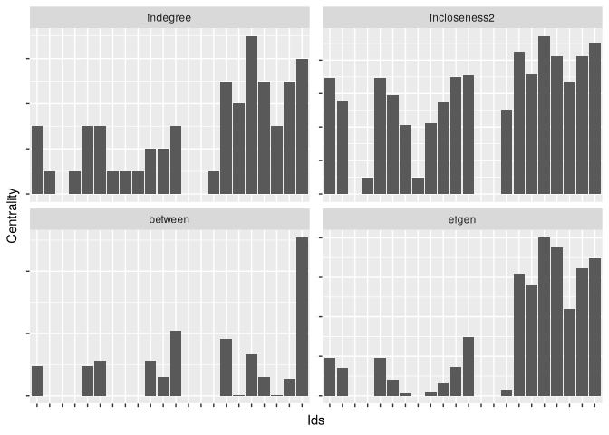
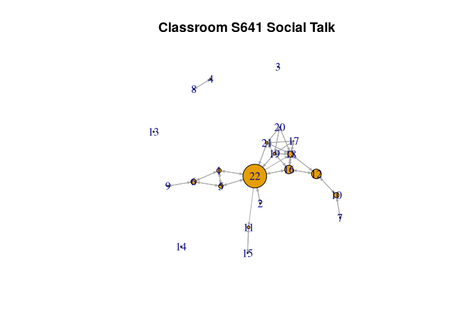
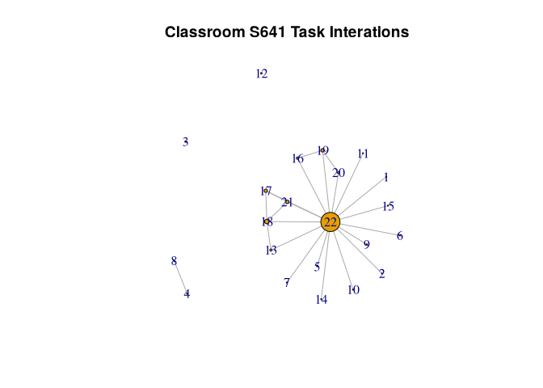
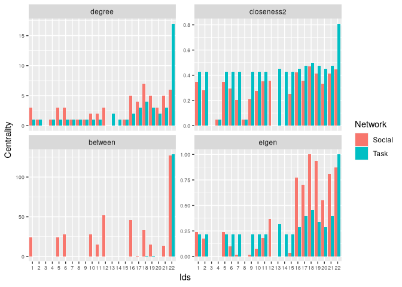
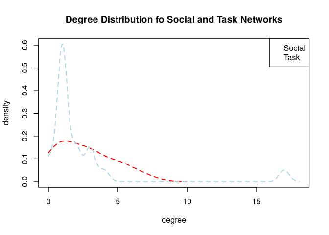

# Network Centrality and Hierarchy


# Setup

``` r
library(igraph)
```

``` r
# url1 <- "https://github.com/JeffreyAlanSmith/Integrated_Network_Science/raw/master/data/social_interactions_s641.csv"

social_data <- read.csv("data/social_interactions_s641.csv")
head(social_data)
```

      ego alter social_tie
    1   1     1      0.000
    2   1     2      0.000
    3   1     3      0.000
    4   1     4      0.000
    5   1     5      5.625
    6   1     6      1.500

Only consider dyads which have interacted

``` r
edgelist_social <- social_data[social_data$social_tie > 0, ]
head(edgelist_social)
```

       ego alter social_tie
    5    1     5      5.625
    6    1     6      1.500
    22   1    22      1.875
    44   2    22      0.375
    74   4     8      1.875
    89   5     1      5.250

``` r
s641_social <- graph_from_data_frame(
  d = edgelist_social, directed = T,
  vertices = (id <- 1:max(edgelist_social$ego))
)
```

``` r
net641_social_noisolates <- graph_from_data_frame(
  d = edgelist_social,
  directed = T
)
```

``` r
url2 <- "https://github.com/JeffreyAlanSmith/Integrated_Network_Science/raw/master/data/task_interactions_s641.csv"

task_data <- read.csv(file = url2)
head(task_data)
```

      ego alter task_tie
    1   1     1        0
    2   1     2        0
    3   1     3        0
    4   1     4        0
    5   1     5        0
    6   1     6        0

``` r
edgelist_task <- task_data[task_data$task_tie > 0, ]
# reduce edgelist so each is only mentioned once
edgelist_task <- edgelist_task[edgelist_task$ego < edgelist_task$alter, ]
s641_task <- graph_from_data_frame(
  d = edgelist_task, directed = F,
  vertices = (id <- 1:22)
)
```

``` r
par(mfrow = c(1, 2))

plot(s641_social,
  vertex.frame.color = NA, vertex.size = 8,
  edge.arrow.size = 0.25, main = "Social Interactions"
)

plot(s641_task,
  vertex.frame.color = NA, vertex.size = 8,
  edge.arrow.size = 0.25, main = "Task Interactions"
)
```



Our main substantive goal is to determine which nodes are most important
in the classroom and how (or if) this varies across network relation and
measure of centrality. Are individuals who are prominent in the task
network also prominent in the social interaction network? Which nodes
act as bridges? Are they the same nodes with the highest degree? We also
want to uncover something about the overall level of inequality and
hierarchy that exists in this classroom. Is this a world where one node
dominates?

# Centrality

## Centrality measures for Social Interactions

``` r
indegree_social <- degree(graph = s641_social, mode = "in")
head(indegree_social)
```

    1 2 3 4 5 6 
    3 1 0 1 3 3 

``` r
outdegree_social <- degree(graph = s641_social, mode = "out")
head(outdegree_social)
```

    1 2 3 4 5 6 
    3 1 0 1 3 3 

Closeness is the inverse of the mean geodesic distance between a given
node and all other nodes. In-closeness and out-closeness are the average
number of steps to all other reachable nodes.

``` r
outcloseness_social <- closeness(
  graph = s641_social,
  mode = "out",
  normalized = T
)
head(outcloseness_social)
```

          1       2       3       4       5       6 
    0.42105 0.37209     NaN 1.00000 0.42105 0.32000 

``` r
incloseness_social <- closeness(
  graph = s641_social, mode = "in",
  normalized = T
)
head(incloseness_social)
```

          1       2       3       4       5       6 
    0.41176 0.35897     NaN 1.00000 0.41176 0.31818 

Alternatively, take the main based on the inverse distance matrix.
Avoids needing to exclude unreachable nodes, so better for disconnected
graphs.

``` r
dist_mat_social <- distances(graph = s641_social, mode = "out")
diag(dist_mat_social) <- NA
dist_mat_social_inverted <- 1 / dist_mat_social
```

``` r
outcloseness_social2 <- apply(dist_mat_social_inverted,
  MARGIN = 1,
  FUN = mean, na.rm = T
)
head(outcloseness_social2)
```

           1        2        3        4        5        6 
    0.394444 0.326984 0.000000 0.047619 0.394444 0.326984 

``` r
cor(outcloseness_social, outcloseness_social2, use = "complete.obs")
```

    [1] -0.68507

This is the case as the original calculation (outcloseness_social)
calculates closeness only including the reachable nodes for each actor.
This means that nodes like 4, 8, 11 and 15 get surprisingly high
closeness values (1), as they reach only one other node at distance 1.
This might not be what we want as these nodes are, in fact, not very
central in the network (see figure above) but are assigned a high
centrality value. The alternative version of out-closeness handles this
better and assigns a low value for these nodes. If we remove those ‘odd’
cases, the two versions are very highly correlated:

``` r
cor(outcloseness_social[-c(4, 8, 11, 15)],
  outcloseness_social2[-c(4, 8, 11, 15)],
  use = "complete.obs"
)
```

    [1] 0.98066

``` r
incloseness_social2 <- apply(dist_mat_social_inverted,
  MARGIN = 2,
  FUN = mean, na.rm = T
)
head(incloseness_social2)
```

           1        2        3        4        5        6 
    0.346825 0.279365 0.000000 0.047619 0.346825 0.295238 

> betweenness

the number of possible paths a node could be between.

``` r
betweenness_social <- betweenness(graph = s641_social, normalized = F)
head(betweenness_social)
```

     1  2  3  4  5  6 
    24  0  0  0 24 28 

## Eigenvector centrality

Gives greater weight to nodes connected to other highly-connected nodes.
A measure of a node’s importance.

``` r
s641_social_undirected <- as_undirected(s641_social, mode = "collapse")
```

``` r
ev_obj_social <- eigen_centrality(s641_social_undirected)
eigen_social <- ev_obj_social$vector
head(eigen_social)
```

             1          2          3          4          5          6 
    2.4183e-01 1.7354e-01 1.7423e-17 3.1680e-17 2.4183e-01 1.0048e-01 

``` r
ids <- V(s641_social)$name
```

``` r
central_social <- data.frame(
  ids = ids, net = "social",
  indegree = indegree_social,
  outdegree = outdegree_social,
  incloseness2 = incloseness_social2,
  outcloseness2 = outcloseness_social2,
  between = betweenness_social,
  eigen = eigen_social
)
head(central_social)
```

      ids    net indegree outdegree incloseness2 outcloseness2 between      eigen
    1   1 social        3         3     0.346825      0.394444      24 2.4183e-01
    2   2 social        1         1     0.279365      0.326984       0 1.7354e-01
    3   3 social        0         0     0.000000      0.000000       0 1.7423e-17
    4   4 social        1         1     0.047619      0.047619       0 3.1680e-17
    5   5 social        3         3     0.346825      0.394444      24 2.4183e-01
    6   6 social        3         3     0.295238      0.326984      28 1.0048e-01

> find the most central nodes based on the various measures

sort all columns at once

``` r
apply(central_social[, -(1:2)],
  MARGIN = 2,
  FUN = order, decreasing = T
)
```

          indegree outdegree incloseness2 outcloseness2 between eigen
     [1,]       18        22           18            22      22    18
     [2,]       22        18           22            19      12    19
     [3,]       16        19           16            16      16    22
     [4,]       19        16           19            18      18    21
     [5,]       21        17           21            21       6    16
     [6,]       17        21           17             1      10    17
     [7,]        1         1           12             5       1    20
     [8,]        5         5           11            17       5    12
     [9,]        6         6            1            12      11     1
    [10,]       12        12            5            20      19     5
    [11,]       20        20           20             2      21    11
    [12,]       10        10            6             6      17     2
    [13,]       11         2            2            10      20     6
    [14,]        2         4           10             9       2    10
    [15,]        4         7           15             7       3    15
    [16,]        7         8            9             4       4     9
    [17,]        8         9            7             8       7     7
    [18,]        9        11            4            11       8     4
    [19,]       15        15            8            15       9     3
    [20,]        3         3            3             3      13    13
    [21,]       13        13           13            13      14    14
    [22,]       14        14           14            14      15     8

``` r
library(reshape)
```

``` r
vars_to_stack <- c("ids", "indegree", "incloseness2", "between", "eigen")

social_long <- melt(central_social[, vars_to_stack], id.vars = "ids")
str(social_long)
```

    'data.frame':   88 obs. of  3 variables:
     $ ids     : chr  "1" "2" "3" "4" ...
     $ variable: Factor w/ 4 levels "indegree","incloseness2",..: 1 1 1 1 1 1 1 1 1 1 ...
     $ value   : num  3 1 0 1 3 3 1 1 1 2 ...

``` r
library(ggplot2)

ggplot(social_long, aes(x = factor(ids, levels = 1:length(ids)), y = value)) +
  geom_bar(stat = "identity", position = "dodge") +
  facet_wrap(~variable, scales = "free_y", ncol = 2) +
  labs(
    x = "Ids", y = "Centrality"
  ) +
  theme(axis.text = element_text(size = 0.5))
```



Note that, while a number of nodes have prominence, only node 22 plays a
bridging role.

``` r
plot(s641_social,
  layout = layout.fruchterman.reingold,
  vertex.label = V(s641_social)$name, vertex.size = central_social$between / 5,
  edge.arrow.size = 0.25, margin = -0.08,
  main = "Classroom S641 Social Talk"
)
```



## Correlations between Centrality Measures

Computing correlations between centrality scores. Which measures yield
the same nodes as central, and which disagree.

``` r
cor_tab1 <- cor(central_social[, -c(1, 2)])
round(cor_tab1, 3)
```

                  indegree outdegree incloseness2 outcloseness2 between eigen
    indegree         1.000     0.960        0.874         0.860   0.629 0.940
    outdegree        0.960     1.000        0.822         0.874   0.738 0.914
    incloseness2     0.874     0.822        1.000         0.879   0.548 0.794
    outcloseness2    0.860     0.874        0.879         1.000   0.595 0.800
    between          0.629     0.738        0.548         0.595   1.000 0.507
    eigen            0.940     0.914        0.794         0.800   0.507 1.000

Indegree and outdegree are highly correlated. People tend to answer each
other in social interations. Both are also highly correlated with
eigenvector centrality indicating that the students that talk the most
to others (or, relatedly, are talked to the most by others) are also the
ones that are connected to other highly connected students – possibly
indicating high density cliques around these individuals.

## Centrality for Task Interactions

``` r
degree_task <- degree(s641_task)

dist_mat_task <- distances(graph = s641_task)
diag(dist_mat_task) <- NA
dist_mat_task_inverted <- 1 / dist_mat_task

closenness_task2 <- apply(dist_mat_task_inverted,
  MARGIN = 1,
  FUN = mean, na.rm = T
)

betweenness_task <- betweenness(s641_task, normalized = F)

ev_obj_task <- eigen_centrality(s641_task)

eigen_task <- ev_obj_task$vector
```

``` r
central_task <- data.frame(
  ids = ids, net = "task",
  degree = degree_task,
  closeness2 = closenness_task2,
  between = betweenness_task,
  eigen = eigen_task
)
head(central_task)
```

      ids  net degree closeness2 between   eigen
    1   1 task      1   0.428571       0 0.21549
    2   2 task      1   0.428571       0 0.21549
    3   3 task      0   0.000000       0 0.00000
    4   4 task      1   0.047619       0 0.00000
    5   5 task      1   0.428571       0 0.21549
    6   6 task      1   0.428571       0 0.21549

Look at nodes with top centrality scores.

``` r
apply(central_task[, -c(1, 2)],
  MARGIN = 2,
  FUN = order, decreasing = T
)
```

          degree closeness2 between eigen
     [1,]     22         22      22    22
     [2,]     18         18      18    18
     [3,]     17         17      19    17
     [4,]     19         19       1    21
     [5,]     21         21       2    19
     [6,]     13         13       3    13
     [7,]     16         16       4    16
     [8,]     20         20       5    20
     [9,]      1          1       6     6
    [10,]      2          2       7    15
    [11,]      4          5       8     2
    [12,]      5          6       9     5
    [13,]      6          7      10     7
    [14,]      7          9      11    11
    [15,]      8         10      12    14
    [16,]      9         11      13     1
    [17,]     10         14      14    10
    [18,]     11         15      15     9
    [19,]     14          4      16     3
    [20,]     15          8      17     4
    [21,]      3          3      20     8
    [22,]     12         12      21    12

``` r
plot(s641_task,
  vertex.size = central_task$degree, vertex.label = V(s641_social)$name,
  edge.arrow.size = 0.25, layout = layout.fruchterman.reingold,
  main = "Classroom S641 Task Interations", margin = -0.08
)
```



## Task/Social Correlations

``` r
vars_to_stack_task <- c("ids", "degree", "closeness2", "between", "eigen")
task_long <- melt(central_task[, vars_to_stack_task], id.vars = "ids")
head(task_long)
```

      ids variable value
    1   1   degree     1
    2   2   degree     1
    3   3   degree     0
    4   4   degree     1
    5   5   degree     1
    6   6   degree     1

``` r
task_long$net <- "task"
social_long$net <- "social"
social_task_long <- rbind(social_long, task_long)
```

``` r
library(car)
```

``` r
social_task_long$variable <- recode(social_task_long$variable,
  as.factor = T,
  "'incloseness2' = 'closeness2';
                                    'indegree' = 'degree'",
  levels = c(
    "degree", "closeness2",
    "between", "eigen"
  )
)
```

``` r
ggplot(
  social_task_long,
  aes(
    x = factor(ids, levels = 1:length(ids)),
    y = value, fill = net
  )
) +
  geom_bar(stat = "identity", position = "dodge") +
  facet_wrap(~variable, scales = "free_y", ncol = 2) +
  scale_fill_discrete(
    name = "Network",
    breaks = c("social", "task"),
    labels = c("Social", "Task")
  ) +
  xlab("Ids") +
  ylab("Centrality") +
  theme(axis.text = element_text(size = 6.5))
```



``` r
cor_tab2 <- cor(central_social[, -c(1, 2)], central_task[, -c(1, 2)])
rownames(cor_tab2) <- paste(rownames(cor_tab2), "social", sep = "_")
colnames(cor_tab2) <- paste(colnames(cor_tab2), "task", sep = "_")
round(cor_tab2[, c("eigen_task", "degree_task", "closeness2_task")], 3)
```

                         eigen_task degree_task closeness2_task
    indegree_social           0.650       0.558           0.494
    outdegree_social          0.734       0.700           0.536
    incloseness2_social       0.553       0.394           0.554
    outcloseness2_social      0.570       0.460           0.507
    between_social            0.681       0.803           0.412
    eigen_social              0.657       0.549           0.481

# Centralization

Summarize the distribution of centrality measures.

``` r
summary(indegree_social)
```

       Min. 1st Qu.  Median    Mean 3rd Qu.    Max. 
       0.00    1.00    2.50    2.59    3.75    7.00 

``` r
summary(degree_task)
```

       Min. 1st Qu.  Median    Mean 3rd Qu.    Max. 
       0.00    1.00    1.00    2.18    2.00   17.00 

``` r
sd(indegree_social)
```

    [1] 2.0391

``` r
sd(degree_task)
```

    [1] 3.4591

The distribution shows that social interactions are more widely spread
while tasks is focused on one node.

The standard deviation is a measure of centralization. To calculate
centralization, we take the centrality scores of interest and sum up the
total deviations from the highest value. We then typically divide the
total summation by the maximum possible level of centralization in a
network of that size (i.e., the centralization we would have observed in
a hub and spoke structure).

Each score has its own function.

``` r
cent_social <- centr_degree(
  graph = s641_social, mode = "in",
  loops = FALSE, normalized = TRUE
)
cent_social
```

    $res
     [1] 3 1 0 1 3 3 1 1 1 2 2 3 0 0 1 5 4 7 5 3 5 6

    $centralization
    [1] 0.21995

    $theoretical_max
    [1] 441

``` r
sum(rep(length(cent_social$res) - 1, length(cent_social$res) - 1))
```

    [1] 441

Or

``` r
sum(max(indegree_social) - indegree_social) / sum(21 - rep(0, 21))
```

    [1] 0.21995

``` r
cent_task <- centr_degree(
  graph = s641_task,
  loops = FALSE, normalized = TRUE
)
cent_task
```

    $res
     [1]  1  1  0  1  1  1  1  1  1  1  1  0  2  1  1  2  3  4  3  2  3 17

    $centralization
    [1] 0.77619

    $theoretical_max
    [1] 420

The theoretical max is different because the task network was treated as
undirected.

``` r
den_social <- density(indegree_social, from = 0)
den_task <- density(degree_task, from = 0)
```

``` r
plot(range(den_social$x, den_task$x), range(den_social$y, den_task$y),
  type = "n", xlab = "degree", ylab = "density",
  main = "Degree Distribution fo Social and Task Networks"
)

lines(den_social, col = "red", lty = 2, lwd = 2)
lines(den_task, col = "lightblue", lty = 2, lwd = 2)

legend("topright", c("Social", "Task"),
  col = c("red", "lightblue", lty = 2, lwd = 2)
)
```



More generally, our centrality and centralization analyses paint a
picture of two different kinds of interactional tendencies. For the
social interaction network, we have a set of divided groups bridged by
one focal node with high betweenness. Within each group there are
prominent nodes with high degree, closeness, etc. but only one node
holds the whole network together. For the task network, there is only
one focal node, with everyone doing task interactions with them and few
interactions happening otherwise.

# Clustering and Hierarchy

Are groups heirarchically organized? The tau statistic is a z-score
which captures how micro processes aggregate to create macro structures.

``` r
library(intergraph)
```

``` r
s641_social_network <- asNetwork(s641_social)
source("tau_functions.R")
```

Triad types: 003 A, B, C, empty triad. 012 A-\>B, C 102 A\<-\>B, C 021D
A\<-B-\>C 021U A-\>B\<-C 021C A-\>B-\>C 111D A\<-\>B\<-C 111U
A\<-\>B-\>C 030T A-\>B\<-C, A-\>C 030C A\<-B\<-C, A-\>C. 201
A\<-\>B\<-\>C. 120D A\<-B-\>C, A\<-\>C. 120U A-\>B\<-C, A\<-\>C. 120C
A-\>B-\>C, A\<-\>C. 210 A-\>B\<-\>C, A\<-\>C. 300 A\<-\>B\<-\>C,
A\<-\>C, completely connected.

``` r
library(ergm)
library(sna)
```

Test 3 hypotheses, each represented by a vector of which triads should
be summed and compared to baseline.

ranked clustering - higher rates of 003, 102, 021D, 021U, 030T, 120D,
120U, 300 - mutual ties within groups - asymetric accross groups, lower
status send to higher status, not vice versa

``` r
weights_rankedcluster <- c(1, 0, 1, 1, 1, 0, 0, 0, 1, 0, 0, 1, 1, 0, 0, 1)
```

clustering - higher rates of 003, 102 and 300 - does not include triads
that create hierarchies (021U, 120U, etc)

``` r
weights_cluster <- c(1, 0, 1, 0, 0, 0, 0, 0, 0, 0, 0, 0, 0, 0, 0, 1)
```

balanced - only includes 102 and 300 - implies that only 2 groups should
emerge

``` r
weights_balance <- c(0, 0, 1, 0, 0, 0, 0, 0, 0, 0, 0, 0, 0, 0, 0, 1)
```

``` r
tau_ranked_cluster <- tau_stat_function(
  network = s641_social_network,
  weight.vector = weights_rankedcluster
)
tau_ranked_cluster
```

    $tau
           [,1]
    [1,] 2.9684

    [[2]]
                     observed.triads expected.triads weight.vector
    triadcensus.003             1029      1.0126e+03             1
    triadcensus.012               37      4.5795e+01             0
    triadcensus.102              403      4.1215e+02             1
    triadcensus.021D               1      1.1449e-01             1
    triadcensus.021U               0      1.1449e-01             1
    triadcensus.021C               0      2.2897e-01             0
    triadcensus.111D               4      6.1823e+00             0
    triadcensus.111U              10      6.1823e+00             0
    triadcensus.030T               0      5.6958e-04             1
    triadcensus.030C               0      1.8986e-04             0
    triadcensus.201               38      5.3580e+01             0
    triadcensus.120D               0      1.5379e-02             1
    triadcensus.120U               0      1.5379e-02             1
    triadcensus.120C               0      3.0758e-02             0
    triadcensus.210                7      7.9970e-01             0
    triadcensus.300               11      2.2214e+00             1

``` r
tau_cluster <- tau_stat_function(
  network = s641_social_network,
  weight.vector = weights_cluster
)
tau_cluster
```

    $tau
           [,1]
    [1,] 2.8672

    [[2]]
                     observed.triads expected.triads weight.vector
    triadcensus.003             1029      1.0126e+03             1
    triadcensus.012               37      4.5795e+01             0
    triadcensus.102              403      4.1215e+02             1
    triadcensus.021D               1      1.1449e-01             0
    triadcensus.021U               0      1.1449e-01             0
    triadcensus.021C               0      2.2897e-01             0
    triadcensus.111D               4      6.1823e+00             0
    triadcensus.111U              10      6.1823e+00             0
    triadcensus.030T               0      5.6958e-04             0
    triadcensus.030C               0      1.8986e-04             0
    triadcensus.201               38      5.3580e+01             0
    triadcensus.120D               0      1.5379e-02             0
    triadcensus.120U               0      1.5379e-02             0
    triadcensus.120C               0      3.0758e-02             0
    triadcensus.210                7      7.9970e-01             0
    triadcensus.300               11      2.2214e+00             1

``` r
tau_balance <- tau_stat_function(
  network = s641_social_network,
  weight.vector = weights_balance
)
tau_balance
```

    $tau
              [,1]
    [1,] -0.033776

    [[2]]
                     observed.triads expected.triads weight.vector
    triadcensus.003             1029      1.0126e+03             0
    triadcensus.012               37      4.5795e+01             0
    triadcensus.102              403      4.1215e+02             1
    triadcensus.021D               1      1.1449e-01             0
    triadcensus.021U               0      1.1449e-01             0
    triadcensus.021C               0      2.2897e-01             0
    triadcensus.111D               4      6.1823e+00             0
    triadcensus.111U              10      6.1823e+00             0
    triadcensus.030T               0      5.6958e-04             0
    triadcensus.030C               0      1.8986e-04             0
    triadcensus.201               38      5.3580e+01             0
    triadcensus.120D               0      1.5379e-02             0
    triadcensus.120U               0      1.5379e-02             0
    triadcensus.120C               0      3.0758e-02             0
    triadcensus.210                7      7.9970e-01             0
    triadcensus.300               11      2.2214e+00             1

Tau statistics over 2 support the hypothesis in question.

Consider the triads in the ranked cluster but not the cluster.

``` r
triad_names <- c(
  "triadcensus.021D", "triadcensus.021U", "triadcensus.030T",
  "triadcensus.120D", "triadcensus.120U"
)

tau_ranked_cluster[[2]][rownames(tau_ranked_cluster[[2]]) %in% triad_names, ]
```

                     observed.triads expected.triads weight.vector
    triadcensus.021D               1      0.11448642             1
    triadcensus.021U               0      0.11448642             1
    triadcensus.030T               0      0.00056958             1
    triadcensus.120D               0      0.01537877             1
    triadcensus.120U               0      0.01537877             1

As the observed values are similar to expected, and most 0, they do not
add to the model.

This suggests that the overall network is grouped but non-heirarchical.
