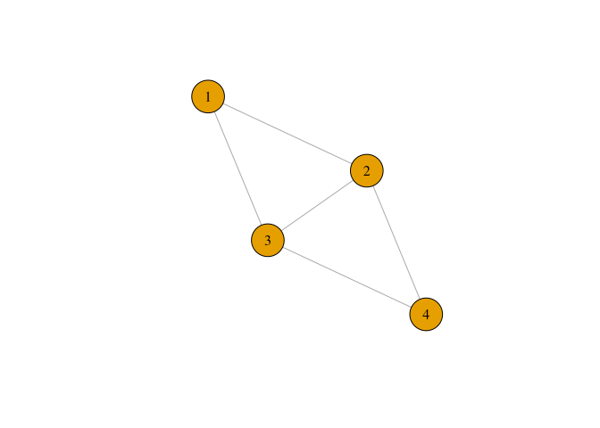
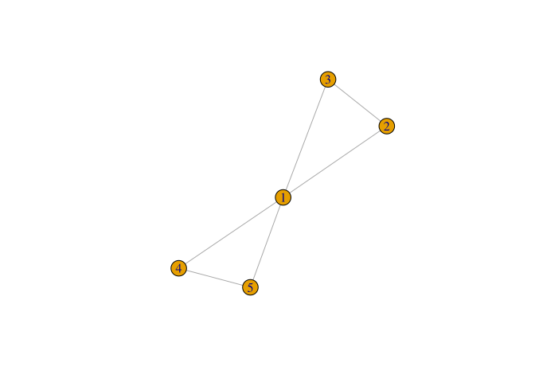
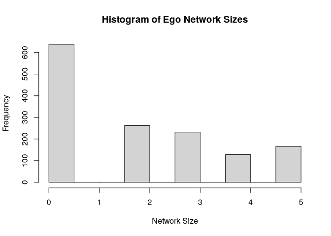
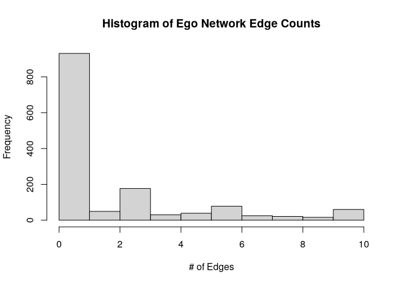
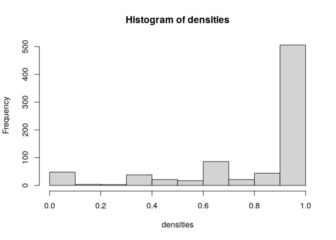
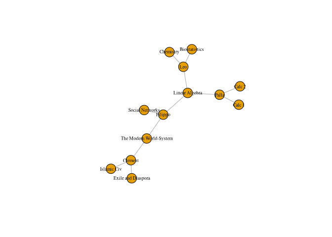
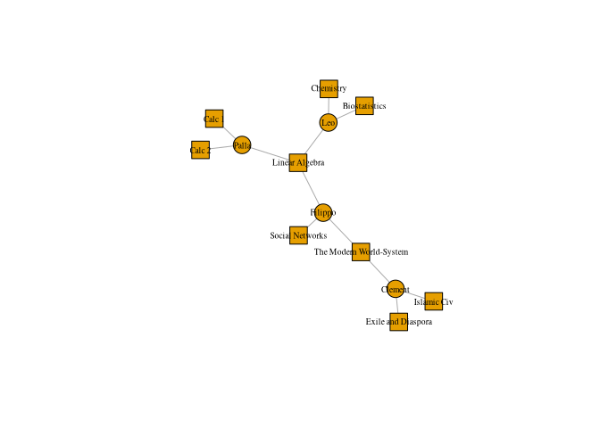
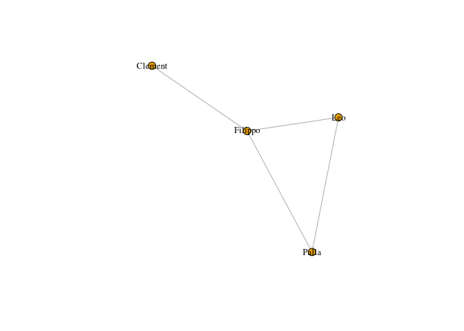
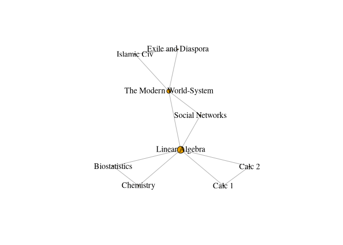

# GSS Network


- [Ego Networks](#ego-networks)
- [Network Size and Density](#network-size-and-density)
- [Affiliation Data](#affiliation-data)
  - [Unipartite projection](#unipartite-projection)
  - [Tripartite analysis](#tripartite-analysis)

[Source](https://raw.githubusercontent.com/mahoffman/stanford_networks/main/data/gss_local_nets.csv)

``` r
library(dplyr)
library(igraph)
```

# Ego Networks

``` r
gss <- read.csv("data/gss_local_nets.csv",
  stringsAsFactors = T
)
head(gss)
```

         sex  race age            partyid        relig numgiven close12 close13
    1 female other  52        independent     catholic        0      NA      NA
    2 female other  43 not str republican     catholic        0      NA      NA
    3   male black  52    strong democrat   protestant        4       1       2
    4 female other  34       ind,near dem     catholic        4       2       0
    5   male other  22       ind,near dem moslem/islam        0      NA      NA
    6   male black  26   not str democrat   protestant        6       0       2
      close14 close15 close23 close24 close25 close34 close35 close45 sex1 sex2
    1      NA      NA      NA      NA      NA      NA      NA      NA   NA   NA
    2      NA      NA      NA      NA      NA      NA      NA      NA   NA   NA
    3       0      NA       2       2      NA       1      NA      NA    1    1
    4       2      NA       2       2      NA       2      NA      NA    1    0
    5      NA      NA      NA      NA      NA      NA      NA      NA   NA   NA
    6       1       1       1       1       1       2       2       2    1    1
      sex3 sex4 sex5 race1 race2 race3 race4 race5 educ1     educ2     educ3
    1   NA   NA   NA    NA    NA    NA    NA    NA    NA      <NA>      <NA>
    2   NA   NA   NA    NA    NA    NA    NA    NA    NA      <NA>      <NA>
    3    0    0   NA     1     1     1     1    NA     1 h.s. grad      Grad
    4    1    1   NA     2     2     2     2    NA     1 h.s. grad      Grad
    5   NA   NA   NA    NA    NA    NA    NA    NA    NA      <NA>      <NA>
    6    0    1    1     0     1     1     2     2     1 h.s. grad h.s. grad
             educ4        educ5 age1 age2 age3 age4 age5     relig1     relig2
    1         <NA>         <NA>   NA   NA   NA   NA   NA       <NA>       <NA>
    2         <NA>         <NA>   NA   NA   NA   NA   NA       <NA>       <NA>
    3    Bachelors         <NA>   56   40   58   59   NA protestant protestant
    4         Grad         <NA>   63   36   34   36   NA   catholic   catholic
    5         <NA>         <NA>   NA   NA   NA   NA   NA       <NA>       <NA>
    6 Some College Some College   25   25   39   33   30      other      other
          relig3     relig4   relig5
    1       <NA>       <NA>     <NA>
    2       <NA>       <NA>     <NA>
    3 protestant protestant     <NA>
    4   catholic   catholic     <NA>
    5       <NA>       <NA>     <NA>
    6   catholic   catholic catholic

To see why these are called ego networks, let’s take a respondent and
graph the relations of the up to five people they said they discussed
“important matters” with. To do so, we have to first turn the variables
close12 through close45 into an edge list, one for each respondent

``` r
ties <- gss[, grepl("close", colnames(gss))]
head(ties)
```

      close12 close13 close14 close15 close23 close24 close25 close34 close35
    1      NA      NA      NA      NA      NA      NA      NA      NA      NA
    2      NA      NA      NA      NA      NA      NA      NA      NA      NA
    3       1       2       0      NA       2       2      NA       1      NA
    4       2       0       2      NA       2       2      NA       2      NA
    5      NA      NA      NA      NA      NA      NA      NA      NA      NA
    6       0       2       1       1       1       1       1       2       2
      close45
    1      NA
    2      NA
    3      NA
    4      NA
    5      NA
    6       2

``` r
gss %>%
  select(starts_with("close")) %>%
  head()
```

      close12 close13 close14 close15 close23 close24 close25 close34 close35
    1      NA      NA      NA      NA      NA      NA      NA      NA      NA
    2      NA      NA      NA      NA      NA      NA      NA      NA      NA
    3       1       2       0      NA       2       2      NA       1      NA
    4       2       0       2      NA       2       2      NA       2      NA
    5      NA      NA      NA      NA      NA      NA      NA      NA      NA
    6       0       2       1       1       1       1       1       2       2
      close45
    1      NA
    2      NA
    3      NA
    4      NA
    5      NA
    6       2

Make a matrix for each respondent, for example.

``` r
mat <- matrix(nrow = 5, ncol = 5)
mat[lower.tri(mat)] <- as.numeric(ties[3, ])
```

``` r
mat[upper.tri(mat)] <- t(mat)[upper.tri(mat)]
mat
```

         [,1] [,2] [,3] [,4] [,5]
    [1,]   NA    1    2    0   NA
    [2,]    1   NA    2    2   NA
    [3,]    2    2   NA    1   NA
    [4,]    0    2    1   NA   NA
    [5,]   NA   NA   NA   NA   NA

``` r
na_vals <- is.na(mat)
non_missing_rows <- rowSums(na_vals) < nrow(mat)
mat <- mat[non_missing_rows, non_missing_rows]
diag(mat) <- 0
mat
```

         [,1] [,2] [,3] [,4]
    [1,]    0    1    2    0
    [2,]    1    0    2    2
    [3,]    2    2    0    1
    [4,]    0    2    1    0

``` r
ego_net <- graph_from_adjacency_matrix(mat, mode = "undirected", weighted = T)
```

``` r
plot(ego_net,
  vertex.size = 30, vertex.label.color = "black",
  vertex.label.cex = 1
)
```



``` r
make_ego_nets <- function(tie) {
  mat <- matrix(nrow = 5, ncol = 5)
  mat[lower.tri(mat)] <- as.numeric(tie)
  mat[upper.tri(mat)] <- t(mat)[upper.tri(mat)]
  na_vals <- is.na(mat)
  non_missing_rows <- rowSums(na_vals) < nrow(mat)
  if (sum(!non_missing_rows) > 0) {
    mat <- mat[non_missing_rows, non_missing_rows]
  }
  diag(mat) <- 0
  graph_from_adjacency_matrix(mat, mode = "undirected", weighted = T)
}
```

``` r
ego_nets <- lapply(1:nrow(ties),
  FUN = function(x) make_ego_nets(ties[x, ])
)
head(ego_nets)
```

    [[1]]
    IGRAPH f5f0bf2 U-W- 0 0 -- 
    + attr: weight (e/n)
    + edges from f5f0bf2:

    [[2]]
    IGRAPH 5061673 U-W- 0 0 -- 
    + attr: weight (e/n)
    + edges from 5061673:

    [[3]]
    IGRAPH cacd65e U-W- 4 5 -- 
    + attr: weight (e/n)
    + edges from cacd65e:
    [1] 1--2 1--3 2--3 2--4 3--4

    [[4]]
    IGRAPH 9208ebc U-W- 4 5 -- 
    + attr: weight (e/n)
    + edges from 9208ebc:
    [1] 1--2 1--4 2--3 2--4 3--4

    [[5]]
    IGRAPH 2195a7a U-W- 0 0 -- 
    + attr: weight (e/n)
    + edges from 2195a7a:

    [[6]]
    IGRAPH 974b8c5 U-W- 5 9 -- 
    + attr: weight (e/n)
    + edges from 974b8c5:
    [1] 1--3 1--4 1--5 2--3 2--4 2--5 3--4 3--5 4--5

``` r
plot(ego_nets[[1021]])
```



# Network Size and Density

``` r
network_sizes <- lapply(ego_nets, vcount)
network_edge_counts <- lapply(ego_nets, ecount)

head(network_sizes)
```

    [[1]]
    [1] 0

    [[2]]
    [1] 0

    [[3]]
    [1] 4

    [[4]]
    [1] 4

    [[5]]
    [1] 0

    [[6]]
    [1] 5

``` r
network_sizes <- unlist(network_sizes)
mean(network_sizes, na.rm = T)
```

    [1] 1.796634

On average, each network as 1.8 people.

``` r
hist(network_sizes,
  main = "Histogram of Ego Network Sizes",
  xlab = "Network Size"
)
```



``` r
hist(unlist(network_edge_counts),
  main = "Histogram of Ego Network Edge Counts",
  xlab = "# of Edges"
)
```



``` r
densities <- lapply(ego_nets, graph.density) %>% unlist()
hist(densities)
```



# Affiliation Data

``` r
classes_data <- data.frame(
  name = c("Leo", "Clement", "Palla", "Filippo"),
  class1 = c("Biostatistics", "Islamic Civ", "Calc 1", "Linear Algebra"),
  class2 = c("Chemistry", "The Modern World-System", "Calc 2", "Social Networks"),
  class3 = c("Linear Algebra", "Exile and Diaspora", "Linear Algebra", "The Modern World-System"),
  stringsAsFactors = FALSE
)

classes_data
```

         name         class1                  class2                  class3
    1     Leo  Biostatistics               Chemistry          Linear Algebra
    2 Clement    Islamic Civ The Modern World-System      Exile and Diaspora
    3   Palla         Calc 1                  Calc 2          Linear Algebra
    4 Filippo Linear Algebra         Social Networks The Modern World-System

The reshape packages will let us convert this type of data into an
edgelist.

``` r
library(reshape2)
```

``` r
classes_data <- melt(classes_data,
  measure.vars = c("class1", "class2", "class3"),
  value.name = "classes",
  variable.name = "order"
)
classes_data
```

          name  order                 classes
    1      Leo class1           Biostatistics
    2  Clement class1             Islamic Civ
    3    Palla class1                  Calc 1
    4  Filippo class1          Linear Algebra
    5      Leo class2               Chemistry
    6  Clement class2 The Modern World-System
    7    Palla class2                  Calc 2
    8  Filippo class2         Social Networks
    9      Leo class3          Linear Algebra
    10 Clement class3      Exile and Diaspora
    11   Palla class3          Linear Algebra
    12 Filippo class3 The Modern World-System

``` r
classes_data <- subset(classes_data, select = c("name", "classes"))
classes_data
```

          name                 classes
    1      Leo           Biostatistics
    2  Clement             Islamic Civ
    3    Palla                  Calc 1
    4  Filippo          Linear Algebra
    5      Leo               Chemistry
    6  Clement The Modern World-System
    7    Palla                  Calc 2
    8  Filippo         Social Networks
    9      Leo          Linear Algebra
    10 Clement      Exile and Diaspora
    11   Palla          Linear Algebra
    12 Filippo The Modern World-System

Once we have such an edge list, we can then use the table function to
turn it into an incidence matrix, which is what igraph needs to turn
affiliation data into an igraph object.

``` r
classes_matrix <- as.matrix(table(classes_data))
classes_matrix[, 1:4]
```

             classes
    name      Biostatistics Calc 1 Calc 2 Chemistry
      Clement             0      0      0         0
      Filippo             0      0      0         0
      Leo                 1      0      0         1
      Palla               0      1      1         0

``` r
classes_net <- graph_from_biadjacency_matrix(classes_matrix,
  mode = c("all")
)
plot(classes_net, vertex.label.cex = .6, vertex.label.color = "black")
```



``` r
V(classes_net)$shape <- ifelse(V(classes_net)$type == FALSE,
  "circle", "square"
)
plot(classes_net, vertex.label.cex = .6, vertex.label.color = "black")
```



## Unipartite projection

We can make the projection two ways - using the bipartite.projection()
function in igraph, or by multiplying the incidence matrix by its
transpose (or vise versa).

The mathematical operation to make a person-to-person projection is to
multiply the initial matrix by its transpose.

``` r
person_matrix <- classes_matrix %*% t(classes_matrix)
person_matrix
```

             name
    name      Clement Filippo Leo Palla
      Clement       3       1   0     0
      Filippo       1       3   1     1
      Leo           0       1   3     1
      Palla         0       1   1     3

``` r
number_classes_taken <- diag(person_matrix)
diag(person_matrix) <- 0
```

``` r
person_net <- graph_from_adjacency_matrix(
  person_matrix,
  mode = "undirected"
)

plot(person_net,
  vertex.size = 8, vertex.label.cex = .8,
  vertex.label.color = "black"
)
```



``` r
group_matrix <- t(classes_matrix) %*% classes_matrix
group_matrix
```

                             classes
    classes                   Biostatistics Calc 1 Calc 2 Chemistry
      Biostatistics                       1      0      0         1
      Calc 1                              0      1      1         0
      Calc 2                              0      1      1         0
      Chemistry                           1      0      0         1
      Exile and Diaspora                  0      0      0         0
      Islamic Civ                         0      0      0         0
      Linear Algebra                      1      1      1         1
      Social Networks                     0      0      0         0
      The Modern World-System             0      0      0         0
                             classes
    classes                   Exile and Diaspora Islamic Civ Linear Algebra
      Biostatistics                            0           0              1
      Calc 1                                   0           0              1
      Calc 2                                   0           0              1
      Chemistry                                0           0              1
      Exile and Diaspora                       1           1              0
      Islamic Civ                              1           1              0
      Linear Algebra                           0           0              3
      Social Networks                          0           0              1
      The Modern World-System                  1           1              1
                             classes
    classes                   Social Networks The Modern World-System
      Biostatistics                         0                       0
      Calc 1                                0                       0
      Calc 2                                0                       0
      Chemistry                             0                       0
      Exile and Diaspora                    0                       1
      Islamic Civ                           0                       1
      Linear Algebra                        1                       1
      Social Networks                       1                       1
      The Modern World-System               1                       2

``` r
number_of_students <- diag(group_matrix)

diag(group_matrix) <- 0
group_net <- graph_from_adjacency_matrix(group_matrix, mode = "undirected")
plot(group_net,
  vertex.size = betweenness(group_net) / max(betweenness(group_net)) * 10,
  vertex.labesl.cex = .6, vertex.label.color = "black"
)
```



## Tripartite analysis

Include other modes or levels, eg. departments and schools. Here
departments.

``` r
classes <- c(
  "Biostatistics", "Islamic Civ", "Calc 1",
  "Linear Algebra", "Chemistry",
  "The Modern World-System", "Calc 2",
  "Social Networks", "Exile and Diaspora"
)

departments <- c(
  "Math", "History", "Math", "Math",
  "Chemistry", "Sociology", "Math",
  "Sociology", "History"
)

classes_to_departments <- data.frame(
  class = classes, department = departments, stringsAsFactors = F
)
```

``` r
classes_to_departments_matrix <- table(classes_to_departments)
class(classes_to_departments_matrix) <- "matrix"

ctd_table <- table(classes_to_departments)
classes_to_departments_matrix2 <- matrix(
  ctd_table,
  ncol = ncol(ctd_table),
  dimnames = dimnames(ctd_table)
)
```

``` r
str(classes_to_departments_matrix)
```

     int [1:9, 1:4] 0 0 0 1 0 0 0 0 0 0 ...
     - attr(*, "dimnames")=List of 2
      ..$ class     : chr [1:9] "Biostatistics" "Calc 1" "Calc 2" "Chemistry" ...
      ..$ department: chr [1:4] "Chemistry" "History" "Math" "Sociology"

``` r
str(classes_to_departments_matrix2)
```

     int [1:9, 1:4] 0 0 0 1 0 0 0 0 0 0 ...
     - attr(*, "dimnames")=List of 2
      ..$ class     : chr [1:9] "Biostatistics" "Calc 1" "Calc 2" "Chemistry" ...
      ..$ department: chr [1:4] "Chemistry" "History" "Math" "Sociology"
