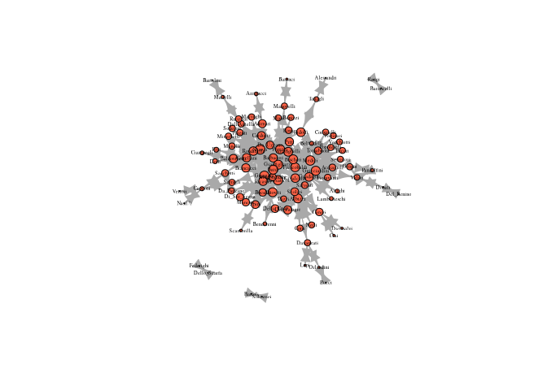

# Centrality


Centrality measures:

- degree
- betweenness
- closeness
- eigenvector

# Preparation

``` r
library(igraph)
library(tidyverse)
library(reshape2)
```

We will use John Padgett’s Florentine Families dataset. It is part of a
famous historical datset about the relationships of prominent Florentine
families in 15th century Italy. The historical puzzle is how the Medici,
an upstart family, managed to accumulate political power during this
period. Padgett’s goal was to explain their rise.

``` r
# https://raw.githubusercontent.com/mahoffman/stanford_networks/main/data/florentine_marriage_edgelist.csv
florentine_edj <- read.csv("data/florentine_marriage_edgelist.csv")
florentine_edj <- florentine_edj[, 2:3]
head(florentine_edj)
```

         FamilyA      FamilyB
    1 Acciaiuoli Guicciardini
    2 Acciaiuoli       Medici
    3    Adimari    Arrigucci
    4    Adimari    Barbadori
    5    Adimari      Strozzi
    6    Albizzi     Altoviti

``` r
# https://raw.githubusercontent.com/mahoffman/stanford_networks/main/data/florentine_attributes.csv
florentine_attributes <- read.csv("data/florentine_attributes.csv")
str(florentine_attributes)
```

    'data.frame':   116 obs. of  16 variables:
     $ Family           : chr  "Acciaiuoli" "Adimari" "Alberti" "Albizzi" ...
     $ particip1        : int  12 NA 3 22 6 9 27 5 7 5 ...
     $ particip2        : int  4 NA 4 7 2 3 5 4 0 3 ...
     $ spoke            : int  1 0 0 1 0 1 0 0 0 0 ...
     $ party            : num  1 5 1 4 6 3 6 4 6 1 ...
     $ Gwealth          : int  28200 45689 NA 92599 7171 NA 42357 18437 57596 4160 ...
     $ Nwealth          : int  10448 5251 61122 35730 NA 17761 6430 NA 42982 4967 ...
     $ date             : int  1282 1286 1345 1282 1307 1376 1282 1282 1282 1318 ...
     $ status           : int  0 1 0 0 0 0 2 0 2 0 ...
     $ Npriors          : int  53 NA 38 65 27 2 73 28 35 13 ...
     $ residence        : int  31 44 34 43 34 43 31 21 32 21 ...
     $ index116to16     : int  1 0 0 1 0 0 0 0 0 0 ...
     $ index116to87     : int  1 1 0 1 1 0 1 1 1 1 ...
     $ X                : logi  NA NA NA NA NA NA ...
     $ X.1              : logi  NA NA NA NA NA NA ...
     $ X..describe.116..: chr  "Data from John Padgett." "  partner116, credit116, business116, marriage116 <--> symmetric binary networks on 116 families" "  business116 is partitioned into partner116 and credit116" "  partner116 <--> partnerships in business" ...

``` r
# graph the marriage network
marriageNet <- graph_from_edgelist(as.matrix(florentine_edj), directed = T)
V(marriageNet)$Wealth <-
  florentine_attributes$Gwealth[match(
    V(marriageNet)$name,
    florentine_attributes$Family
  )]
summary(V(marriageNet)$Wealth)
```

       Min. 1st Qu.  Median    Mean 3rd Qu.    Max.    NA's 
        148   12884   27394   41683   54724  296250      18 

Simple mean imputation of wealth

``` r
V(marriageNet)$Wealth <- ifelse(
  is.na(V(marriageNet)$Wealth),
  mean(V(marriageNet)$Wealth, na.rm = T),
  V(marriageNet)$Wealth
)
```

Number of Priors, The Priorate (or city council), first created in 1282,
was Florence’s governing body. Count of how many seats a family had on
that city council from 1282-1344 (measure of the aggregate political
influence of the family over a long period of time)

``` r
V(marriageNet)$Priorates <-
  florentine_attributes$Npriors[match(
    V(marriageNet)$name,
    florentine_attributes$Family
  )]
```

``` r
plot(marriageNet,
  vertex.size = 8, vertex.label.cex = .6,
  vertex.label.color = "black", vertex.color = "pink",
  edge.arrow.size = 0.4
)
```


# Degree Centrality

> Note: In a directed network, you will need to specify if in or out
> ties should be counted. These will be referred to as in or out degree
> respectively. If both are counted, then it is just called degree

``` r
degree(marriageNet)
```

       Acciaiuoli  Guicciardini        Medici       Adimari     Arrigucci 
                4            14            40             6             2 
        Barbadori       Strozzi       Albizzi      Altoviti    Della_Casa 
               14            50            28            12             4 
            Corsi     Davanzati   Frescobaldi        Ginori      Guadagni 
                2             6            12             8            20 
         Guasconi         Nerli   Del_Palagio   Panciatichi       Scolari 
               24             2             4            14             6 
     Aldobrandini    Alessandri       Tanagli    Bencivenni Gianfigliazzi 
                4             2             4             2            20 
            Spini  Dall'Antella      Martelli    Rondinelli   Ardinghelli 
                8             6             4            10            10 
          Peruzzi         Rossi       Arrighi  Baldovinetti     Ciampegli 
               30             4             2             8             2 
          Manelli      Carducci    Castellani      Ricasoli         Bardi 
                4             4            14            20            14 
          Bucelli      Serragli     Da_Uzzano    Baroncelli         Raugi 
                4             4             4             2             2 
          Baronci     Manovelli       Bartoli      Solosmei     Bartolini 
                2             4             2             2             2 
      Belfradelli    Del_Benino        Donati       Benizzi      Bischeri 
                2             2             4             2             8 
        Brancacci       Capponi       Nasi(?)     Sacchetti       Vettori 
                4             8             2             6             2 
            Doffi          Pepi    Cavalcanti          Ciai    Corbinelli 
                2             2             6             2             2 
             Lapi     Orlandini    Dietisalvi        Valori     Federighi 
                2             4             2             8             2 
     Dello_Scarfa    Fioravanti      Salviati        Giugni    Pandolfini 
                2             4             6             6             4 
     Lamberteschi    Tornabuoni       Mancini  Di_Ser_Segna      Macinghi 
                2             8             2             2             2 
             Masi        Pecori         Pitti    Popoleschi     Portinari 
                2             2             4             4             2 
          Ridolfi    Serristori    Vecchietti    Minerbetti         Pucci 
                8             2             2             2             2 
       Da_Panzano       Parenti         Pazzi      Rucellai    Scambrilla 
                4             2             4             2             2 
         Soderini 
                2 

``` r
V(marriageNet)$degree <- degree(marriageNet)

plot(marriageNet,
  vertex.label.cex = .6,
  vertex.label.color = "black",
  vertex.size = V(marriageNet)$degree
)
```


``` r
plot(marriageNet,
  vertex.label.cex = .6,
  vertex.label.color = "black",
  vertex.size = V(marriageNet)$degree * 3
)
```


# Betweenness Centrality

``` r
betweenness(marriageNet, directed = F)
```

       Acciaiuoli  Guicciardini        Medici       Adimari     Arrigucci 
         0.000000    327.850305   1029.609288     93.009524      0.000000 
        Barbadori       Strozzi       Albizzi      Altoviti    Della_Casa 
       162.697344   1369.979110    856.436111    125.620147     11.577398 
            Corsi     Davanzati   Frescobaldi        Ginori      Guadagni 
         0.000000    260.000000    145.532681    180.571429    277.059921 
         Guasconi         Nerli   Del_Palagio   Panciatichi       Scolari 
       583.679251      0.000000      0.000000    167.994891     19.801010 
     Aldobrandini    Alessandri       Tanagli    Bencivenni Gianfigliazzi 
        23.351190      0.000000     88.000000      0.000000    187.915043 
            Spini  Dall'Antella      Martelli    Rondinelli   Ardinghelli 
        89.500000    174.000000     88.000000     43.186597     58.278211 
          Peruzzi         Rossi       Arrighi  Baldovinetti     Ciampegli 
       604.369691      0.000000      0.000000     95.613889      0.000000 
          Manelli      Carducci    Castellani      Ricasoli         Bardi 
         0.000000      5.009524    194.199423    205.097092    280.248232 
          Bucelli      Serragli     Da_Uzzano    Baroncelli         Raugi 
         1.066667     81.000000      3.666667      0.000000      0.000000 
          Baronci     Manovelli       Bartoli      Solosmei     Bartolini 
         0.000000     88.000000      0.000000      0.000000      0.000000 
      Belfradelli    Del_Benino        Donati       Benizzi      Bischeri 
         0.000000      0.000000     88.000000      0.000000     63.995238 
        Brancacci       Capponi       Nasi(?)     Sacchetti       Vettori 
         0.000000    177.000000      0.000000    197.651515      0.000000 
            Doffi          Pepi    Cavalcanti          Ciai    Corbinelli 
         0.000000      0.000000    125.467749      0.000000      0.000000 
             Lapi     Orlandini    Dietisalvi        Valori     Federighi 
         0.000000     88.000000      0.000000    202.285859      0.000000 
     Dello_Scarfa    Fioravanti      Salviati        Giugni    Pandolfini 
         0.000000      5.951190     35.571429     96.664141      0.000000 
     Lamberteschi    Tornabuoni       Mancini  Di_Ser_Segna      Macinghi 
         0.000000     23.831746      0.000000      0.000000      0.000000 
             Masi        Pecori         Pitti    Popoleschi     Portinari 
         0.000000      0.000000     19.610606      0.000000      0.000000 
          Ridolfi    Serristori    Vecchietti    Minerbetti         Pucci 
       213.727670      0.000000      0.000000      0.000000      0.000000 
       Da_Panzano       Parenti         Pazzi      Rucellai    Scambrilla 
        16.961111      0.000000      4.361111      0.000000      0.000000 
         Soderini 
         0.000000 

``` r
V(marriageNet)$betweenness <- betweenness(marriageNet, directed = F)

plot(marriageNet,
  vertex.label.cex = .6,
  vertex.label.color = "black",
  vertex.size = V(marriageNet)$betweenness
)
```


Normalize

``` r
plot(marriageNet,
  vertex.label.cex = .6,
  vertex.label.color = "black",
  vertex.size = V(marriageNet)$betweenness / max(V(marriageNet)$betweenness) * 20
)
```


# Closeness Centrality

``` r
closeness(marriageNet)
```

       Acciaiuoli  Guicciardini        Medici       Adimari     Arrigucci 
      0.003610108   0.004424779   0.004926108   0.003846154   0.002873563 
        Barbadori       Strozzi       Albizzi      Altoviti    Della_Casa 
      0.004115226   0.005128205   0.004672897   0.004065041   0.003676471 
            Corsi     Davanzati   Frescobaldi        Ginori      Guadagni 
      0.003311258   0.003378378   0.004081633   0.003623188   0.004166667 
         Guasconi         Nerli   Del_Palagio   Panciatichi       Scolari 
      0.005025126   0.003311258   0.003717472   0.004545455   0.003717472 
     Aldobrandini    Alessandri       Tanagli    Bencivenni Gianfigliazzi 
      0.003717472   0.002439024   0.003105590   0.002994012   0.004716981 
            Spini  Dall'Antella      Martelli    Rondinelli   Ardinghelli 
      0.003676471   0.003597122   0.002747253   0.004098361   0.004255319 
          Peruzzi         Rossi       Arrighi  Baldovinetti     Ciampegli 
      0.004761905   0.003436426   0.003048780   0.003984064   0.002949853 
          Manelli      Carducci    Castellani      Ricasoli         Bardi 
      0.003558719   0.003816794   0.004166667   0.004184100   0.004504505 
          Bucelli      Serragli     Da_Uzzano    Baroncelli         Raugi 
      0.003521127   0.003311258   0.003623188   1.000000000   1.000000000 
          Baronci     Manovelli       Bartoli      Solosmei     Bartolini 
      0.002604167   0.003378378   1.000000000   1.000000000   0.002212389 
      Belfradelli    Del_Benino        Donati       Benizzi      Bischeri 
      0.003003003   0.002083333   0.002551020   0.003355705   0.004291845 
        Brancacci       Capponi       Nasi(?)     Sacchetti       Vettori 
      0.003937008   0.002985075   0.002364066   0.003690037   0.002364066 
            Doffi          Pepi    Cavalcanti          Ciai    Corbinelli 
      0.003048780   0.003048780   0.004201681   0.002747253   0.003436426 
             Lapi     Orlandini    Dietisalvi        Valori     Federighi 
      0.002604167   0.002617801   0.002747253   0.003267974   1.000000000 
     Dello_Scarfa    Fioravanti      Salviati        Giugni    Pandolfini 
      1.000000000   0.003571429   0.003610108   0.003533569   0.002801120 
     Lamberteschi    Tornabuoni       Mancini  Di_Ser_Segna      Macinghi 
      0.003048780   0.003773585   0.003484321   0.003484321   0.003533569 
             Masi        Pecori         Pitti    Popoleschi     Portinari 
      0.003355705   0.003436426   0.004098361   0.003484321   0.003436426 
          Ridolfi    Serristori    Vecchietti    Minerbetti         Pucci 
      0.004237288   0.003436426   0.003436426   0.003533569   0.002127660 
       Da_Panzano       Parenti         Pazzi      Rucellai    Scambrilla 
      0.003311258   0.003533569   0.003267974   0.003533569   0.002777778 
         Soderini 
      0.003533569 

``` r
V(marriageNet)$closeness <- closeness(marriageNet)

plot(marriageNet,
  vertex.label.cex = .6,
  vertex.label.color = "black",
  vertex.size = V(marriageNet)$closeness / max(V(marriageNet)$closeness) * 50
)
```


# Eigenvector Centrality

Takes into account alters’ power. Eg, if A and B have the same degree
centrality, but A is tied to high degree people and B is tied to low
degree people, A should have a higher score than b.

Eigenvector centrality takes into account alters’ power. It is
calculated a little bit differently in igraph. It produces a list object
and we need to extract only the vector of centrality values.

``` r
evcent(marriageNet)$vector
```

    Warning: `evcent()` was deprecated in igraph 2.0.0.
    ℹ Please use `eigen_centrality()` instead.

       Acciaiuoli  Guicciardini        Medici       Adimari     Arrigucci 
     1.399699e-01  3.830752e-01  6.707160e-01  1.831812e-01  2.433106e-02 
        Barbadori       Strozzi       Albizzi      Altoviti    Della_Casa 
     3.547849e-01  1.000000e+00  5.323660e-01  3.372469e-01  1.414314e-01 
            Corsi     Davanzati   Frescobaldi        Ginori      Guadagni 
     7.071156e-02  7.332195e-02  3.436670e-01  1.057862e-01  3.460880e-01 
         Guasconi         Nerli   Del_Palagio   Panciatichi       Scolari 
     6.811084e-01  7.071156e-02  1.383317e-01  5.090917e-01  1.367356e-01 
     Aldobrandini    Alessandri       Tanagli    Bencivenni Gianfigliazzi 
     1.509870e-01  4.503879e-03  3.390835e-02  4.479485e-02  7.162939e-01 
            Spini  Dall'Antella      Martelli    Rondinelli   Ardinghelli 
     2.096823e-01  1.893404e-01  2.560082e-02  3.998861e-01  4.000982e-01 
          Peruzzi         Rossi       Arrighi  Baldovinetti     Ciampegli 
     7.915554e-01  1.582815e-01  4.596917e-02  2.497482e-01  3.317283e-02 
          Manelli      Carducci    Castellani      Ricasoli         Bardi 
     1.659979e-01  1.799494e-01  4.238792e-01  5.324287e-01  4.080706e-01 
          Bucelli      Serragli     Da_Uzzano    Baroncelli         Raugi 
     1.218222e-01  5.798025e-02  1.593404e-01  5.960032e-18  7.191457e-18 
          Baronci     Manovelli       Bartoli      Solosmei     Bartolini 
     1.421582e-02  1.070266e-01  0.000000e+00  0.000000e+00  3.400431e-03 
      Belfradelli    Del_Benino        Donati       Benizzi      Bischeri 
     4.564759e-02  1.231075e-03  9.268390e-03  1.051384e-01  3.348147e-01 
        Brancacci       Capponi       Nasi(?)     Sacchetti       Vettori 
     2.232934e-01  2.844521e-02  3.778238e-03  1.486187e-01  3.778238e-03 
            Doffi          Pepi    Cavalcanti          Ciai    Corbinelli 
     5.630179e-02  5.630179e-02  2.359640e-01  1.405106e-02  8.908790e-02 
             Lapi     Orlandini    Dietisalvi        Valori     Federighi 
     9.738994e-03  9.913900e-03  1.405106e-02  6.854784e-02  3.230208e-18 
     Dello_Scarfa    Fioravanti      Salviati        Giugni    Pandolfini 
     7.896260e-19  1.350571e-01  1.467173e-01  1.011873e-01  2.254509e-02 
     Lamberteschi    Tornabuoni       Mancini  Di_Ser_Segna      Macinghi 
     4.596917e-02  1.834366e-01  9.046827e-02  9.046827e-02  1.328251e-01 
             Masi        Pecori         Pitti    Popoleschi     Portinari 
     1.051384e-01  8.908790e-02  2.219130e-01  1.134529e-01  8.908790e-02 
          Ridolfi    Serristori    Vecchietti    Minerbetti         Pucci 
     2.507818e-01  8.908790e-02  8.908790e-02  1.328251e-01  1.316815e-03 
       Da_Panzano       Parenti         Pazzi      Rucellai    Scambrilla 
     9.046017e-02  1.328251e-01  9.020762e-02  1.328251e-01  2.785107e-02 
         Soderini 
     1.328251e-01 

``` r
V(marriageNet)$eigenvector <- evcent(marriageNet)$vector

plot(marriageNet,
  vertex.label.cex = .6,
  vertex.label.color = "black",
  vertex.size = V(marriageNet)$eigenvector / max(V(marriageNet)$eigenvector) * 20
)
```


# Bonacich Centrality

Interpretively, the Bonacich power measure corresponds to the notion
that the power of a vertex is recursively defined by the sum of the
power of its alters. The nature of the recursion involved is then
controlled by the power exponent: positive values imply that vertices
become more powerful as their alters become more powerful (as occurs in
cooperative relations), while negative values imply that vertices become
more powerful only as their alters become weaker (as occurs in
competitive or antagonistic relations). The magnitude of the exponent
indicates the tendency of the effect to decay across long walks; higher
magnitudes imply slower decay. One interesting feature of this measure
is its relative instability to changes in exponent magnitude
(particularly in the negative case). If your theory motivates use of
this measure, you should be very careful to choose a decay parameter on
a non-ad hoc basis.

For directed networks, the Bonacich power measure can be understood as
similar to status in the network where higher status nodes have more
edges that point from them to others with status. Node A’s centrality
depends on the centrality of all the nodes that A points toward, and
their centrality depends on the nodes they point toward, etc. Note, this
means that a node with an out-degree of 0 will have a Bonacich power
centrality of 0 as they do not point towards anyone. When using this
with directed network it is important to think about the edge direction
and what it represents.

``` r
V(marriageNet)$bonacich <-
  power_centrality(marriageNet, exponent = -2, rescale = T)
V(marriageNet)$bonacich <-
  ifelse(V(marriageNet)$bonacich < 0, 0, V(marriageNet)$bonacich)

plot(marriageNet,
  vertex.label.cex = .6,
  vertex.label.color = "black",
  vertex.size =
    V(marriageNet)$bonacich / max(V(marriageNet)$bonacich) * 20
)
```


# Page Rank

Google’s page rank measure, uses random walks to identify individuals
who are commonly encountered.

``` r
V(marriageNet)$page_rank <-
  page_rank(marriageNet, directed = T)$vector
```

``` r
plot(marriageNet,
  vertex.label.cex = .6,
  vertex.label.color = "black",
  vertex.size =
    V(marriageNet)$page_rank / max(V(marriageNet)$page_rank) * 20
)
```


# Measure Correlations

``` r
all_atts <- lapply(
  vertex_attr_names(marriageNet),
  function(x) vertex_attr(marriageNet, x)
)

all_atts <- do.call("cbind", all_atts)
```

``` r
all_atts <- lapply(
  vertex_attr_names(marriageNet),
  function(x) vertex_attr(marriageNet, x)
) %>%
  do.call("cbind", .)

colnames(all_atts) <- vertex_attr_names(marriageNet)

all_atts <- data.frame(all_atts[, 2:ncol(all_atts)]) %>%
  sapply(as.numeric)

cor_mat <- cor(all_atts)

# melt it using reshape to function melt() to prepare it for ggplot which requires long form data
melted_cor_mat <- melt(cor_mat)
ggplot(data = melted_cor_mat, aes(x = Var1, y = Var2, fill = value)) +
  geom_tile() +
  scale_fill_distiller(palette = "Spectral", direction = -2) +
  xlab("") +
  ylab("")
```


# Centralization and Degree Distributions

Fit a degree distribution on the log-log scale

``` r
alter_hist <- table(degree(marriageNet))
vals <- as.numeric(names(alter_hist))
vals <- vals[2:length(vals)]
alter_hist <- alter_hist[2:length(alter_hist)]
df <- data.frame(
  Vals = log(vals),
  Hist = log(as.numeric(alter_hist)),
  stringsAsFactors = F
)

plot(Hist ~ Vals, data = df)
abline(lm(Hist ~ Vals, data = df))
```


Compare ego’s partners with neighbor’s partners

``` r
neighbor_degrees <- knn(marriageNet)$knn
degrees <- degree(marriageNet)

mean(neighbor_degrees, na.rm = T)
```

    [1] 18.72979

``` r
mean(degrees)
```

    [1] 6.541667

``` r
hist(neighbor_degrees)
```


``` r
hist(degrees)
```


Finally centralization measures the extent to which a network is
centered around a single node. The closer a network gets to looking like
a star, the higher the centralization score will be.

``` r
centr_betw(marriageNet)$centralization
```

    [1] 0.2881759

``` r
centr_eigen(marriageNet)$centralization
```

    [1] 0.8503616

``` r
centr_clo(marriageNet)$centralization
```

    [1] 0.6578484

Note that this is significantly different from the text.

Compaire with a Barabasi-Albert simulated model with preferential
attachment with respect to degree (power parameter).

``` r
N <- vcount(marriageNet)
deg_cent <- centr_degree(marriageNet)$centralization

# centralizations = c()
powers <- seq(0, 3, .1)

# for (e in powers) {
#  net <- sample_pa(N, directed = F, power = e)
#  centralizations <- c(centralizations, centr_degree(net)$centralization)
# }

cents <- function(powers) {
  net <- sample_pa(N, directed = F, power = powers)
  centr_degree(net)$centralization
}

centralizations <- map(powers, cents) %>% list_c()
centralizations
```

     [1] 0.07390351 0.07390351 0.05285088 0.05285088 0.07390351 0.05285088
     [7] 0.09495614 0.09495614 0.07390351 0.10548246 0.10548246 0.09495614
    [13] 0.20021930 0.13706140 0.17916667 0.25285088 0.80021930 0.44232456
    [19] 0.48442982 0.89495614 0.65285088 0.89495614 0.94758772 0.91600877
    [25] 0.94758772 0.97916667 0.94758772 0.92653509 0.90548246 0.85285088
    [31] 0.97916667

``` r
power_df <- data.frame(
  Centralization = centralizations,
  Power = powers
)

ggplot(power_df, aes(x = Power, y = Centralization)) +
  geom_point() +
  geom_hline(yintercept = deg_cent, linetype = "dashed", color = "red") +
  theme_bw()
```


What proportion of nodes can any node reach at N steps?

``` r
reach_n <- function(x, n = 2) {
  r <- vector(length = vcount(x))
  for (i in 1:vcount(x)) {
    neighb <- neighborhood(x, n, nodes = i)
    ni <- unlist(neighb)
    l <- length(ni)
    r[i] <- (l) / vcount(x)
  }
  return(r)
}

two_reach <- reach_n(marriageNet, 2)

plot(marriageNet,
  vertex.size = two_reach * 10,
  vertex.label.cex = .4, vertex.label.color = "black"
)
```


``` r
three_reach <- reach_n(marriageNet, 3)
plot(marriageNet,
  vertex.size = three_reach * 10,
  vertex.label.cex = .4, vertex.label.color = "black",
  vertex.color = "tomato"
)
```



``` r
five_reach <- reach_n(marriageNet, 5)

plot(marriageNet, vertex.size = five_reach * 10, vertex.label.cex = .4, vertex.label.color = "black", vertex.color = "tomato")
```


# Distance weighted reach

``` r
distance_weighted_reach <- function(x) {
  distances <- distances(x) # create matrix of geodesic distances
  diag(distances) <- 1 # replace the diagonal with 1s
  weights <- 1 / distances # take the reciprocal of distances
  return(apply(weights, 1, sum)) # sum for each node (row)
}

dw_reach <- distance_weighted_reach(marriageNet)
dw_reach <- dw_reach / max(dw_reach)

plot(marriageNet, vertex.size = dw_reach * 10, vertex.label.cex = .4, vertex.label.color = "black", vertex.color = "tomato")
```


