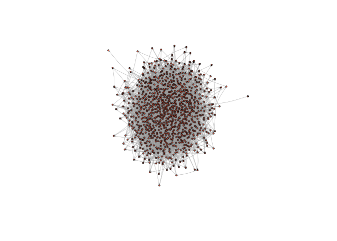
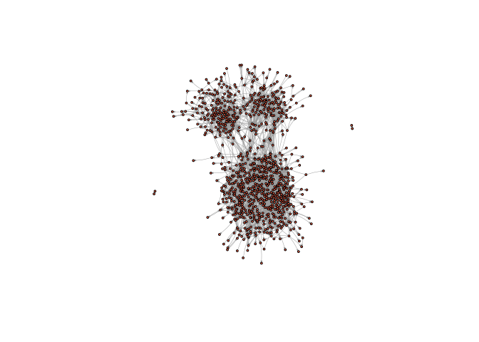
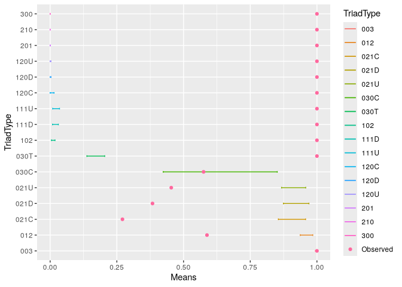
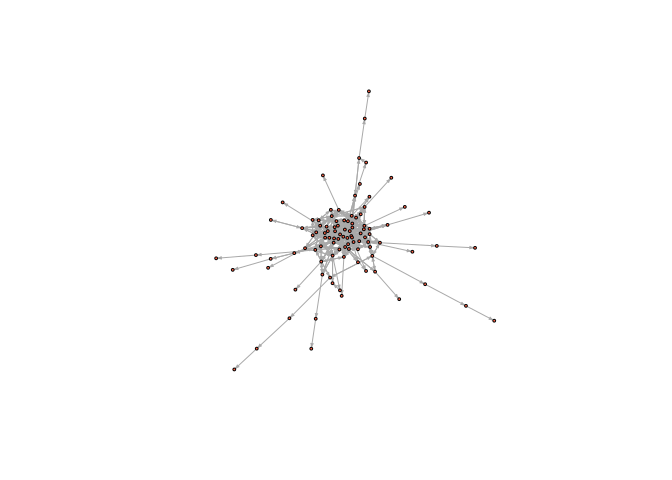

# GSS Network - Dyads and Triads


# Preparation

``` r
# url1 <- "https://raw.githubusercontent.com/mahoffman/stanford_networks/main/data/comm59.dat.txt"

el <- read.table("../data/comm59.dat.txt", header = T)

# url2 <- "https://raw.githubusercontent.com/mahoffman/stanford_networks/main/data/comm59_att.dat.txt"

attributes <- read.table("../data/comm59_att.dat.txt", header = T)

# add an ID column
attributes$ID <- 1:nrow(attributes)
```

``` r
library(igraph)
library(tidyverse)
```

``` r
head(el)
```

      id1 id2 rank
    1   1 191    4
    2   1 245    6
    3   1 272    1
    4   1 413    4
    5   1 447    1
    6   3  21    2

``` r
el_no_weight <- el %>%
  select(-rank) %>%
  mutate(across(where(is.numeric), as.character)) %>%
  as.matrix()

net59 <- graph_from_edgelist(el_no_weight,
  directed = T
)
```

``` r
# First link vertex names to their place in the attribute dataset
linked_ids <- match(V(net59)$name, attributes$ID)

V(net59)$race <- attributes$race[linked_ids]
V(net59)$sex <- attributes$sex[linked_ids]
V(net59)$grade <- attributes$grade[linked_ids]
V(net59)$school <- attributes$school[linked_ids]

net59
```

    IGRAPH e5a134b DN-- 975 4160 -- 
    + attr: name (v/c), race (v/n), sex (v/n), grade (v/n), school (v/n)
    + edges from e5a134b (vertex names):
     [1] 1 ->191 1 ->245 1 ->272 1 ->413 1 ->447 3 ->21  3 ->221 3 ->480 3 ->495
    [10] 3 ->574 5 ->96  5 ->258 5 ->335 6 ->271 6 ->374 6 ->400 6 ->489 6 ->491
    [19] 6 ->573 6 ->586 7 ->134 7 ->159 7 ->464 7 ->478 8 ->221 8 ->284 8 ->378
    [28] 8 ->557 9 ->137 9 ->442 9 ->473 9 ->498 10->20  10->22  10->64  10->75 
    [37] 10->89  10->219 10->272 10->276 11->101 11->155 11->190 11->273 11->337
    [46] 11->339 11->353 11->616 12->188 12->475 14->20  14->151 14->597 15->106
    [55] 15->189 15->233 15->325 15->333 15->449 15->491 15->552 15->624 15->627
    [64] 16->30  16->201 16->217 16->267 16->268 16->466 16->569 17->625 19->45 
    + ... omitted several edges

# The Dyad

``` r
edge_density(net59)
```

    [1] 0.004380561

``` r
reciprocity(net59)
```

    [1] 0.39375

``` r
random_graph <- sample_gnp(
  n = vcount(net59), p = edge_density(net59), directed = T
)
```

``` r
plot(random_graph,
  vertex.size = 2,
  vertex.label = NA,
  edge.curved = .1,
  vertex.color = "tomato",
  edge.arrow.size = .1,
  edge.width = .5,
  edge.color = "grey60"
)
```



``` r
edge_density(net59)
```

    [1] 0.004380561

``` r
reciprocity(net59)
```

    [1] 0.39375

``` r
edge_density(random_graph)
```

    [1] 0.004286843

``` r
reciprocity(random_graph)
```

    [1] 0.002947679

The reciprocity is much higher than expected.

``` r
plot(net59,
  vertex.size = 2,
  vertex.label = NA,
  edge.curved = .1,
  vertex.color = "tomato",
  edge.arrow.size = .1,
  edge.width = .5,
  edge.color = "grey60"
)
```



# The Triad

``` r
triad_census(net59)
```

     [1] 150776065   2416731    785249      3621      4325      5165      4028
     [8]      3619       450        23      1019       294       320       137
    [15]       385       144

``` r
triad_census(random_graph)
```

     [1] 150080187   3881894      5723      8438      8260     16872        64
     [8]        51        65        21         0         0         0         0
    [15]         0         0

Triads are common in the observed network but not in the random graph.

# Distribution of random graphs

``` r
trial <- vector("list", 100)

for (i in 1:length(trial)) {
  trial[[i]] <- sample_gnp(
    n = vcount(net59), p = edge_density(net59), directed = T
  ) %>%
    triad_census()
}

trial_df <- do.call("rbind", trial)

colnames(trial_df) <- c("003", "012", "102", "021D", "021U", "021C", "111D", "111U", "030T", "030C", "201", "120D", "120U", "120C", "210", "300")


trial_df_w_observed <- rbind(trial_df, as.numeric(triad_census(net59)))
```

``` r
head(trial_df_w_observed)
```

               003     012   102 021D 021U  021C 111D 111U 030T 030C 201 120D 120U
    [1,] 150027449 3931922  7668 8622 8495 17206   60   55   65   32   0    0    0
    [2,] 150023490 3936934  6696 8446 8615 17168   58   56   93   18   0    0    0
    [3,] 150083112 3872308 12397 8409 8393 16601  123  127   76   27   0    0    0
    [4,] 149982549 3974107  9569 8799 8685 17590   84   77   93   22   0    0    0
    [5,] 149931643 4015775 18149 8894 8876 17782  189  147   92   26   0    0    0
    [6,] 149973340 3982811  9547 9153 8848 17584  105   78   93   16   0    0    0
         120C 210 300
    [1,]    1   0   0
    [2,]    1   0   0
    [3,]    2   0   0
    [4,]    0   0   0
    [5,]    2   0   0
    [6,]    0   0   0

Let’s produce, for each column, some simple statistics, like a mean and
a confidence interval. First, standardize all of the columns by dividing
each of their values by the largest value in that column, so that each
will be on a similar scale (0 to 1), we can visualize them meaningfully

``` r
trial_df_w_observed <- as.data.frame(trial_df_w_observed)

trial_df_w_observed[, 1:ncol(trial_df_w_observed)] <- sapply(
  trial_df_w_observed[, 1:length(trial_df_w_observed)],
  function(x) x / max(x)
)

trial_df <- as.data.frame(trial_df_w_observed[1:100, ])
observed <- as.numeric(trial_df_w_observed[101, ])
```

``` r
summarized_stats <- data.frame(
  TriadType = colnames(trial_df),
  Means = sapply(trial_df, mean),
  LowerCI = sapply(trial_df, function(x) quantile(x, 0.05)),
  UpperCI = sapply(trial_df, function(x) quantile(x, 0.95)),
  Observed = observed
)
summarized_stats
```

         TriadType        Means     LowerCI      UpperCI  Observed
    003        003 0.9948718270 0.994266167 0.9955814850 1.0000000
    012        012 0.9620186224 0.937420104 0.9843418763 0.5878273
    102        102 0.0108967474 0.004865590 0.0182396284 1.0000000
    021D      021D 0.9209873927 0.874261045 0.9699597415 0.3836211
    021U      021U 0.9137772880 0.867280647 0.9579292611 0.4539253
    021C      021C 0.9110980536 0.855330255 0.9573658255 0.2709721
    111D      111D 0.0187388282 0.008676763 0.0308093347 1.0000000
    111U      111U 0.0207626416 0.009325781 0.0351201989 1.0000000
    030T      030T 0.1673777778 0.137666667 0.2044444444 1.0000000
    030C      030C 0.6187500000 0.423750000 0.8512500000 0.5750000
    201        201 0.0001766438 0.000000000 0.0009813543 1.0000000
    120D      120D 0.0005102041 0.000000000 0.0034013605 1.0000000
    120U      120U 0.0004062500 0.000000000 0.0031250000 1.0000000
    120C      120C 0.0031386861 0.000000000 0.0145985401 1.0000000
    210        210 0.0000000000 0.000000000 0.0000000000 1.0000000
    300        300 0.0000000000 0.000000000 0.0000000000 1.0000000

``` r
library(ggplot2)
ggplot(summarized_stats) +
  geom_path(aes(x = TriadType, y = Means, color = TriadType)) +
  geom_errorbar(aes(
    x = TriadType, ymin = LowerCI, ymax = UpperCI,
    color = TriadType
  ), width = .1) +
  geom_point(aes(x = TriadType, y = Observed, color = "Observed")) +
  coord_flip()
```

    `geom_path()`: Each group consists of only one observation.
    ℹ Do you need to adjust the group aesthetic?



# Banning Triads

``` r
# A basic function which prevents the formation of specified triads in a random graph simulation
banning_triads_game <- function(n = 100, porm = .05,
                                banned = c(2), sim_max = 1000000,
                                probrecip = .5) {
  if (any(c(1) %in% banned)) {
    stop("Can't ban 003s") # Stops the simulation if the user tried to ban 003 triads
  }

  num_edges <- round(n * (n - 1) * porm, 2) # calculates the desired number of edges according to the N and Porm parameters

  net <- make_empty_graph(n = n, directed = TRUE) # initializes an empty network

  edge_count <- 0
  sim_count <- 0

  while (edge_count < num_edges) {
    # This part samples two nodes, checks whether the two sampled nodes are the same node, and whether an edge is already present in the network between these nodes

    uniq <- TRUE
    edge_present <- TRUE
    while (uniq == TRUE | edge_present == TRUE) {
      edge_id <- sample(1:n, 2, replace = T)
      uniq <- edge_id[1] == edge_id[2]
      reciprocated <- sample(c(FALSE, TRUE), 1, prob = c(1 - probrecip, probrecip))
      edge_present_1 <- are_adjacent(net, edge_id[1], edge_id[2])
      if (reciprocated) {
        edge_present_2 <- are_adjacent(net, edge_id[2], edge_id[1])
        edge_present <- edge_present_1 | edge_present_2
      } else {
        edge_present <- edge_present_1
      }
    }

    # Calculates the traid census for the network before adding an edge
    before <- triad.census(net)
    net_new <- net + edge(edge_id) # Adds in the edge
    if (reciprocated) {
      edge_id_rev <- edge_id[2:1]
      net_new <- net_new + edge(edge_id_rev) # Adds in the edge
    }
    after <- triad.census(net_new) # Calculates the triad census again
    triad_diff <- after - before # Checks to see how much the triad census changed

    if (all(triad_diff[banned] == 0)) {
      net <- net_new # If the banned triads still aren't observed, then the new network is accepted.
    }

    edge_count <- ecount(net) # number of edges updated
    sim_count <- sim_count + 1 # Simulation count updated
    if (sim_count > sim_max) {
      print("Warning: Failed to converge, banned triads may be incompatible") # exits simulation if simulation max count is exceeded
      return(net)
    }
  }
  return(net) # Returns the simulated network
}
```

``` r
no_cycles <- banning_triads_game(banned = c(4, 5, 7))
```

    Warning: `triad.census()` was deprecated in igraph 2.0.0.
    ℹ Please use `triad_census()` instead.

``` r
triad_census(no_cycles)
```

     [1] 137271   3530  19227      0      0     12      0    157      1      0
    [11]   1438      0      2      2      2     58

``` r
plot(no_cycles,
  vertex.size = 2, vertex.label = NA,
  vertex.color = "tomato", edge.arrow.size = .2
)
```


