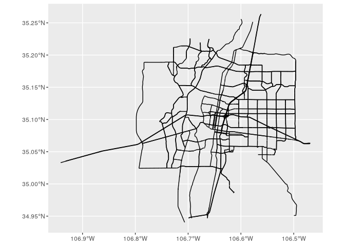
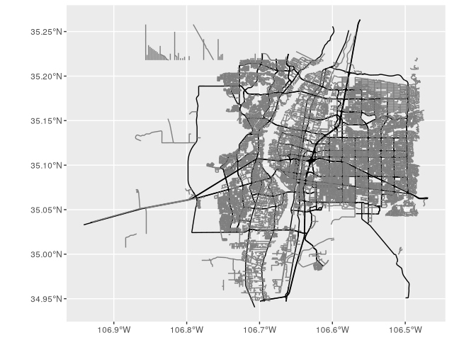
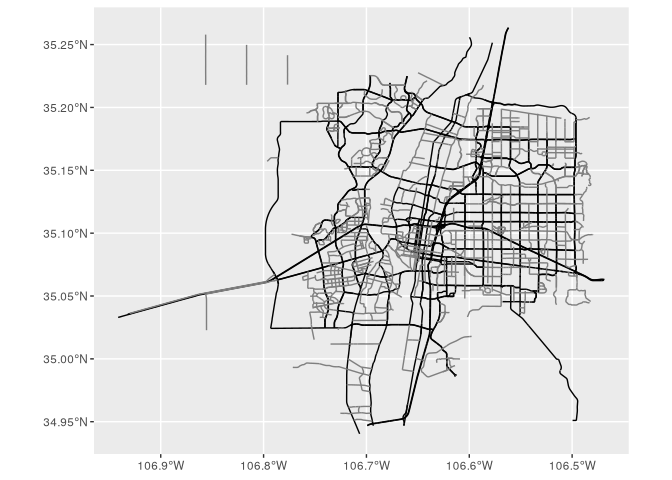
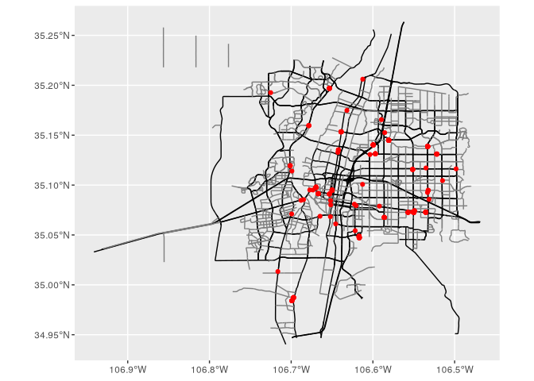
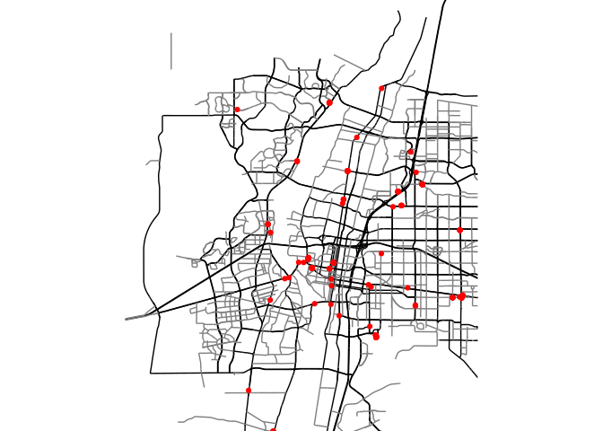
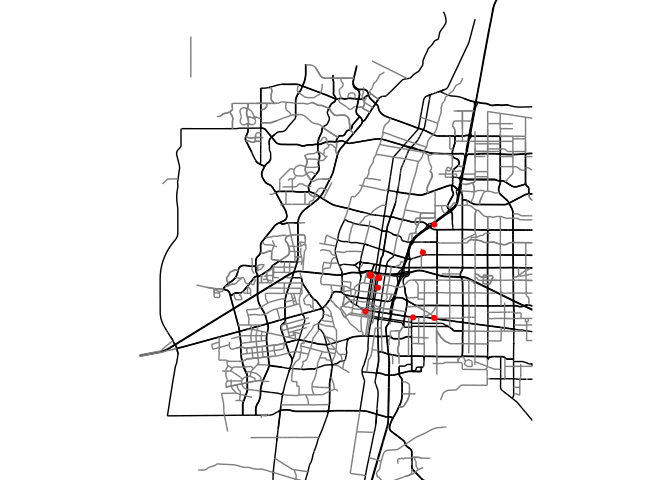

# OpenStreetMap


# Interrogating

``` r
library(osmdata)
```

    Data (c) OpenStreetMap contributors, ODbL 1.0. https://www.openstreetmap.org/copyright

``` r
available_features()
```

      [1] "4wd_only"                    "abandoned"                  
      [3] "abutters"                    "access"                     
      [5] "addr"                        "addr:*"                     
      [7] "addr:city"                   "addr:conscriptionnumber"    
      [9] "addr:country"                "addr:county"                
     [11] "addr:district"               "addr:flats"                 
     [13] "addr:full"                   "addr:hamlet"                
     [15] "addr:housename"              "addr:housenumber"           
     [17] "addr:inclusion"              "addr:interpolation"         
     [19] "addr:place"                  "addr:postbox"               
     [21] "addr:postcode"               "addr:province"              
     [23] "addr:state"                  "addr:street"                
     [25] "addr:subdistrict"            "addr:suburb"                
     [27] "addr:unit"                   "admin_level"                
     [29] "aeroway"                     "agricultural"               
     [31] "alcohol"                     "alt_name"                   
     [33] "amenity"                     "area"                       
     [35] "atv"                         "backward"                   
     [37] "barrier"                     "basin"                      
     [39] "bdouble"                     "bicycle"                    
     [41] "bicycle_road"                "biergarten"                 
     [43] "boat"                        "border_type"                
     [45] "boundary"                    "brand"                      
     [47] "bridge"                      "bridge:name"                
     [49] "building"                    "building:colour"            
     [51] "building:fireproof"          "building:flats"             
     [53] "building:levels"             "building:material"          
     [55] "building:min_level"          "building:part"              
     [57] "building:prefabricated"      "building:soft_storey"       
     [59] "bus"                         "bus_bay"                    
     [61] "bus:lanes"                   "busway"                     
     [63] "capacity"                    "carriage"                   
     [65] "castle_type"                 "change"                     
     [67] "charge"                      "clothes"                    
     [69] "construction"                "construction_date"          
     [71] "construction#Railways"       "covered"                    
     [73] "craft"                       "crossing"                   
     [75] "crossing:island"             "cuisine"                    
     [77] "cutting"                     "cycle_rickshaw"             
     [79] "cycleway"                    "cycleway:left"              
     [81] "cycleway:left:oneway"        "cycleway:right"             
     [83] "cycleway:right:oneway"       "denomination"               
     [85] "destination"                 "diet:*"                     
     [87] "direction"                   "dispensing"                 
     [89] "disused"                     "dog"                        
     [91] "drinking_water"              "drinking_water:legal"       
     [93] "drive_in"                    "drive_through"              
     [95] "ele"                         "electric_bicycle"           
     [97] "electrified"                 "embankment"                 
     [99] "embedded_rails"              "emergency"                  
    [101] "end_date"                    "energy_class"               
    [103] "entrance"                    "est_width"                  
    [105] "fee"                         "female"                     
    [107] "fire_object:type"            "fire_operator"              
    [109] "fire_rank"                   "food"                       
    [111] "foot"                        "footway"                    
    [113] "ford"                        "forestry"                   
    [115] "forward"                     "frequency"                  
    [117] "frontage_road"               "fuel"                       
    [119] "full_name"                   "gauge"                      
    [121] "gender_segregated"           "golf_cart"                  
    [123] "goods"                       "gutter"                     
    [125] "hand_cart"                   "hazard"                     
    [127] "hazmat"                      "healthcare"                 
    [129] "healthcare:counselling"      "healthcare:speciality"      
    [131] "height"                      "hgv"                        
    [133] "highway"                     "historic"                   
    [135] "horse"                       "hot_water"                  
    [137] "hov"                         "ice_road"                   
    [139] "incline"                     "industrial"                 
    [141] "inline_skates"               "inscription"                
    [143] "int_name"                    "internet_access"            
    [145] "junction"                    "kerb"                       
    [147] "landuse"                     "lane_markings"              
    [149] "lanes"                       "lanes:bus"                  
    [151] "lanes:psv"                   "layer"                      
    [153] "leaf_cycle"                  "leaf_type"                  
    [155] "leisure"                     "lhv"                        
    [157] "lit"                         "loc_name"                   
    [159] "location"                    "male"                       
    [161] "man_made"                    "max_age"                    
    [163] "max_level"                   "maxaxleload"                
    [165] "maxheight"                   "maxlength"                  
    [167] "maxspeed"                    "maxstay"                    
    [169] "maxweight"                   "maxwidth"                   
    [171] "military"                    "min_age"                    
    [173] "min_level"                   "minspeed"                   
    [175] "mofa"                        "moped"                      
    [177] "motor_vehicle"               "motorboat"                  
    [179] "motorcar"                    "motorcycle"                 
    [181] "motorroad"                   "mountain_pass"              
    [183] "mtb:description"             "mtb:scale"                  
    [185] "name"                        "name_1"                     
    [187] "name_2"                      "name:left"                  
    [189] "name:right"                  "narrow"                     
    [191] "nat_name"                    "natural"                    
    [193] "nickname"                    "noexit"                     
    [195] "non_existent_levels"         "nudism"                     
    [197] "office"                      "official_name"              
    [199] "old_name"                    "oneway"                     
    [201] "oneway:bicycle"              "oneway:bus"                 
    [203] "openfire"                    "opening_hours"              
    [205] "opening_hours:drive_through" "operator"                   
    [207] "orientation"                 "oven"                       
    [209] "overtaking"                  "parking"                    
    [211] "parking:condition"           "parking:lane"               
    [213] "passenger_lines"             "passing_places"             
    [215] "place"                       "power"                      
    [217] "power_supply"                "priority"                   
    [219] "priority_road"               "produce"                    
    [221] "proposed"                    "proposed:name"              
    [223] "protected_area"              "psv"                        
    [225] "psv:lanes"                   "public_transport"           
    [227] "railway"                     "railway:preserved"          
    [229] "railway:track_ref"           "recycling_type"             
    [231] "ref"                         "ref_name"                   
    [233] "reg_name"                    "religion"                   
    [235] "religious_level"             "rental"                     
    [237] "residential"                 "roadtrain"                  
    [239] "route"                       "sac_scale"                  
    [241] "sauna"                       "service"                    
    [243] "service_times"               "shelter_type"               
    [245] "shop"                        "short_name"                 
    [247] "shoulder"                    "shower"                     
    [249] "side_road"                   "sidewalk"                   
    [251] "site"                        "ski"                        
    [253] "smoking"                     "smoothness"                 
    [255] "social_facility"             "sorting_name"               
    [257] "speed_pedelec"               "sport"                      
    [259] "start_date"                  "step_count"                 
    [261] "substation"                  "surface"                    
    [263] "tactile_paving"              "tank"                       
    [265] "taxi"                        "tidal"                      
    [267] "toilets"                     "toilets:wheelchair"         
    [269] "toll"                        "topless"                    
    [271] "tourism"                     "tourist_bus"                
    [273] "tower:type"                  "tracks"                     
    [275] "tracktype"                   "traffic_calming"            
    [277] "traffic_sign"                "trail_visibility"           
    [279] "trailblazed"                 "trailblazed:visibility"     
    [281] "trailer"                     "tunnel"                     
    [283] "tunnel:name"                 "turn"                       
    [285] "type"                        "unisex"                     
    [287] "usage"                       "vehicle"                    
    [289] "vending"                     "voltage"                    
    [291] "water"                       "wheelchair"                 
    [293] "wholesale"                   "width"                      
    [295] "winter_road"                 "wood"                       

``` r
available_tags(feature = "water")
```

    # A tibble: 15 × 2
       Key   Value          
       <chr> <chr>          
     1 water basin          
     2 water canal          
     3 water ditch          
     4 water fish_pass      
     5 water lagoon         
     6 water lake           
     7 water lock           
     8 water moat           
     9 water oxbow          
    10 water pond           
    11 water reflecting_pool
    12 water reservoir      
    13 water river          
    14 water stream_pool    
    15 water wastewater     

``` r
available_tags(feature = "amenity")
```

    # A tibble: 137 × 2
       Key     Value          
       <chr>   <chr>          
     1 amenity animal_boarding
     2 amenity animal_breeding
     3 amenity animal_shelter 
     4 amenity animal_training
     5 amenity arts_centre    
     6 amenity atm            
     7 amenity baby_hatch     
     8 amenity baking_oven    
     9 amenity bank           
    10 amenity bar            
    # ℹ 127 more rows

# Area of interest

## With a bounding box

``` r
abq_bb <- matrix(
  data = c(-106.9, -106.4, 34.9, 35.3),
  nrow = 2, byrow = T
)
colnames(abq_bb) <- c("min", "max")
rownames(abq_bb) <- c("x", "y")
abq_bb
```

         min    max
    x -106.9 -106.4
    y   34.9   35.3

``` r
abq_bb <- getbb("Albuquerque")
abq_bb
```

           min      max
    x -106.882 -106.471
    y   34.947   35.218

# Roads

``` r
available_tags(feature = "highway")
```

    # A tibble: 57 × 2
       Key     Value              
       <chr>   <chr>              
     1 highway bridleway          
     2 highway bus_guideway       
     3 highway bus_stop           
     4 highway busway             
     5 highway construction       
     6 highway corridor           
     7 highway crossing           
     8 highway cycleway           
     9 highway cyclist_waiting_aid
    10 highway elevator           
    # ℹ 47 more rows

``` r
abq_major_roads <- abq_bb |>
  opq() |>
  add_osm_feature(
    key = "highway",
    value = c("motorway", "primary", "secondary")
  ) |>
  osmdata_sf()
abq_major_roads
```

    Object of class 'osmdata' with:
                     $bbox : 34.9470871,-106.8821501,35.218203,-106.4714237
            $overpass_call : The call submitted to the overpass API
                     $meta : metadata including timestamp and version numbers
               $osm_points : 'sf' Simple Features Collection with 24087 points
                $osm_lines : 'sf' Simple Features Collection with 3738 linestrings
             $osm_polygons : 'sf' Simple Features Collection with 4 polygons
           $osm_multilines : NULL
        $osm_multipolygons : NULL

``` r
library(ggplot2)

street_plot <- ggplot() +
  geom_sf(
    data = abq_major_roads$osm_lines,
    inherit.aes = F,
    color = "black",
    size = 0.2
  )
street_plot
```



``` r
abq_minor <- getbb("Albuquerque") |>
  opq() |>
  add_osm_feature(key = "highway", value = c("tertiary", "residential")) |>
  osmdata_sf()
```

``` r
street_plot_minor <- street_plot +
  geom_sf(
    data = abq_minor$osm_lines,
    inherit.aes = F, color = "grey50", size = 0.1
  )
street_plot_minor
```



``` r
abq_tert <- getbb("Albuquerque") |>
  opq() |>
  add_osm_feature(key = "highway", value = c("tertiary")) |>
  osmdata_sf()

street_plot_tert <- street_plot +
  geom_sf(data = abq_tert$osm_lines, inherit.aes = F, color = "grey50", size = 0.1)
street_plot_tert
```



``` r
abq_rest <- abq_bb |>
  opq() |>
  add_osm_feature("amenity", "restaurant") |>
  osmdata_sf()
abq_rest
```

    Object of class 'osmdata' with:
                     $bbox : 34.9470871,-106.8821501,35.218203,-106.4714237
            $overpass_call : The call submitted to the overpass API
                     $meta : metadata including timestamp and version numbers
               $osm_points : 'sf' Simple Features Collection with 2081 points
                $osm_lines : NULL
             $osm_polygons : 'sf' Simple Features Collection with 167 polygons
           $osm_multilines : NULL
        $osm_multipolygons : NULL

``` r
# Query for Tucson restaurants, them filter to mexican cuisine
abq_rest_mex <- getbb(place_name = "Albuquerque") %>%
  opq() %>%
  add_osm_feature(key = "amenity", value = "restaurant") %>%
  add_osm_feature(key = "cuisine", value = "mexican") %>% # filters results
  osmdata_sf()
abq_rest_mex
```

    Object of class 'osmdata' with:
                     $bbox : 34.9470871,-106.8821501,35.218203,-106.4714237
            $overpass_call : The call submitted to the overpass API
                     $meta : metadata including timestamp and version numbers
               $osm_points : 'sf' Simple Features Collection with 265 points
                $osm_lines : NULL
             $osm_polygons : 'sf' Simple Features Collection with 25 polygons
           $osm_multilines : NULL
        $osm_multipolygons : NULL

``` r
rest_plot <- street_plot_tert +
  geom_sf(
    data = abq_rest_mex$osm_points,
    inherit.aes = F,
    size = 1.5, color = "red"
  )

rest_plot
```



``` r
rest_plot +
  coord_sf(
    xlim = c(-106.8, -106.55),
    ylim = c(35, 35.25)
  ) +
  theme_void()
```



``` r
abq_rest_mex <- getbb(place_name = "Albuquerque") %>%
  opq() %>%
  add_osm_feature(key = "amenity", value = "restaurant") %>%
  add_osm_feature(key = "cuisine", value = "thai") %>% # filters results
  osmdata_sf()
abq_rest_mex
```

    Object of class 'osmdata' with:
                     $bbox : 34.9470871,-106.8821501,35.218203,-106.4714237
            $overpass_call : The call submitted to the overpass API
                     $meta : metadata including timestamp and version numbers
               $osm_points : 'sf' Simple Features Collection with 12 points
                $osm_lines : NULL
             $osm_polygons : 'sf' Simple Features Collection with 0 polygons
           $osm_multilines : NULL
        $osm_multipolygons : NULL

``` r
abq_micro_brew <- getbb(place_name = "Albuquerque") %>%
  opq() %>%
  add_osm_feature(key = "microbrewery", value = "yes") |>
  osmdata_sf()
abq_micro_brew
```

    Object of class 'osmdata' with:
                     $bbox : 34.9470871,-106.8821501,35.218203,-106.4714237
            $overpass_call : The call submitted to the overpass API
                     $meta : metadata including timestamp and version numbers
               $osm_points : 'sf' Simple Features Collection with 26 points
                $osm_lines : NULL
             $osm_polygons : 'sf' Simple Features Collection with 2 polygons
           $osm_multilines : NULL
        $osm_multipolygons : NULL

``` r
brew_plot <- street_plot_tert +
  geom_sf(
    data = abq_micro_brew$osm_points,
    inherit.aes = F,
    size = 1.5, color = "red"
  ) +
  coord_sf(
    xlim = c(-106.8, -106.55),
    ylim = c(35, 35.25)
  ) +
  theme_void()
brew_plot
```



``` r
str(abq_micro_brew)
```

    List of 8
     $ bbox             : chr "34.9470871,-106.8821501,35.218203,-106.4714237"
     $ overpass_call    : chr "[out:xml][timeout:25];\n(\n  node [\"microbrewery\"=\"yes\"] (34.9470871,-106.8821501,35.218203,-106.4714237);\"| __truncated__
     $ meta             :List of 3
      ..$ timestamp       : chr "[ Mon 2 Sep 2025 09:20:52 ]"
      ..$ OSM_version     : chr "0.6"
      ..$ overpass_version: chr "Overpass API 0.7.61.8 b1080abd"
     $ osm_points       :Classes 'sf' and 'data.frame': 26 obs. of  28 variables:
      ..$ osm_id             : chr [1:26] "2510101792" "2567961039" "2913662702" "4016438916" ...
      ..$ name               : chr [1:26] "La Cumbre Brewing" "Nexus Brewery and Restaurant" "Flock Of Moons" NA ...
      ..$ addr:city          : chr [1:26] NA "Albuquerque" NA NA ...
      ..$ addr:housenumber   : chr [1:26] NA "4730" NA NA ...
      ..$ addr:postcode      : chr [1:26] NA "87109" NA NA ...
      ..$ addr:state         : chr [1:26] NA "NM" "NM" NA ...
      ..$ addr:street        : chr [1:26] NA "Pan American Fwy NE" "Harvard Drive Southeast" NA ...
      ..$ alt_name           : chr [1:26] NA NA NA NA ...
      ..$ amenity            : chr [1:26] "pub" "pub" "biergarten" NA ...
      ..$ bar                : chr [1:26] NA NA "yes" NA ...
      ..$ check_date         : chr [1:26] NA "2023-08-12" NA NA ...
      ..$ cuisine            : chr [1:26] NA "new_mexican;soul_food;cajun;seafood;fish" NA NA ...
      ..$ entrance           : chr [1:26] NA NA NA NA ...
      ..$ internet_access    : chr [1:26] NA NA "wlan" NA ...
      ..$ internet_access:fee: chr [1:26] NA NA "no" NA ...
      ..$ level              : chr [1:26] NA NA "1" NA ...
      ..$ microbrewery       : chr [1:26] "yes" "yes" "yes" NA ...
      ..$ opening_hours      : chr [1:26] NA "Su-Th 11:00-20:30, Fr-Sa 11:00-21:00" NA NA ...
      ..$ outdoor_seating    : chr [1:26] NA "yes" "yes" NA ...
      ..$ phone              : chr [1:26] NA "505-242-4100" NA NA ...
      ..$ smoking            : chr [1:26] NA NA "no" NA ...
      ..$ takeaway           : chr [1:26] NA NA "yes" NA ...
      ..$ toilets            : chr [1:26] NA NA "yes" NA ...
      ..$ toilets:access     : chr [1:26] NA NA "customers" NA ...
      ..$ website            : chr [1:26] NA "https://restaurant.nexusbrewery.com/" "https://www.flockofmoons.com" NA ...
      ..$ website:menu       : chr [1:26] NA "https://restaurant.nexusbrewery.com/food-menu/" NA NA ...
      ..$ wheelchair         : chr [1:26] NA NA "limited" NA ...
      ..$ geometry           :sfc_POINT of length 26; first list element:  'XY' num [1:2] -106.6 35.1
      ..- attr(*, "sf_column")= chr "geometry"
      ..- attr(*, "agr")= Factor w/ 3 levels "constant","aggregate",..: NA NA NA NA NA NA NA NA NA NA ...
      .. ..- attr(*, "names")= chr [1:27] "osm_id" "name" "addr:city" "addr:housenumber" ...
     $ osm_lines        : NULL
     $ osm_polygons     :Classes 'sf' and 'data.frame': 2 obs. of  19 variables:
      ..$ osm_id             : chr [1:2] "398908697" "705310697"
      ..$ name               : chr [1:2] "Bow and Arrow Brewing Company" "Rio Bravo Brewing Company"
      ..$ addr:city          : chr [1:2] "Albuquerque" "Albuquerque"
      ..$ addr:housenumber   : chr [1:2] "608" "1912"
      ..$ addr:postcode      : chr [1:2] "87102" NA
      ..$ addr:state         : chr [1:2] "NM" "NM"
      ..$ addr:street        : chr [1:2] "McKnight Avenue Northwest" "2nd Street Northwest"
      ..$ alt_name           : chr [1:2] "Bow & Arrow Brewing Company" NA
      ..$ amenity            : chr [1:2] "pub" "pub"
      ..$ building           : chr [1:2] "yes" "yes"
      ..$ email              : chr [1:2] NA "gabe@riobravobrewing.com"
      ..$ internet_access    : chr [1:2] "yes" NA
      ..$ internet_access:fee: chr [1:2] "no" NA
      ..$ microbrewery       : chr [1:2] "yes" "yes"
      ..$ operator           : chr [1:2] NA "Gabe"
      ..$ outdoor_seating    : chr [1:2] "yes" NA
      ..$ phone              : chr [1:2] NA "+1-505-900-3909"
      ..$ smoking            : chr [1:2] "outside" NA
      ..$ geometry           :sfc_POLYGON of length 2; first list element: List of 1
      .. ..$ : num [1:14, 1:2] -107 -107 -107 -107 -107 ...
      .. .. ..- attr(*, "dimnames")=List of 2
      .. .. .. ..$ : chr [1:14] "4016438953" "4016438928" "4016438962" "4016438954" ...
      .. .. .. ..$ : chr [1:2] "lon" "lat"
      .. ..- attr(*, "class")= chr [1:3] "XY" "POLYGON" "sfg"
      ..- attr(*, "sf_column")= chr "geometry"
      ..- attr(*, "agr")= Factor w/ 3 levels "constant","aggregate",..: NA NA NA NA NA NA NA NA NA NA ...
      .. ..- attr(*, "names")= chr [1:18] "osm_id" "name" "addr:city" "addr:housenumber" ...
     $ osm_multilines   : NULL
     $ osm_multipolygons: NULL
     - attr(*, "class")= chr [1:3] "list" "osmdata" "osmdata_sf"

``` r
abq_micro_brew$osm_points$name
```

     [1] "La Cumbre Brewing"            "Nexus Brewery and Restaurant"
     [3] "Flock Of Moons"               NA                            
     [5] NA                             NA                            
     [7] NA                             NA                            
     [9] NA                             NA                            
    [11] NA                             NA                            
    [13] NA                             "Dialogue Brewing"            
    [15] "Boese Bros Brewing"           NA                            
    [17] NA                             NA                            
    [19] NA                             NA                            
    [21] NA                             NA                            
    [23] NA                             NA                            
    [25] NA                             "Lizard Tail Brewing"         

``` r
abq_bar_pub <- getbb(place_name = "Albuquerque") %>%
  opq() %>%
  add_osm_feature(key = "amenity", value = "bar") |>
  add_osm_feature(key = "drink:cocktail", value = "served") |>
  osmdata_sf()
abq_bar_pub
```

    Object of class 'osmdata' with:
                     $bbox : 34.9470871,-106.8821501,35.218203,-106.4714237
            $overpass_call : The call submitted to the overpass API
                     $meta : metadata including timestamp and version numbers
               $osm_points : 'sf' Simple Features Collection with 0 points
                $osm_lines : NULL
             $osm_polygons : 'sf' Simple Features Collection with 0 polygons
           $osm_multilines : NULL
        $osm_multipolygons : NULL
