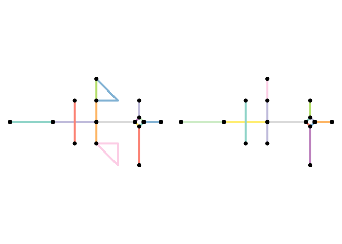
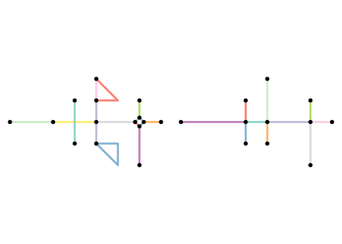

# The sfnetwork data structure


``` r
library(sfnetworks)
library(sf)
library(tidygraph)
library(igraph)
library(dbscan)
```

# Common tasks

## Rounding coordinates

When the endpoints of lines are *almost* shared, rounding can make them
one point instead of two.

``` r
p1 <- st_point(c(7, 51))
p2 <- st_point(c(8, 52))
p3 <- st_point(c(8.000001, 52.000001))
p4 <- st_point(c(7, 52))

l1 <- st_sfc(st_linestring(c(p1, p2)))
l2 <- st_sfc(st_linestring(c(p3, p4)))

edges <- st_as_sf(c(l1, l2), crs = 4326)
as_sfnetwork(edges)
```

    # A sfnetwork with 4 nodes and 2 edges
    #
    # CRS:  EPSG:4326 
    #
    # A rooted forest with 2 trees with spatially explicit edges
    #
    # Node data: 4 × 1 (active)
                  x
        <POINT [°]>
    1        (7 51)
    2        (8 52)
    3 (8.000001 52)
    4        (7 52)
    #
    # Edge data: 2 × 3
       from    to                   x
      <int> <int>    <LINESTRING [°]>
    1     1     2        (7 51, 8 52)
    2     3     4 (8.000001 52, 7 52)

With rounding to 0 digits

``` r
st_geometry(edges) <- st_geometry(edges) %>%
  lapply(function(x) round(x, 0)) %>%
  st_sfc(crs = st_crs(edges))

as_sfnetwork(edges)
```

    # A sfnetwork with 3 nodes and 2 edges
    #
    # CRS:  EPSG:4326 
    #
    # A rooted tree with spatially explicit edges
    #
    # Node data: 3 × 1 (active)
                x
      <POINT [°]>
    1      (7 51)
    2      (8 52)
    3      (7 52)
    #
    # Edge data: 2 × 3
       from    to                x
      <int> <int> <LINESTRING [°]>
    1     1     2     (7 51, 8 52)
    2     2     3     (8 52, 7 52)

## One-way edges

Real-world networks are a mix of directed and undirected edges. To deal
with this, a directed network is used, but all edges that can travel
both ways are duplicated and reversed.

See the small example below, where we have three lines with one-way
information stored in a oneway column. One of the lines is a one-way
street, the other two are not. By duplicating and reversing the two
linestrings that are not one-way streets, we create a directed network
that correctly models our situation.

``` r
p1 <- st_point(c(7, 51))
p2 <- st_point(c(7, 52))
p3 <- st_point(c(8, 52))

l1 <- st_sfc(st_linestring(c(p1, p2)))
l2 <- st_sfc(st_linestring(c(p1, p3)))
l3 <- st_sfc(st_linestring(c(p3, p2)))

edges <- st_as_sf(c(l1, l2, l3), crs = 4326)
edges$oneway <- c(TRUE, FALSE, FALSE)
edges
```

    Simple feature collection with 3 features and 1 field
    Geometry type: LINESTRING
    Dimension:     XY
    Bounding box:  xmin: 7 ymin: 51 xmax: 8 ymax: 52
    Geodetic CRS:  WGS 84
                            x oneway
    1 LINESTRING (7 51, 7 52)   TRUE
    2 LINESTRING (7 51, 8 52)  FALSE
    3 LINESTRING (8 52, 7 52)  FALSE

``` r
net <- edges %>%
  filter(!oneway) %>%
  st_reverse() %>%
  rbind(edges, .) %>%
  as_sfnetwork()
activate(net, "edges")
```

    # A sfnetwork with 3 nodes and 5 edges
    #
    # CRS:  EPSG:4326 
    #
    # A directed simple graph with 1 component with spatially explicit edges
    #
    # Edge data: 5 × 4 (active)
       from    to oneway                x
      <int> <int> <lgl>  <LINESTRING [°]>
    1     1     2 TRUE       (7 51, 7 52)
    2     1     3 FALSE      (7 51, 8 52)
    3     3     2 FALSE      (8 52, 7 52)
    4     3     1 FALSE      (8 52, 7 51)
    5     2     3 FALSE      (7 52, 8 52)
    #
    # Node data: 3 × 1
                x
      <POINT [°]>
    1      (7 51)
    2      (7 52)
    3      (8 52)

# Network cleaning functions

Before presenting the cleaning functions that are currently implemented,
lets create a network to be cleaned.

``` r
p1 <- st_point(c(0, 1))
p2 <- st_point(c(1, 1))
p3 <- st_point(c(2, 1))
p4 <- st_point(c(3, 1))
p5 <- st_point(c(4, 1))
p6 <- st_point(c(3, 2))
p7 <- st_point(c(3, 0))
p8 <- st_point(c(4, 3))
p9 <- st_point(c(4, 2))
p10 <- st_point(c(4, 0))
p11 <- st_point(c(5, 2))
p12 <- st_point(c(5, 0))
p13 <- st_point(c(5, -1))
p14 <- st_point(c(5.8, 1))
p15 <- st_point(c(6, 1.2))
p16 <- st_point(c(6.2, 1))
p17 <- st_point(c(6, 0.8))
p18 <- st_point(c(6, 2))
p19 <- st_point(c(6, -1))
p20 <- st_point(c(7, 1))

l1 <- st_sfc(st_linestring(c(p1, p2, p3)))
l2 <- st_sfc(st_linestring(c(p3, p4, p5)))
l3 <- st_sfc(st_linestring(c(p6, p4, p7)))
l4 <- st_sfc(st_linestring(c(p8, p11, p9)))
l5 <- st_sfc(st_linestring(c(p9, p5, p10)))
l6 <- st_sfc(st_linestring(c(p8, p9)))
l7 <- st_sfc(st_linestring(c(p10, p12, p13, p10)))
l8 <- st_sfc(st_linestring(c(p5, p14)))
l9 <- st_sfc(st_linestring(c(p15, p14)))
l10 <- st_sfc(st_linestring(c(p16, p15)))
l11 <- st_sfc(st_linestring(c(p14, p17)))
l12 <- st_sfc(st_linestring(c(p17, p16)))
l13 <- st_sfc(st_linestring(c(p15, p18)))
l14 <- st_sfc(st_linestring(c(p17, p19)))
l15 <- st_sfc(st_linestring(c(p16, p20)))

lines <- c(l1, l2, l3, l4, l5, l6, l7, l8, l9, l10, l11, l12, l13, l14, l15)

edge_colors <- function(x) rep(sf.colors(12, categorical = TRUE)[-2], 2)[c(1:ecount(x))]

net <- as_sfnetwork(lines)
plot(st_geometry(net, "edges"), col = edge_colors(net), lwd = 4)
plot(st_geometry(net, "nodes"), pch = 20, cex = 2, add = TRUE)
```


## Simplify Network

A simple network has no loops or multiple edges.

``` r
simple <- net %>%
  activate("edges") %>%
  filter(!edge_is_loop() & !edge_is_multiple())

loop <- net %>%
  activate("edges") %>%
  filter(edge_is_loop())

multiple <- net %>%
  activate("edges") %>%
  filter(edge_is_multiple())
```

``` r
par(mfrow = c(1, 2), mar = c(.4, .4, .4, .4))
plot(st_geometry(net, "edges"), col = edge_colors(net), lwd = 4)
plot(st_geometry(net, "nodes"), pch = 20, cex = 1.5, add = TRUE)
plot(st_geometry(simple, "edges"), col = edge_colors(simple), lwd = 4)
plot(st_geometry(simple, "nodes"), pch = 20, cex = 1.5, add = TRUE)
```


``` r
par(mfrow = c(1, 2))
plot(st_geometry(loop, "edges"), col = edge_colors(net), lwd = 4)
plot(st_geometry(loop, "nodes"), pch = 20, cex = 1.5, add = TRUE)
plot(st_geometry(multiple, "edges"), col = edge_colors(simple), lwd = 4)
plot(st_geometry(multiple, "nodes"), pch = 20, cex = 1.5, add = TRUE)
```


by re-arranging the edges table before applying the filter you can
influence which edges are kept whenever sets of multiple edges are
detected. For example, you might want to always keep the edge with the
shortest distance in the set.

``` r
simple <- net %>%
  activate("edges") %>%
  arrange(edge_length()) %>%
  filter(!edge_is_loop() & !edge_is_multiple())

par(mfrow = c(1, 2), mar = c(.4, .4, .4, .4))
plot(st_geometry(net, "edges"), col = edge_colors(net), lwd = 4)
plot(st_geometry(net, "nodes"), pch = 20, cex = 1.5, add = TRUE)
plot(st_geometry(simple, "edges"), col = edge_colors(simple), lwd = 4)
plot(st_geometry(simple, "nodes"), pch = 20, cex = 1.5, add = TRUE)
```



When your edges have attributes, you might prefer to merge the edges in
a set into a single new edge. This new edge has the geometry of the
first edge in the set, but its attribute values are a combination of the
attributes of all the edges in the set. This is exactly what the
function to_spatial_simple() does. It has an argument
summarise_attributes that lets you specify exactly how you want to merge
the attributes of each set of multiple edges.

There are two ways to specify the combination technique for an
attribute:

- As a character, referring to the name of a pre-defined combination
  technique in igraph. Examples include mean, sum, first and last. See
  here for an overview of all implemented techniques.
- As a function, taking a vector of attribute values as input and
  returning a single value. This is helpful when you want to combine
  attributes in a way that is not pre-defined in igraph.

Providing a single character or a single function
(e.g. summarise_attributes = “sum”) will apply the same technique to
each attribute. Instead, you can provide a named list with a different
technique for each attribute. This list can also include one unnamed
element containing the technique that should be applied to all
attributes that were not referenced in any of the other elements. Note
that the geometry-list column, the tidygraph index column, as well as
the from and to columns are not attributes!

The analogue of this in tidyverse terms is a dplyr::group_by() operation
followed by a dplyr::summarise() call. The groups in this case are
defined by the start and end node indices of the edges. Edges that
connect the same pair of nodes (i.e. multiple edges) are in the same
group. Then, attributes are summarised into a single value for each
group separately.

Add some attributes:

``` r
flows <- sample(1:10, ecount(net), replace = TRUE)
types <- c(rep("path", 8), rep("road", 7))
foo <- sample(c(1:ecount(net)), ecount(net))
bar <- sample(letters, ecount(net))

net <- net %>%
  activate("edges") %>%
  arrange(edge_length()) %>%
  mutate(flow = flows, type = types, foo = foo, bar = bar)
net
```

    # A sfnetwork with 15 nodes and 15 edges
    #
    # CRS:  NA 
    #
    # A directed multigraph with 3 components with spatially explicit edges
    #
    # Edge data: 15 × 7 (active)
       from    to              x  flow type    foo bar  
      <int> <int>   <LINESTRING> <int> <chr> <int> <chr>
    1    10     9 (6 1.2, 5.8 1)     5 path      7 d    
    2    11    10 (6.2 1, 6 1.2)     1 path      2 h    
    3     9    12 (5.8 1, 6 0.8)     4 path      5 e    
    4    12    11 (6 0.8, 6.2 1)     7 path      6 u    
    5    11    15   (6.2 1, 7 1)     4 path      8 l    
    6    10    13   (6 1.2, 6 2)     3 path      4 n    
    # ℹ 9 more rows
    #
    # Node data: 15 × 1
            x
      <POINT>
    1   (0 1)
    2   (2 1)
    3   (4 1)
    # ℹ 12 more rows

The multiple edges identified before:

``` r
net %>%
  activate("edges") %>%
  filter(edge_is_between(6, 7)) %>%
  st_as_sf()
```

    Simple feature collection with 2 features and 6 fields
    Geometry type: LINESTRING
    Dimension:     XY
    Bounding box:  xmin: 4 ymin: 2 xmax: 5 ymax: 3
    CRS:           NA
    # A tibble: 2 × 7
       from    to               x  flow type    foo bar  
      <int> <int>    <LINESTRING> <int> <chr> <int> <chr>
    1     6     7      (4 3, 4 2)     6 path     14 o    
    2     6     7 (4 3, 5 2, 4 2)     1 road     12 v    

Our strategy will be to sum the flows and remove type if there is
conflicting information.

``` r
combinations <- list(
  flow = "sum",
  type = function(x) ifelse(length(unique(x)) == 1, x[1], "unknown"), "ignore"
)
```

``` r
simple <- convert(net, to_spatial_simple,
  summarise_attributes = combinations
)

simple %>%
  activate("edges") %>%
  filter(edge_is_between(6, 7)) %>%
  st_as_sf()
```

    Simple feature collection with 1 feature and 5 fields
    Geometry type: LINESTRING
    Dimension:     XY
    Bounding box:  xmin: 4 ymin: 2 xmax: 4 ymax: 3
    CRS:           NA
    # A tibble: 1 × 6
       from    to            x  flow type    .tidygraph_edge_index
      <int> <int> <LINESTRING> <dbl> <chr>   <list>               
    1     6     7   (4 3, 4 2)     7 unknown <int [2]>            

When the edges table does not have attribute columns, using
to_spatial_simple does not have advantages and applying the filter
functions as shown before is faster.

## Subdivide edges

When endpoints are shared by multiple lines, they become one node. But
when interior points coincide, they are not merged, and there is no
connection between the points, and there is no connection between the
lines. They must be split at their shared point.

The function to_spatial_subdivision() subdivides edges at interior
points whenever these interior points are equal to one or more interior
points or endpoints of other edges, and recalculates network
connectivity afterwards.

To illustrate the workflow, lets consider a situation where an interior
point px in edge x is shared with point py in edge y

. That gives two possible situations:

- $p_y$ is an interior point of y. Since $p_x$ and $p_y$ are both
  interior points, neither of them is already a node in the network.
  Then:
  - $x$ is subdivided at $p_x$ into two new edges $x_1$ and $x_2$ and
    new node $p_x$.
  - $y$ is subdivided at $p_y$ into two new edges $y_1$ and $y_2$ and
    new node $p_y$.
  - The new nodes $p_x$ and $p_y$ are merged into a single node $p$ with
    the edge set $\{x1,x2,y1,y2\}$ as incidents.
- $p_y$ is and endpoint of $y$. Since $p_y$ is an edge endpoint, it is
  already a node in the network. Then:
  - $x$ is subdivided at $p_x$ into two new edges $x_1$ and $x_2$ and
    new node $p_x$.
  - The new node $p_x$ is merged with node $p_y$ into a single node $p$
    with the edge set $\{y,x1,x2\}$ as incidents.

Note that an edge is not subdivided when it crosses another edge at a
location that is not an interior point or endpoint in the linestring
geometry of any of the two edges.

``` r
subdivision <- convert(simple, to_spatial_subdivision)

par(mfrow = c(1, 2), mar = c(.4, .4, .4, .4))
plot(st_geometry(simple, "edges"), col = edge_colors(simple), lwd = 4)
plot(st_geometry(simple, "nodes"), pch = 20, cex = 1.5, add = TRUE)
plot(st_geometry(subdivision, "edges"), col = edge_colors(subdivision), lwd = 4)
plot(st_geometry(subdivision, "nodes"), pch = 20, cex = 1.5, add = TRUE)
```


## Smooth pseudo nodes

Pseudo nodes have one incoming and one outgoing edge, and are redundant
for many calculations. In undirected graphs, they are nodes with only
two incident edges.

In graph theory terms this process is the opposite of subdivision and
also called smoothing: smoothing a node b with incident edges
$o=\{a,b\}$ and $p=\{b,c\}$ removes $b$, $o$ and $p$ and creates the new
edge $q=\{a,c\}$.

``` r
smoothed <- convert(subdivision, to_spatial_smooth)

par(mfrow = c(1, 2), mar = c(.4, .4, .4, .4))
plot(st_geometry(subdivision, "edges"), col = edge_colors(subdivision), lwd = 4)
plot(st_geometry(subdivision, "nodes"), pch = 20, cex = 1.5, add = TRUE)
plot(st_geometry(smoothed, "edges"), col = edge_colors(smoothed), lwd = 4)
plot(st_geometry(smoothed, "nodes"), pch = 20, cex = 1.5, add = TRUE)
```


Like `to_spatial_simple`, can define how information is summarised.
Let’s consider the two pseudo nodes.

``` r
subdivision %>%
  activate("edges") %>%
  filter(edge_is_incident(2) | edge_is_incident(9)) %>%
  st_as_sf()
```

    Simple feature collection with 4 features and 5 fields
    Geometry type: LINESTRING
    Dimension:     XY
    Bounding box:  xmin: 0 ymin: 1 xmax: 4 ymax: 3
    CRS:           NA
    # A tibble: 4 × 6
       from    to               x  flow type    .tidygraph_edge_index
      <int> <int>    <LINESTRING> <dbl> <chr>                   <int>
    1     1     2 (0 1, 1 1, 2 1)     9 road                        1
    2     2     3      (2 1, 3 1)     1 road                        2
    3     8     9      (4 3, 4 2)     7 unknown                     5
    4     9     4      (4 2, 4 1)     3 road                        6

``` r
combinations <- list(
  flow = "sum",
  type = function(x) ifelse(length(unique(x)) == 1, x[1], "unknown"), "ignore"
)

other_smoothed <- convert(subdivision, to_spatial_smooth,
  summarise_attributes = combinations
)

other_smoothed %>%
  activate("edges") %>%
  filter(edge_is_between(1, 2) | edge_is_between(7, 3)) %>%
  st_as_sf()
```

    Simple feature collection with 2 features and 5 fields
    Geometry type: LINESTRING
    Dimension:     XY
    Bounding box:  xmin: 0 ymin: 1 xmax: 4 ymax: 3
    CRS:           NA
    # A tibble: 2 × 6
       from    to  flow type    .tidygraph_edge_index                    x
      <int> <int> <dbl> <chr>   <list>                        <LINESTRING>
    1     1     2    10 road    <int [2]>             (0 1, 1 1, 2 1, 3 1)
    2     7     3    10 unknown <int [2]>                  (4 3, 4 2, 4 1)

- to only remove those pseudo nodes for which attributes among their
  incident edges are equal, set require_equal = TRUE.
- Optionally, you can provide a list of attribute names instead, such
  that only those attributes are checked for equality

``` r
other_smoothed <- convert(subdivision, to_spatial_smooth,
  require_equal = "type"
)

par(mfrow = c(1, 2), mar = c(.4, .4, .4, .4))
plot(st_geometry(subdivision, "edges"), col = edge_colors(subdivision), lwd = 4)
plot(st_geometry(subdivision, "nodes"), pch = 20, cex = 1.5, add = TRUE)
plot(st_geometry(other_smoothed, "edges"), col = edge_colors(smoothed), lwd = 4)
plot(st_geometry(other_smoothed, "nodes"), pch = 20, cex = 1.5, add = TRUE)
```


To preserve specific nodes, even if they are pseudo nodes, use
`protect`.

``` r
other_smoothed <- convert(subdivision, to_spatial_smooth,
  protect = 2
)

par(mfrow = c(1, 2), mar = c(.4, .4, .4, .4))
plot(st_geometry(subdivision, "edges"), col = edge_colors(subdivision), lwd = 4)
plot(st_geometry(subdivision, "nodes"), pch = 20, cex = 1.5, add = TRUE)
plot(st_geometry(other_smoothed, "edges"), col = edge_colors(smoothed), lwd = 4)
plot(st_geometry(other_smoothed, "nodes"), pch = 20, cex = 1.5, add = TRUE)
```


## Simplify intersections

Intersections can be represented by several spatially close nodes with
their own edges. They can be combined into a single node with
`to_spatial_contracted` and specifying a spatial clustering algorithm
with a distance parameter. Here the clustering distance of 0.5. minPts
is set to 1 so that all nodes are assigned to a cluster, even if they
are the only member. Nodes should only be clustered if they are
connected, ie. part of the same network component. In this case it is a
fully connected graph. If not, the combination of cluster and group can
define the nodes to be contracted.

``` r
node_coords <- smoothed %>%
  activate("nodes") %>%
  st_coordinates()
clusters <- dbscan(node_coords,
  eps = 0.5,
  minPts = 1
)$cluster

clustered <- smoothed %>%
  activate("nodes") %>%
  mutate(
    cls = clusters,
    cmp = group_components()
  )
select(clustered, cls, cmp)
```

    # A sfnetwork with 14 nodes and 14 edges
    #
    # CRS:  NA 
    #
    # A directed simple graph with 1 component with spatially explicit edges
    #
    # Node data: 14 × 3 (active)
        cls   cmp       x
      <int> <int> <POINT>
    1     1     1   (0 1)
    2     2     1   (3 1)
    3     3     1   (4 1)
    4     4     1 (5.8 1)
    5     5     1   (3 2)
    6     6     1   (3 0)
    # ℹ 8 more rows
    #
    # Edge data: 14 × 6
       from    to  flow type  .tidygraph_edge_index            x
      <int> <int> <dbl> <chr> <list>                <LINESTRING>
    1     2     3     1 road  <int [1]>               (3 1, 4 1)
    2     3     4     5 path  <int [1]>             (4 1, 5.8 1)
    3     5     2     3 road  <int [1]>               (3 2, 3 1)
    # ℹ 11 more rows

Contraction can introduce loops and multiple edges. This can be avoided
with the simplify argument.

``` r
contracted <- convert(clustered, to_spatial_contracted,
  cls, cmp,
  simplify = TRUE
)

par(mfrow = c(1, 2), mar = c(.4, .4, .4, .4))
plot(st_geometry(smoothed, "edges"), col = edge_colors(smoothed), lwd = 4)
plot(st_geometry(smoothed, "nodes"), pch = 20, cex = 1.5, add = TRUE)
plot(st_geometry(contracted, "edges"), col = edge_colors(contracted), lwd = 4)
plot(st_geometry(contracted, "nodes"), pch = 20, cex = 1.5, add = TRUE)
```


Attributes can be combined as before.

Create some additional attributes:

``` r
clustered <- clustered %>%
  activate("nodes") %>%
  mutate(is_priority = sample(c(TRUE, FALSE), vcount(clustered),
    replace = TRUE
  ))
```

The group with several close nodes, identified before.

``` r
clustered %>%
  activate("nodes") %>%
  filter(cls == 4 & cmp == 1) %>%
  st_as_sf()
```

    Simple feature collection with 4 features and 4 fields
    Geometry type: POINT
    Dimension:     XY
    Bounding box:  xmin: 5.8 ymin: 0.8 xmax: 6.2 ymax: 1.2
    CRS:           NA
    # A tibble: 4 × 5
            x .tidygraph_node_index   cls   cmp is_priority
      <POINT>                 <int> <int> <int> <lgl>      
    1 (5.8 1)                     5     4     1 FALSE      
    2 (6 0.8)                    11     4     1 TRUE       
    3 (6 1.2)                    12     4     1 FALSE      
    4 (6.2 1)                    14     4     1 TRUE       

Set priority to TRUE if any are TRUE.

``` r
combinations <- list(
  is_priority = \(x) any(x),
  "ignore"
)

contracted <- convert(
  clustered, to_spatial_contracted, cls, cmp,
  simplify = TRUE, summarise_attributes = combinations
)

contracted %>%
  activate("nodes") %>%
  slice(4) %>%
  st_as_sf()
```

    Simple feature collection with 1 feature and 2 fields
    Geometry type: POINT
    Dimension:     XY
    Bounding box:  xmin: 6 ymin: 1 xmax: 6 ymax: 1
    CRS:           NA
    # A tibble: 1 × 3
      .tidygraph_node_index is_priority       x
      <list>                <lgl>       <POINT>
    1 <int [4]>             TRUE          (6 1)

``` r
par(mfrow = c(1, 2), mar = c(.4, .4, .4, .4))
plot(st_geometry(net, "edges"), col = edge_colors(net), lwd = 4)
plot(st_geometry(net, "nodes"), pch = 20, cex = 1.5, add = TRUE)
plot(st_geometry(contracted, "edges"), col = edge_colors(contracted), lwd = 4)
plot(st_geometry(contracted, "nodes"), pch = 20, cex = 1.5, add = TRUE)
```


