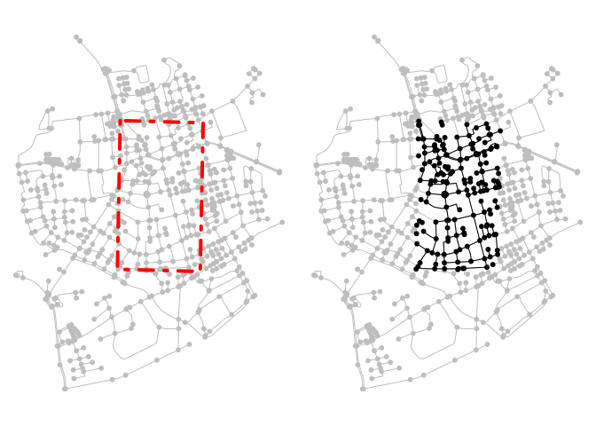

# Spatial joins and filters


``` r
library(sfnetworks)
library(sf)
library(tidygraph)
library(igraph)
```

# Spatial filters

## `st_filter`

Removes features from A based on their spatial relationship with B. It
is only applied to the active element, but may affect the other element.

``` r
p1 <- st_point(c(4151358, 3208045))
p2 <- st_point(c(4151340, 3207120))
p3 <- st_point(c(4151856, 3207106))
p4 <- st_point(c(4151874, 3208031))

poly <- st_multipoint(c(p1, p2, p3, p4)) %>%
  st_cast("POLYGON") %>%
  st_sfc(crs = 3035)

net <- as_sfnetwork(roxel) %>%
  st_transform(3035)

filtered <- st_filter(net, poly, .pred = st_intersects)

par(mfrow = c(1, 2), mar = c(.3, .3, .3, .3))
plot(net, col = "grey")
plot(poly,
  border = "red", lty = 4,
  lwd = 4, add = T
)
plot(net, col = "grey")
plot(filtered, add = T)
```



``` r
filtered <- net %>%
  activate("edges") %>%
  st_filter(poly, .pred = st_intersects)

par(mfrow = c(1, 2), mar = c(.3, .3, .3, .3))
plot(net, col = "grey")
plot(poly,
  border = "red", lty = 4,
  lwd = 4, add = T
)
plot(net, col = "grey")
plot(filtered, add = T)
```


To remove the nodes that are no longer connected by edges:

``` r
filtered <- net %>%
  activate("edges") %>%
  st_filter(poly, .pred = st_intersects) %>%
  activate("nodes") %>%
  filter(!node_is_isolated())

par(mfrow = c(1, 2), mar = c(.3, .3, .3, .3))
plot(net, col = "grey")
plot(poly,
  border = "red", lty = 4,
  lwd = 4, add = T
)
plot(net, col = "grey")
plot(filtered, add = T)
```


Filtering based on distance

``` r
point <- st_centroid(st_combine(net))

filtered <- net %>%
  activate("nodes") %>%
  st_filter(point, .predicate = st_is_within_distance, dist = 500)

par(mfrow = c(1, 2), mar = c(.3, .3, .3, .3))
plot(net, col = "grey")
plot(point,
  col = "red", cex = 3,
  pch = 20, add = T
)
plot(net, col = "grey")
plot(filtered, add = T)
```


## Spatial node and edge query functions

``` r
filtered <- net %>%
  activate("edges") %>%
  filter(edge_intersects(poly)) %>%
  activate("nodes") %>%
  filter(!node_is_isolated())

par(mfrow = c(1, 2), mar = c(.3, .3, .3, .3))
plot(net, col = "grey")
plot(poly, border = "red", lty = 4, lwd = 4, add = TRUE)
plot(net, col = "grey")
plot(filtered, add = TRUE)
```


Find all edges that cross but don’t connect (ie overpasses/underpasses).
The tidygraph::.E() function used in the example makes it possible to
directly access the complete edges table inside verbs. In this case,
that means that for each edge we evaluate if it crosses with any other
edge in the network. Similarly, we can use tidygraph::.N() to access the
nodes table and tidygraph::.G() to access the network object as a whole.

``` r
net %>%
  activate("edges") %>%
  filter(edge_crosses(.E()))
```

    # A sfnetwork with 701 nodes and 0 edges
    #
    # CRS:  EPSG:3035 
    #
    # A rooted forest with 701 trees with spatially explicit edges
    #
    # Edge data: 0 × 5 (active)
    # ℹ 5 variables: from <int>, to <int>, name <chr>, type <fct>,
    #   geometry <GEOMETRY [m]>
    #
    # Node data: 701 × 1
               geometry
            <POINT [m]>
    1 (4151491 3207923)
    2 (4151474 3207946)
    3 (4151398 3207777)
    # ℹ 698 more rows

``` r
net %>%
  mutate(in_poly = node_intersects(poly))
```

    # A sfnetwork with 701 nodes and 851 edges
    #
    # CRS:  EPSG:3035 
    #
    # A directed multigraph with 14 components with spatially explicit edges
    #
    # Node data: 701 × 2 (active)
               geometry in_poly
            <POINT [m]> <lgl>  
    1 (4151491 3207923) TRUE   
    2 (4151474 3207946) TRUE   
    3 (4151398 3207777) TRUE   
    4 (4151370 3207673) TRUE   
    5 (4151408 3207539) TRUE   
    6 (4151421 3207592) TRUE   
    # ℹ 695 more rows
    #
    # Edge data: 851 × 5
       from    to name                  type                                geometry
      <int> <int> <chr>                 <fct>                       <LINESTRING [m]>
    1     1     2 Havixbecker Strasse   residential (4151491 3207923, 4151474 32079…
    2     3     4 Pienersallee          secondary   (4151398 3207777, 4151390 32077…
    3     5     6 Schulte-Bernd-Strasse residential (4151408 3207539, 4151417 32075…
    # ℹ 848 more rows

Using coordinate query functions

``` r
v <- 4152000
l <- st_linestring(rbind(
  c(v, st_bbox(net)["ymin"]),
  c(v, st_bbox(net)["ymax"])
))

filtered_by_coords <- net %>%
  activate("nodes") %>%
  filter(node_X() > v)

par(mfrow = c(1, 2), mar = c(.3, .3, .3, .3))
plot(net, col = "grey")
plot(l, col = "red", lty = 4, lwd = 4, add = TRUE)
plot(net, col = "grey")
plot(filtered_by_coords, add = TRUE)
```


## Clipping

Filtering leaves the geometries, clipping modifies edges, cutting
linestrings at the border of the feature, or the bounding box in the
case of cropping. sfnetworks adds new nodes at these locations.

- `sf::st_intersection()` keeps only those parts of the original
  geometries that lie within the clip feature
- `sf::st_difference()` keeps only those parts of the original
  geometries that lie outside the clip feature
- `sf::st_crop()` keeps only those parts of the original geometries that
  lie within the bounding box of the clip feature

``` r
clipped <- net %>%
  activate("edges") %>%
  st_intersection(poly) %>%
  activate("nodes") %>%
  filter(!node_is_isolated())
```

    Warning: attribute variables are assumed to be spatially constant throughout
    all geometries

``` r
par(mfrow = c(1, 2), mar = c(.3, .3, .3, .3))
plot(net, col = "grey")
plot(poly, border = "red", lty = 4, lwd = 4, add = TRUE)
plot(net, col = "grey")
plot(clipped, add = TRUE)
```


# Spatial Joins

# `st_join()`

The function is applied to a set of geometries A with respect to another
set of geometries B, and attaches feature attributes from features in B
to features in A based on their spatial relation.

Lets show this with an example in which we first create imaginary postal
code areas for the Roxel dataset.

``` r
codes <- net %>%
  st_make_grid(n = c(2, 2)) %>%
  st_as_sf() %>%
  mutate(post_code = as.character(seq(1000, 1000 + n() * 10 - 10, 10)))

joined <- st_join(net, codes, join = st_intersects)
joined
```

    # A sfnetwork with 701 nodes and 851 edges
    #
    # CRS:  EPSG:3035 
    #
    # A directed multigraph with 14 components with spatially explicit edges
    #
    # Node data: 701 × 2 (active)
               geometry post_code
            <POINT [m]> <chr>    
    1 (4151491 3207923) 1020     
    2 (4151474 3207946) 1020     
    3 (4151398 3207777) 1020     
    4 (4151370 3207673) 1020     
    5 (4151408 3207539) 1020     
    6 (4151421 3207592) 1020     
    # ℹ 695 more rows
    #
    # Edge data: 851 × 5
       from    to name                  type                                geometry
      <int> <int> <chr>                 <fct>                       <LINESTRING [m]>
    1     1     2 Havixbecker Strasse   residential (4151491 3207923, 4151474 32079…
    2     3     4 Pienersallee          secondary   (4151398 3207777, 4151390 32077…
    3     5     6 Schulte-Bernd-Strasse residential (4151408 3207539, 4151417 32075…
    # ℹ 848 more rows

``` r
par(mfrow = c(1, 2), mar = c(.3, .3, .3, .3))
plot(net, col = "grey")
plot(codes,
  col = NA, border = "red",
  lty = 4, lwd = 4, add = T
)
text(st_coordinates(st_centroid(st_geometry(codes))),
  codes$post_code,
  cex = 2
)
plot(st_geometry(joined, "edges"))
plot(st_as_sf(joined, "nodes"), pch = 20, add = T)
```


When polygons overlap, `sf` creates duplicate points, but `sfnetworks`
only takes the information from the first match so as not to duplicate
nodes. Joining on edges does not pose this problem, as the edges can be
duplicated.

``` r
two_equal_polys <- st_as_sf(c(poly, poly)) %>%
  mutate(foo = c("a", "b"))

st_join(net, two_equal_polys, join = st_intersects)
```

    Warning: Multiple matches were detected from some nodes. Only the first match
    is considered

    # A sfnetwork with 701 nodes and 851 edges
    #
    # CRS:  EPSG:3035 
    #
    # A directed multigraph with 14 components with spatially explicit edges
    #
    # Node data: 701 × 2 (active)
               geometry foo  
            <POINT [m]> <chr>
    1 (4151491 3207923) a    
    2 (4151474 3207946) a    
    3 (4151398 3207777) a    
    4 (4151370 3207673) a    
    5 (4151408 3207539) a    
    6 (4151421 3207592) a    
    # ℹ 695 more rows
    #
    # Edge data: 851 × 5
       from    to name                  type                                geometry
      <int> <int> <chr>                 <fct>                       <LINESTRING [m]>
    1     1     2 Havixbecker Strasse   residential (4151491 3207923, 4151474 32079…
    2     3     4 Pienersallee          secondary   (4151398 3207777, 4151390 32077…
    3     5     6 Schulte-Bernd-Strasse residential (4151408 3207539, 4151417 32075…
    # ℹ 848 more rows

``` r
net %>%
  activate("edges") %>%
  st_join(two_equal_polys, join = st_intersects)
```

    # A sfnetwork with 701 nodes and 1097 edges
    #
    # CRS:  EPSG:3035 
    #
    # A directed multigraph with 14 components with spatially explicit edges
    #
    # Edge data: 1,097 × 6 (active)
       from    to name                  type                          geometry foo  
      <int> <int> <chr>                 <fct>                 <LINESTRING [m]> <chr>
    1     1     2 Havixbecker Strasse   residential (4151491 3207923, 4151474… a    
    2     1     2 Havixbecker Strasse   residential (4151491 3207923, 4151474… b    
    3     3     4 Pienersallee          secondary   (4151398 3207777, 4151390… a    
    4     3     4 Pienersallee          secondary   (4151398 3207777, 4151390… b    
    5     5     6 Schulte-Bernd-Strasse residential (4151408 3207539, 4151417… a    
    6     5     6 Schulte-Bernd-Strasse residential (4151408 3207539, 4151417… b    
    # ℹ 1,091 more rows
    #
    # Node data: 701 × 1
               geometry
            <POINT [m]>
    1 (4151491 3207923)
    2 (4151474 3207946)
    3 (4151398 3207777)
    # ℹ 698 more rows

## Snapping points to nearest node

To find the nearest node in the network for each POI, you can use the sf
function sf::st_nearest_feature().

``` r
node1 <- st_point(c(0, 0))
node2 <- st_point(c(1, 0))
edge <- st_sfc(st_linestring(c(node1, node2)))

net <- as_sfnetwork(edge)

pois <- data.frame(
  poi_type = c("bakery", "butcher"),
  x = c(0, 0.6), y = c(0.2, 0.2)
) %>%
  st_as_sf(coords = c("x", "y"))

nearest_nodes <- st_nearest_feature(pois, net)

snapped_pois <- pois %>%
  st_set_geometry(st_geometry(net)[nearest_nodes])

plot_connections <- function(pois) {
  for (i in seq_len(nrow(pois))) {
    connection <- st_nearest_points(pois[i, ], net)[nearest_nodes[i]]
    plot(connection, col = "grey", lty = 2, lwd = 2, add = TRUE)
  }
}

par(mfrow = c(1, 2), mar = c(.3, .3, .3, .3))
plot(net, cex = 2, lwd = 4)
plot_connections(pois)
plot(pois, pch = 8, cex = 2, lwd = 2, add = TRUE)
plot(net, cex = 2, lwd = 4)
plot(snapped_pois, pch = 8, cex = 2, lwd = 2, add = TRUE)
```


If multiple nodes, only the attributes of the first are retained.

``` r
st_join(net, snapped_pois)
```

    # A sfnetwork with 2 nodes and 1 edges
    #
    # CRS:  NA 
    #
    # A rooted tree with spatially explicit edges
    #
    # Node data: 2 × 2 (active)
            x poi_type
      <POINT> <chr>   
    1   (0 0) bakery  
    2   (1 0) butcher 
    #
    # Edge data: 1 × 3
       from    to            x
      <int> <int> <LINESTRING>
    1     1     2   (0 0, 1 0)

## Blending points into a network

Sometimes the nearest node is far away relative to the nearest location
on the nearest edge. The edge can be split at that location to create a
new node.

The function `st_network_blend()` does exactly that. For each POI, it
finds the nearest location p on the nearest edge e. If p is an already
existing node (i.e. p is an endpoint of e), it joins the information
from the POI into that node. If p is not an already existing node, it
subdivides e at p, adds p as a new node to the network, and joins the
information from the POI into that new node. For this process, it does
not matter if p is an interior point in the linestring geometry of e.

A tolerance factor can be specified (defaults to meters).

``` r
blended <- st_network_blend(net, pois)
blended
```

    # A sfnetwork with 3 nodes and 2 edges
    #
    # CRS:  NA 
    #
    # A rooted tree with spatially explicit edges
    #
    # Node data: 3 × 2 (active)
      poi_type       x
      <chr>    <POINT>
    1 bakery     (0 0)
    2 <NA>       (1 0)
    3 butcher  (0.6 0)
    #
    # Edge data: 2 × 3
       from    to            x
      <int> <int> <LINESTRING>
    1     1     3 (0 0, 0.6 0)
    2     3     2 (0.6 0, 1 0)

``` r
par(mfrow = c(1, 2), mar = c(.3, .3, .3, .3))
plot_connections <- function(pois) {
  for (i in seq_len(nrow(pois))) {
    connection <- st_nearest_points(pois[i, ], activate(net, "edges"))
    plot(connection, col = "grey", lty = 2, lwd = 2, add = TRUE)
  }
}

plot(net, cex = 2, lwd = 4)
plot_connections(pois)
plot(pois, pch = 8, cex = 2, lwd = 2, add = TRUE)
plot(blended, cex = 2, lwd = 4)
```


``` r
pois <- data.frame(
  poi_type = c("bakery", "butcher", "bar"),
  x = c(0, 0.6, 0.4), y = c(0.2, 0.2, 0.3)
) %>%
  st_as_sf(coords = c("x", "y"))

blended <- st_network_blend(net, pois)
blended_with_tolerance <- st_network_blend(net, pois, tolerance = 0.2)

par(mfrow = c(1, 2), mar = c(.3, .3, .3, .3))
plot(blended, cex = 2, lwd = 4)
plot_connections(pois)
plot(pois, pch = 8, cex = 2, lwd = 2, add = TRUE)
plot(blended_with_tolerance, cex = 2, lwd = 4)
plot_connections(pois)
plot(pois, pch = 8, cex = 2, lwd = 2, add = TRUE)
```


Note: - when multiple POIs have the same nearest location on the nearest
edge, only the first of them is blended into the network - when a single
POI has multiple nearest edges, it is only blended into the first of
these edge - due to floating point precision, intersection points
between to lines may not evaluate as intersecting those lines. Therefore
tolerance should be set non-zero. See example

``` r
# Two intersecting lines
p1 <- st_point(c(0.53236, 1.95377))
p2 <- st_point(c(0.53209, 1.95328))
l1 <- st_sfc(st_linestring(c(p1, p2)))

p3 <- st_point(c(0.53209, 1.95345))
p4 <- st_point(c(0.53245, 1.95345))
l2 <- st_sfc(st_linestring(c(p3, p4)))

st_intersection(l1, l2)
```

    Geometry set for 1 feature 
    Geometry type: POINT
    Dimension:     XY
    Bounding box:  xmin: 0.5321837 ymin: 1.95345 xmax: 0.5321837 ymax: 1.95345
    CRS:           NA

    POINT (0.5321837 1.95345)

``` r
st_intersects(l1, st_intersection(l1, l2), sparse = F)
```

          [,1]
    [1,] FALSE

``` r
st_distance(l1, st_intersection(l1, l2))
```

                 [,1]
    [1,] 4.310191e-17

``` r
net <- as_sfnetwork(l1)
p <- st_intersection(l1, l2)

par(mfrow = c(1, 2), mar = c(.3, .3, .3, .3))
plot(l1)
plot(l2, col = "grey", lwd = 2, add = TRUE)
plot(st_network_blend(net, p, tolerance = 0), lwd = 2, cex = 2, add = TRUE)
```

    Warning: No points were blended. Increase the tolerance distance?

``` r
plot(l1)
plot(l2, col = "grey", lwd = 2, add = TRUE)
plot(st_network_blend(net, p, tolerance = 1e-10), lwd = 2, cex = 2, add = TRUE)
```


## Joining two networks

`st_network_join()` full spatial join of nodes based on geometries, with
equal nodes combined into a single node. Edges are not combined.

``` r
node3 <- st_point(c(1, 1))
node4 <- st_point(c(0, 1))
edge2 <- st_sfc(st_linestring(c(node2, node3)))
edge3 <- st_sfc(st_linestring(c(node3, node4)))

net <- as_sfnetwork(c(edge, edge2))
other_net <- as_sfnetwork(c(edge2, edge3))

joined <- st_network_join(net, other_net)
joined
```

    # A sfnetwork with 4 nodes and 4 edges
    #
    # CRS:  NA 
    #
    # A directed acyclic multigraph with 1 component with spatially explicit edges
    #
    # Node data: 4 × 1 (active)
            x
      <POINT>
    1   (0 0)
    2   (1 0)
    3   (1 1)
    4   (0 1)
    #
    # Edge data: 4 × 3
       from    to            x
      <int> <int> <LINESTRING>
    1     1     2   (0 0, 1 0)
    2     2     3   (1 0, 1 1)
    3     2     3   (1 0, 1 1)
    # ℹ 1 more row

``` {rsfnetwork-joins-filters-13}
par(mfrow=c(1,2), mar=c(.3,.3,.3,.3))
plot(net, pch = 15, cex = 2, lwd = 4)
plot(other_net, col = "red", pch = 18, cex = 2, lty = 2, lwd = 4, add = TRUE)
plot(joined, cex = 2, lwd = 4)
```
