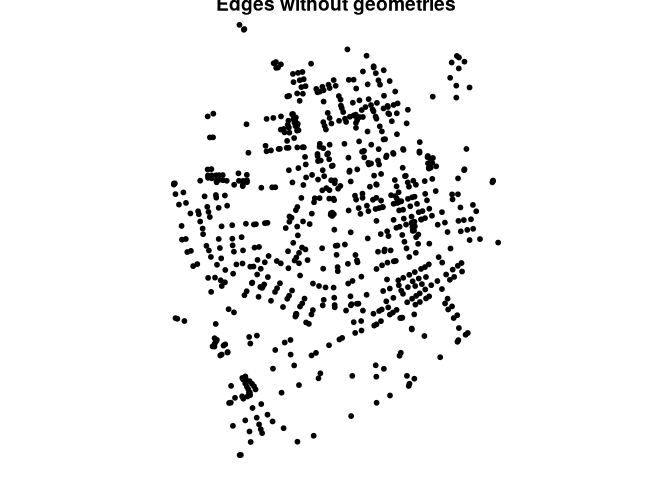

# The sfnetwork data structure


``` r
library(sfnetworks)
library(sf)
library(tidygraph)
library(igraph)
library(ggplot2)
```

# Construction

A sfnetwork should have a valid spatial network structure. For the
nodes, this currently means that their geometries should all be of type
POINT. In the case of spatially explicit edges, edge geometries should
all be of type LINESTRING, nodes and edges should have the same CRS and
endpoints of edges should match their corresponding node coordinates.

``` r
p1 <- st_point(c(7, 51))
p2 <- st_point(c(7, 52))
p3 <- st_point(c(8, 52))
p4 <- st_point(c(8, 51.5))

l1 <- st_sfc(st_linestring(c(p1, p2)))
l2 <- st_sfc(st_linestring(c(p1, p4, p3)))
l3 <- st_sfc(st_linestring(c(p3, p2)))

edges <- st_as_sf(c(l1, l2, l3), crs = 4326)
nodes <- st_as_sf(c(st_sfc(p1), st_sfc(p2), st_sfc(p3)), crs = 4326)

edges$from <- c(1, 1, 3)
edges$to <- c(2, 3, 2)

net <- sfnetwork(nodes, edges)
```

    Checking if spatial network structure is valid...

    Spatial network structure is valid

``` r
net
```

    # A sfnetwork with 3 nodes and 3 edges
    #
    # CRS:  EPSG:4326 
    #
    # A directed acyclic simple graph with 1 component with spatially explicit edges
    #
    # Node data: 3 × 1 (active)
                x
      <POINT [°]>
    1      (7 51)
    2      (7 52)
    3      (8 52)
    #
    # Edge data: 3 × 3
       from    to                    x
      <int> <int>     <LINESTRING [°]>
    1     1     2         (7 51, 7 52)
    2     1     3 (7 51, 8 51.5, 8 52)
    3     3     2         (8 52, 7 52)

``` r
class(net)
```

    [1] "sfnetwork" "tbl_graph" "igraph"   

By default, the created network is a directed network. If you want to
create an undirected network, set directed = FALSE. Note that for
undirected networks, the indices in the from and to columns are
re-arranged such that the from index is always smaller than (or equal
to, for loop edges) the to index. However, the linestring geometries
remain unchanged. That means that in undirected networks it can happen
that for some edges the from index refers to the last point of the edge
linestring, and the to index to the first point. The behavior of
ordering the indices comes from igraph and might be confusing, but
remember that in undirected networks the terms from and to do not have a
meaning and can thus be used interchangeably.

``` r
net <- sfnetwork(nodes, edges, directed = F)
```

    Checking if spatial network structure is valid...

    Spatial network structure is valid

``` r
net
```

    # A sfnetwork with 3 nodes and 3 edges
    #
    # CRS:  EPSG:4326 
    #
    # An undirected simple graph with 1 component with spatially explicit edges
    #
    # Node data: 3 × 1 (active)
                x
      <POINT [°]>
    1      (7 51)
    2      (7 52)
    3      (8 52)
    #
    # Edge data: 3 × 3
       from    to                    x
      <int> <int>     <LINESTRING [°]>
    1     1     2         (7 51, 7 52)
    2     1     3 (7 51, 8 51.5, 8 52)
    3     2     3         (8 52, 7 52)

Instead of from and to columns containing integers that refer to node
indices, the provided edges table can also have from and to columns
containing characters that refer to node keys. In that case, you should
tell the construction function which column in the nodes table contains
these keys. Internally, they will then be converted to integer indices.

``` r
nodes$name <- c("city", "village", "farm")
edges$from <- c("city", "city", "farm")
edges$to <- c("village", "farm", "village")
edges
```

    Simple feature collection with 3 features and 2 fields
    Geometry type: LINESTRING
    Dimension:     XY
    Bounding box:  xmin: 7 ymin: 51 xmax: 8 ymax: 52
    Geodetic CRS:  WGS 84
                                   x from      to
    1        LINESTRING (7 51, 7 52) city village
    2 LINESTRING (7 51, 8 51.5, 8... city    farm
    3        LINESTRING (8 52, 7 52) farm village

``` r
net <- sfnetwork(nodes, edges, node_key = "name")
```

    Checking if spatial network structure is valid...

    Spatial network structure is valid

``` r
net
```

    # A sfnetwork with 3 nodes and 3 edges
    #
    # CRS:  EPSG:4326 
    #
    # A directed acyclic simple graph with 1 component with spatially explicit edges
    #
    # Node data: 3 × 2 (active)
                x name   
      <POINT [°]> <chr>  
    1      (7 51) city   
    2      (7 52) village
    3      (8 52) farm   
    #
    # Edge data: 3 × 3
       from    to                    x
      <int> <int>     <LINESTRING [°]>
    1     1     2         (7 51, 7 52)
    2     1     3 (7 51, 8 51.5, 8 52)
    3     3     2         (8 52, 7 52)

If your edges table does not have linestring geometries, but only
references to node indices or keys, you can tell the construction
function to create the linestring geometries during construction. This
will draw a straight line between the endpoints of each edge.

``` r
st_geometry(edges) <- NULL

other_net <- sfnetwork(nodes, edges, edges_as_lines = TRUE)
```

    Checking if spatial network structure is valid...

    Spatial network structure is valid

``` r
par(mfrow = c(1, 2))
plot(net, cex = 2, lwd = 2, main = "Original geometries")
plot(other_net, cex = 2, lwd = 2, main = "Straight Lines")
```


``` r
net
```

    # A sfnetwork with 3 nodes and 3 edges
    #
    # CRS:  EPSG:4326 
    #
    # A directed acyclic simple graph with 1 component with spatially explicit edges
    #
    # Node data: 3 × 2 (active)
                x name   
      <POINT [°]> <chr>  
    1      (7 51) city   
    2      (7 52) village
    3      (8 52) farm   
    #
    # Edge data: 3 × 3
       from    to                    x
      <int> <int>     <LINESTRING [°]>
    1     1     2         (7 51, 7 52)
    2     1     3 (7 51, 8 51.5, 8 52)
    3     3     2         (8 52, 7 52)

# From an sf object with linestring geometries

Edges from the linestrings, nodes at endpoints, shared endpoints become
a single node.

``` r
roxel
```

    Simple feature collection with 851 features and 2 fields
    Geometry type: LINESTRING
    Dimension:     XY
    Bounding box:  xmin: 7.522594 ymin: 51.94151 xmax: 7.546705 ymax: 51.9612
    Geodetic CRS:  WGS 84
    # A tibble: 851 × 3
       name                  type                                           geometry
     * <chr>                 <fct>                                  <LINESTRING [°]>
     1 Havixbecker Strasse   residential      (7.533722 51.95556, 7.533461 51.95576)
     2 Pienersallee          secondary   (7.532442 51.95422, 7.53236 51.95377, 7.53…
     3 Schulte-Bernd-Strasse residential (7.532709 51.95209, 7.532823 51.95239, 7.5…
     4 <NA>                  path        (7.540063 51.94468, 7.539696 51.94479, 7.5…
     5 Welsingheide          residential       (7.537673 51.9475, 7.537614 51.94562)
     6 <NA>                  footway     (7.543791 51.94733, 7.54369 51.94686, 7.54…
     7 <NA>                  footway           (7.54012 51.94478, 7.539931 51.94514)
     8 <NA>                  path        (7.53822 51.94546, 7.538131 51.94549, 7.53…
     9 <NA>                  track       (7.540063 51.94468, 7.540338 51.94468, 7.5…
    10 <NA>                  track       (7.5424 51.94599, 7.54205 51.94629, 7.5419…
    # ℹ 841 more rows

``` r
par(mar = c(0, 0, 0, 0))
net <- as_sfnetwork(roxel)
plot(net)
```


# Activation

Removing nodes will result in the elimination of edges termitating at
the nodes. Removing edges will not remove nodes.

``` r
net %>%
  activate("edges") %>%
  mutate(weight = edge_length()) %>%
  activate("nodes") %>%
  mutate(bc = centrality_betweenness(weights = weight, directed = FALSE))
```

    # A sfnetwork with 701 nodes and 851 edges
    #
    # CRS:  EPSG:4326 
    #
    # A directed multigraph with 14 components with spatially explicit edges
    #
    # Node data: 701 × 2 (active)
                 geometry    bc
              <POINT [°]> <dbl>
    1 (7.533722 51.95556) 13808
    2 (7.533461 51.95576)  9777
    3 (7.532442 51.95422) 35240
    4  (7.53209 51.95328) 31745
    5 (7.532709 51.95209)  7174
    6 (7.532869 51.95257)  9081
    # ℹ 695 more rows
    #
    # Edge data: 851 × 6
       from    to name                  type                         geometry weight
      <int> <int> <chr>                 <fct>                <LINESTRING [°]>    [m]
    1     1     2 Havixbecker Strasse   residential (7.533722 51.95556, 7.53…   28.8
    2     3     4 Pienersallee          secondary   (7.532442 51.95422, 7.53…  108. 
    3     5     6 Schulte-Bernd-Strasse residential (7.532709 51.95209, 7.53…   54.3
    # ℹ 848 more rows

# Extraction

Neither all sf functions nor all tidyverse verbs can be directly applied
to a sfnetwork as described above. That is because there is a clear
limitation in the relational data structure that requires rows to
maintain their identity. Hence, a verb like dplyr::summarise() has no
clear application for a network. For sf functions, this means also that
the valid spatial network structure should be maintained. That is,
functions that summarise geometries of an sf object, or (may) change
their type, shape or position, are not supported directly. These are for
example most of the geometric unary operations.

These functions cannot be directly applied to a sfnetwork, but no need
to panic! The active element of the network can at any time be extracted
with sf::st_as_sf() (or tibble::as_tibble()). This allows you to
continue a specific part of your analysis outside of the network
structure, using a regular sf object. Afterwards you could join inferred
information back into the network. See the vignette about spatial joins
for more details.

``` r
net %>%
  activate("nodes") %>%
  st_as_sf()
```

    Simple feature collection with 701 features and 0 fields
    Geometry type: POINT
    Dimension:     XY
    Bounding box:  xmin: 7.522622 ymin: 51.94151 xmax: 7.546705 ymax: 51.9612
    Geodetic CRS:  WGS 84
    # A tibble: 701 × 1
                  geometry
               <POINT [°]>
     1 (7.533722 51.95556)
     2 (7.533461 51.95576)
     3 (7.532442 51.95422)
     4  (7.53209 51.95328)
     5 (7.532709 51.95209)
     6 (7.532869 51.95257)
     7 (7.540063 51.94468)
     8  (7.53822 51.94546)
     9  (7.537673 51.9475)
    10 (7.537614 51.94562)
    # ℹ 691 more rows

or:

``` r
st_as_sf(net, "edges")
```

    Simple feature collection with 851 features and 4 fields
    Geometry type: LINESTRING
    Dimension:     XY
    Bounding box:  xmin: 7.522594 ymin: 51.94151 xmax: 7.546705 ymax: 51.9612
    Geodetic CRS:  WGS 84
    # A tibble: 851 × 5
        from    to name                  type                               geometry
       <int> <int> <chr>                 <fct>                      <LINESTRING [°]>
     1     1     2 Havixbecker Strasse   residential (7.533722 51.95556, 7.533461 5…
     2     3     4 Pienersallee          secondary   (7.532442 51.95422, 7.53236 51…
     3     5     6 Schulte-Bernd-Strasse residential (7.532709 51.95209, 7.532823 5…
     4     7     8 <NA>                  path        (7.540063 51.94468, 7.539696 5…
     5     9    10 Welsingheide          residential (7.537673 51.9475, 7.537614 51…
     6    11    12 <NA>                  footway     (7.543791 51.94733, 7.54369 51…
     7    13    14 <NA>                  footway     (7.54012 51.94478, 7.539931 51…
     8     8    10 <NA>                  path        (7.53822 51.94546, 7.538131 51…
     9     7    15 <NA>                  track       (7.540063 51.94468, 7.540338 5…
    10    16    17 <NA>                  track       (7.5424 51.94599, 7.54205 51.9…
    # ℹ 841 more rows

# Visualization

``` r
par(mar = c(0, 0, 0, 0))
plot(net)
```


``` r
autoplot(net) +
  ggtitle("Road network of Münster Roxel")
```


Using `geom_sf` by extracting nodes and edges.

``` r
net <- net %>%
  activate("nodes") %>%
  mutate(bc = centrality_betweenness())

ggplot() +
  geom_sf(data = st_as_sf(net, "edges"), col = "grey50") +
  geom_sf(data = st_as_sf(net, "nodes"), aes(col = bc, size = bc)) +
  ggtitle("Betweenness centrality in Münster Roxel")
```


# Geometries

The geometry of the active element can be extracted with `st_geometry`.
Replacing the geometry with NULL removes geometry. Removing geometries
from edges retains the spatial structure of nodes. Removing node
geometries results in loss of spatial structure.

``` r
net %>%
  activate("nodes") %>%
  st_geometry()
```

    Geometry set for 701 features 
    Geometry type: POINT
    Dimension:     XY
    Bounding box:  xmin: 7.522622 ymin: 51.94151 xmax: 7.546705 ymax: 51.9612
    Geodetic CRS:  WGS 84
    First 5 geometries:

    POINT (7.533722 51.95556)

    POINT (7.533461 51.95576)

    POINT (7.532442 51.95422)

    POINT (7.53209 51.95328)

    POINT (7.532709 51.95209)

``` r
par(mar = c(.4, .4, .4, .4))
net %>%
  activate("edges") %>%
  st_set_geometry(NULL) %>%
  plot(draw_lines = FALSE, main = "Edges without geometries")
```



``` r
par(mar = c(.5, .5, .5, .5))
net %>%
  activate("nodes") %>%
  st_set_geometry(NULL) %>%
  plot(vertex.color = "black", main = "Nodes without geometries")
```


When calling sf::st_reverse() on the edges of a directed network, not
only the geometries will be reversed, but the from and to columns of the
edges will be swapped as well. In the case of undirected networks these
columns remain unchanged, since the terms from and to don’t have a
meaning in undirected networks and can be used interchangeably.

``` r
as_sfnetwork(roxel, directed = TRUE) %>%
  activate("edges") %>%
  st_reverse()
```

    Warning: In directed networks st_reverse swaps columns 'to' and 'from'

    # A sfnetwork with 701 nodes and 851 edges
    #
    # CRS:  EPSG:4326 
    #
    # A directed multigraph with 14 components with spatially explicit edges
    #
    # Edge data: 851 × 5 (active)
       from    to name                  type                                geometry
      <int> <int> <chr>                 <fct>                       <LINESTRING [°]>
    1     2     1 Havixbecker Strasse   residential (7.533461 51.95576, 7.533722 51…
    2     4     3 Pienersallee          secondary   (7.53209 51.95328, 7.53236 51.9…
    3     6     5 Schulte-Bernd-Strasse residential (7.532869 51.95257, 7.532823 51…
    4     8     7 <NA>                  path        (7.53822 51.94546, 7.538353 51.…
    5    10     9 Welsingheide          residential (7.537614 51.94562, 7.537673 51…
    6    12    11 <NA>                  footway     (7.543751 51.94677, 7.54369 51.…
    # ℹ 845 more rows
    #
    # Node data: 701 × 1
                 geometry
              <POINT [°]>
    1 (7.533722 51.95556)
    2 (7.533461 51.95576)
    3 (7.532442 51.95422)
    # ℹ 698 more rows

# Coordinates

The coordinates of the active element of a sfnetwork can be extracted
with the sf function sf::st_coordinates(), or from any element by
specifying the element of interest as additional argument,
e.g. sf::st_coordinate(net, “edges”)

``` r
node_coords <- net %>%
  activate("nodes") %>%
  st_coordinates()
node_coords[1:4, ]
```

                X        Y
    [1,] 7.533722 51.95556
    [2,] 7.533461 51.95576
    [3,] 7.532442 51.95422
    [4,] 7.532090 51.95328

Besides X and Y coordinates, the features in the network can possibly
also have Z and M coordinates.

``` r
st_z_range(net)
```

    NULL

``` r
st_m_range(net)
```

    NULL

Add Z coordinates with value 0 to all features.

``` r
st_zm(net, drop = F, what = "Z")
```

    # A sfnetwork with 701 nodes and 851 edges
    #
    # CRS:  EPSG:4326 
    #
    # A directed multigraph with 14 components with spatially explicit edges
    #
    # Node data: 701 × 2 (active)
                     geometry     bc
                  <POINT [°]>  <dbl>
    1 Z (7.533722 51.95556 0) 12936.
    2 Z (7.533461 51.95576 0) 11824 
    3 Z (7.532442 51.95422 0) 11926.
    4  Z (7.53209 51.95328 0)  7259.
    5 Z (7.532709 51.95209 0)  5668 
    6 Z (7.532869 51.95257 0)  2374 
    # ℹ 695 more rows
    #
    # Edge data: 851 × 5
       from    to name                  type                                geometry
      <int> <int> <chr>                 <fct>                       <LINESTRING [°]>
    1     1     2 Havixbecker Strasse   residential Z (7.533722 51.95556 0, 7.53346…
    2     3     4 Pienersallee          secondary   Z (7.532442 51.95422 0, 7.53236…
    3     5     6 Schulte-Bernd-Strasse residential Z (7.532709 51.95209 0, 7.53282…
    # ℹ 848 more rows

Coordinate queries

``` r
net %>%
  st_zm(drop = F, what = "Z") %>%
  mutate(
    X = node_X(), Y = node_Y(),
    Z = node_Z(), M = node_M()
  )
```

    Warning: There was 1 warning in `stopifnot()`.
    ℹ In argument: `M = node_M()`.
    Caused by warning:
    ! M coordinates are not available

    # A sfnetwork with 701 nodes and 851 edges
    #
    # CRS:  EPSG:4326 
    #
    # A directed multigraph with 14 components with spatially explicit edges
    #
    # Node data: 701 × 6 (active)
                     geometry     bc     X     Y     Z M    
                  <POINT [°]>  <dbl> <dbl> <dbl> <dbl> <lgl>
    1 Z (7.533722 51.95556 0) 12936.  7.53  52.0     0 NA   
    2 Z (7.533461 51.95576 0) 11824   7.53  52.0     0 NA   
    3 Z (7.532442 51.95422 0) 11926.  7.53  52.0     0 NA   
    4  Z (7.53209 51.95328 0)  7259.  7.53  52.0     0 NA   
    5 Z (7.532709 51.95209 0)  5668   7.53  52.0     0 NA   
    6 Z (7.532869 51.95257 0)  2374   7.53  52.0     0 NA   
    # ℹ 695 more rows
    #
    # Edge data: 851 × 5
       from    to name                  type                                geometry
      <int> <int> <chr>                 <fct>                       <LINESTRING [°]>
    1     1     2 Havixbecker Strasse   residential Z (7.533722 51.95556 0, 7.53346…
    2     3     4 Pienersallee          secondary   Z (7.532442 51.95422 0, 7.53236…
    3     5     6 Schulte-Bernd-Strasse residential Z (7.532709 51.95209 0, 7.53282…
    # ℹ 848 more rows

# Precision

The precision in a valid spatial network structure is always the same
for nodes and edges.

``` r
st_precision(net)
```

    [1] 0

``` r
net %>%
  st_set_precision(1) %>%
  st_precision()
```

    [1] 1

# Bounding Box

The bounding boxes of the nodes and edges are not necessarily the same.
Therefore, sfnetworks adds the st_network_bbox() function to retrieve
the combined bounding box of the nodes and edges. In this combined
bounding box, the most extreme coordinates of the two individual element
bounding boxes are preserved. Hence, the xmin value of the network
bounding box is the smallest xmin value of the node and edge bounding
boxes, et cetera.

``` r
net %>%
  activate("nodes") %>%
  st_bbox()
```

         xmin      ymin      xmax      ymax 
     7.522622 51.941512  7.546705 51.961203 

``` r
node1 <- st_point(c(8, 51))
node2 <- st_point(c(7, 51.5))
node3 <- st_point(c(8, 52))
node4 <- st_point(c(9, 51))
edge1 <- st_sfc(st_linestring(c(node1, node2, node3)))

nodes <- st_as_sf(c(st_sfc(node1), st_sfc(node3), st_sfc(node4)))
edges <- st_as_sf(edge1)
edges$from <- 1
edges$to <- 2

small_net <- sfnetwork(nodes, edges)
```

    Checking if spatial network structure is valid...

    Spatial network structure is valid

``` r
node_bbox <- st_as_sfc(st_bbox(activate(small_net, "nodes")))
edge_bbox <- st_as_sfc(st_bbox(activate(small_net, "edges")))
net_bbox <- st_as_sfc(st_network_bbox(small_net))
```

``` r
par(mfrow = c(2, 1), mar = c(.5, .5, .5, .5))
plot(small_net, lwd = 2, cex = 4, main = "Element bounding boxes")
plot(node_bbox, border = "red", lty = 2, lwd = 4, add = TRUE)
plot(edge_bbox, border = "blue", lty = 2, lwd = 4, add = TRUE)
plot(small_net, lwd = 2, cex = 4, main = "Network bounding box")
plot(net_bbox, border = "red", lty = 2, lwd = 4, add = TRUE)
```


# Attrubute-geometry relationships

In sf objects there is the possibility to store information about how
attributes relate to geometries (for more information, see here). You
can get and set this information with the function sf::st_agr() (for the
setter, you can also use the pipe-friendly version sf::st_set_agr()). In
a sfnetwork, you can use the same functions to get and set this
information for the active element of the network.

``` r
net %>%
  activate("edges") %>%
  st_set_agr(c("name" = "constant", "type" = "constant")) %>%
  st_agr()
```

        from       to     name     type 
        <NA>     <NA> constant constant 
    Levels: constant aggregate identity
